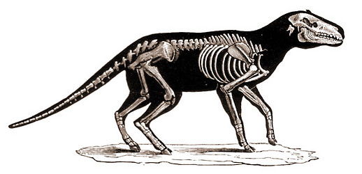

---
aliases:
  - fossil_artiodactyls
  - fossil artiodactyls
title: Miscellaneous fossil artiodactyls
---

# Miscellaneous fossil artiodactyls
 

## Phylogeny 

-   « Ancestral Groups  
    -  [Artiodactyla](../Artiodactyla.md) 
    -  [Eutheria](../../Eutheria.md) 
    -  [Mammal](../../../Mammal.md) 
    -   [Therapsida](../../../../Therapsida.md)
    -   [Synapsida](../../../../../Synapsida.md)
    -   [Amniota](../../../../../../Amniota.md)
    -   [Terrestrial Vertebrates](../../../../../../../Terrestrial.md)
    -   [Sarcopterygii](../../../../../../../../Sarc.md)
    -   [Gnathostomata](../../../../../../../../../Gnath.md)
    -   [Vertebrata](../../../../../../../../../../Vertebrata.md)
    -   [Craniata](../../../../../../../../../../../Craniata.md)
    -   [Chordata](../../../../../../../../../../../../Chordata.md)
    -   [Deuterostomia](../../../../../../../../../../../../../Deutero.md)
    -  [Bilateria](../../../../../../../../../../../../../../Bilateria.md) 
    -  [Animals](../../../../../../../../../../../../../../../Animals.md) 
    -  [Eukarya](../../../../../../../../../../../../../../../../Eukarya.md) 
    -   [Tree of Life](../../../../../../../../../../../../../../../../Tree_of_Life.md)

-   ◊ Sibling Groups of  Artiodactyla
    -   [Suid](Suid.md)
    -   [Tayassuidae](Tayassuidae.md)
    -   [Hippopotamidae](Hippopotamidae.md)
    -   [Tylopoda](Tylopoda.md)
    -   [Ruminants](Ruminants.md)
    -   Miscellaneous fossil artiodactyls

-   » Sub-Groups
    -  [Agriochoeridae](fossil_artiodactyls/Agriochoeridae.md) 
    -  [Anoplotheriidae](fossil_artiodactyls/Anoplotheriidae.md) 
    -  [Cainotheriidae](fossil_artiodactyls/Cainotheriidae.md) 
    -  [Choeropotamidae](fossil_artiodactyls/Choeropotamidae.md) 
	-   [Agriochoeridae](fossil_artiodactyls/Agriochoeridae.md "go to ToL page"))*
	-   *Aksyiria* †
	-   *Amphimerycidae* †
	-   *Anthracotheriidae* †
	-   *Cebochoeridae* †
	-   *Dichobunidae* †[
	    (non-monophyletic) ]
	-   *Entelodontidae* †
	-   *Helohyidae* †
	-   *Merycoidodontidae* † [(oreodonts)]
	-   *Mixtotheriidae* †
	-   *Raoellidae* †
	-   *Sanitheriidae* †
	
Containing group:[Artiodactyla](../Artiodactyla.md) 

## Title Illustrations

 

----------------------------------
Scientific Name ::     Anoplotherium commune
Location ::           France
Reference            Nicholson, H. A. 1897. Ancient Life-History of the Earth. D. Appleton and Company, New York.
Acknowledgements     after Cuvier
Specimen Condition   Fossil \-- Period: Eocene

## Confidential Links & Embeds: 

### #is_/same_as :: [[/_Standards/bio/bio~Domain/Eukarya/Animal/Bilateria/Deutero/Chordata/Craniata/Vertebrata/Gnath/Sarc/Tetrapods/Amniota/Synapsida/Therapsida/Mammal/Eutheria/Artiodactyla/fossil_artiodactyls|fossil_artiodactyls]] 

### #is_/same_as :: [[/_public/bio/bio~Domain/Eukarya/Animal/Bilateria/Deutero/Chordata/Craniata/Vertebrata/Gnath/Sarc/Tetrapods/Amniota/Synapsida/Therapsida/Mammal/Eutheria/Artiodactyla/fossil_artiodactyls.public|fossil_artiodactyls.public]] 

### #is_/same_as :: [[/_internal/bio/bio~Domain/Eukarya/Animal/Bilateria/Deutero/Chordata/Craniata/Vertebrata/Gnath/Sarc/Tetrapods/Amniota/Synapsida/Therapsida/Mammal/Eutheria/Artiodactyla/fossil_artiodactyls.internal|fossil_artiodactyls.internal]] 

### #is_/same_as :: [[/_protect/bio/bio~Domain/Eukarya/Animal/Bilateria/Deutero/Chordata/Craniata/Vertebrata/Gnath/Sarc/Tetrapods/Amniota/Synapsida/Therapsida/Mammal/Eutheria/Artiodactyla/fossil_artiodactyls.protect|fossil_artiodactyls.protect]] 

### #is_/same_as :: [[/_private/bio/bio~Domain/Eukarya/Animal/Bilateria/Deutero/Chordata/Craniata/Vertebrata/Gnath/Sarc/Tetrapods/Amniota/Synapsida/Therapsida/Mammal/Eutheria/Artiodactyla/fossil_artiodactyls.private|fossil_artiodactyls.private]] 

### #is_/same_as :: [[/_personal/bio/bio~Domain/Eukarya/Animal/Bilateria/Deutero/Chordata/Craniata/Vertebrata/Gnath/Sarc/Tetrapods/Amniota/Synapsida/Therapsida/Mammal/Eutheria/Artiodactyla/fossil_artiodactyls.personal|fossil_artiodactyls.personal]] 

### #is_/same_as :: [[/_secret/bio/bio~Domain/Eukarya/Animal/Bilateria/Deutero/Chordata/Craniata/Vertebrata/Gnath/Sarc/Tetrapods/Amniota/Synapsida/Therapsida/Mammal/Eutheria/Artiodactyla/fossil_artiodactyls.secret|fossil_artiodactyls.secret]] 

