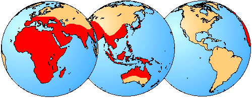

---
aliases:
  - Rhinolophoidea
title: Rhinolophoidea
---

## Phylogeny 

-   « Ancestral Groups  
    -  [Microchiroptera](../Microchiroptera.md) 
    -  [Bat](../../Bat.md) 
    -  [Eutheria](../../../Eutheria.md) 
    -  [Mammal](../../../../Mammal.md) 
    -   [Therapsida](../../../../../Therapsida.md)
    -   [Synapsida](../../../../../../Synapsida.md)
    -   [Amniota](../../../../../../../Amniota.md)
    -   [Terrestrial Vertebrates](../../../../../../../../Terrestrial.md)
    -   [Sarcopterygii](../../../../../../../../../Sarc.md)
    -   [Gnathostomata](../../../../../../../../../../Gnath.md)
    -   [Vertebrata](../../../../../../../../../../../Vertebrata.md)
    -   [Craniata](../../../../../../../../../../../../Craniata.md)
    -   [Chordata](../../../../../../../../../../../../../Chordata.md)
    -   [Deuterostomia](../../../../../../../../../../../../../../Deutero.md)
    -  [Bilateria](../../../../../../../../../../../../../../../Bilateria.md) 
    -  [Animals](../../../../../../../../../../../../../../../../Animals.md) 
    -  [Eukarya](../../../../../../../../../../../../../../../../../Eukarya.md) 
    -   [Tree of Life](../../../../../../../../../../../../../../../../../Tree_of_Life.md)

-   ◊ Sibling Groups of  Microchiroptera
    -   [Rhinopomatoidea](Rhinopomatoidea.md)
    -   Rhinolophoidea
    -   [Noctilionoidea](Noctilionoidea.md)
    -   [Nataloidea](Nataloidea.md)
    -   [Molossoidea](Molossoidea.md)
    -   [Vespertilionidae](Vespertilionidae.md)

-   » Sub-Groups
    -  [Rhinolophidae](Rhinolophoidea/Rhinolophidae.md) 

# Rhinolophoidea 

[Nancy B. Simmons and Tenley Conway]() 

Tree from Simmons (1998) and Simmons and Geisler (1998).

Containing group:[Microchiroptera](../Microchiroptera.md) 

## Introduction

All rhinolophoids are insectivorous or carnivorous, and all are
restricted to the Old World. The largest family in the group is
Rhinolophidae, which comprises 10 genera and over 130 species (Koopman,
1993). In addition to Rhinolophidae, two other families are included in
the superfamily Rhinolophoidea: Nycteridae and Megadermatidae (Simmons,
1998; Simmons and Geisler, 1998). Nycteridae is a small family that
includes only 1 genus and fewer than 20 species (Koopman, 1993), while
Megadermatidae currently includes 4 extant genera and 5 species
(Koopman, 1993). *Macroderma gigas*, a member of the family
Megadermatidae, is the largest microchiropteran bat, with a wing span of
0.6m (Fenton, 1992).

 

### Characteristics

All Rhinolophoidea share the following features:

1.  nasal branches of premaxillae reduced or absent.
2.  tympanic annulus semivertical in orientation.
3.  first rib at least twice the width of other ribs.
4.  first costal cartilage ossified and fused to manubrium.
5.  m\. subclavius originates from first costal cartilage.
6.  m\. omocervicalis originates from transverse process of C2.
7.  shaft of femur with bend that directs distal shaft dorsally.
8.  baculum saddle-shaped or slipper-shaped.\

### Discussion of Phylogenetic Relationships

Many authors recognize Rhinolophidae and Hipposideridae as separate
families, but there is overwhelming evidence that these groups are
sister taxa (e.g., Pierson, 1986; Simmons, 1998; Simmons and Geisler,
1998; Kirsch et al., in press). Simmons (1998) and Simmons and Geisler
(1998) followed Koopman (1993, 1994) in recognizing Hipposiderinae as a
subfamily of Rhinolophidae, a nomenclatural arrangement that provides
recognition of both the similarities and differences between these
clades.

Within Rhinolophoidea, Simmons (1998) and Simmons and Geisler (1998)
found strong support for a sister-group relationship between
Rhinolophidae and Megadermatidae. This stands in contrast to some
previous studies that suggested that Nycteridae and Megadermatidae might
be sister-taxa (e.g., Smith, 1976). Monophyly of Nycteridae and
Megadermatidae is strongly supported by morphological data (Griffiths,
1994; Simmons, 1998).

### Geographic Distribution
 

The geographical distribution of Rhinolophoidea is shown in red.
Distribution from Hill and Smith (1984).
### References

Fenton, M. B. 1992. Bats. New York: Facts on File, Inc.

Griffiths, T.A. 1994. Phylogeny systematics of the Slit-faced bats
(Chrioptera, Nycteridae), based on hyoid and other morpholoyg. American
Museum Novitates, 3090:17 pp.

Hill, J.E., and J.D. Smith. 1984. Bats: a natural history. Austin:
University of Texas Press.

Kirsch, J. A., J. M. Hutcheon, D. C. Byrnes & B. D. Llyod. In Press.
Affinites ad historical zoogeography of the New Zealand Short-tailed
bat, Mystacina tuberculata Gray 1843, inferred from DNA-hybridization
comparisons. Journal of Mammalian Evolution.

Koopman, K. F. 1983. Order Chiroptera. In Mammal species of the world, a
taxonomic and geographic reference, 2nd ed. D. E. Wilson and D. M.
Reeder. Washinton, D. C.: Smithsonian Institution Press.

Koopman, K. F. 1984. Chiroptera: systematics. Handbook of zoology, vol
8, pt. 60. Mammalia, 217 pp.

Pierson, E. D. 1986. Molecular systematics of the Microchiroptera:
higher taxon relationships and biogeography. Ph.D. dissertation.
University of California, Berkely, California.

Simmons, N. B. 1998. A reappraisal of interfamilial relationships of
bats. In Bats: Phylogeny, Morphology, Echolocation and Conservation
Biology. T.H. Kunz and P.A. Racey (eds.). Washington: Smithsonian
Institution Press.

Simmons, N. B. & J. H. Geisler. 1998. Phylogenetic relationships of
Icaronycteris, Archeonycteris, Hassianycteris, and Palaeochiropteryx to
extant bat lineages, with comments on the evolution of echolocation and
foraging strategies in microchiroptera. Bulletin of the American Museum
of Natural History. 235:1-182.

Smith, J. D. 1976. Chriopteran evolution. In Biology of bats of the New
World family Phyllostomidae, part I. R. J. Baker, J. K. Jones and D. C.
carter (eds.). Special Publication. The Museum , Texas-Tech University.
vol. 10. Lubbock: Texas Tech Univeristy.

## Confidential Links & Embeds: 

### #is_/same_as :: [[/_Standards/bio/bio~Domain/Eukarya/Animal/Bilateria/Deutero/Chordata/Craniata/Vertebrata/Gnath/Sarc/Tetrapods/Amniota/Synapsida/Therapsida/Mammal/Eutheria/Bat/Microchiroptera/Rhinolophoidea|Rhinolophoidea]] 

### #is_/same_as :: [[/_public/bio/bio~Domain/Eukarya/Animal/Bilateria/Deutero/Chordata/Craniata/Vertebrata/Gnath/Sarc/Tetrapods/Amniota/Synapsida/Therapsida/Mammal/Eutheria/Bat/Microchiroptera/Rhinolophoidea.public|Rhinolophoidea.public]] 

### #is_/same_as :: [[/_internal/bio/bio~Domain/Eukarya/Animal/Bilateria/Deutero/Chordata/Craniata/Vertebrata/Gnath/Sarc/Tetrapods/Amniota/Synapsida/Therapsida/Mammal/Eutheria/Bat/Microchiroptera/Rhinolophoidea.internal|Rhinolophoidea.internal]] 

### #is_/same_as :: [[/_protect/bio/bio~Domain/Eukarya/Animal/Bilateria/Deutero/Chordata/Craniata/Vertebrata/Gnath/Sarc/Tetrapods/Amniota/Synapsida/Therapsida/Mammal/Eutheria/Bat/Microchiroptera/Rhinolophoidea.protect|Rhinolophoidea.protect]] 

### #is_/same_as :: [[/_private/bio/bio~Domain/Eukarya/Animal/Bilateria/Deutero/Chordata/Craniata/Vertebrata/Gnath/Sarc/Tetrapods/Amniota/Synapsida/Therapsida/Mammal/Eutheria/Bat/Microchiroptera/Rhinolophoidea.private|Rhinolophoidea.private]] 

### #is_/same_as :: [[/_personal/bio/bio~Domain/Eukarya/Animal/Bilateria/Deutero/Chordata/Craniata/Vertebrata/Gnath/Sarc/Tetrapods/Amniota/Synapsida/Therapsida/Mammal/Eutheria/Bat/Microchiroptera/Rhinolophoidea.personal|Rhinolophoidea.personal]] 

### #is_/same_as :: [[/_secret/bio/bio~Domain/Eukarya/Animal/Bilateria/Deutero/Chordata/Craniata/Vertebrata/Gnath/Sarc/Tetrapods/Amniota/Synapsida/Therapsida/Mammal/Eutheria/Bat/Microchiroptera/Rhinolophoidea.secret|Rhinolophoidea.secret]] 

