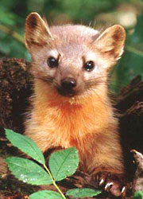
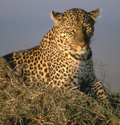
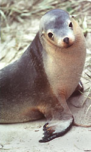

---
aliases:
  - Fleischfresser
  - Carnivora
  - գիշատիչներ
  - rovpattedyr
has_id_wikidata: Q25306
Commons_category: Carnivora
Commons_gallery: Carnivora
described_by_source:
  - '[[../../../../../../../../../../../../../../../../../WikiData/WD~Brockhaus_and_Efron_Encyclopedic_Dictionary,602358]]'
  - '[[_Standards/WikiData/WD~Encyclopædia_Britannica_11th_edition,867541]]'
  - '[[_Standards/WikiData/WD~Small_Brockhaus_and_Efron_Encyclopedic_Dictionary,19180675]]'
EPPO_Code: 1CARNO
image: http://commons.wikimedia.org/wiki/Special:FilePath/Carnivora.jpg
instance_of: '[[_Standards/WikiData/WD~taxon,16521]]'
ITIS_TSN: 180539
Krugosvet_article: nauka_i_tehnika/biologiya/HISHCHNIE.html
MeSH_tree_code: B01.050.150.900.649.313.750
NBN_System_Key: NHMSYS0000376165
parent_taxon:
  - '[[_Standards/WikiData/WD~Carnivoraformes,106488638]]'
  - '[[_Standards/WikiData/WD~Laurasiatheria,27379]]'
start_time: -42000000-01-01
subclass_of: '[[_Standards/WikiData/WD~carnivore,81875]]'
taxon_common_name:
  - գիշատիչներ
  - rovpattedyr
taxon_name: Carnivora
taxon_rank: '[[_Standards/WikiData/WD~order,36602]]'
this_taxon_is_source_of: '[[_Standards/WikiData/WD~carnivoran_meat,124815693]]'
title: Carnivora
topic_s_main_template:
  - '[[_Standards/WikiData/WD~Template_Carnivora,6290878]]'
  - '[[_Standards/WikiData/WD~Template_Taxonomy_Carnivora,13217770]]'
UMLS_CUI: C0562690
---

# [[Carnivora]]

## Dogs, cats, bears, raccoons, weasels, mongooses, hyenas, seals, walruses, etc. 

#is_/same_as :: [[../../../../../../../../../../../../../../../../../WikiData/WD~Carnivora,25306|WD~Carnivora,25306]]  

## #has_/text_of_/abstract 

> **Carnivora** ( kar-NIH-vər-ə) is an order of placental mammals specialized primarily in eating flesh, 
> whose members are formally referred to as carnivorans. 
> 
> The order Carnivora is the sixth largest order of mammals, comprising at least 279 species. 
> Carnivorans are found on every major landmass and in a variety of habitats, 
> ranging from the cold polar regions of Earth 
> to the hyper-arid region of the Sahara Desert and the open seas. 
> Carnivorans exhibit a wide array of body plans, varying greatly in size and shape.
>
> Carnivora are divided into two suborders, 
> - the Feliformia, containing the true felids and several "cat-like" animals; and 
> - the Caniformia, containing the true canids and many "dog-like" animals. 
> 
> The feliforms include the Felidae, Viverridae, hyena, and mongoose families, 
> the majority of which live only in the Old World; 
> cats are the only exception, occurring in the Old World and the New World, 
> entering the Americas via the Bering land bridge. 
> 
> The caniforms include the Caninae, Procyonidae, bears, mustelids, skunks, 
> and pinnipeds that occur worldwide with immense diversity in their morphology, diet, and behavior.
>
> [Wikipedia](https://en.wikipedia.org/wiki/Carnivora) 

## Phylogeny 

-   « Ancestral Groups  
    -  [Eutheria](../Eutheria.md) 
    -  [Mammal](../../Mammal.md) 
    -   [Therapsida](../../../Therapsida.md)
    -   [Synapsida](../../../../Synapsida.md)
    -   [Amniota](../../../../../Amniota.md)
    -   [Terrestrial Vertebrates](../../../../../../Terrestrial.md)
    -   [Sarcopterygii](../../../../../../../Sarc.md)
    -   [Gnathostomata](../../../../../../../../Gnath.md)
    -   [Vertebrata](../../../../../../../../../Vertebrata.md)
    -   [Craniata](../../../../../../../../../../Craniata.md)
    -   [Chordata](../../../../../../../../../../../Chordata.md)
    -   [Deuterostomia](../../../../../../../../../../../../Deutero.md)
    -  [Bilateria](../../../../../../../../../../../../../Bilateria.md) 
    -  [Animals](../../../../../../../../../../../../../../Animals.md) 
    -  [Eukarya](../../../../../../../../../../../../../../../Eukarya.md) 
    -   [Tree of Life](../../../../../../../../../../../../../../../Tree_of_Life.md)

-   ◊ Sibling Groups of  Eutheria
    -   [Edentata](Edentata.md)
    -   [Pholidota](Pholidota.md)
    -  [Lagomorpha](Glires/Lagomorpha.md) 
    -   [Rodentia](Rodentia.md)
    -   [Macroscelididae](Macroscelididae.md)
    -   [Primates](Primates.md)
    -   [Scandentia](Scandentia.md)
    -   [Bat](Bat.md)
    -   [Dermoptera](Dermoptera.md)
    -   [Insectivora](Insectivora.md)
    -   Carnivora
    -   [Artiodactyla](Artiodactyla.md)
    -   [Whale](Whale.md)
    -   [Tubulidentata](Tubulidentata.md)
    -   [Perissodactyla](Perissodactyla.md)
    -   [Hyracoidea](Hyracoidea.md)
    -   [Sirenia](Sirenia.md)
    -   [Proboscidea](Eukarya/Animal/Bilateria/Deutero/Chordata/Craniata/Vertebrata/Gnath/Sarc/Terrestrial/Amniota/Synapsida/Therapsida/Mammal/Eutheria/Proboscidea.md)

-   » Sub-Groups 
	-   *Nimravidae* † [(false
		saber-tooths)]
	-   *Felidae* [(cats)]
	-   *Viverridae* [(civets, linsangs, genets, etc.)]
	-   *Herpestidae* [(mongooses, meerkats, fossa)]
	-   *Hyaenidae* [(hyaenas, aardwolf)]
	-   *Nandiniidae* [(African palm civets)]
	-   *Caniformia*
	-   *Miacidae* †
	-   *Canidae* [(wolves, dogs, coyotes, foxes,
		jackals)]
	-   *Amphicyonidae* †
	-   *Ursidae* [(bears and giant panda)]
	-   *Hemicyonidae* †
	-   *Mustelidae* [(weasels, otters, ferrets, badgers, skunks,
		wolverines, etc.)]
	-   *Procyonidae* [(raccoons, kinkajous, coatimundis, lesser panda,
		etc.)]
	-   *Pinnipedia (Phocoidea)*
		-   *Phocidae* [(true seals, earless seals,
			walrus)]
		-   *Otariidae* [(sea lions, eared seals, fur
			seals)]

### Information on the Internet

-   [Introduction to the     Carnivora](http://www.ucmp.berkeley.edu/mammal/carnivora/carnivora.html).   UCMP Berkeley.
-   [Order     Carnivora](http://animaldiversity.ummz.umich.edu/chordata/mammalia/carnivora.html).    Animal Diversity Web. University of Michigan Museum of Zoology.
-   [Carnivore Preservation Trust](http://www.cptigers.org/).
-   [The Swedish Carnivore     Association](http://www.rovdjur.w.se/wolf/wolffak.htm).
-   [Carnivores](http://www.rovdjur.w.se/wolf/wolffak.htm). The Living Africa: Wildlife. ThinkQuest library.
-   [References on Mustelids and     Viverrids](http://sciences.univ-angers.fr/ecologie/RefMustelidneo.html).  Compiled by Thierry Lodé, Université d\'Angers.
-   [Cat Specialist Group](http://lynx.uio.no/catfolk/). IUCN - The World Conservation Union. Species Survival Commission.
-   [Cats! Wild to Mild](http://www.lam.mus.ca.us/cats/). Natural History Museum of Los Angeles County.
-   [Big Cats     Online](http://dialspace.dial.pipex.com/agarman/main_ns.htm).
-   [The Big Cats Info     Page](http://www.lam.mus.ca.us/%7Epcannon/cats.html).
-   [WildLife on Easy Street, Inc.](http://wildlifeeasyst.com/)
    Information about rare and exotic cats.
-   [Bear Cats](http://wildlifeeasyst.com/bear_cat.htm). WildLife on
    Easy Street, Inc.
-   [Civets](http://wildlifeeasyst.com/civet.htm). WildLife on Easy
    Street, Inc.
-   [Meerkats.net](http://www.meerkats.net/).
-   [The Hyena Pages](http://www.liberalmafia.org/hyenas/hyena.html).
-   [The Brown Hyaenas of the Cape     Flats](http://www.museums.org.za/sam/resource/palaeo/brownhya.htm).
    South African Museum.
-   [Canid Specialist Group](http://www.canids.org/). IUCN - The World
    Conservation Union. Species Survival Commission.
-   [International Wolf Center](http://www.wolf.org/).
-   [Dog Genome Project](http://mendel.berkeley.edu/dog.html). A
    collaborative study involving scientists at the University of
    California, Berkeley, the University of Oregon, and the Fred
    Hutchinson Cancer Research Center.
-   [Project Vulpes](http://www.vulpine.pp.se/vulpes/). Information
    about Foxes.
-   [African Wild Dog\'s     Website](http://www.naturalia.org/wild_dog/index.html).
-   [Dhole Home Page](http://www.dcpbase.demon.co.uk/dcp/).
-   [Bears of the     World](http://www.nwf.org/wildalive/grizzly/bearsworld.html).
    National Wildlife Federation.
-   [International Association for Bear Research and Management     (IBA)](http://www.bearbiology.com/).
-   [Bear Trust International](http://www.beartrust.org/).
-   [The Bear Den](http://www.nature-net.com/bears/).
-   [Panda     Central](http://www.sandiegozoo.org/special/pandas/index.html).
    Zoological Society of San Diego.
-   [Badgers on the Web](http://www.badgers.org.uk/).
-   [Wolverine Foundation](http://www.wolverinefoundation.org/).
-   [Otters](http://www.infidels.org/%7Emeta/otters/).
-   [Otternet](http://www.otternet.com/index.htm).
-   [Laboratoire d\'Écologie Animale, Université     d\'Angers](http://sciences.univ-angers.fr/ecologie/animalecology.html):
    -   [Conservation de la Loutre         d\'Europe](http://sciences.univ-angers.fr/ecologie/Lutralutra.html).
    -   [The European Polecat Mustela         putorius](http://sciences.univ-angers.fr/ecologie/Polecat_project.html).
    -   [Conservation Plan for the European         mink](http://sciences.univ-angers.fr/ecologie/Englutreola.html).
-   [The Red Panda Pages](http://w3.one.net/%7Eshire/redpanda/).
-   [The World Wide Raccoon Web](http://www.loomcom.com/raccoons/).
-   [Coatimundi](http://wildlifeeasyst.com/coatimundi.htm). WildLife on
    Easy Street, Inc.
-   [Online Zoologists:     Pinnipeds](http://www.rtis.com/nat/user/elsberry/taxa/pin.html).
-   [The Pinnipeds: Seals, Sea Lions, and     Walruses](http://www.tmmc.org/pinniped.htm). Marine Mammal Center.
-   [National Marine Mammal Laboratory     (NMML)](http://nmml.afsc.noaa.gov/).
-   [Canada\'s Marine     Mammals](http://www.aquatic.uoguelph.ca/mammals/whales/marine_frame.htm).
    Part of the [Canada\'s Aquatic     Environments](http://www.aquatic.uoguelph.ca/) web site. University
    of Guelph.
-   [Seal Conservation     Society](http://www.greenchannel.com/tec/seals.htm).
-   [Pinniped Photo     Gallery](http://nmml.afsc.noaa.gov/gallery/pinnipeds.htm). National
    Marine Mammal Laboratory.

## Title Illustrations

---------------------------------------------------------------------------- 
 
-   **Pine Marten** (Martes martes, Mustelidae).
Photograph by Erwin and Peggy Bauer. Courtesy of the [U.S. Fish and     Wildlife Service](http://www.fws.gov/).

---------------------------------------------------------------------------- 
 
-   **Leopard** (Panthera pardus, Felidae).
Photographs copyright © 2000 [Greg and Mary Beth     Dimijian](http://www.dimijianimages.com/).

---------------------------------------------------------------------------- 
 
-   **Australian sea lion pup** (Neophoca cinerea, Otariidae).
copyright ::   © 2000 [Greg and Marybeth Dimijian](http://www.dimijianimages.com/) 

## Confidential Links & Embeds: 

### #is_/same_as :: [[/_Standards/bio/bio~Domain/Eukarya/Animal/Bilateria/Deutero/Chordata/Craniata/Vertebrata/Gnath/Sarc/Tetrapods/Amniota/Synapsida/Therapsida/Mammal/Eutheria/Carnivora|Carnivora]] 

### #is_/same_as :: [[/_public/bio/bio~Domain/Eukarya/Animal/Bilateria/Deutero/Chordata/Craniata/Vertebrata/Gnath/Sarc/Tetrapods/Amniota/Synapsida/Therapsida/Mammal/Eutheria/Carnivora.public|Carnivora.public]] 

### #is_/same_as :: [[/_internal/bio/bio~Domain/Eukarya/Animal/Bilateria/Deutero/Chordata/Craniata/Vertebrata/Gnath/Sarc/Tetrapods/Amniota/Synapsida/Therapsida/Mammal/Eutheria/Carnivora.internal|Carnivora.internal]] 

### #is_/same_as :: [[/_protect/bio/bio~Domain/Eukarya/Animal/Bilateria/Deutero/Chordata/Craniata/Vertebrata/Gnath/Sarc/Tetrapods/Amniota/Synapsida/Therapsida/Mammal/Eutheria/Carnivora.protect|Carnivora.protect]] 

### #is_/same_as :: [[/_private/bio/bio~Domain/Eukarya/Animal/Bilateria/Deutero/Chordata/Craniata/Vertebrata/Gnath/Sarc/Tetrapods/Amniota/Synapsida/Therapsida/Mammal/Eutheria/Carnivora.private|Carnivora.private]] 

### #is_/same_as :: [[/_personal/bio/bio~Domain/Eukarya/Animal/Bilateria/Deutero/Chordata/Craniata/Vertebrata/Gnath/Sarc/Tetrapods/Amniota/Synapsida/Therapsida/Mammal/Eutheria/Carnivora.personal|Carnivora.personal]] 

### #is_/same_as :: [[/_secret/bio/bio~Domain/Eukarya/Animal/Bilateria/Deutero/Chordata/Craniata/Vertebrata/Gnath/Sarc/Tetrapods/Amniota/Synapsida/Therapsida/Mammal/Eutheria/Carnivora.secret|Carnivora.secret]] 

