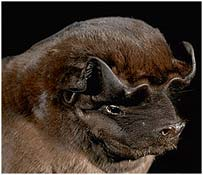
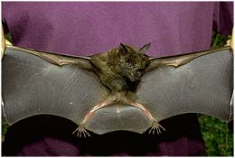

---
title: Chiroptera
---

# [[Chiroptera]]

## Bats 

  ) 

## #has_/text_of_/abstract 

> Bats are flying mammals of the order **Chiroptera** (). With their forelimbs adapted as wings, they are the only mammals capable of true and sustained flight. Bats are more agile in flight than most birds, flying with their very long spread-out digits covered with a thin membrane or patagium. The smallest bat, and arguably the smallest extant mammal, is Kitti's hog-nosed bat, which is 29–34 mm (1.1–1.3 in) in length, 150 mm (5.9 in) across the wings and 2–2.6 g (0.071–0.092 oz) in mass. The largest bats are the flying foxes, with the giant golden-crowned flying fox (Acerodon jubatus) reaching a weight of 1.6 kg (3.5 lb) and having a wingspan of 1.7 m (5 ft 7 in).
>
> The second largest order of mammals after rodents, bats comprise about 20% of all classified mammal species worldwide, with over 1,400 species. These were traditionally divided into two suborders: the largely fruit-eating megabats, and the echolocating microbats. But more recent evidence has supported dividing the order into Yinpterochiroptera and Yangochiroptera, with megabats as members of the former along with several species of microbats. Many bats are insectivores, and most of the rest are frugivores (fruit-eaters) or nectarivores (nectar-eaters). A few species feed on animals other than insects; for example, the vampire bats feed on blood. Most bats are nocturnal, and many roost in caves or other refuges; it is uncertain whether bats have these behaviours to escape predators. Bats are present throughout the world, with the exception of extremely cold regions. They are important in their ecosystems for pollinating flowers and dispersing seeds; many tropical plants depend entirely on bats for these services. Globally, they transfer organic matter into cave ecosystems and arthropod suppression. Insectivory by bats in farmland constitutes an ecosystem service that has paramount value to humans: even in today’s pesticide era, natural enemies account for almost all pest suppression in farmed ecosystems.
>
> Bats provide humans with some direct benefits, at the cost of some disadvantages. Bat dung has been mined as guano from caves and used as fertiliser. Bats consume insect pests, reducing the need for pesticides and other insect management measures. Some bats are also predators of mosquitoes, suppressing the transmission of mosquito-borne diseases. Bats are sometimes numerous enough and close enough to human settlements to serve as tourist attractions, and they are used as food across Asia and the Pacific Rim. However, fruit bats are frequently considered pests by fruit growers. Due to their physiology, bats are one type of animal that acts as a natural reservoir of many pathogens, such as rabies; and since they are highly mobile, social, and long-lived, they can readily spread disease among themselves. If humans interact with bats, these traits become potentially dangerous to humans.
>
> Depending on the culture, bats may be symbolically associated with positive traits, such as protection from certain diseases or risks, rebirth, or long life, but in the West, bats are popularly associated with darkness, malevolence, witchcraft, vampires, and death.
>
> [Wikipedia](https://en.wikipedia.org/wiki/Bat) 

### Information on the Internet

For more information on Chiroptera, see these web sites:

-   [Bats Conservation International](http://www.batcon.org/). Includes
    bat trivia, photographs, conservation news and information on bat
    houses.
-   [University of California Museum of     Paleontology](http://www.ucmp.berkeley.edu/mammal/eutheria/chiroptera.html).
    Information on ecology, systematics, morphology and the fossil
    record of bats.
-   [James Buzbee\'s Bat House](http://www.batbox.org/). Hundreds of
    links to pages about bats including regional sites, exhibits,
    organizations, sites for kids and pictures.
-   [Incredible Bats](http://www.incrediblebats.com/). Dispells common
    myths about bats.
-   [Bat Research Laboratory- at Purdue     University](http://klingon.cs.iupui.edu/%7Ebat). A research project
    trying to develop a bio-sonar model for target recognition and
    classification based on a bats echolocation system.
-   [Pacific Northwest Bat Call     Library](http://depts.washington.edu/%7Esdwasm/pnwbat/batcall.html).
    A collection of bat calls and links to other bat call libraries.

## Introduction

[Nancy B. Simmons and Tenley Conway](http://www.tolweb.org/)

The clade Chiroptera includes two extant clades, Megachiroptera (Old
World Fruit Bats) and
[Microchiroptera](tree?group=Microchiroptera&contgroup=Chiroptera)
(echolocating bats). In addition, Chiroptera includes at least four
extinct clades that are most closely related to Microchiroptera. There
are over nine hundred extant species of bats (Koopman, 1993). Bats vary
greatly in size. The smallest bat, *Craseonycteris thonglongyai*
(Microchiroptera), weighs less than 2 g and has a wingspan of 12-13 cm,
while the largest bats, those of the genus *Pteropus* (Megachiroptera),
weigh up to 1.5 kg and may have a wing span over 2m (Fenton, 1992).

Bats are unique among mammals as they are the only group to have evolved
true powered flight. Some other mammals such as \"flying\" squirrels and
\"flying\" lemurs can glide through the air for long distances, but they
are not capable of sustained flight. In contrast, bats can propel
themselves with their wings, gaining and loosing altitude and flying for
long periods.

Bats are nocturnal and usually spend the daylight hours roosting in
caves, rock crevices, trees, or manmade structures such as houses and/or
bridges. Some bats are solitary, while others are found in colonies that
may include over a million individuals.

Activity begins around dusk, when bats leave the day roost and start
feeding. The clade Chiroptera includes species with very diverse food
preferences, including bats that eat either meat, insects, fish, fruit,
nectar, or a variety of food types. Only three species of bats actually
feed on blood Desmodontinae). Many bats remain at their feeding sites
until just before dawn when they return to the day roost.

[Classification](http://www.tolweb.org/accessory/Classification_of_Bats?acc_id=505)
outlines the higher-level classifications within Chiroptera.

### Characteristics

#### Unique Characteristics

One unique feature of bats is their modified forelimbs, which support a
wing membrane (patagium). The basic elements of the mammalian limb are
present in bats, although the relative sizes of most bones and muscles
differ from those of nonflying mammals. The most elongated parts of the
limb are those of the hand (metacarpal bones) and fingers (phalanges).
The primary functions of these bones in bats is to provide support for
the patagium and control its movements. The patagium stretches between
the fingers and attaches to the side or back of the bat and the lower
leg. Part of the membrane extends between the hindlimbs. Numerous blood
vessels and nerves are present throughout the wing membrane. Bats also
have five unique muscles present in the patagium, and use additional
muscles in the chest and back to move the wings up and down.

The most obvious difference between bird wings and those of bats is that
bird wings are made of feathers, not a skin membrane. Birds have an
elongated arm, but do not have elongated fingers like bats.
Additionally, the muscles used in both the upstroke and downstroke are
found in the chest of birds, while the upstroke muscles are on the back
in bats (Fenton, 1983).

The orientation of the hindlimb is also unique to bats. The hip joint is
rotated 90° so that the legs project sideways and the knee faces almost
backwards. Due in part to the rotation of the hindlimb, the walking
motion of bats differs from other tetrapods, often appearing awkward.
The hindlimb is designed to support the patagium in flight and allow the
bat to roost hanging from its hindlimbs. Most bats have a tendon system
in the toes that locks the claws in place so the bat can hang upside
down even when asleep.

Bats have other unique characteristics including many [morphological synapomorphies](http://www.tolweb.org/accessory/Chiroptera_Synapomorphies?acc_id=506).

#### General Characteristics

The body of a bat is ventrally compressed with a short neck region. The
bones tend to be slender and light-weight. The majority of the body
weight is concentrated in the chest region due to the large flight
muscles.

The overall shape of the head varies more in bats than within most other
groups of mammals. Some bats have very elongated muzzles while others
have broad, short faces. There is a correlation between the shape of the
head and the type of food eaten. For example, most nectar feeders have
long, narrow muzzles that are good for reaching into flowers, while many
fruit eaters have short, broad faces good for biting rounded fruits
(Hill and Smith, 1984).

The ears range from small and round to large and pointed, and often have
a cartilaginous fold (tragus) present at the notch of the ear. There is
additional variation in the nasal and lip regions of bats. Some bats
have complex noseleafs, folds, or wrinkles on their muzzles. The
function of facial ornamentation is not well understood, although it may
effect the emission of echolocation calls in some taxa (Fenton, 1992).

A major misconception about bats is that they are blind. This idea
originated from the fact that bats are able to successfully maneuver in
the dark and often have small eyes. While some bats do have very small
eyes (most
[Microchiroptera](tree?group=Microchiroptera&contgroup=Chiroptera))
many have large and complex eyes (Megachiroptera). Experiments on
several species of bats have shown that they are able to distinguish
patterns even at low light levels (Hill and Smith, 1984).

Bats usually have black or brown fur, although the fur can also be gray,
white, red, or orange. In some species there are stripes on the face or
down the back, or patches of white on the face or above the shoulder.
The length of the fur also varies among species from short and dense to
long and fluffy. The wing membrane is usually dark in color, although it
may have white on the tips or be a lighter color around the bones in the
membrane. A few bats have white or pale yellow wings. There are also
little hairs on the membrane itself. These hairs can be the color of the
wing or the same color as the body.

### Bat Monophyly

Until the 1970s, most evolutionary biologists assumed that bats form a
monophyletic group. Recently, however, several authors have questioned
monophyly of Chiroptera (Jones and Genoways, 1970; Smith, 1976, 1980;
Smith and Madkour, 1980; Hill and Smith, 1984; Pettigrew, 1986, 1991a,
1991b; Pettigrew and Jamieson, 1987; Pettigrew et al., 1989) creating
what has become known as the "bat monophyly controversy". Proponents of
the hypothesis that bats are diphyletic pointed out that many
similarities between Megachiroptera and
[Microchiroptera](tree?group=Microchiroptera&contgroup=Chiroptera)
involve the flight mechanism. It is therefore possible that convergent
evolution of aerial locomotion, rather than shared ancestry, might
account for the similarities found between megachiropteran and
microchiropteran bats (Jones and Genoways, 1970).

The bat monophyly hypothesis states the Megachiroptera and
Microchiroptera are each others closest relatives in an evolutionary
sense (i.e., they form a clade). If this is true, then their shared
characteristics, including the ability to fly, would have been present
in their most recent common ancestor (Simmons, 1994; 1995). It follows
from this that there was only one origin of powered flight in mammals.
In contrast, the diphyly hypothesis states that megachiropteran and
microchiropteran bats do not form a monophyletic group, instead having
evolved independently from two different groups of non-flying mammals.
It has been suggested that Megachiroptera is more closely related to
Dermoptera and Primates than to Microchiroptera (Smith and Madkour,
1980; Pettigrew, 1986, 1991a, b, 1995; Pettigrew and Jamieson, 1987;
Pettigrew et. al., 1989). In this case, the characteristics common to
both groups of bats either evolved as a result of convergent evolution
or are simply the result of retention of primitive features. If bats are
diphyletic, the ability to fly must have evolved once in Megachiroptera
and again in Microchiroptera.

There have been numerous studies using biochemical, molecular, and/or
morphological data to analyze the relationship between Megachiroptera,
Microchiroptera and other taxa. Diphyly has only been supported in two
data sets: features of the nervous system (Pettigrew, 1986, 1991a,
1991b; Pettigrew et. al., 1989; Johnson and Kirsch, 1993) and of the
penis (Smith and Madkour, 1980). In contrast, monophyly has been
supported in studies examining a large and diverse set of morphological
features, including those of the nervous and reproductive systems
(Luckett, 1980a, 1993; Wible and Novacek, 1988; Kovtun, 1989; Thewissen
and Babcock, 1991, 1993; Kay et. al., 1992; Novacek, 1992, 1994; Beard,
1993; Simmons, 1993a, 1994, 1995; Wible and Martin, 1993; Simmons and
Quinn, 1994, Miyamoto, 1996), DNA-DNA hybridization data (Kirsch et al.,
1995; Hutcheon and Kirsch, 1996; Kirsch, 1996), and DNA nucleotide
sequence data from mitochondrial and nuclear genes (Adkins and
Honeycutt, 1991, 1993, 1994; Mindell et al., 1991; Ammerman and Hillis,
1992; Bailey at al., 1992; Stanhope et al., 1992, 1993, 1996; Honeycutt
and Adkins, 1993; Knight and Mindell, 1993; Novacek, 1994, Allard et
al., 1996; Miyamoto, 1996; Porter et al., 1996).

Because the vast majority of available data strongly support a
sister-group relationship between Megachiroptera and Microchiroptera,
bat monophyly is now regarded as a very strongly supported hypothesis.

### Discussion of Phylogenetic Relationships

The fossil record of bats extends back at least to the early Eocene, and
chiropteran fossils are known from all continents except Antarctica.
Icaronycteris, Archaeonycteris, Hassianycteris, and Palaeochiropteryx,
unlike most other fossil bats, have not been referred to any extant
family or superfamily. These Eocene taxa are known from exceptionally
well-preserved fossils, and they have long formed a basis for
reconstructing the early evolutionary history of Chiroptera (see review
in Simmons and Geisler, 1998).

Smith (1977) suggested that these taxa represent an extinct clade of
early microchiropterans (\"Palaeochiropterygoidea\"). In contrast, Van
Valen (1979) argued that these fossil forms are representatives of a
primitive grade ancestral to both Megachiroptera and Microchiroptera
(\"Eochiroptera\"). Novacek (1987) reanalyzed morphology of
Icaronycteris and Palaeochiropterx and concluded that they are more
closely related to Microchroptera than to Megachiroptera. Most recently,
Simmons and Geisler (1998) found that Icaronycteris, Archaeonycteris,
Hassianycteris, and Palaeochiropteryx represent a series of consecutive
sister-taxa to extant microchiropteran bats.

### Geographic Distribution

\

The geographical distribution of bats is shown in red.  Distribution
from Hill and Smith (1984).

## Phylogeny 

-   « Ancestral Groups  
    -  [Eutheria](../Eutheria.md))
    -  [Mammal](../../Mammal.md))
    -   [Therapsida](../../../Therapsida.md)
    -   [Synapsida](../../../../Synapsida.md)
    -   [Amniota](../../../../../Amniota.md)
    -   [Terrestrial Vertebrates](../../../../../../Terrestrial.md)
    -   [Sarcopterygii](../../../../../../../Sarc.md)
    -   [Gnathostomata](../../../../../../../../Gnath.md)
    -   [Vertebrata](../../../../../../../../../Vertebrata.md)
    -   [Craniata](../../../../../../../../../../Craniata.md)
    -   [Chordata](../../../../../../../../../../../Chordata.md)
    -   [Deuterostomia](../../../../../../../../../../../../Deutero.md)
    -  [Bilateria](../../../../../../../../../../../../../Bilateria.md))
    -  [Animals](../../../../../../../../../../../../../../Animals.md))
    -  [Eukarya](../../../../../../../../../../../../../../../Eukarya.md))
    -   [Tree of Life](../../../../../../../../../../../../../../../Tree_of_Life.md)

-   ◊ Sibling Groups of  Eutheria
    -   [Edentata](Edentata.md)
    -   [Pholidota](Pholidota.md)
    -  [Lagomorpha](Glires/Lagomorpha.md))
    -   [Rodentia](Rodentia.md)
    -   [Macroscelididae](Macroscelididae.md)
    -   [Primates](Primates.md)
    -   [Scandentia](Scandentia.md)
    -   Chiroptera
    -   [Dermoptera](Dermoptera.md)
    -   [Insectivora](Insectivora.md)
    -   [Carnivora](Carnivora.md)
    -   [Artiodactyla](Artiodactyla.md)
    -   [Whale](Whale.md)
    -   [Tubulidentata](Tubulidentata.md)
    -   [Perissodactyla](Perissodactyla.md)
    -   [Hyracoidea](Hyracoidea.md)
    -   [Sirenia](Sirenia.md)
    -   [Proboscidea](Eukarya/Animal/Bilateria/Deutero/Chordata/Craniata/Vertebrata/Gnath/Sarc/Terrestrial/Amniota/Synapsida/Therapsida/Mammal/Eutheria/Proboscidea.md)

-   » Sub-Groups
    -  [Microchiroptera](Chiroptera/Microchiroptera.md))

## Title Illustrations

----------

Scientific Name ::  Molossus rufus
Copyright ::         © 1998 Nancy Simmons

----------)
Scientific Name ::  Phylostomus hastatus
Copyright ::         © 1994 Nancy Simmons

## Confidential Links & Embeds: 

### #is_/same_as ::[Chiroptera](Chiroptera.md)) 

### #is_/same_as :: [Chiroptera.public](/_public/bio/bio~Domain/Eukarya/Animal/Bilateria/Deutero/Chordata/Craniata/Vertebrata/Gnath/Sarc/Tetrapods/Amniota/Synapsida/Therapsida/Mammal/Eutheria/Chiroptera.public.md) 

### #is_/same_as :: [Chiroptera.internal](/_internal/bio/bio~Domain/Eukarya/Animal/Bilateria/Deutero/Chordata/Craniata/Vertebrata/Gnath/Sarc/Tetrapods/Amniota/Synapsida/Therapsida/Mammal/Eutheria/Chiroptera.internal.md) 

### #is_/same_as :: [Chiroptera.protect](/_protect/bio/bio~Domain/Eukarya/Animal/Bilateria/Deutero/Chordata/Craniata/Vertebrata/Gnath/Sarc/Tetrapods/Amniota/Synapsida/Therapsida/Mammal/Eutheria/Chiroptera.protect.md) 

### #is_/same_as :: [Chiroptera.private](/_private/bio/bio~Domain/Eukarya/Animal/Bilateria/Deutero/Chordata/Craniata/Vertebrata/Gnath/Sarc/Tetrapods/Amniota/Synapsida/Therapsida/Mammal/Eutheria/Chiroptera.private.md) 

### #is_/same_as :: [Chiroptera.personal](/_personal/bio/bio~Domain/Eukarya/Animal/Bilateria/Deutero/Chordata/Craniata/Vertebrata/Gnath/Sarc/Tetrapods/Amniota/Synapsida/Therapsida/Mammal/Eutheria/Chiroptera.personal.md) 

### #is_/same_as :: [Chiroptera.secret](/_secret/bio/bio~Domain/Eukarya/Animal/Bilateria/Deutero/Chordata/Craniata/Vertebrata/Gnath/Sarc/Tetrapods/Amniota/Synapsida/Therapsida/Mammal/Eutheria/Chiroptera.secret.md)

