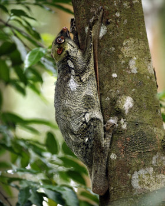
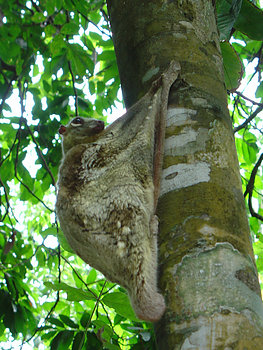
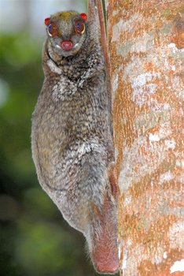

---
aliases:
title: Dermoptera
has_id_wikidata: Q183383
described_by_source:
  - "[[_Standards/WikiData/WD~Brockhaus_and_Efron_Encyclopedic_Dictionary,602358]]"
  - "[[_Standards/WikiData/WD~Encyclopædia_Britannica_11th_edition,867541]]"
  - "[[_Standards/WikiData/WD~Great_Soviet_Encyclopedia_(1926_1947),20078554]]"
different_from: "[[_Standards/WikiData/WD~Latawce,11753158]]"
instance_of: "[[_Standards/WikiData/WD~taxon,16521]]"
taxon_rank: "[[_Standards/WikiData/WD~order,36602]]"
ITIS_TSN: "179984"
image: http://commons.wikimedia.org/wiki/Special:FilePath/Colugo%20%28Galeopterus%20variegatus%2C%20adult%20female%29%2C%20Central%20Catchment%20Area%2C%20Singapore%20-%2020060618.jpg
taxon_range_map_image: http://commons.wikimedia.org/wiki/Special:FilePath/DistributionDermopteraCorrecting.png
EPPO_Code: 1DRMPO
UMLS_CUI: C0324718
Commons_category: Dermoptera
taxon_name: Dermoptera
taxon_common_name: skjermflygere
start_time: -37000000-06
---

# Dermoptera

## Colugos or flying lemurs and their extinct relatives 
)

#is_/same_as :: [[../../../../../../../../../../../../../../../../../WikiData/WD~Dermoptera,183383|WD~Dermoptera,183383]] 

## #has_/text_of_/abstract 

> Colugos (), flying lemurs, or cobegos (), are arboreal gliding euarchontogliran mammals that are native to Southeast Asia. Their closest evolutionary relatives are primates. There are just two living species of colugos: the Sunda flying lemur (Galeopterus variegatus) and the Philippine flying lemur (Cynocephalus volans). These two species make up the entire family Cynocephalidae () and order **Dermoptera**, from Ancient Greek δέρμα (dérma) "skin" and πτερόν (pterón) "wing".
>
> [Wikipedia](https://en.wikipedia.org/wiki/Colugo)

## Phylogeny 

-   « Ancestral Groups  
    -  [Eutheria](../Eutheria.md))
    -  [Mammal](../../Mammal.md))
    -   [Therapsida](../../../Therapsida.md)
    -   [Synapsida](../../../../Synapsida.md)
    -   [Amniota](../../../../../Amniota.md)
    -   [Terrestrial Vertebrates](../../../../../../Terrestrial.md)
    -   [Sarcopterygii](../../../../../../../Sarc.md)
    -   [Gnathostomata](../../../../../../../../Gnath.md)
    -   [Vertebrata](../../../../../../../../../Vertebrata.md)
    -   [Craniata](../../../../../../../../../../Craniata.md)
    -   [Chordata](../../../../../../../../../../../Chordata.md)
    -   [Deuterostomia](../../../../../../../../../../../../Deutero.md)
    -  [Bilateria](../../../../../../../../../../../../../Bilateria.md))
    -  [Animals](../../../../../../../../../../../../../../Animals.md))
    -  [Eukarya](../../../../../../../../../../../../../../../Eukarya.md))
    -   [Tree of Life](../../../../../../../../../../../../../../../Tree_of_Life.md)

-   ◊ Sibling Groups of  Eutheria
    -   [Edentata](Edentata.md)
    -   [Pholidota](Pholidota.md)
    -  [Lagomorpha](Glires/Lagomorpha.md))
    -   [Rodentia](Rodentia.md)
    -   [Macroscelididae](Macroscelididae.md)
    -   [Primates](Primates.md)
    -   [Scandentia](Scandentia.md)
    -   [Bat](Bat.md)
    -   Dermoptera
    -   [Insectivora](Insectivora.md)
    -   [Carnivora](Carnivora.md)
    -   [Artiodactyla](Artiodactyla.md)
    -   [Whale](Whale.md)
    -   [Tubulidentata](Tubulidentata.md)
    -   [Perissodactyla](Perissodactyla.md)
    -   [Hyracoidea](Hyracoidea.md)
    -   [Sirenia](Sirenia.md)
    -   [Proboscidea](Eukarya/Animal/Bilateria/Deutero/Chordata/Craniata/Vertebrata/Gnath/Sarc/Terrestrial/Amniota/Synapsida/Therapsida/Mammal/Eutheria/Proboscidea.md)

-   » Sub-Groups 

	-   *Plagiomenidae* †
	-   *Mixodectidae* †
	-   *Galeopithecidae*
	    -   *Dermotherium* †
	    -   *Cynocephalus variegatus*
	    -   *Cynocephalus volans*

### Information on the Internet

-   [Order     Dermoptera](http://animaldiversity.ummz.umich.edu/chordata/mammalia/dermoptera.html).
    Animal Diversity Web. University of Michigan Museum of Zoology.
-   [Flying lemurs mating in the forests of     Borneo](http://www.youtube.com/watch?v=wavNc4nuVyk). Video on
    YouYube.com.

## Title Illustrations

----------------------------------------------------------------)
Scientific Name ::     Cynocephalus variegatus
Location ::           Central Catchment area, Singapore
Specimen Condition   Live Specimen
Sex ::                Female
Life Cycle Stage ::     adult
Source               [Colugo](http://www.flickr.com/photos/lipkee/453554996/)
Source Collection    [Flickr](http://flickr.com/)
Image Use ::    [Attribution-NonCommercial-NoDerivs 2.0 Creative Commons License](http://creativecommons.org/licenses/by-nc-nd/2.0/).
Copyright ::            © 2006 [Lip Kee Yap](http://flickr.com/people/64565252@N00)

----------------------------------------------------------------)
Scientific Name ::     Cynocephalus variegatus
Location ::           Langkawi Island, Malaysia
Specimen Condition   Live Specimen
Source               [Honeymoon - 128.jpg](http://flickr.com/photos/petermacdonald/143391931/)
Source Collection    [Flickr](http://flickr.com/)
Image Use ::    [Attribution-NoDerivs 2.0 Creative Commons License](http://creativecommons.org/licenses/by-nd/2.0/).
Copyright ::            © 2006 [Peter MacDonald](http://flickr.com/people/petermacdonald/)

------------------------------------------------------------)
Scientific Name ::     Cynocephalus variegatus
Location ::           MacRitchie Reservoir, Singapore
Specimen Condition   Live Specimen
Source               [Flying lemur, Colugo](http://www.flickr.com/photos/64684201@N00/296191800/)
Source Collection    [Flickr](http://flickr.com/)
Image Use ::    [Attribution 2.0 Creative Commons License](http://creativecommons.org/licenses/by/2.0/).
Copyright ::            © 2006 [Jwee](http://flickr.com/people/64684201@N00)

## Confidential Links & Embeds: 

### #is_/same_as :: [Dermoptera](/_Standards/bio/bio~Domain/Eukarya/Animal/Bilateria/Deutero/Chordata/Craniata/Vertebrata/Gnath/Sarc/Tetrapods/Amniota/Synapsida/Therapsida/Mammal/Eutheria/Dermoptera.md) 

### #is_/same_as :: [Dermoptera.public](/_public/bio/bio~Domain/Eukarya/Animal/Bilateria/Deutero/Chordata/Craniata/Vertebrata/Gnath/Sarc/Tetrapods/Amniota/Synapsida/Therapsida/Mammal/Eutheria/Dermoptera.public.md) 

### #is_/same_as :: [Dermoptera.internal](/_internal/bio/bio~Domain/Eukarya/Animal/Bilateria/Deutero/Chordata/Craniata/Vertebrata/Gnath/Sarc/Tetrapods/Amniota/Synapsida/Therapsida/Mammal/Eutheria/Dermoptera.internal.md) 

### #is_/same_as :: [Dermoptera.protect](/_protect/bio/bio~Domain/Eukarya/Animal/Bilateria/Deutero/Chordata/Craniata/Vertebrata/Gnath/Sarc/Tetrapods/Amniota/Synapsida/Therapsida/Mammal/Eutheria/Dermoptera.protect.md) 

### #is_/same_as :: [Dermoptera.private](/_private/bio/bio~Domain/Eukarya/Animal/Bilateria/Deutero/Chordata/Craniata/Vertebrata/Gnath/Sarc/Tetrapods/Amniota/Synapsida/Therapsida/Mammal/Eutheria/Dermoptera.private.md) 

### #is_/same_as :: [Dermoptera.personal](/_personal/bio/bio~Domain/Eukarya/Animal/Bilateria/Deutero/Chordata/Craniata/Vertebrata/Gnath/Sarc/Tetrapods/Amniota/Synapsida/Therapsida/Mammal/Eutheria/Dermoptera.personal.md) 

### #is_/same_as :: [Dermoptera.secret](/_secret/bio/bio~Domain/Eukarya/Animal/Bilateria/Deutero/Chordata/Craniata/Vertebrata/Gnath/Sarc/Tetrapods/Amniota/Synapsida/Therapsida/Mammal/Eutheria/Dermoptera.secret.md)

