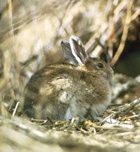

---
aliases:
  - Lagomorpha
  - Rabbit
  - hare
  - pika
  - lagomorphs
  - lagomorph
title: Lagomorpha
has_id_wikidata: Q25401
parent_taxon: "[[_Standards/WikiData/WD~Glires,660432]]"
said_to_be_the_same_as: "[[_Standards/WikiData/WD~Master_Lampe,1918298]]"
topic_s_main_Wikimedia_portal: "[[_Standards/WikiData/WD~Portal_Lagomorpha,106498011]]"
instance_of: "[[_Standards/WikiData/WD~taxon,16521]]"
taxon_rank: "[[_Standards/WikiData/WD~order,36602]]"
ITIS_TSN: "180105"
taxon_common_name:
  - خرگوش
  - харгӯш
  - haredyr
  - қоянтәрізділер
Commons_category: Lagomorpha
taxon_name: Lagomorpha
taxon_range_map_image: http://commons.wikimedia.org/wiki/Special:FilePath/Lagomorpha%20range.png
image: http://commons.wikimedia.org/wiki/Special:FilePath/Ochotona%20princeps.jpg
EPPO_Code: 1LAGOO
MeSH_tree_code: B01.050.150.900.649.313.968
Krugosvet_article_archived_: nauka_i_tehnika/biologiya/ZATSEOBRAZNIE.html
NBN_System_Key: NBNSYS0000160265
---

# [[Lagomorpha]]

## Rabbits, hares, and pikas 
)

#is_/same_as :: [[../../../../../../../../../../../../../../../../../../WikiData/WD~Lagomorpha,25401|WD~Lagomorpha,25401]] 

## #has_/text_of_/abstract  

> The lagomorphs are the members of the taxonomic order **Lagomorpha**, of which there are two living families: the Leporidae (rabbits and hares) and the Ochotonidae (pikas). There are 110 recent species of lagomorph, of which 109 species in twelve genera are extant, including ten genera of rabbits (42 species); one genus of hare (33 species) and one genus of pika (34 species). The name of the order is derived from the Ancient Greek lagos (λαγώς, "hare") + morphē (μορφή, "form").
>
> [Wikipedia](https://en.wikipedia.org/wiki/Lagomorpha) 

## Phylogeny 

-   « Ancestral Groups  
    -  [Eutheria](../../Eutheria.md))
    -  [Mammal](../../../Mammal.md))
    -   [Therapsida](../../../../Therapsida.md)
    -   [Synapsida](../../../../../Synapsida.md)
    -   [Amniota](../../../../../../Amniota.md)
    -   [Terrestrial Vertebrates](../../../../../../../Terrestrial.md)
    -   [Sarcopterygii](../../../../../../../../Sarc.md)
    -   [Gnathostomata](../../../../../../../../../Gnath.md)
    -   [Vertebrata](../../../../../../../../../../Vertebrata.md)
    -   [Craniata](../../../../../../../../../../../Craniata.md)
    -   [Chordata](../../../../../../../../../../../../Chordata.md)
    -   [Deuterostomia](../../../../../../../../../../../../../Deutero.md)
    -  [Bilateria](../../../../../../../../../../../../../../Bilateria.md))
    -  [Animals](../../../../../../../../../../../../../../../Animals.md))
    -  [Eukarya](../../../../../../../../../../../../../../../../Eukarya.md))
    -   [Tree of Life](../../../../../../../../../../../../../../../../Tree_of_Life.md)

-   ◊ Sibling Groups of  Eutheria
    -  [Edentata](../Edentata.md))
    -  [Pholidota](../Pholidota.md))
    -   Lagomorpha
    -  [Rodentia](../Rodentia.md))
    -  [Macroscelididae](../Macroscelididae.md))
    -  [Primates](../Primates.md))
    -  [Scandentia](../Scandentia.md))
    -  [Chiroptera](../Chiroptera.md))
    -  [Dermoptera](../Dermoptera.md))
    -  [Insectivora](../Insectivora.md))
    -  [Carnivora](../Carnivora.md))
    -  [Artiodactyla](../Artiodactyla.md))
    -   [Whale](../Whale.md)
    -  [Tubulidentata](../Tubulidentata.md))
    -  [Perissodactyla](../Perissodactyla.md))
    -  [Hyracoidea](../Hyracoidea.md))
    -  [Sirenia](../Sirenia.md))
    -   [proboscidea](../../../../../../../../../../../../../../bio~Domain/Eukarya/Protist/Apusomonads/Apusomonas/proboscidea.md)

-   » Sub-Groups 

	-   *Ochotonidae* [(pikas, mouse hares, conies)]
	-   *Leporidae* [(hares and rabbits)]

### Information on the Internet

-   [Order     Lagomorpha](http://animaldiversity.ummz.umich.edu/chordata/mammalia/lagomorpha.html).
    Animal Diversity Web. University of Michigan Museum of Zoology.
-   [Lagomorph Specialist Group Home     Page](http://www.ualberta.ca/%7Edhik/lsg/index.htm). IUCN - The
    World Conservation Union. Species Survival Commission.
-   [Pika Project: Predicting extinction in a habitat     specialist](http://ice.ucdavis.edu/pika/pikapage.html). UC Davis.
-   [Thermophysiology of     Pikas](http://www.aichi-med-u.ac.jp/english/info/medicine/physio2/pika-e.html).

## Title Illustrations
)
**Snowshoe hare** (Lepus americanus, Leporidae). 
Photograph by Dick Hensel. Courtesy of the [U.S. Fish and Wildlife Service](http://www.fws.gov/).

## Confidential Links & Embeds: 

### #is_/same_as :: [Lagomorpha](/_Standards/bio/bio~Domain/Eukarya/Animal/Bilateria/Deutero/Chordata/Craniata/Vertebrata/Gnath/Sarc/Tetrapods/Amniota/Synapsida/Therapsida/Mammal/Eutheria/Glires/Lagomorpha.md) 

### #is_/same_as :: [Lagomorpha.public](/_public/bio/bio~Domain/Eukarya/Animal/Bilateria/Deutero/Chordata/Craniata/Vertebrata/Gnath/Sarc/Tetrapods/Amniota/Synapsida/Therapsida/Mammal/Eutheria/Glires/Lagomorpha.public.md) 

### #is_/same_as :: [Lagomorpha.internal](/_internal/bio/bio~Domain/Eukarya/Animal/Bilateria/Deutero/Chordata/Craniata/Vertebrata/Gnath/Sarc/Tetrapods/Amniota/Synapsida/Therapsida/Mammal/Eutheria/Glires/Lagomorpha.internal.md) 

### #is_/same_as :: [Lagomorpha.protect](/_protect/bio/bio~Domain/Eukarya/Animal/Bilateria/Deutero/Chordata/Craniata/Vertebrata/Gnath/Sarc/Tetrapods/Amniota/Synapsida/Therapsida/Mammal/Eutheria/Glires/Lagomorpha.protect.md) 

### #is_/same_as :: [Lagomorpha.private](/_private/bio/bio~Domain/Eukarya/Animal/Bilateria/Deutero/Chordata/Craniata/Vertebrata/Gnath/Sarc/Tetrapods/Amniota/Synapsida/Therapsida/Mammal/Eutheria/Glires/Lagomorpha.private.md) 

### #is_/same_as :: [Lagomorpha.personal](/_personal/bio/bio~Domain/Eukarya/Animal/Bilateria/Deutero/Chordata/Craniata/Vertebrata/Gnath/Sarc/Tetrapods/Amniota/Synapsida/Therapsida/Mammal/Eutheria/Glires/Lagomorpha.personal.md) 

### #is_/same_as :: [Lagomorpha.secret](/_secret/bio/bio~Domain/Eukarya/Animal/Bilateria/Deutero/Chordata/Craniata/Vertebrata/Gnath/Sarc/Tetrapods/Amniota/Synapsida/Therapsida/Mammal/Eutheria/Glires/Lagomorpha.secret.md)

