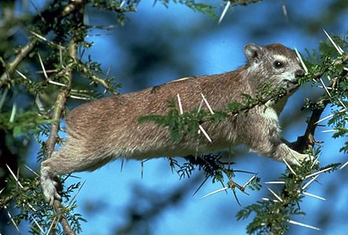

# Hyracoidea

## Hyraxes or dassies 

## #has_/text_of_/abstract 

> Hyraxes (from Ancient Greek  ὕραξ (hýrax) 'shrew-mouse'), also called dassies, 
> are small, stout, thickset, herbivorous mammals in the family Procaviidae 
> within the order **Hyracoidea**. 
> 
> Hyraxes are well-furred, rotund animals with short tails. 
> Modern hyraxes are typically between 30 and 70 cm (12 and 28 in) in length 
> and weigh between 2 and 5 kg (4 and 11 lb). They are superficially similar to marmots or over-large pikas but are much more closely related to elephants and sirenians. Hyraxes have a life span of 9 to 14 years. Both types of "rock" hyrax (P. capensis and H. brucei) live on rock outcrops, including cliffs in Ethiopia and isolated granite outcrops called koppies in southern Africa.
>
> Almost all hyraxes are limited to Africa; the exception is the rock hyrax (P. capensis) which is also found in adjacent parts of the Middle East.
>
> Hyraxes were a much more diverse group in the past encompassing species considerably larger than modern hyraxes. The largest known extinct hyrax, Titanohyrax ultimus, has been estimated to weigh 600–1,300 kilograms (1,300–2,900 lb), comparable to a rhinoceros.
>
> [Wikipedia](https://en.wikipedia.org/wiki/Hyrax) 

## Phylogeny 

-   « Ancestral Groups  
    -  [Eutheria](../Eutheria.md))
    -  [Mammal](../../Mammal.md))
    -   [Therapsida](../../../Therapsida.md)
    -   [Synapsida](../../../../Synapsida.md)
    -   [Amniota](../../../../../Amniota.md)
    -   [Terrestrial Vertebrates](../../../../../../Terrestrial.md)
    -   [Sarcopterygii](../../../../../../../Sarc.md)
    -   [Gnathostomata](../../../../../../../../Gnath.md)
    -   [Vertebrata](../../../../../../../../../Vertebrata.md)
    -   [Craniata](../../../../../../../../../../Craniata.md)
    -   [Chordata](../../../../../../../../../../../Chordata.md)
    -   [Deuterostomia](../../../../../../../../../../../../Deutero.md)
    -  [Bilateria](../../../../../../../../../../../../../Bilateria.md))
    -  [Animals](../../../../../../../../../../../../../../Animals.md))
    -  [Eukarya](../../../../../../../../../../../../../../../Eukarya.md))
    -   [Tree of Life](../../../../../../../../../../../../../../../Tree_of_Life.md)

-   ◊ Sibling Groups of  Eutheria
    -   [Edentata](Edentata.md)
    -   [Pholidota](Pholidota.md)
    -  [Lagomorpha](Glires/Lagomorpha.md))
    -   [Rodentia](Rodentia.md)
    -   [Macroscelididae](Macroscelididae.md)
    -   [Primates](Primates.md)
    -   [Scandentia](Scandentia.md)
    -   [Bat](Bat.md)
    -   [Dermoptera](Dermoptera.md)
    -   [Insectivora](Insectivora.md)
    -   [Carnivora](Carnivora.md)
    -   [Artiodactyla](Artiodactyla.md)
    -   [Whale](Whale.md)
    -   [Tubulidentata](Tubulidentata.md)
    -   [Perissodactyla](Perissodactyla.md)
    -   Hyracoidea
    -   [Sirenia](Sirenia.md)
    -   [Proboscidea](Eukarya/Animal/Bilateria/Deutero/Chordata/Craniata/Vertebrata/Gnath/Sarc/Terrestrial/Amniota/Synapsida/Therapsida/Mammal/Eutheria/Proboscidea.md)

-   » Sub-Groups
    -  [Heterohyrax](Hyracoidea/Heterohyrax.md))
    -  [Dendrohyrax](Hyracoidea/Dendrohyrax.md))

	-   *Pliohyracidae* †
	-   *Procaviidae*
	    -   *Procavia capensis* [(rock hyrax)]
	    -   [Heterohyrax](Hyracoidea/Heterohyrax.md "go to ToL page"))*
	        [(yellow-spotted hyraxes)]
	    -   [Dendrohyrax](Hyracoidea/Dendrohyrax.md "go to ToL page"))*
	        [(tree or bush hyraxes)]
	    -   *Prohyrax* †
	    -   *Gigantohyrax* †

### Information on the Internet

-   [Order     Hyracoidea](http://animaldiversity.ummz.umich.edu/chordata/mammalia/hyracoidea.html).
    Animal Diversity Web. University of Michigan Museum of Zoology.
-   [Hyracoidea](http://www.ultimateungulate.com/hyracoidea.html). The
    Ultimate Ungulate Page.
-   [Afrotheria Specialist     Group](http://www.calacademy.org/research/bmammals/afrotheria/ASG.html).
    IUCN - The World Conservation Union. Species Survival Commission.
-   [Order Hyracoidea: the     Hyraxes](http://helios.bto.ed.ac.uk/icapb/collection/museum/SF-MUS97/text/hyracoidea.html).
    University of Edinburgh Aubrey Manning Gallery Collection.
-   [Hyrax](http://www.awf.org/wildlives/142). African Wildlife
    Foundation.

### References

Court, N. and J. L. Hartenberger. 1992. A new species of the hyracoid
mammal Titanohyrax from the Eocene of Tunisia. Palaeontology 35:309-317.

Court, N. and M. Mahboubi. 1993. Reassessment of Lower Eocene Seggeurius
amourensis - aspects of primitive dental morphology in the mammalian
order Hyracoidea. Journal of Paleontology 67:889-893.

Hoeck, H. N. 1989. Demography and competition in hyrax - a 17 years
study. Oecologia 79:353-360.

Janis, C. M. 1979. Mastication in the hyrax and its relevance to
ungulate dental evolution. Paleobiology 5:50-59.

Janis, C. M. 1983. Muscles of the masticatory apparatus in 2 genera of
hyraces (Procavia and Heterohyrax). Journal of Morphology 176:61-87.

McKenna, M. C. and S. K. Bell. 1997. Classification of Mammals Above the
Species Level. Columbia University Press, New York.

McMahon, C. R. amd J. F. Thackeray. 1994. Pliopleistocene Hyracoidea
from Swartkrans cave, South Africa. South African Journal of Zoology
29:40-45.

Nowak, R. M. 1999. Order Hyracoidea. Pages 1041-1047 in: Walker\'s
Mammals of the World. Sixth Edition. Volume II. (R. M. Nowak). Johns
Hopkins University Press, Baltimore.

Pickford, M. 1996. Pliohyracids (Mammalia, Hyracoidea) from the upper
Middle Miocene at Berg Aukas, Namibia. Comptes Rendus de l\'Academie des
Sciences Serie II Fascicule A-Sciences de la Terre et des Planetes
322:501-505.

Pickford, M., H. Thomas, S. Sen, J. Roger, E. Gheerbrant, and Z.
Alsulaimani. 1994. Early Oligocene Hyracoidea (Mammalia) from Thaytiniti
and Taqah, Dhofar Province, Sultanate of Oman. Comptes Rendus de
l\'Academie des Sciences Serie II 318:1395-1400.

Rasmussen, D. T. 1989. The evolution of the Hyracoidea: a review of the
fossil evidence. Pages 57-78 in The Evolution of Perissodactyls. (D. R.
Prothero and R. M. Schoch, eds.) Clarendon Press, New York.

Rasmussen, D. T., M. Gagnon, and E. L. Simons. 1990. Taxeopody in the
carpus and tarsus of Oligocene Pliohyracidae (Mammalia, Hyracoidea) and
the phyletic position of hyraxes. Proceedings of the National Academy of
Sciences (USA) 87:4688-4691.

Rasmussen, D. T., M. Pickford, P. Mein, B. Senut, and G. C. Conroy.
1996. Earliest known Procaviid hyracoid from the late miocene of
Namibia. Journal of Mammalogy 77:745-754.

Schwartz, G. T., D. T. Rasmussen, and R. J. Smith. 1995. Body-size
diversity and community structure of fossil hyracoids. Journal of
Mammalogy 76:1088-1099.

## Title Illustrations

)

  ------------------------------------------------------------------------------
  Scientific Name ::     Heterohyrax brucei, Acacia tortilis
  Location ::           Seronera area of Serengeti National Park, Tanzania
  Comments             Heterohyrax feeding in Acacia
  Specimen Condition   Live Specimen
  Copyright ::            © 1989 [Greg and Marybeth Dimijian](http://www.dimijianimages.com/) 
  ------------------------------------------------------------------------------

## Confidential Links & Embeds: 

### #is_/same_as :: [Hyracoidea](/_Standards/bio/bio~Domain/Eukarya/Animal/Bilateria/Deutero/Chordata/Craniata/Vertebrata/Gnath/Sarc/Tetrapods/Amniota/Synapsida/Therapsida/Mammal/Eutheria/Hyracoidea.md) 

### #is_/same_as :: [Hyracoidea.public](/_public/bio/bio~Domain/Eukarya/Animal/Bilateria/Deutero/Chordata/Craniata/Vertebrata/Gnath/Sarc/Tetrapods/Amniota/Synapsida/Therapsida/Mammal/Eutheria/Hyracoidea.public.md) 

### #is_/same_as :: [Hyracoidea.internal](/_internal/bio/bio~Domain/Eukarya/Animal/Bilateria/Deutero/Chordata/Craniata/Vertebrata/Gnath/Sarc/Tetrapods/Amniota/Synapsida/Therapsida/Mammal/Eutheria/Hyracoidea.internal.md) 

### #is_/same_as :: [Hyracoidea.protect](/_protect/bio/bio~Domain/Eukarya/Animal/Bilateria/Deutero/Chordata/Craniata/Vertebrata/Gnath/Sarc/Tetrapods/Amniota/Synapsida/Therapsida/Mammal/Eutheria/Hyracoidea.protect.md) 

### #is_/same_as :: [Hyracoidea.private](/_private/bio/bio~Domain/Eukarya/Animal/Bilateria/Deutero/Chordata/Craniata/Vertebrata/Gnath/Sarc/Tetrapods/Amniota/Synapsida/Therapsida/Mammal/Eutheria/Hyracoidea.private.md) 

### #is_/same_as :: [Hyracoidea.personal](/_personal/bio/bio~Domain/Eukarya/Animal/Bilateria/Deutero/Chordata/Craniata/Vertebrata/Gnath/Sarc/Tetrapods/Amniota/Synapsida/Therapsida/Mammal/Eutheria/Hyracoidea.personal.md) 

### #is_/same_as :: [Hyracoidea.secret](/_secret/bio/bio~Domain/Eukarya/Animal/Bilateria/Deutero/Chordata/Craniata/Vertebrata/Gnath/Sarc/Tetrapods/Amniota/Synapsida/Therapsida/Mammal/Eutheria/Hyracoidea.secret.md)

