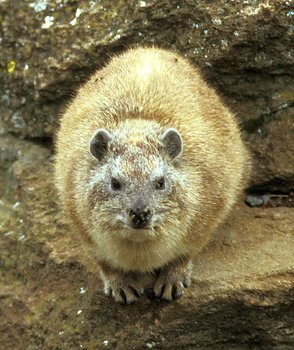

---
aliases:
  - Heterohyrax
title: Heterohyrax
---

# [[Heterohyrax]]

## Yellow-spotted hyraxes 
 

## #has_/text_of_/abstract 

> The yellow-spotted rock hyrax or bush hyrax (**Heterohyrax** brucei) is a species of mammal in the family Procaviidae. It is found in Angola, Botswana, Burundi, the Democratic Republic of the Congo, southern Egypt, Eritrea, Ethiopia, Kenya, Malawi, Mozambique, Rwanda, Somalia, northern South Africa, South Sudan, Sudan, Tanzania, Uganda, Zambia, and Zimbabwe. Its natural habitats are dry savanna and rocky areas.  Hyrax comes from the Greek word ὕραξ, or shrew-mouse.
>
> [Wikipedia](https://en.wikipedia.org/wiki/Yellow-spotted%20rock%20hyrax)

## Phylogeny 

-   « Ancestral Groups  
    -  [Hyracoidea](../Hyracoidea.md) 
    -  [Eutheria](../../Eutheria.md) 
    -  [Mammal](../../../Mammal.md) 
    -   [Therapsida](../../../../Therapsida.md)
    -   [Synapsida](../../../../../Synapsida.md)
    -   [Amniota](../../../../../../Amniota.md)
    -   [Terrestrial Vertebrates](../../../../../../../Terrestrial.md)
    -   [Sarcopterygii](../../../../../../../../Sarc.md)
    -   [Gnathostomata](../../../../../../../../../Gnath.md)
    -   [Vertebrata](../../../../../../../../../../Vertebrata.md)
    -   [Craniata](../../../../../../../../../../../Craniata.md)
    -   [Chordata](../../../../../../../../../../../../Chordata.md)
    -   [Deuterostomia](../../../../../../../../../../../../../Deutero.md)
    -  [Bilateria](../../../../../../../../../../../../../../Bilateria.md) 
    -  [Animals](../../../../../../../../../../../../../../../Animals.md) 
    -  [Eukarya](../../../../../../../../../../../../../../../../Eukarya.md) 
    -   [Tree of Life](../../../../../../../../../../../../../../../../Tree_of_Life.md)

-   ◊ Sibling Groups of  Hyracoidea
    -   Heterohyrax
    -   [Dendrohyrax](Dendrohyrax.md)

-   » Sub-Groups 

	-   *Heterohyrax antineae*
	-   *Heterohyrax brucei*
	-   *Heterohyrax chapini*

## Title Illustrations

------------------------------ 
 
scientific_name ::     Heterohyrax brucei
location ::           Kenya
Acknowledgements     Photograph courtesy [InsectImages.org](http://www.insectimages.org/) (#1428071)
specimen_condition ::  Live Specimen
Source Collection    [InsectImages.org](http://www.insectimages.org/)
copyright ::            © William M. Ciesla, Forest Health Management International

## Confidential Links & Embeds: 

### #is_/same_as :: [[/_Standards/bio/bio~Domain/Eukarya/Animal/Bilateria/Deutero/Chordata/Craniata/Vertebrata/Gnath/Sarc/Tetrapods/Amniota/Synapsida/Therapsida/Mammal/Eutheria/Hyracoidea/Heterohyrax|Heterohyrax]] 

### #is_/same_as :: [[/_public/bio/bio~Domain/Eukarya/Animal/Bilateria/Deutero/Chordata/Craniata/Vertebrata/Gnath/Sarc/Tetrapods/Amniota/Synapsida/Therapsida/Mammal/Eutheria/Hyracoidea/Heterohyrax.public|Heterohyrax.public]] 

### #is_/same_as :: [[/_internal/bio/bio~Domain/Eukarya/Animal/Bilateria/Deutero/Chordata/Craniata/Vertebrata/Gnath/Sarc/Tetrapods/Amniota/Synapsida/Therapsida/Mammal/Eutheria/Hyracoidea/Heterohyrax.internal|Heterohyrax.internal]] 

### #is_/same_as :: [[/_protect/bio/bio~Domain/Eukarya/Animal/Bilateria/Deutero/Chordata/Craniata/Vertebrata/Gnath/Sarc/Tetrapods/Amniota/Synapsida/Therapsida/Mammal/Eutheria/Hyracoidea/Heterohyrax.protect|Heterohyrax.protect]] 

### #is_/same_as :: [[/_private/bio/bio~Domain/Eukarya/Animal/Bilateria/Deutero/Chordata/Craniata/Vertebrata/Gnath/Sarc/Tetrapods/Amniota/Synapsida/Therapsida/Mammal/Eutheria/Hyracoidea/Heterohyrax.private|Heterohyrax.private]] 

### #is_/same_as :: [[/_personal/bio/bio~Domain/Eukarya/Animal/Bilateria/Deutero/Chordata/Craniata/Vertebrata/Gnath/Sarc/Tetrapods/Amniota/Synapsida/Therapsida/Mammal/Eutheria/Hyracoidea/Heterohyrax.personal|Heterohyrax.personal]] 

### #is_/same_as :: [[/_secret/bio/bio~Domain/Eukarya/Animal/Bilateria/Deutero/Chordata/Craniata/Vertebrata/Gnath/Sarc/Tetrapods/Amniota/Synapsida/Therapsida/Mammal/Eutheria/Hyracoidea/Heterohyrax.secret|Heterohyrax.secret]] 

