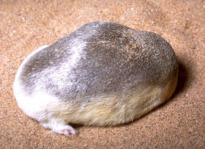

---
aliases:
- Altın köstebek
- aranyvakondfélék
- Auksakurminiai
- Chrysochloridae
- Crisoclóridos
- Crizocloride
- Fuko-dhahabu
- golden mole
- Goldmulle
- goudmollen
- Goz-aour
- Guldmuldvarpe
- Guldmullvadar
- Gullmoldvarper
- Gullmoldvörpur
- Góldmöl
- kultakontiaiset
- Mondok-emas
- Nhuta
- Náʼagéédí łichíiʼii
- Talp daurat
- wedemoleem
- zlati krti
- zlatokrtovití
- złotokretowate
- Алтынсары көрчычкан сымалдуулар
- Залатакратовыя
- Златакратовыя
- златни къртици
- Златокротові
- Златокроты
- Златокртови
- ոսկեխլուրդներ
- חפרפזיים
- عسربيات
- موش کور طلایی
- ოქროს თხუნელასებრნი
- キンモグラ
- 金毛鼴科
- 金毛鼹科
- 황금두더지
title: Chrysochloridae
has_id_wikidata: Q23351
dv_has_:
  name_:
    ar: عسربيات
    arz: عسربيات
    ast: Chrysochloridae
    avk: wedemoleem
    be: Залатакратовыя
    be_tarask: Златакратовыя
    bg: златни къртици
    br: Goz-aour
    ca: Talp daurat
    ceb: Chrysochloridae
    cs: zlatokrtovití
    da: Guldmuldvarpe
    de: Goldmulle
    de_ch: Goldmulle
    en: golden mole
    en_ca: Golden mole
    en_gb: golden mole
    es: Chrysochloridae
    eu: Chrysochloridae
    fa: موش کور طلایی
    fi: kultakontiaiset
    fr: Chrysochloridae
    ga: Chrysochloridae
    gl: Crisoclóridos
    he: חפרפזיים
    hu: aranyvakondfélék
    hy: ոսկեխլուրդներ
    ia: Chrysochloridae
    id: Mondok-emas
    is: Gullmoldvörpur
    it: Chrysochloridae
    ja: キンモグラ
    ka: ოქროს თხუნელასებრნი
    ko: 황금두더지
    ky: Алтынсары көрчычкан сымалдуулар
    la: Chrysochloridae
    li: Góldmöl
    lt: Auksakurminiai
    mk: Златокртови
    mul: Chrysochloridae
    nb: Gullmoldvarper
    nl: goudmollen
    nv: Náʼagéédí łichíiʼii
    oc: Chrysochloridae
    pl: złotokretowate
    pt: Chrysochloridae
    pt_br: Chrysochloridae
    ro: Crizocloride
    ru: Златокроты
    sl: zlati krti
    sn: Nhuta
    sq: Chrysochloridae
    sv: Guldmullvadar
    sw: Fuko-dhahabu
    tl: Chrysochloridae
    tr: Altın köstebek
    uk: Златокротові
    vi: Chrysochloridae
    war: Chrysochloridae
    zh: 金毛鼹科
    zh_cn: 金毛鼴科
    zh_hans: 金毛鼴科
    zh_tw: 金毛鼴科
---

# [[Chrysochloridae]]

## Golden Moles 
 

## #has_/text_of_/abstract 

> Golden moles are small insectivorous burrowing mammals endemic to Sub-Saharan Africa. They comprise the family **Chrysochloridae** (the only family in the suborder Chrysochloridea) and as such they are taxonomically distinct from the true moles, family Talpidae, and other mole-like families, all of which, to various degrees, they resemble as a result of evolutionary convergence. There are 21 species. Some (e.g., Chrysochloris asiatica, Amblysomus hottentotus) are relatively common, whereas others (e.g., species of Chrysospalax, Cryptochloris, Neamblysomus) are rare and endangered.
>
> [Wikipedia](https://en.wikipedia.org/wiki/Golden%20mole) 

## Phylogeny 

-   « Ancestral Groups  
    -  [Insectivora](../Insectivora.md) 
    -  [Eutheria](../../Eutheria.md) 
    -  [Mammal](../../../Mammal.md) 
    -   [Therapsida](../../../../Therapsida.md)
    -   [Synapsida](../../../../../Synapsida.md)
    -   [Amniota](../../../../../../Amniota.md)
    -   [Terrestrial Vertebrates](../../../../../../../Terrestrial.md)
    -   [Sarcopterygii](../../../../../../../../Sarc.md)
    -   [Gnathostomata](../../../../../../../../../Gnath.md)
    -   [Vertebrata](../../../../../../../../../../Vertebrata.md)
    -   [Craniata](../../../../../../../../../../../Craniata.md)
    -   [Chordata](../../../../../../../../../../../../Chordata.md)
    -   [Deuterostomia](../../../../../../../../../../../../../Deutero.md)
    -  [Bilateria](../../../../../../../../../../../../../../Bilateria.md) 
    -  [Animals](../../../../../../../../../../../../../../../Animals.md) 
    -  [Eukarya](../../../../../../../../../../../../../../../../Eukarya.md) 
    -   [Tree of Life](../../../../../../../../../../../../../../../../Tree_of_Life.md)

-   ◊ Sibling Groups of  Insectivora
    -   Chrysochloridae
    -   [Tenrecidae](Tenrecidae.md)

-   » Sub-Groups 

	-   *Calcochloris obtusirostris* [(Yellow golden mole)]
	-   *Eremitalpa granti* [(Grant\'s desert golden mole)]
	-   *Cryptochloris wintoni* [(De Winton\'s golden mole)]
	-   *Cryptochloris zyli* [(Van Zyl\'s golden mole)]
	-   *South African golden moles*
	    -   *Amblysomus (Neamblysomus)*
	        -   *Amblysomus julianae*
	        -   *Amblysomus gunningi*
	    -   *Amblysomus (Amblysomus)*
	        -   *Amblysomus iris*
	        -   *Amblysomus septentrionalis*
	        -   *Amblysomus hottentotus*
	-   *African golden moles*
	    -   *Chlorotalpa tytonis*
	    -   *Chlorotalpa leucorhina*
	    -   *Chlorotalpa sclateri*
	    -   *Chlorotalpa duthieae*
	    -   *Chlorotalpa arendsi*
	-   *Large golden moles*
	    -   *Chrysospalax trevelyani*
	    -   *Chrysospalax villosus*
	-   *Cape golden moles*
	    -   *Chrysochloris visagei*
	    -   *Chrysochloris stuhlmanni*
	    -   *Chrysochloris asiatica*

## Title Illustrations

------------------------------------------------------------------------------ 
 
scientific_name ::     Eremitalpa granti
location ::           Namibia
Comments             Grant\'s desert golden mole
Creator              H. Vannoy Davis
specimen_condition ::  Live Specimen
Source Collection    [CalPhotos](http://calphotos.berkeley.edu/)
copyright ::            © 1999 [California Academy of Sciences](http://www.calacademy.org/) 

## Confidential Links & Embeds: 

### #is_/same_as :: [[/_Standards/bio/bio~Domain/Eukarya/Animal/Bilateria/Deutero/Chordata/Craniata/Vertebrata/Gnath/Sarc/Tetrapods/Amniota/Synapsida/Therapsida/Mammal/Eutheria/Insectivora/Chrysochloridae|Chrysochloridae]] 

### #is_/same_as :: [[/_public/bio/bio~Domain/Eukarya/Animal/Bilateria/Deutero/Chordata/Craniata/Vertebrata/Gnath/Sarc/Tetrapods/Amniota/Synapsida/Therapsida/Mammal/Eutheria/Insectivora/Chrysochloridae.public|Chrysochloridae.public]] 

### #is_/same_as :: [[/_internal/bio/bio~Domain/Eukarya/Animal/Bilateria/Deutero/Chordata/Craniata/Vertebrata/Gnath/Sarc/Tetrapods/Amniota/Synapsida/Therapsida/Mammal/Eutheria/Insectivora/Chrysochloridae.internal|Chrysochloridae.internal]] 

### #is_/same_as :: [[/_protect/bio/bio~Domain/Eukarya/Animal/Bilateria/Deutero/Chordata/Craniata/Vertebrata/Gnath/Sarc/Tetrapods/Amniota/Synapsida/Therapsida/Mammal/Eutheria/Insectivora/Chrysochloridae.protect|Chrysochloridae.protect]] 

### #is_/same_as :: [[/_private/bio/bio~Domain/Eukarya/Animal/Bilateria/Deutero/Chordata/Craniata/Vertebrata/Gnath/Sarc/Tetrapods/Amniota/Synapsida/Therapsida/Mammal/Eutheria/Insectivora/Chrysochloridae.private|Chrysochloridae.private]] 

### #is_/same_as :: [[/_personal/bio/bio~Domain/Eukarya/Animal/Bilateria/Deutero/Chordata/Craniata/Vertebrata/Gnath/Sarc/Tetrapods/Amniota/Synapsida/Therapsida/Mammal/Eutheria/Insectivora/Chrysochloridae.personal|Chrysochloridae.personal]] 

### #is_/same_as :: [[/_secret/bio/bio~Domain/Eukarya/Animal/Bilateria/Deutero/Chordata/Craniata/Vertebrata/Gnath/Sarc/Tetrapods/Amniota/Synapsida/Therapsida/Mammal/Eutheria/Insectivora/Chrysochloridae.secret|Chrysochloridae.secret]] 

