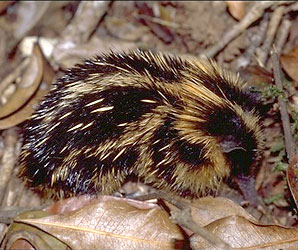

---
aliases:
- bodlínovití
- Burstasvín
- Børstepinnsvin
- ratiavatoleem
- Tandaraka
- Tanderak
- Tanrekar
- tanrekfélék
- tanrekit
- tenrec
- Tenrecidae
- tenrecs
- Tenrek
- Tenrekgiller
- Tenrekiniai
- Tenreklər
- Tenrekowate
- Tenreks
- Tenreku dzimta
- Tenrécidos
- Yáázhłání dóó bikʼéí
- Тенрекові
- тенрекови
- Тенрековые
- тенреци
- Тэнрэкавыя
- տենրեկներ
- טנרקיים
- تیغپشت
- مدال
- ಟೆನ್ರೆಕ್
- ტანრეკისებრნი
- テンレック科
- 馬島猬科
- 马岛猬科
- 텐렉과
title: Tenrecidae
has_id_wikidata: Q23340
dv_has_:
  name_:
    ar: مدال
    arz: مدال
    ast: Tenrecidae
    avk: ratiavatoleem
    az: Tenreklər
    be: Тэнрэкавыя
    be_tarask: Тэнрэкавыя
    bg: тенрекови
    br: Tenrek
    ca: tenrecs
    ceb: Tenrecidae
    cs: bodlínovití
    de: Tenreks
    de_ch: Tenreks
    en: tenrecs
    en_ca: Tenrecidae
    en_gb: Tenrecidae
    en-us: tenrecs
    es: Tenrecidae
    eu: Tenrecidae
    fa: تیغپشت
    fi: tanrekit
    fr: Tenrecidae
    ga: Tenrecidae
    gl: Tenrécidos
    he: טנרקיים
    hu: tanrekfélék
    hy: տենրեկներ
    ia: Tenrecidae
    id: Tanderak
    is: Burstasvín
    it: Tenrecidae
    ja: テンレック科
    ka: ტანრეკისებრნი
    kn: ಟೆನ್ರೆಕ್
    ko: 텐렉과
    la: Tenrecidae
    li: Tenreks
    lt: Tenrekiniai
    lv: Tenreku dzimta
    mk: тенреци
    ms: Tenrecidae
    mul: Tenrecidae
    nb: Børstepinnsvin
    nl: tenreks
    nv: Yáázhłání dóó bikʼéí
    oc: Tenrecidae
    pl: Tenrekowate
    pt: Tenrecidae
    pt_br: Tenrecidae
    ro: Tenrecidae
    ru: Тенрековые
    sco: tenrec
    sq: Tenrecidae
    sv: Tanrekar
    sw: Tandaraka
    tr: Tenrekgiller
    uk: Тенрекові
    vi: Tenrecidae
    war: Tenrecidae
    zh: 马岛猬科
    zh_cn: 马岛猬科
    zh_hans: 马岛猬科
    zh_tw: 馬島猬科
---
# [[Tenrecidae]]

## tenrecs, Madagascar \"hedgehogs\" 

## #has_/text_of_/abstract 

> A tenrec is a mammal belonging to any species within the afrotherian family **Tenrecidae**, which is endemic to Madagascar. Tenrecs are a very diverse group, as a result of adaptive radiation, and exhibit convergent evolution, some resemble hedgehogs, shrews, opossums, rats, and mice. They occupy aquatic, arboreal, terrestrial, and fossorial environments. Some of these species, including the greater hedgehog tenrec, can be found in the Madagascar dry deciduous forests. However, the speciation rate in this group has been higher in humid forests.
>
> All tenrecs are believed to descend from a common ancestor that lived 29–37 million years ago after rafting over from Africa. The split from their closest relatives, African otter shrews, is estimated to have occurred about 47–53 million years ago.
>
> [Wikipedia](https://en.wikipedia.org/wiki/Tenrec) 

### Information on the Internet

-   [Family     Tenrecidae](http://animaldiversity.ummz.umich.edu/site/accounts/information/Tenrecidae.html).
    University of Michigan Animal Diversity Web.
-   University of Texas Digimorph:
    -   [Lowland Streaked Tenrec         Skeleton](http://www.digimorph.org/specimens/Hemicentetes_semispinosus/body/)
    -   [Lowland Streaked Tenrec         Head](http://www.digimorph.org/specimens/Hemicentetes_semispinosus/head/)

## Phylogeny 

-   « Ancestral Groups  
    -  [Insectivora](../Insectivora.md) 
    -  [Eutheria](../../Eutheria.md) 
    -  [Mammal](../../../Mammal.md) 
    -   [Therapsida](../../../../Therapsida.md)
    -   [Synapsida](../../../../../Synapsida.md)
    -   [Amniota](../../../../../../Amniota.md)
    -   [Terrestrial Vertebrates](../../../../../../../Terrestrial.md)
    -   [Sarcopterygii](../../../../../../../../Sarc.md)
    -   [Gnathostomata](../../../../../../../../../Gnath.md)
    -   [Vertebrata](../../../../../../../../../../Vertebrata.md)
    -   [Craniata](../../../../../../../../../../../Craniata.md)
    -   [Chordata](../../../../../../../../../../../../Chordata.md)
    -   [Deuterostomia](../../../../../../../../../../../../../Deutero.md)
    -  [Bilateria](../../../../../../../../../../../../../../Bilateria.md) 
    -  [Animals](../../../../../../../../../../../../../../../Animals.md) 
    -  [Eukarya](../../../../../../../../../../../../../../../../Eukarya.md) 
    -   [Tree of Life](../../../../../../../../../../../../../../../../Tree_of_Life.md)

-   ◊ Sibling Groups of  Insectivora
    -   [Chrysochloridae](Chrysochloridae.md)
    -   Tenrecidae

-   » Sub-Groups
    -  [Micropotamogale](Tenrecidae/Micropotamogale.md) 
    -  [Oryzorictes](Tenrecidae/Oryzorictes.md) 
    -  [Microgale](Tenrecidae/Microgale.md) 
    -  [Geogalinae](Tenrecidae/Geogalinae.md) 

## Title Illustrations

------------------------------------------------------------------------------ 
 
scientific_name ::     Hemicentetes semispinosus (Tenrecidae)
location ::           Perinet Reserve (Madagascar)
Comments             Lowland streaked tenrec
Creator              Gerald and Buff Corsi
specimen_condition ::  Live Specimen
Source Collection    [CalPhotos](http://calphotos.berkeley.edu/)
copyright ::            © 2000 [California Academy of Sciences](http://www.calacademy.org/) 

## Confidential Links & Embeds: 

### #is_/same_as :: [[/_Standards/bio/bio~Domain/Eukarya/Animal/Bilateria/Deutero/Chordata/Craniata/Vertebrata/Gnath/Sarc/Tetrapods/Amniota/Synapsida/Therapsida/Mammal/Eutheria/Insectivora/Tenrecidae|Tenrecidae]] 

### #is_/same_as :: [[/_public/bio/bio~Domain/Eukarya/Animal/Bilateria/Deutero/Chordata/Craniata/Vertebrata/Gnath/Sarc/Tetrapods/Amniota/Synapsida/Therapsida/Mammal/Eutheria/Insectivora/Tenrecidae.public|Tenrecidae.public]] 

### #is_/same_as :: [[/_internal/bio/bio~Domain/Eukarya/Animal/Bilateria/Deutero/Chordata/Craniata/Vertebrata/Gnath/Sarc/Tetrapods/Amniota/Synapsida/Therapsida/Mammal/Eutheria/Insectivora/Tenrecidae.internal|Tenrecidae.internal]] 

### #is_/same_as :: [[/_protect/bio/bio~Domain/Eukarya/Animal/Bilateria/Deutero/Chordata/Craniata/Vertebrata/Gnath/Sarc/Tetrapods/Amniota/Synapsida/Therapsida/Mammal/Eutheria/Insectivora/Tenrecidae.protect|Tenrecidae.protect]] 

### #is_/same_as :: [[/_private/bio/bio~Domain/Eukarya/Animal/Bilateria/Deutero/Chordata/Craniata/Vertebrata/Gnath/Sarc/Tetrapods/Amniota/Synapsida/Therapsida/Mammal/Eutheria/Insectivora/Tenrecidae.private|Tenrecidae.private]] 

### #is_/same_as :: [[/_personal/bio/bio~Domain/Eukarya/Animal/Bilateria/Deutero/Chordata/Craniata/Vertebrata/Gnath/Sarc/Tetrapods/Amniota/Synapsida/Therapsida/Mammal/Eutheria/Insectivora/Tenrecidae.personal|Tenrecidae.personal]] 

### #is_/same_as :: [[/_secret/bio/bio~Domain/Eukarya/Animal/Bilateria/Deutero/Chordata/Craniata/Vertebrata/Gnath/Sarc/Tetrapods/Amniota/Synapsida/Therapsida/Mammal/Eutheria/Insectivora/Tenrecidae.secret|Tenrecidae.secret]] 

