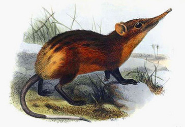
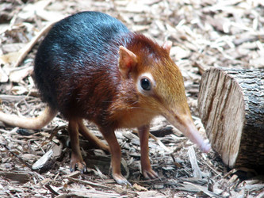
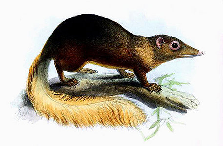

# [[Rhynchocyon]] 

 )

## #has_/text_of_/abstract 

> **Rhynchocyon** is a genus of elephant shrew (or sengi) in the family Macroscelididae. Members of this genus are known colloquially as giant sengis.
>
> They are a ground-dwelling mammal, significantly larger than their relatives in the order Macroscelidea that live primarily in dense forests across eastern Africa. Habitats range from eastern Africa's coastal forests, Rift Valley highlands, and the Congo basin. The species is widely threatened, with two of four assessed by the International Union for Conservation of Nature's Red List of Threatened Species. Habitat fragmentation from the growth of human settlements and activities are the primary threats to their populations. The genus contains the following five species and several subspecies:
>- Golden-rumped sengi, Rhynchocyon chrysopygus
>- Rhynchocyon chrysopygus mandelai
>- Chequered sengi, Rhynchocyon cirnei
>- Rhynchocyon cirnei shirensis
>- Rhynchocyon cirnei reichardi
>- Rhynchocyon cirnei hendersoni
>- Rhynchocyon cirnei macrurus
>- Black and rufous sengi, Rhynchocyon petersi
>- Rhynchocyon petersi adersi
>- Stuhlmann's sengi, Rhynchocyon stuhlmanni
>- Grey-faced sengi, Rhynchocyon udzungwensis
> 
> [Wikipedia](https://en.wikipedia.org/wiki/Rhynchocyon) 

## Phylogeny 

-   « Ancestral Groups  
    -  [Macroscelididae](../Macroscelididae.md))
    -  [Eutheria](../../Eutheria.md))
    -  [Mammal](../../../Mammal.md))
    -   [Therapsida](../../../../Therapsida.md)
    -   [Synapsida](../../../../../Synapsida.md)
    -   [Amniota](../../../../../../Amniota.md)
    -   [Terrestrial Vertebrates](../../../../../../../Terrestrial.md)
    -   [Sarcopterygii](../../../../../../../../Sarc.md)
    -   [Gnathostomata](../../../../../../../../../Gnath.md)
    -   [Vertebrata](../../../../../../../../../../Vertebrata.md)
    -   [Craniata](../../../../../../../../../../../Craniata.md)
    -   [Chordata](../../../../../../../../../../../../Chordata.md)
    -   [Deuterostomia](../../../../../../../../../../../../../Deutero.md)
    -  [Bilateria](../../../../../../../../../../../../../../Bilateria.md))
    -  [Animals](../../../../../../../../../../../../../../../Animals.md))
    -  [Eukarya](../../../../../../../../../../../../../../../../Eukarya.md))
    -   [Tree of Life](../../../../../../../../../../../../../../../../Tree_of_Life.md)

-   ◊ Sibling Groups of  Macroscelididae
    -   Rhynchocyon

-   » Sub-Groups 

	-   *Rhynchocyon chrysopygus* [(golden-rumped elephant
	    shrew)]
	-   *Rhynchocyon cirnei* [(checkered elephant shrew)]
	-   *Rhynchocyon petersi* [(black and rufous elephant
	    shrew)]

## Title Illustrations

------------

Scientific Name ::  Rhynchocyon chrysopygus
Creator           Joseph Smit (1836--1929)

-----------------------------)
Scientific Name ::                    Rhynchocyon petersi
Location ::                          Philadelphia Zoo
Acknowledgements                    This image is licensed under the
							  [Attribution-NonCommercial-ShareAlike 2.0 Creative Commons                                       License](http://creativecommons.org/licenses/by-nc-sa/2.0/).\
							  source: [flickr: elephant                                       shrew](http://flickr.com/photos/zeandroid/210618830/)
Specimen Condition                  Live Specimen
Source Collection                   [Flickr](http://flickr.com/)
Copyright ::                           © 2006 [zeandroid](http://flickr.com/people/zeandroid/)

## Confidential Links & Embeds: 

### #is_/same_as :: [Rhynchocyon](/_Standards/bio/bio~Domain/Eukarya/Animal/Bilateria/Deutero/Chordata/Craniata/Vertebrata/Gnath/Sarc/Tetrapods/Amniota/Synapsida/Therapsida/Mammal/Eutheria/Macroscelididae/Rhynchocyon.md) 

### #is_/same_as :: [Rhynchocyon.public](/_public/bio/bio~Domain/Eukarya/Animal/Bilateria/Deutero/Chordata/Craniata/Vertebrata/Gnath/Sarc/Tetrapods/Amniota/Synapsida/Therapsida/Mammal/Eutheria/Macroscelididae/Rhynchocyon.public.md) 

### #is_/same_as :: [Rhynchocyon.internal](/_internal/bio/bio~Domain/Eukarya/Animal/Bilateria/Deutero/Chordata/Craniata/Vertebrata/Gnath/Sarc/Tetrapods/Amniota/Synapsida/Therapsida/Mammal/Eutheria/Macroscelididae/Rhynchocyon.internal.md) 

### #is_/same_as :: [Rhynchocyon.protect](/_protect/bio/bio~Domain/Eukarya/Animal/Bilateria/Deutero/Chordata/Craniata/Vertebrata/Gnath/Sarc/Tetrapods/Amniota/Synapsida/Therapsida/Mammal/Eutheria/Macroscelididae/Rhynchocyon.protect.md) 

### #is_/same_as :: [Rhynchocyon.private](/_private/bio/bio~Domain/Eukarya/Animal/Bilateria/Deutero/Chordata/Craniata/Vertebrata/Gnath/Sarc/Tetrapods/Amniota/Synapsida/Therapsida/Mammal/Eutheria/Macroscelididae/Rhynchocyon.private.md) 

### #is_/same_as :: [Rhynchocyon.personal](/_personal/bio/bio~Domain/Eukarya/Animal/Bilateria/Deutero/Chordata/Craniata/Vertebrata/Gnath/Sarc/Tetrapods/Amniota/Synapsida/Therapsida/Mammal/Eutheria/Macroscelididae/Rhynchocyon.personal.md) 

### #is_/same_as :: [Rhynchocyon.secret](/_secret/bio/bio~Domain/Eukarya/Animal/Bilateria/Deutero/Chordata/Craniata/Vertebrata/Gnath/Sarc/Tetrapods/Amniota/Synapsida/Therapsida/Mammal/Eutheria/Macroscelididae/Rhynchocyon.secret.md)

