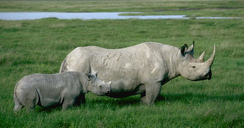

---
aliases:
- Barlubekdunol (Perissodactyla)
- Buron makuku gasal
- bộ Guốc lẻ
- Ch'ulla ruk'anayuq
- Hewan berkuku ganjil
- houvako kriatuuri
- hovdyr
- kabjalised
- kavioeläimet
- Kopitari
- Kéwan kuku ganjil
- lichokopytníci
- lihoprsti kopitarji
- Neparhufuloj
- Neparnoprstaši
- Neporakanopiai
- Nepárnokopytníky
- Nepārnadži
- nieparzystokopytne
- odd-taed ungulate
- odd-toed ungulate
- Odd-toed_Ungulate
- Oeneevnhoevign
- onevenhoevigen
- Oonevehovege
- Perisodaktiled
- Perisodaktilo
- Perisodatilo
- perisodáctilos
- Perissodactyla
- perissodactylos
- perissodàctils
- perissodáctilos
- Pysã namomokõiva
- páratlanujjú patások
- Tek toynaklılar
- Tisuffenza
- Toq tuyoqlilar
- Təkdırnaqlılar
- uddatåiga hovdjur
- Unpaarhufer
- Uparrettåede hovdyr
- Æнæкъайсæфтæгджынтæ
- Ünpaartuanet Kloksdiarten
- Περισσοδάκτυλα
- Бүтэй туйахтаахтар
- Вожтöмгыжаэз
- конеподібні
- копитари
- Мăшăрсăр чĕрнеллисем
- Непарнокопитни
- непарнокопытные
- непарнопрсти копитари
- нечифтокопитни
- няпарнакапытныя
- тактояклылар
- Тақтұяқтылар
- Шалабергаш йоцурш
- Միասմբակավորներ
- מפריטי פרסה
- انپدھرے کھر
- بیٚسُم پاڑُر
- تکدیرناقلیلار
- فردسمان
- مفردات الأصابع
- مفردات الاصابع
- अयुग्मखुरी
- विषम-ऊँगली खुरदार
- অযুগ্ম ক্ষুরযুক্ত চতুষ্পদ
- ஒற்றைப்படைக் குளம்பி
- สัตว์กีบคี่
- ခွာမစုံသော တိရစ္ဆာန်များ
- კენტჩლიქოსნები
- ცანდჩორქოამეფი
- 奇蹄目
- 말목
has_id_wikidata: Q25374
title: Perissodactyla
described_by_source:
- '[[_Standards/WikiData/WD~Encyclopædia_Britannica_11th_edition,867541]]'
- '[[_Standards/WikiData/WD~New_Encyclopedic_Dictionary,19190511]]'
- '[[_Standards/WikiData/WD~Armenian_Soviet_Encyclopedia,_vol._7,123625363]]'
topic_has_template:
- '[[_Standards/WikiData/WD~Template_Perissodactyla,6418784]]'
- '[[_Standards/WikiData/WD~Template_Taxonomy_Perissodactyla,13218341]]'
parent_taxon: '[[_Standards/WikiData/WD~Perissodactylamorpha,125762739]]'
instance_of: '[[_Standards/WikiData/WD~taxon,16521]]'
taxon_rank: '[[_Standards/WikiData/WD~order,36602]]'
ITIS_TSN: 180687
image:
- http://commons.wikimedia.org/wiki/Special:FilePath/00296%20zebra.jpg
- http://commons.wikimedia.org/wiki/Special:FilePath/Zebra%20chapman%20za%202003.jpg
EPPO_Code: 1PERIO
MeSH_tree_code: B01.050.150.900.649.313.984
UMLS_CUI: C0031132
NBN_System_Key: NHMSYS0000377074
Commons_category: Perissodactyla
taxon_name: Perissodactyla
taxon_common_name:
- perisodáctilos
- hovdyr
- lihoprsti kopitarji
start_time: -56000000-01-01T00:00:00Z
dv_has_:
  name_:
    af: Perissodactyla
    an: Perissodactyla
    ar: مفردات الأصابع
    arz: مفردات الاصابع
    ast: Perissodactyla
    avk: Barlubekdunol (Perissodactyla)
    az: Təkdırnaqlılar
    azb: تکدیرناقلیلار
    ban: Buron makuku gasal
    be: няпарнакапытныя
    be_tarask: Няпарнакапытныя
    bg: нечифтокопитни
    bn: অযুগ্ম ক্ষুরযুক্ত চতুষ্পদ
    br: Perisodaktiled
    bs: Kopitari
    ca: perissodàctils
    ce: Шалабергаш йоцурш
    ceb: Perissodactyla
    cs: lichokopytníci
    cv: Мăшăрсăр чĕрнеллисем
    cy: Perissodactyla
    da: Uparrettåede hovdyr
    de: Unpaarhufer
    el: Περισσοδάκτυλα
    en: odd-toed ungulate
    en_ca: Odd-toed ungulate
    en_gb: odd-toed ungulate
    eo: Neparhufuloj
    es: Perissodactyla
    et: kabjalised
    eu: Perisodaktilo
    ext: Perissodactyla
    fa: فردسمان
    fi: kavioeläimet
    fr: Perissodactyla
    frr: Ünpaartuanet Kloksdiarten
    ga: Perissodactyla
    gl: Perisodáctilos
    gn: Pysã namomokõiva
    gsw: Unpaarhufer
    he: מפריטי פרסה
    hi: विषम-ऊँगली खुरदार
    hr: Neparnoprstaši
    hu: páratlanujjú patások
    hy: Միասմբակավորներ
    ia: perissodactylos
    id: Hewan berkuku ganjil
    is: Perissodactyla
    it: Perissodactyla
    ja: 奇蹄目
    jv: Kéwan kuku ganjil
    ka: კენტჩლიქოსნები
    kab: Tisuffenza
    kk: Тақтұяқтылар
    ko: 말목
    koi: Вожтöмгыжаэз
    ks: بیٚسُم پاڑُر
    la: Perissodactyla
    lb: Perissodactyla
    lfn: Perisodatilo
    li: Oonevehovege
    lij: Perissodactyla
    lmo: Perissodactyla
    lt: Neporakanopiai
    lv: Nepārnadži
    mk: Непарнокопитни
    mr: अयुग्मखुरी
    ms: Perissodactyla
    mul: odd-toed ungulate
    my: ခွာမစုံသော တိရစ္ဆာန်များ
    nb: hovdyr
    nds: Perissodactyla
    nds_nl: Perissodactyla
    nl: onevenhoevigen
    nn: hovdyr
    nov: Perissodactyla
    oc: Perissodactyla
    os: Æнæкъайсæфтæгджынтæ
    pl: nieparzystokopytne
    pms: Perissodactyla
    pnb: انپدھرے کھر
    pt: perissodáctilos
    pt_br: Perissodáctilos
    qu: Ch'ulla ruk'anayuq
    rmf: houvako kriatuuri
    ro: Perissodactyla
    ru: непарнокопытные
    sah: Бүтэй туйахтаахтар
    scn: Perissodactyla
    sco: odd-taed ungulate
    sh: Neparnoprstaši
    sk: Nepárnokopytníky
    sl: lihoprsti kopitarji
    sq: Perissodactyla
    sr: копитари
    sr_ec: непарнопрсти копитари
    sv: uddatåiga hovdjur
    ta: ஒற்றைப்படைக் குளம்பி
    th: สัตว์กีบคี่
    tl: Perissodactyla
    tr: Tek toynaklılar
    tt: тактояклылар
    tt_cyrl: тактояклылар
    uk: конеподібні
    uz: Toq tuyoqlilar
    vec: Perissodactyla
    vi: bộ Guốc lẻ
    vls: Oeneevnhoevign
    wa: Perissodactyla
    war: Perissodactyla
    wuu: 奇蹄目
    xmf: ცანდჩორქოამეფი
    yue: 奇蹄目
    zh: 奇蹄目
    zh_cn: 奇蹄目
    zh_hans: 奇蹄目
    zh_hant: 奇蹄目
    zh_tw: 奇蹄目
---

# [[Perissodactyla]]

## Odd-toed ungulates 

#is_/same_as :: [[../../../../../../../../../../../../../../../../../WikiData/WD~Odd-toed_ungulate,25374|WD~Odd-toed_ungulate,25374]] 

## #has_/text_of_/abstract 

> **Perissodactyla** (Ancient Greek  περισσός, perissós 'odd' and  δάκτυλος, dáktylos 'finger, toe'), 
> or odd-toed ungulates, is an order of ungulates. 
> 
> The order includes about 17 living species divided into three families: 
> Equidae (horses, asses, and zebras), Rhinocerotidae (rhinoceroses), and Tapiridae (tapirs). 
> 
> They typically have reduced the weight-bearing toes to three or one of the five original toes, 
> though tapirs retain four toes on their front feet. 
> 
> The nonweight-bearing toes are either present, absent, vestigial, or positioned posteriorly. 
> By contrast, artiodactyls (even-toed ungulates) bear most of their weight equally on four or two (an even number) of the five toes: their third and fourth toes. Another difference between the two is that perissodactyls digest plant cellulose in their intestines, rather than in one or more stomach chambers as artiodactyls, with the exception of Suina, do.
>
> The order was considerably more diverse in the past, with notable extinct groups including the brontotheres, palaeotheres, chalicotheres, and the paraceratheres, with the paraceratheres including the largest known land mammals to have ever existed.
>
> Despite their very different appearances, they were recognized as related families in the 19th century by the zoologist Richard Owen, who also coined the order's name.
>
> [Wikipedia](https://en.wikipedia.org/wiki/Perissodactyla) 

## Phylogeny 

-   « Ancestral Groups  
    -  [Eutheria](../Eutheria.md) 
    -  [Mammal](../../Mammal.md) 
    -   [Therapsida](../../../Therapsida.md)
    -   [Synapsida](../../../../Synapsida.md)
    -   [Amniota](../../../../../Amniota.md)
    -   [Terrestrial Vertebrates](../../../../../../Terrestrial.md)
    -   [Sarcopterygii](../../../../../../../Sarc.md)
    -   [Gnathostomata](../../../../../../../../Gnath.md)
    -   [Vertebrata](../../../../../../../../../Vertebrata.md)
    -   [Craniata](../../../../../../../../../../Craniata.md)
    -   [Chordata](../../../../../../../../../../../Chordata.md)
    -   [Deuterostomia](../../../../../../../../../../../../Deutero.md)
    -  [Bilateria](../../../../../../../../../../../../../Bilateria.md) 
    -  [Animals](../../../../../../../../../../../../../../Animals.md) 
    -  [Eukarya](../../../../../../../../../../../../../../../Eukarya.md) 
    -   [Tree of Life](../../../../../../../../../../../../../../../Tree_of_Life.md)

-   ◊ Sibling Groups of  Eutheria
    -   [Edentata](Edentata.md)
    -   [Pholidota](Pholidota.md)
    -  [Lagomorpha](Glires/Lagomorpha.md) 
    -   [Rodentia](Rodentia.md)
    -   [Macroscelididae](Macroscelididae.md)
    -   [Primates](Primates.md)
    -   [Scandentia](Scandentia.md)
    -   [Bat](Bat.md)
    -   [Dermoptera](Dermoptera.md)
    -   [Insectivora](Insectivora.md)
    -   [Carnivora](Carnivora.md)
    -   [Artiodactyla](Artiodactyla.md)
    -   [Whale](Whale.md)
    -   [Tubulidentata](Tubulidentata.md)
    -   Perissodactyla
    -   [Hyracoidea](Hyracoidea.md)
    -   [Sirenia](Sirenia.md)
    -   [Proboscidea](Eukarya/Animal/Bilateria/Deutero/Chordata/Craniata/Vertebrata/Gnath/Sarc/Terrestrial/Amniota/Synapsida/Therapsida/Mammal/Eutheria/Proboscidea.md)

-   » Sub-Groups 

	-   *[Equidae](Perissodactyla/Equidae.md)* (horses, zebras, asses & extinct relatives)
	-   *Palaeotheriidae* †
	-   *Brontotheriidae* †
	-   *Anchilophidae* †
	-   *Eomoropidae* †
	-   *Chalicotheriidae* †
	-   *Hyracodontidae* †
	-   *[Rhinoceros](Perissodactyla/Rhinoceros.md)* (rhinoceroses & extinct relatives)
	-   *Helaletidae* †
	-   *Isectolophidae* †
	-   *Lophiodontidae* †
	-   *Deperetellidae* †
	-   *Lophialetidae* †
	-   *[Tapir](Perissodactyla/Tapir.md)* (tapirs & extinct relatives)

### Information on the Internet

-   [Introduction to the     Perissodactyla](http://www.ucmp.berkeley.edu/mammal/mesaxonia/perissodactyla.html).
    UCMP Berkeley.
-   [Order     Perissodactyla](http://animaldiversity.ummz.umich.edu/chordata/mammalia/perissodactyla.html).
    Animal Diversity Web. University of Michigan Museum of Zoology.
-   [Perissodactyla](http://www.ultimateungulate.com/perissodactyla.html).
    The Ultimate Ungulate Page.
-   [Horse     Evolution](http://www.talkorigins.org/faqs/horses/horse_evol.html).
    by Kathleen Hunt, the Talk.Origins Archive.
-   [Fossil Horses in     Cyberspace](http://www.flmnh.ufl.edu/natsci/vertpaleo/fhc/fhc.htm).
    Florida Museum of Natural History.
-   [International Museum of the     Horse](http://www.imh.org/imh/imhmain.html). Kentucky Horse Park.
-   [Herds of Information About     Zebras](http://www.alumni.caltech.edu/%7Ekantner/zebras/).
-   [The Quagga Project](http://www.quaggaproject.org/). South African
    Museum.
-   [International Rhino Foundation](http://www.rhinos-irf.org/).
-   [SOS Rhino](http://www.sosrhino.org/index.php).
-   [The Tapir Gallery](http://www.tapirback.com/tapirgal/).
-   [Tapir Specialist Group](http://www.tapirspecialistgroup.org/).
    IUCN - The World Conservation Union. Species Survival Commission.
-   [What\'s a Tapir?](http://www.tapir.org/about_tapir.html)

## Title Illustrations

------------------------------------------------------------------------------

scientific_name ::     Diceros bicornis
specimen_condition ::  Live Specimen
copyright ::            © 2000 [Greg and Marybeth Dimijian](http://www.dimijianimages.com/) 

## Confidential Links & Embeds: 

### #is_/same_as :: [[/_Standards/bio/bio~Domain/Eukarya/Animal/Bilateria/Deutero/Chordata/Craniata/Vertebrata/Gnath/Sarc/Tetrapods/Amniota/Synapsida/Therapsida/Mammal/Eutheria/Perissodactyla|Perissodactyla]] 

### #is_/same_as :: [[/_public/bio/bio~Domain/Eukarya/Animal/Bilateria/Deutero/Chordata/Craniata/Vertebrata/Gnath/Sarc/Tetrapods/Amniota/Synapsida/Therapsida/Mammal/Eutheria/Perissodactyla.public|Perissodactyla.public]] 

### #is_/same_as :: [[/_internal/bio/bio~Domain/Eukarya/Animal/Bilateria/Deutero/Chordata/Craniata/Vertebrata/Gnath/Sarc/Tetrapods/Amniota/Synapsida/Therapsida/Mammal/Eutheria/Perissodactyla.internal|Perissodactyla.internal]] 

### #is_/same_as :: [[/_protect/bio/bio~Domain/Eukarya/Animal/Bilateria/Deutero/Chordata/Craniata/Vertebrata/Gnath/Sarc/Tetrapods/Amniota/Synapsida/Therapsida/Mammal/Eutheria/Perissodactyla.protect|Perissodactyla.protect]] 

### #is_/same_as :: [[/_private/bio/bio~Domain/Eukarya/Animal/Bilateria/Deutero/Chordata/Craniata/Vertebrata/Gnath/Sarc/Tetrapods/Amniota/Synapsida/Therapsida/Mammal/Eutheria/Perissodactyla.private|Perissodactyla.private]] 

### #is_/same_as :: [[/_personal/bio/bio~Domain/Eukarya/Animal/Bilateria/Deutero/Chordata/Craniata/Vertebrata/Gnath/Sarc/Tetrapods/Amniota/Synapsida/Therapsida/Mammal/Eutheria/Perissodactyla.personal|Perissodactyla.personal]] 

### #is_/same_as :: [[/_secret/bio/bio~Domain/Eukarya/Animal/Bilateria/Deutero/Chordata/Craniata/Vertebrata/Gnath/Sarc/Tetrapods/Amniota/Synapsida/Therapsida/Mammal/Eutheria/Perissodactyla.secret|Perissodactyla.secret]] 

