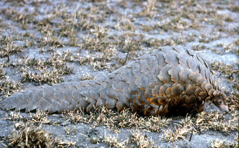
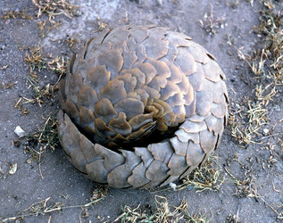

---
aliases:
  - Pholidota
title: Pholidota
---

# [[Pholidota]]

## Pangolins and their extinct relatives 
 

## #has_/text_of_/abstract 

> Pangolins, sometimes known as scaly anteaters, are mammals of the order **Pholidota** (). The one extant family, the Manidae, has three genera: Manis, Phataginus, and Smutsia. Manis comprises four species found in Asia, while Phataginus and Smutsia include two species each, all found in sub-Saharan Africa. These species range in size from 30 to 100 cm (12 to 39 in). Several extinct pangolin species are also known. In September 2023, nine species were reported.
>
> Pangolins have large, protective keratin scales, similar in material to fingernails and toenails, covering their skin; they are the only known mammals with this feature. Depending on the species, they live in hollow trees or burrows. Pangolins are nocturnal, and their diet consists of mainly ants and termites, which they capture using their long tongues. They tend to be solitary animals, meeting only to mate and produce a litter of one to three offspring, which they raise for about two years. Pangolins superficially resemble armadillos, though the two are not closely related; they have undergone convergent evolution.
>
> Pangolins are threatened by poaching (for their meat and scales, which are used in traditional medicine) and heavy deforestation of their natural habitats, and are the most trafficked mammals in the world. As of January 2020, there are eight species of pangolin whose conservation status is listed in the threatened tier. Three (Manis culionensis, M. pentadactyla and M. javanica) are critically endangered, three (Phataginus tricuspis, Manis crassicaudata and Smutsia gigantea) are endangered and two (Phataginus tetradactyla and Smutsia temminckii) are vulnerable on the Red List of Threatened Species of the International Union for Conservation of Nature.
>
> [Wikipedia](https://en.wikipedia.org/wiki/Pangolin) 

## Phylogeny 

-   « Ancestral Groups  
    -  [Eutheria](../Eutheria.md) 
    -  [Mammal](../../Mammal.md) 
    -   [Therapsida](../../../Therapsida.md)
    -   [Synapsida](../../../../Synapsida.md)
    -   [Amniota](../../../../../Amniota.md)
    -   [Terrestrial Vertebrates](../../../../../../Terrestrial.md)
    -   [Sarcopterygii](../../../../../../../Sarc.md)
    -   [Gnathostomata](../../../../../../../../Gnath.md)
    -   [Vertebrata](../../../../../../../../../Vertebrata.md)
    -   [Craniata](../../../../../../../../../../Craniata.md)
    -   [Chordata](../../../../../../../../../../../Chordata.md)
    -   [Deuterostomia](../../../../../../../../../../../../Deutero.md)
    -  [Bilateria](../../../../../../../../../../../../../Bilateria.md) 
    -  [Animals](../../../../../../../../../../../../../../Animals.md) 
    -  [Eukarya](../../../../../../../../../../../../../../../Eukarya.md) 
    -   [Tree of Life](../../../../../../../../../../../../../../../Tree_of_Life.md)

-   ◊ Sibling Groups of  Eutheria
    -   [Edentata](Edentata.md)
    -   Pholidota
    -  [Lagomorpha](Glires/Lagomorpha.md) 
    -   [Rodentia](Rodentia.md)
    -   [Macroscelididae](Macroscelididae.md)
    -   [Primates](Primates.md)
    -   [Scandentia](Scandentia.md)
    -   [Bat](Bat.md)
    -   [Dermoptera](Dermoptera.md)
    -   [Insectivora](Insectivora.md)
    -   [Carnivora](Carnivora.md)
    -   [Artiodactyla](Artiodactyla.md)
    -   [Whale](Whale.md)
    -   [Tubulidentata](Tubulidentata.md)
    -   [Perissodactyla](Perissodactyla.md)
    -   [Hyracoidea](Hyracoidea.md)
    -   [Sirenia](Sirenia.md)
    -   [Proboscidea](Eukarya/Animal/Bilateria/Deutero/Chordata/Craniata/Vertebrata/Gnath/Sarc/Terrestrial/Amniota/Synapsida/Therapsida/Mammal/Eutheria/Proboscidea.md)

-   » Sub-Groups
    -  [Manidae](Pholidota/Manidae.md) 

	-   *Metacheiromyidae* †
	-   [Manidae](Pholidota/Manidae.md "go to ToL page"))*

### Information on the Internet

-   [Pholidota:     Pangolins](http://www.ucmp.berkeley.edu/mammal/eutheria/pholidota.html). UCMP Berkeley.

## Title Illustrations

------------------------------------------------------------------------- 
 
scientific_name ::     Manis temmincki
location ::           Serengeti NP, Tanzania
specimen_condition ::  Live Specimen
Identified By        self
Behavior             Walking
Life Cycle Stage ::     adult
Body Part            whole
View                 side
copyright ::            © 2006 [David Bygott](mailto:davidbygott@yahoo.com) 

------------------------------------------------------------------------- 
 
scientific_name ::     Manis temmincki
location ::           Serengeti NP, Tanzania
specimen_condition ::  Live Specimen
Identified By        self
Behavior             Defensive, rolled in ball
Life Cycle Stage ::     adult
Body Part            whole
View                 side
copyright ::            © 2006 [David Bygott](mailto:davidbygott@yahoo.com) 

## Confidential Links & Embeds: 

### #is_/same_as :: [[/_Standards/bio/bio~Domain/Eukarya/Animal/Bilateria/Deutero/Chordata/Craniata/Vertebrata/Gnath/Sarc/Tetrapods/Amniota/Synapsida/Therapsida/Mammal/Eutheria/Pholidota|Pholidota]] 

### #is_/same_as :: [[/_public/bio/bio~Domain/Eukarya/Animal/Bilateria/Deutero/Chordata/Craniata/Vertebrata/Gnath/Sarc/Tetrapods/Amniota/Synapsida/Therapsida/Mammal/Eutheria/Pholidota.public|Pholidota.public]] 

### #is_/same_as :: [[/_internal/bio/bio~Domain/Eukarya/Animal/Bilateria/Deutero/Chordata/Craniata/Vertebrata/Gnath/Sarc/Tetrapods/Amniota/Synapsida/Therapsida/Mammal/Eutheria/Pholidota.internal|Pholidota.internal]] 

### #is_/same_as :: [[/_protect/bio/bio~Domain/Eukarya/Animal/Bilateria/Deutero/Chordata/Craniata/Vertebrata/Gnath/Sarc/Tetrapods/Amniota/Synapsida/Therapsida/Mammal/Eutheria/Pholidota.protect|Pholidota.protect]] 

### #is_/same_as :: [[/_private/bio/bio~Domain/Eukarya/Animal/Bilateria/Deutero/Chordata/Craniata/Vertebrata/Gnath/Sarc/Tetrapods/Amniota/Synapsida/Therapsida/Mammal/Eutheria/Pholidota.private|Pholidota.private]] 

### #is_/same_as :: [[/_personal/bio/bio~Domain/Eukarya/Animal/Bilateria/Deutero/Chordata/Craniata/Vertebrata/Gnath/Sarc/Tetrapods/Amniota/Synapsida/Therapsida/Mammal/Eutheria/Pholidota.personal|Pholidota.personal]] 

### #is_/same_as :: [[/_secret/bio/bio~Domain/Eukarya/Animal/Bilateria/Deutero/Chordata/Craniata/Vertebrata/Gnath/Sarc/Tetrapods/Amniota/Synapsida/Therapsida/Mammal/Eutheria/Pholidota.secret|Pholidota.secret]] 

