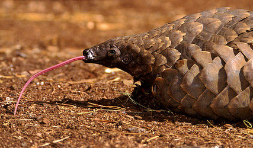

---
title: Manidae
---

# [[Manidae]] 

## Pangolins and extinct relatives 

 

## #has_/text_of_/abstract 

> **Manidae** ("spirits") is the only extant family of pangolins. This family comprises three genera (Manis from subfamily Maninae, Phataginus from subfamily Phatagininae, and Smutsia from subfamily Smutsiinae), as well as the extinct Fayum pangolin.
>
> [Wikipedia](https://en.wikipedia.org/wiki/Manidae) 

## Phylogeny 

-   « Ancestral Groups  
    -  [Pholidota](../Pholidota.md))
    -  [Eutheria](../../Eutheria.md))
    -  [Mammal](../../../Mammal.md))
    -   [Therapsida](../../../../Therapsida.md)
    -   [Synapsida](../../../../../Synapsida.md)
    -   [Amniota](../../../../../../Amniota.md)
    -   [Terrestrial Vertebrates](../../../../../../../Terrestrial.md)
    -   [Sarcopterygii](../../../../../../../../Sarc.md)
    -   [Gnathostomata](../../../../../../../../../Gnath.md)
    -   [Vertebrata](../../../../../../../../../../Vertebrata.md)
    -   [Craniata](../../../../../../../../../../../Craniata.md)
    -   [Chordata](../../../../../../../../../../../../Chordata.md)
    -   [Deuterostomia](../../../../../../../../../../../../../Deutero.md)
    -  [Bilateria](../../../../../../../../../../../../../../Bilateria.md))
    -  [Animals](../../../../../../../../../../../../../../../Animals.md))
    -  [Eukarya](../../../../../../../../../../../../../../../../Eukarya.md))
    -   [Tree of Life](../../../../../../../../../../../../../../../../Tree_of_Life.md)

-   ◊ Sibling Groups of  Pholidota
    -   Manidae

-   » Sub-Groups 

	-   *Eurotamandua* †
	-   *Maninae*
	    -   *Eomanis* †
	    -   *Necromanis* †
	    -   *Patriomanis* †
	    -   *Manis (Manis) crassicaudata*
	    -   *Manis (Manis) pentadactyla* [(Chinese pangolin)]
	    -   *Manis (Paramanis) javanica*
	-   *Smutsiinae (African pangolins)*
	    -   *Manis (Smutsia) gigantea* [(giant pangolin)]
	    -   *Manis (Smutsia) temminckii* [(Cape pangolin)]
	    -   *Manis (Phataginus) tricuspis* [(African tree
	        pangolin)]
	    -   *Manis (Uromanis) tetradactyla* [(Four-toed
	        pangolin)]

### Information on the Internet

-   [IUCN Pangolin Specialist     Group](http://protect.tfri.gov.tw/animal/pangolin/iucn_002_01.asp)
-   [Order:     Pholidota](http://animaldiversity.ummz.umich.edu/chordata/mammalia/pholidota.html).
    Animal Diversity Web. University of Michigan Museum of Zoology.
-   [Pangolin](http://www.awf.org/wildlives/178). African Wildlife
    Foundation.

## Title Illustrations

----------------------------------------------------------------

Scientific Name ::     Manis (Smutsia) temminckii
Location ::           captive at Johannesburg Zoo, South Africa
Comments             A sad story with a great end. This guy was rescued from the illegal animal trade. The shangomas use the parts of these animal to preare muti - \"healing\" medicine. One of its scales can sell for as much as R20. Luckily this sub-adult was rescued and send to Johannesburg zoo where he recuperated fully. This picture was taken while he still had pneumonia - note the froth on his nose. This was the first and only time in my life I was privileged to see the \"rare\" creature. We have never seen one in the wild. They can walk on their hindlegs, using the tail as balancing mechanism. Their only defence is to roll into a tight ball. If picked up, they flick the tail and the scales can inflict lacerations. He was released back into the wild.
Acknowledgements     source: [flickr: Pangolin - Manis temminckii](http://flickr.com/photos/wildimages/197302432/)
Specimen Condition   Live Specimen
Source Collection    [Flickr](http://flickr.com/)
Copyright ::            © 2006 [Callie de Wet](http://flickr.com/people/wildimages/) 

## Confidential Links & Embeds: 

### #is_/same_as ::[Manidae](Manidae.md)) 

### #is_/same_as :: [Manidae.public](/_public/bio/bio~Domain/Eukarya/Animal/Bilateria/Deutero/Chordata/Craniata/Vertebrata/Gnath/Sarc/Tetrapods/Amniota/Synapsida/Therapsida/Mammal/Eutheria/Pholidota/Manidae.public.md) 

### #is_/same_as :: [Manidae.internal](/_internal/bio/bio~Domain/Eukarya/Animal/Bilateria/Deutero/Chordata/Craniata/Vertebrata/Gnath/Sarc/Tetrapods/Amniota/Synapsida/Therapsida/Mammal/Eutheria/Pholidota/Manidae.internal.md) 

### #is_/same_as :: [Manidae.protect](/_protect/bio/bio~Domain/Eukarya/Animal/Bilateria/Deutero/Chordata/Craniata/Vertebrata/Gnath/Sarc/Tetrapods/Amniota/Synapsida/Therapsida/Mammal/Eutheria/Pholidota/Manidae.protect.md) 

### #is_/same_as :: [Manidae.private](/_private/bio/bio~Domain/Eukarya/Animal/Bilateria/Deutero/Chordata/Craniata/Vertebrata/Gnath/Sarc/Tetrapods/Amniota/Synapsida/Therapsida/Mammal/Eutheria/Pholidota/Manidae.private.md) 

### #is_/same_as :: [Manidae.personal](/_personal/bio/bio~Domain/Eukarya/Animal/Bilateria/Deutero/Chordata/Craniata/Vertebrata/Gnath/Sarc/Tetrapods/Amniota/Synapsida/Therapsida/Mammal/Eutheria/Pholidota/Manidae.personal.md) 

### #is_/same_as :: [Manidae.secret](/_secret/bio/bio~Domain/Eukarya/Animal/Bilateria/Deutero/Chordata/Craniata/Vertebrata/Gnath/Sarc/Tetrapods/Amniota/Synapsida/Therapsida/Mammal/Eutheria/Pholidota/Manidae.secret.md)

