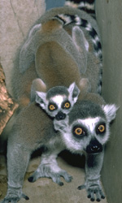
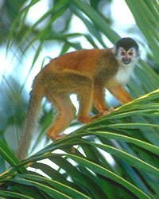
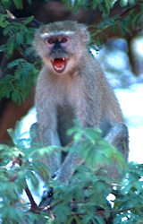

---
aliases:
- Aapechtege
- Akọ́dièyàn
- bộ Linh trưởng
- Esikloomalised
- Ezibuchophokhulu
- főemlősök
- Jidoldunol
- kädelliset
- Lêng-tióng-lūi
- Makiyuq
- Mágí dóó Mágí Ndahalinígíí
- naczelne
- Olaantiyyaa
- primaat
- Primaaten
- Primat
- primata
- primatad
- Primatai
- primatar
- primatas
- Primate
- Primated
- Primaten
- primater
- Primates
- Primati
- Primatlar
- Primatoj
- Primats
- Primatā
- Primoatn
- Primà
- primáti
- Primáty
- primāti
- prvaki
- Prymat
- prímatar
- príomhach
- Prîmat
- Prînma
- soweli Primate
- Ungoy
- πρωτεύοντα
- Примааттар
- Приматар
- примати
- Приматлар
- Приматсем
- приматтæ
- Приматтар
- Приматтэз
- приматъёс
- Приматы
- прыматы
- պրիմատներ
- פרימאט
- פרימטים
- آگو مانس
- حیوانات رئیسہ
- رئيسيات
- نخستیسانان
- نَر وانٛدَر
- پرايميټ
- پریماتلار
- گوانداری ڕەسەن
- नरवानर गण
- प्राथमिकवर्ग
- बँमनू
- প্রাইমেট
- প্ৰাইমেট
- ਆਗੂ ਮਾਨਸ
- முதனி
- ప్రైమేట్
- ಪ್ರೈಮೇಟ್
- പ്രൈമേറ്റ്
- อันดับวานร
- ပရိုင်းမိတ်
- პრიმატები
- პრიმატეფი
- ሰብአስተኔ
- ⵉⵎⵣⵡⵓⵔⴰ/ⵜⵉⴳⵊⴷⴰⵏⵉⵏ
- サル目
- 灵长目
- 靈長目
- 영장목
has_id_wikidata: Q7380
CITES_Appendix: '[[_Standards/WikiData/WD~Appendix_II_of_CITES,2851527]]'
Commons_category: Primates
Commons_gallery: Primates
described_by_source:
- '[[_Standards/WikiData/WD~Encyclopædia_Britannica_11th_edition,867541]]'
- '[[_Standards/WikiData/WD~Small_Brockhaus_and_Efron_Encyclopedic_Dictionary,19180675]]'
EPPO_Code:
- 1PRIMO
- AADMPX
equivalent_class:
- http://kbpedia.org/kko/rc/Primate
GS1_GPC_code: 10005459
has_list: '[[_Standards/WikiData/WD~list_of_primates,1076997]]'
image: http://commons.wikimedia.org/wiki/Special:FilePath/Olive%20baboon.jpg
instance_of:
- '[[_Standards/WikiData/WD~taxon,16521]]'
ITIS_TSN: 180089
Krugosvet_article: nauka_i_tehnika/biologiya/PRIMATI.html
MCN_code: 0106.11.00
MeSH_tree_code: B01.050.150.900.649.313.988
montage_image: http://commons.wikimedia.org/wiki/Special:FilePath/Primates%20-%20some%20families.jpg
NBN_System_Key: NHMSYS0000377147
OmegaWiki_Defined_Meaning: 2964
start_time:
- 79600000-01-01
- -55000000-01-01
studied_in:
- '[[_Standards/WikiData/WD~primatology,219488]]'
- '[[_Standards/WikiData/WD~palaeoprimatology,126598067]]'
taxon_common_name:
- primater
taxon_name: Primates
taxon_range_map_image: http://commons.wikimedia.org/wiki/Special:FilePath/Non-human%20primate%20range.png
taxon_rank: '[[_Standards/WikiData/WD~order,36602]]'
title: Primates
topic_s_main_template: '[[_Standards/WikiData/WD~Template_Primate-stub,11125405]]'
topic_s_main_Wikimedia_portal: '[[_Standards/WikiData/WD~Portal_Primates,11847392]]'
UMLS_CUI: C0033147
UNSPSC_Code: 10101514
dv_has_:
  name_:
    ace: Primata
    af: primaat
    am: ሰብአስተኔ
    an: Primates
    ar: رئيسيات
    arz: رئيسيات
    as: প্ৰাইমেট
    ast: Primates
    avk: Jidoldunol
    az: Primatlar
    azb: پریماتلار
    ba: Приматтар
    ban: Primata
    be: прыматы
    be_tarask: прыматы
    bg: примати
    bn: প্রাইমেট
    br: Primated
    bs: Primat
    ca: primat
    ceb: Ungoy
    ckb: گوانداری ڕەسەن
    crh: primat
    cs: primáti
    cv: Приматсем
    cy: Primat
    da: Primater
    de: Primaten
    diq: Primat
    el: πρωτεύοντα
    en: primate
    en_ca: Primate
    en_gb: primate
    eo: Primatoj
    es: primates
    et: Esikloomalised
    eu: Primate
    ext: Primates
    fa: نخستیسانان
    fi: kädelliset
    fr: primates
    frr: Primaaten
    fy: Primaten
    ga: príomhach
    gl: Primates
    gn: Primates
    gor: Primata
    gsw: Primate
    he: פרימטים
    hi: नरवानर गण
    hif: primate
    hr: Primati
    ht: Primat
    hu: főemlősök
    hy: պրիմատներ
    ia: primate
    id: Primata
    is: prímatar
    it: primati
    ja: サル目
    jv: Primata
    ka: პრიმატები
    kk: Приматтар
    kn: ಪ್ರೈಮೇಟ್
    ko: 영장목
    koi: Приматтэз
    ks: نَر وانٛدَر
    ku: Prîmat
    ku_latn: Prîmat
    kw: Prymat
    ky: Приматтар
    la: Primates
    lb: Primaten
    lez: Приматар
    lfn: Primate
    li: Aapechtege
    lij: Primates
    lmo: Primates
    lt: Primatai
    lv: primāti
    mad: Primata
    min: Primata
    mk: Примати
    ml: പ്രൈമേറ്റ്
    ms: Primat
    mul: Primates
    my: ပရိုင်းမိတ်
    nan: Lêng-tióng-lūi
    nb: Primater
    nds: Primaten
    ne: प्राथमिकवर्ग
    new: बँमनू
    nl: primaten
    nn: primatar
    nov: Primates
    nrm: Prînma
    nv: Mágí dóó Mágí Ndahalinígíí
    oc: Primats
    om: Olaantiyyaa
    os: приматтæ
    pa: ਆਗੂ ਮਾਨਸ
    pap: Primate
    pl: naczelne
    pms: Primà
    pnb: آگو مانس
    ps: پرايميټ
    pt: primatas
    pt_br: primata
    qu: Makiyuq
    ro: primate
    ru: приматы
    rue: Приматы
    sah: Примааттар
    scn: Primati
    sco: primates
    sgs: Primatā
    sh: Primati
    sk: Primáty
    sl: prvaki
    sq: Primates
    sr: примати
    su: Primata
    sv: primater
    sw: Primates
    ta: முதனி
    te: ప్రైమేట్
    th: อันดับวานร
    tl: Primate
    tok: soweli Primate
    tr: Primat
    tt: Приматлар
    udm: приматъёс
    uk: примати
    ur: حیوانات رئیسہ
    uz: Primatlar
    vep: primatad
    vi: bộ Linh trưởng
    vls: Primoatn
    war: Primata
    wuu: 灵长目
    xmf: პრიმატეფი
    yi: פרימאט
    yo: Akọ́dièyàn
    yue: 靈長目
    zgh: ⵉⵎⵣⵡⵓⵔⴰ/ⵜⵉⴳⵊⴷⴰⵏⵉⵏ
    zh: 灵长目
    zh_cn: 灵长目
    zh_hans: 灵长目
    zh_hant: 靈長目
    zh_hk: 靈長目
    zh_mo: 靈長目
    zh-my: 灵长目
    zh_sg: 灵长目
    zh_tw: 靈長目
    zu: Ezibuchophokhulu
---
# [[Primates]] 

#is_/instance_of :: [[../../../../../../../../../../../../../bio~Domain/Eukarya/Animal/Bilateria/bio~Class/bio~Order|bio~Order]] 
#is_/same_as :: [[../../../../../../../../../../../../../../../../../WikiData/WD~Primate,7380|WD~Primate,7380]] 
## Lemurs, tarsiers, monkeys, apes, and humans 
)   

Primates, the order of mammals that includes humans, apes, monkeys, and prosimians, exhibit several specific differences from their parent group within the class Mammalia. 

## #has_/text_of_/abstract 

> **Primates** is an order of mammals, which is further divided into the strepsirrhines, which include lemurs, galagos, and lorisids; and the haplorhines, which include tarsiers and simians (monkeys and apes). Primates arose 74–63 million years ago first from small terrestrial mammals, which adapted for life in tropical forests: many primate characteristics represent adaptations to the challenging environment among tree tops, including large brain sizes, binocular vision, color vision, vocalizations, shoulder girdles allowing a large degree of movement in the upper limbs, and opposable thumbs (in most but not all) that enable better grasping and dexterity. Primates range in size from Madame Berthe's mouse lemur, which weighs 30 g (1 oz), to the eastern gorilla, weighing over 200 kg (440 lb). There are 376–524 species of living primates, depending on which classification is used. New primate species continue to be discovered: over 25 species were described in the 2000s, 36 in the 2010s, and six in the 2020s.
>
> Primates have large brains (relative to body size) compared to other mammals, as well as an increased reliance on visual acuity at the expense of the sense of smell, which is the dominant sensory system in most mammals. These features are more developed in monkeys and apes, and noticeably less so in lorises and lemurs. Some primates, including gorillas, humans and baboons, are primarily ground-dwelling rather than arboreal, but all species have adaptations for climbing trees. Arboreal locomotion techniques used include leaping from tree to tree and swinging between branches of trees (brachiation); terrestrial locomotion techniques include walking on two hindlimbs (bipedalism) and modified walking on four limbs (quadrupedalism) via knuckle-walking.
>
> Primates are among the most social of all animals, forming pairs or family groups, uni-male harems, and multi-male/multi-female groups. Non-human primates have at least four types of social systems, many defined by the amount of movement by adolescent females between groups. Primates have slower rates of development than other similarly sized mammals, reach maturity later, and have longer lifespans. Primates are also the most cognitively advanced animals, with humans (genus Homo) capable of creating complex languages and sophisticated civilizations, while non-human primates have been recorded using tools. They may communicate using facial and hand gestures, smells and vocalizations.
>
> Close interactions between humans and non-human primates (NHPs) can create opportunities for the transmission of zoonotic diseases, especially virus diseases including herpes, measles, ebola, rabies and hepatitis. Thousands of non-human primates are used in research around the world because of their psychological and physiological similarity to humans. About 60% of primate species are threatened with extinction. Common threats include deforestation, forest fragmentation, monkey drives, and primate hunting for use in medicines, as pets, and for food. Large-scale tropical forest clearing for agriculture most threatens primates.
>
> [Wikipedia](https://en.wikipedia.org/wiki/Primate) 

## Characteristics 

Here are some key distinctions:

### Hands and Feet: 
Primates possess specialized hands and feet adapted for grasping and manipulation. They typically have opposable thumbs, allowing for precision grip and dexterity. Primates often have flat nails instead of claws on their digits, facilitating fine motor skills.

### Forward-Facing Eyes: 
Primates have forward-facing eyes with overlapping fields of vision, providing depth perception and stereoscopic vision. This adaptation enhances their ability to judge distances and accurately grasp objects, important for their arboreal lifestyle.

### Dental Formula: 
Primates generally have a characteristic dental formula of 2-1-2-3/2-1-2-3, meaning they have two incisors, one canine, two premolars, and three molars on each side of the upper and lower jaws. However, this dental formula can vary among primate species.

### Enhanced Brain Complexity: 
Primates have relatively large brains compared to body size and exhibit increased brain complexity, especially in regions associated with cognition, social behavior, and sensory processing. This enhanced brain development is correlated with their advanced cognitive abilities and social complexity.

### Social Structure: 
Primates often live in social groups characterized by complex social behaviors, such as cooperation, communication, and social hierarchies. While social structures vary among species, many primates exhibit strong social bonds and engage in cooperative activities, such as grooming and group defense.

### Parental Care: 
Primates generally exhibit extensive parental care, with mothers providing substantial investment in raising offspring. Many primate species have long gestation periods, extended periods of infant dependency, and complex social interactions involved in rearing young.

### Arboreal Adaptations: 
While not universal, many primates exhibit adaptations for an arboreal lifestyle, including grasping hands and feet, mobile shoulder joints, and flexible limbs. These adaptations facilitate locomotion in the trees, such as climbing, leaping, and swinging from branches.

### Varied Diet: 
Primates exhibit a wide range of dietary adaptations, including 
- frugivory (fruit-eating), 
- folivory (leaf-eating), 
- insectivory (insect-eating), 
- omnivory (eating a variety of foods), and 
- even carnivory (meat-eating in some species). 
Their dietary flexibility allows them to exploit diverse food resources in their environments.

These specific differences distinguish primates from their parent group within the class Mammalia and reflect their unique evolutionary history, ecological adaptations, and complex behaviors.

## Phylogeny 
from Purvis (1995).

## Phylogeny 

-   « Ancestral Groups  
    -  [Eutheria](../Eutheria.md) 
    -  [Mammal](../../Mammal.md) 
    -   [Therapsida](../../../Therapsida.md)
    -   [Synapsida](../../../../Synapsida.md)
    -   [Amniota](../../../../../Amniota.md)
    -   [Terrestrial Vertebrates](../../../../../../Terrestrial.md)
    -   [Sarcopterygii](../../../../../../../Sarc.md)
    -   [Gnathostomata](../../../../../../../../Gnath.md)
    -   [Vertebrata](../../../../../../../../../Vertebrata.md)
    -   [Craniata](../../../../../../../../../../Craniata.md)
    -   [Chordata](../../../../../../../../../../../Chordata.md)
    -   [Deuterostomia](../../../../../../../../../../../../Deutero.md)
    -  [Bilateria](../../../../../../../../../../../../../Bilateria.md) 
    -  [Animals](../../../../../../../../../../../../../../Animals.md) 
    -  [Eukarya](../../../../../../../../../../../../../../../Eukarya.md) 
    -   [Tree of Life](../../../../../../../../../../../../../../../Tree_of_Life.md)

-   ◊ Sibling Groups of  Eutheria
    -   [Edentata](Edentata.md)
    -   [Pholidota](Pholidota.md)
    -  [Lagomorpha](Glires/Lagomorpha.md) 
    -   [Rodentia](Rodentia.md)
    -   [Macroscelididae](Macroscelididae.md)
    -   Primates
    -   [Scandentia](Scandentia.md)
    -   [Bat](Bat.md)
    -   [Dermoptera](Dermoptera.md)
    -   [Insectivora](Insectivora.md)
    -   [Carnivora](Carnivora.md)
    -   [Artiodactyla](Artiodactyla.md)
    -   [Whale](Whale.md)
    -   [Tubulidentata](Tubulidentata.md)
    -   [Perissodactyla](Perissodactyla.md)
    -   [Hyracoidea](Hyracoidea.md)
    -   [Sirenia](Sirenia.md)
    -   [Proboscidea](Eukarya/Animal/Bilateria/Deutero/Chordata/Craniata/Vertebrata/Gnath/Sarc/Terrestrial/Amniota/Synapsida/Therapsida/Mammal/Eutheria/Proboscidea.md)

-   » Sub-Groups
    -  [Platyrrhini](Primates/Platyrrhini.md) 
    -  [Catarrhini](Primates/Catarrhini.md) 
    -  [Tarsier](Primates/Tarsier.md) 
    -  [Strepsirrhini](Primates/Strepsirrhini.md) 

## #has_/text_of_/abstract 

> **Primate**s is an order of mammals, which is further divided into the strepsirrhines, which include lemurs, galagos, and lorisids; and the haplorhines, which include tarsiers and simians (monkeys and apes). Primates arose 74–63 million years ago first from small terrestrial mammals, which adapted for life in tropical forests: many primate characteristics represent adaptations to the challenging environment among tree tops, including large brain sizes, binocular vision, color vision, vocalizations, shoulder girdles allowing a large degree of movement in the upper limbs, and opposable thumbs (in most but not all) that enable better grasping and dexterity. Primates range in size from Madame Berthe's mouse lemur, which weighs 30 g (1 oz), to the eastern gorilla, weighing over 200 kg (440 lb). There are 376–524 species of living primates, depending on which classification is used. New primate species continue to be discovered: over 25 species were described in the 2000s, 36 in the 2010s, and six in the 2020s.
>
> Primates have large brains (relative to body size) compared to other mammals, as well as an increased reliance on visual acuity at the expense of the sense of smell, which is the dominant sensory system in most mammals. These features are more developed in monkeys and apes, and noticeably less so in lorises and lemurs. Some primates, including gorillas, humans and baboons, are primarily ground-dwelling rather than arboreal, but all species have adaptations for climbing trees. Arboreal locomotion techniques used include leaping from tree to tree and swinging between branches of trees (brachiation); terrestrial locomotion techniques include walking on two hindlimbs (bipedalism) and modified walking on four limbs (quadrupedalism) via knuckle-walking.
>
> Primates are among the most social of all animals, forming pairs or family groups, uni-male harems, and multi-male/multi-female groups. Non-human primates have at least four types of social systems, many defined by the amount of movement by adolescent females between groups. Primates have slower rates of development than other similarly sized mammals, reach maturity later, and have longer lifespans. Primates are also the most cognitively advanced animals, with humans (genus Homo) capable of creating complex languages and sophisticated civilizations, and non-human primates are recorded to use tools. They may communicate using facial and hand gestures, smells and vocalizations.
>
> Close interactions between humans and non-human primates (NHPs) can create opportunities for the transmission of zoonotic diseases, especially virus diseases including herpes, measles, ebola, rabies and hepatitis. Thousands of non-human primates are used in research around the world because of their psychological and physiological similarity to humans. About 60% of primate species are threatened with extinction. Common threats include deforestation, forest fragmentation, monkey drives, and primate hunting for use in medicines, as pets, and for food. Large-scale tropical forest clearing for agriculture most threatens primates.
>
> [Wikipedia](https://en.wikipedia.org/wiki/Primate) 

### Information on the Internet

-   [The Wisconsin Regional Primate Research Center     (WRPRC)](http://www.primate.wisc.edu/). Provides acces to a variety
    of resources including:
    -   [Primate Info Net (PIN)](http://www.primate.wisc.edu/pin/)
    -   [PrimateLit. A bibliographic database for         primatology.](http://primatelit.library.wisc.edu/)
    -   [WRPRC Primate Image         Collection](http://www.primate.wisc.edu/pin/images/index.html)
    -   [World Directory of         Primatologists](http://www.primate.wisc.edu/pin/idp/wdp).
-   [BIOSIS BiologyBrowser:     Primates](http://www.biologybrowser.org/bb/Organism/Chordata/Vertebrata/Mammalia/Primates/index.shtml)
-   [California Regional Primate Research     Center](http://www.crprc.ucdavis.edu/crprc/homepage.html).
    University of California, Davis.
-   [American Society of Primatologists](http://www.asp.org/)
-   [Primate Cytogenetics Network](http://www.selu.com/%7Ebio/cyto/)
-   [The Virtual Skeletons Project](http://www.eskeletons.org/).
    University of Texas at Austin.
-   [Order     Primates](http://animaldiversity.ummz.umich.edu/chordata/mammalia/primates.html).
    The University of Michigan Museum of Zoology Animal Diversity Web.
-   [Introduction to     Primates](http://mcweb.mc.maricopa.edu/academic/cult_sci/anthro/primates/index.html).
    Mesa Community College Exploratorium of Our Kind.
-   [Primate     Display](http://helios.bto.ed.ac.uk/icapb/collection/museum/beth97/order.htm).
    University of Edinburgh\'s Natural History Museum.
-   Information on recent finds of fossil primates in China:
    -   [Searching for Our Primate Ancestors in         China](http://www.cruzio.com/%7Ecscp/beard.htm). An article by
        Carnegie paleontologist Chris Beard.
    -   [Newly discovered fossils from China shed light on the common         ancestry of monkeys, apes and         humans](http://www.niu.edu/pubaffairs/RELEASES/2000/MAR/primate/Nature.htm)
        . Northern Illinois University News Release.
    -   [Researchers discover fossils of tiny, thumb-length         primates](http://www.niu.edu/pubaffairs/RELEASES/2000/MAR/primate/Tinyprimates.htm).
        Northern Illinois University News Release.
-   [Primates Online](http://www.primates-online.com/). Primate
    Conservation & Welfare Society.
-   [Electronic Zoo Primates     Page](http://netvet.wustl.edu/primates.htm). Links to primate
    information on the web.
-   [Tim Knight\'s Primate     Gallery](http://www.selu.com/%7Ebio/PrimateGallery/main.html).
    Primate photos, illustrations, and paintings by various artists.
-   [Steve Bloom\'s Primates Project](http://www.primates.net/). A
    collection of great primate photos.

### References

Adkins, R. M. and R. L. Honeycutt. 1994. Evolution of the primate
cytochrome c oxidase subunit II gene. Journal of Molecular Evolution
38:215-231.

Arnason, U., A. Gullberg, and A. Janke. 1998. Molecular timing of
primate divergences as estimated by two nonprimate calibration points.
Journal of Molecular Evolution 47:718-727.

Bailey, W. J., D. H. A. Fitch, D. A. Tagle, J. Czelusniak, J. L.
Slightom, and M. Goodman. 1991. Molecular evolution of the
PSI-eta-globin gene locus: Gibbon phylogeny and the hominoid slowdown.
Molecular Biology and Evolution 8:155-184.

Barton, R. A. 2004. Binocularity and brain evolution in primates.
Proceedings of the National Academy of Sciences (USA)
101(27):10113-10115.

Bloch, J. I. and D. M. Boyer. 2002. Grasping primate origins.
Science298:1606-1610.

Bloch, J. I., D. C. Fisher, P. D. Gingerich, G. F. Gunnell, E. L.
Simons, and M. D. Uhen. 1997. Cladistic analysis and anthropoid origins.
Science 278:2134-2135.

Flynn, J. J., A. R. Wyss, R. Charrier, and C. C. Swisher. 1995. An Early
Miocene anthropoid skull from the Chilean Andes. Nature 373:603-607.

Gebo, D. L., M. Dagosto, K. C. Beard, and T. Qi. 2000. The smallest
primates. Journal of Human Evolution 38:585-594.

Gebo, D. L., M. Dagosto, K. C. Beard, T. Qi, and J. W. Wang. 2000. The
oldest known anthropoid postcranial fossils and the early evolution of
higher primates. Nature 404:276-278.

Glazko, G. V. and M. Nei. 2003. Estimation of divergence times for major
lineages of primate species. Molecular Biology and Evolution
20(3):424-434.

Goodman, M., W. J. Bailey, K. Hayasaka, M. J. Stanhope, J. Slightom, and
J. Czelusniak. 1994. Molecular evidence on primate phylogeny from DNA
sequences. American Journal of Physical Anthropology 94:3-24.

Goodman, M., C. A. Porter, J. Czelusniak, S. L. Page, H. Schneider, J.
Shoshani, G. Gunnell, and C. P. Groves. 1998. Toward a phylogenetic
classification of primates based on DNA evidence complemented by fossil
evidence. Molecular Phylogenetics and Evolution 9:585-598.

Hartwig, W. C., ed. 2002. The Primate Fossil Record. Cambridge Studies
in Biological and Evolutionary Anthropology 33. Cambridge University
Press, Cambridge, New York.

Jaworski, C. J. 1995. A reassessment of mammalian alpha-A-crystallin
sequences using DNA sequencing: Implications for anthropoid affinities
of tarsier. Journal of Molecular Evolution 41:901-908.

Johnson, W.E. and J. M. Coffin. 1999. Constructing primate phylogenies
from ancient retrovirus sequences. Proceedings of the National Academy
of Sciences (USA) 96:10254-10260.

Kappeler, P. M. 1998. Nests, tree holes, and the evolution of primate
life histories. American Journal of Primatology 46:7-33.

Kay, R. F., C. Ross, and B. A. Williams. Anthropoid origins. Science
275:797-804.

Kay, R. F., C. Ross, B. A. Williams, and D. Johnson. 1997. Cladistic
analysis and anthropoid origins - Response. Science 278:2135-2136.

Koop, B. F., D. A. Tagle, M. Goodman, and J. L. Slightom. 1989. A
molecular view of primate phylogeny and important systematic and
evolutionary questions. Molecular Biology and Evolution 6:580-613.

Lockwood, C. A. and J. G. Fleagle. 1999. The recognition and evaluation
of homoplasy in primate and human evolution. Yearbook of Physical
Anthropology 42:189-232.

Martin, R. D. 1993. Primate origins: plugging the gaps. Nature
262:223-234.

Miyamoto, M. M. and M. Goodman. 1990. DNA systematics and evolution of
primates. Annual Review of Ecology and Systematics 21:197-220.

Porter, C. A., S. L. Page, J. Czelusniak, H. Schneider, M. P. C.
Schneider, I. Sampaio, and M. Goodman. 1997. Phylogeny and evolution of
selected primates as determined by sequences of the epsilon-globin locus
and 5\' flanking regions. International Journal of Primatology
18:261-295.

Porter, C. A., I. Sampaio, H. Schneider, M. P. C. Schneider, J.
Czelusniak, and M. Goodman. 1995. Evidence on primate phylogeny from
epsilon-globin gene-sequences and flanking regions. Journal of Molecular
Evolution 40:30-55.

Purvis, A. 1995. A composite estimate of primate phylogeny.
Philosophical Transactions of the Royal Society of London Series B
348:405-421.

Purvis, A., S. Nee, and P. H. Harvey. 1995. Macroevolutionary inferences
from primate phylogeny. Proceedings of the Royal Society London Series B
260:329-333.

Rasmussen, D. T., G. C. Conroy, and E. L. Simons. 1998. Tarsier-like
locomotor specializations in the Oligocene primate Afrotarsius.
Proceedings of the National Academy of Sciences (USA) 95:14848-14850.

Robson, S. K., G. W. Rouse, and J. D. Pettigrew. 1997. Sperm
ultrastructure of Tarsius bancanus (Tarsiidae, Primates): Implications
for primate phylogeny and the use of sperm in systematics. Acta
Zoologica Stockholm 78:269-278.

Ross, C. 1996. Adaptive explanation for the origins of the Anthropoidea
(primates). American Journal of Primatology 40:205-230.

Ross, C., B. Williams, and R. F. Kay. 1998. Phylogenetic analysis of
anthropoid relationships. Journal of Human Evolution 35:221-306.

Schrago, C. G. and C. A. M. Russo. 2003. Timing the origin of New World
monkeys. Molecular Biology and Evolution 20(10):1620-1625.

Shoshani, J., C. P. Groves, E. L. Simons, and G. F. Gunnell. 1996.
Primate phylogeny: Morphological vs molecular results. Molecular
Phylogenetics and Evolution 5:102-154.

Simons, E. 1995. Egyptian Oligocene primates: A review. Yearbook of
Physical Anthropology 38:199-238.

Tavaré, S., C. R. Marshall, O. Will, C. Soligo, and R. D. Martin. 2002.
Using the fossil record to estimate the age of the last common ancestor
of extant primates. Nature 416:726-729.

## Title Illustrations

 

  ------------------------------------------------------------------------------
  scientific_name ::  Lemur catta
  Comments          Ring-tailed lemurs (Strepsirrhini)
  copyright ::         © 2000 [Greg and Marybeth Dimijian](http://www.dimijianimages.com/) 
 
  ------------------------------------------------------------------------------
 

  ------------------------------------------------------------------------------
  scientific_name ::  Saimiri oerstedi
  Comments          Squirrel monkey (Platyrrhini)
  copyright ::         © 2000 [Greg and Marybeth Dimijian](http://www.dimijianimages.com/) 
 
  ------------------------------------------------------------------------------
 

  ------------------------------------------------------------------------------
  scientific_name ::  Cercopithecus aethiops
  Comments          Vervet monkey (Catarrhini)
  copyright ::         © 2000 [Greg and Marybeth Dimijian](http://www.dimijianimages.com/) 
 
  ------------------------------------------------------------------------------

## Confidential Links & Embeds: 

### #is_/same_as :: [[/_Standards/bio/bio~Domain/Eukarya/Animal/Bilateria/Deutero/Chordata/Craniata/Vertebrata/Gnath/Sarc/Tetrapods/Amniota/Synapsida/Therapsida/Mammal/Eutheria/Primates|Primates]] 

### #is_/same_as :: [[/_public/bio/bio~Domain/Eukarya/Animal/Bilateria/Deutero/Chordata/Craniata/Vertebrata/Gnath/Sarc/Tetrapods/Amniota/Synapsida/Therapsida/Mammal/Eutheria/Primates.public|Primates.public]] 

### #is_/same_as :: [[/_internal/bio/bio~Domain/Eukarya/Animal/Bilateria/Deutero/Chordata/Craniata/Vertebrata/Gnath/Sarc/Tetrapods/Amniota/Synapsida/Therapsida/Mammal/Eutheria/Primates.internal|Primates.internal]] 

### #is_/same_as :: [[/_protect/bio/bio~Domain/Eukarya/Animal/Bilateria/Deutero/Chordata/Craniata/Vertebrata/Gnath/Sarc/Tetrapods/Amniota/Synapsida/Therapsida/Mammal/Eutheria/Primates.protect|Primates.protect]] 

### #is_/same_as :: [[/_private/bio/bio~Domain/Eukarya/Animal/Bilateria/Deutero/Chordata/Craniata/Vertebrata/Gnath/Sarc/Tetrapods/Amniota/Synapsida/Therapsida/Mammal/Eutheria/Primates.private|Primates.private]] 

### #is_/same_as :: [[/_personal/bio/bio~Domain/Eukarya/Animal/Bilateria/Deutero/Chordata/Craniata/Vertebrata/Gnath/Sarc/Tetrapods/Amniota/Synapsida/Therapsida/Mammal/Eutheria/Primates.personal|Primates.personal]] 

### #is_/same_as :: [[/_secret/bio/bio~Domain/Eukarya/Animal/Bilateria/Deutero/Chordata/Craniata/Vertebrata/Gnath/Sarc/Tetrapods/Amniota/Synapsida/Therapsida/Mammal/Eutheria/Primates.secret|Primates.secret]] 

