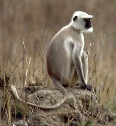
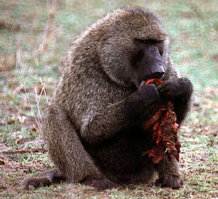

---
aliases:
  - aap
  - aapakaaq
  - abe
  - adoe
  - Affe
  - Affen
  - ahv
  - amo
  - apa
  - apag
  - apaköttur
  - Ape
  - apekatt
  - Apes
  - apina
  - atò
  - bakes
  - beždiuonė
  - beždžionės
  - biri
  - Bodat
  - bojog
  - catarrhine monkeys
  - Catarrhini
  - cigak
  - enwe
  - gobuk
  - golo
  - gàu
  - hèu-è
  - Ibki
  - Inguge
  - Inkende
  - jɛŋa
  - k'usillu
  - k3s3
  - ka'i
  - kema
  - Kera
  - kethèk
  - Khỉ
  - kima
  - kuya'
  - kâu
  - kâu-á
  - Lambas
  - lingz
  - lotong
  - macaco
  - maimuță
  - majmun
  - majmuni
  - majom
  - makak
  - maki
  - marmouz
  - marmoûset
  - maymal
  - maymona
  - Maymun
  - maymunlar
  - maymıl
  - małpy
  - maјmun
  - meymun
  - mico
  - moncaí
  - Monkey
  - Monkeys
  - Mono
  - Monyet
  - monyét
  - muncaidh
  - munkhwele
  - mwnci
  - mákohe
  - məjmun
  - Ngĩma
  - nyoka
  - Old World anthropoids
  - Old World monkeys
  - opica
  - opice
  - ozomahtli
  - primate
  - pug
  - pērtiķi
  - rajako
  - scimia
  - scimmia
  - shoko
  - sim
  - Simia
  - Simio
  - sinche
  - Singe
  - sumia
  - séndje
  - tximino
  - tɩgbayʋ
  - ukay
  - unggoy
  - vi᷆r
  - warik
  - wopica
  - wãamba
  - yapi yapi
  - yungay
  - zeam
  - áhppa
  - ŋmaaŋa
  - Μαϊμού
  - мајмун
  - Мавпи
  - маймалак
  - маймалаш
  - маймули
  - маймун
  - маймыл
  - малпа
  - мамун
  - мечин
  - мөчн
  - нечовекоподобни маймуни
  - обезьян
  - обезьяны (без человека)
  - сармагчин
  - упӑтесем
  - կապիկներ
  - מאלפע
  - קופים
  - باندر
  - بندر
  - سعدان
  - شادی
  - قرد
  - مايمۇن
  - میمون
  - مەیموون
  - پونٛز
  - ܩܘܦܐ
  - बंदर
  - बाँदर
  - बानर
  - माकः
  - माकड
  - বানর
  - ਬਾਂਦਰ
  - વાંદરો
  - ମାଙ୍କଡ଼
  - குரங்கு
  - కోతి
  - ಕೋತಿ
  - ಮಂಗೆ
  - കുരങ്ങ്
  - ลิง
  - སྤྲེའུ།
  - ကၞုဲ
  - မျောက်
  - လိင်း
  - ህበይ
  - ጦጣ
  - ᎠᏓᎵᏍᎩᏱᏍᎩ
  - ᠪᠣᠨᡳᠣ
  - ᥘᥤᥒᥰ
  - ᱦᱟ.ᱬᱩ
  - ọ̀bọ
  - サル
  - 猢狲
  - 猴
  - 猴仔
  - 猿猴
  - 馬騮
  - ꯌꯣꯡ
  - 원숭이
has_id_wikidata: Q1367
title: Catarrhini
taxon_known_by_this_common_name: "[[_Standards/WikiData/WD~Cercopithecidae,182968]]"
described_by_source:
  - "[[../../../../../../../../../../../../../../../../../../WikiData/WD~Brockhaus_and_Efron_Encyclopedic_Dictionary,602358]]"
  - "[[_Standards/WikiData/WD~Encyclopædia_Britannica_11th_edition,867541]]"
  - "[[_Standards/WikiData/WD~Gujin_Tushu_Jicheng,1768721]]"
  - "[[_Standards/WikiData/WD~Explanatory_Dictionary_of_the_Living_Great_Russian_Language,1970746]]"
  - "[[_Standards/WikiData/WD~Armenian_Soviet_Encyclopedia,2657718]]"
  - "[[_Standards/WikiData/WD~Bible_Encyclopedia_of_Archimandrite_Nicephorus,4086271]]"
  - "[[_Standards/WikiData/WD~Small_Brockhaus_and_Efron_Encyclopedic_Dictionary,19180675]]"
  - "[[_Standards/WikiData/WD~New_Encyclopedic_Dictionary,19190511]]"
  - "[[_Standards/WikiData/WD~Metropolitan_Museum_of_Art_Tagging_Vocabulary,106727050]]"
subclass_of: "[[_Standards/WikiData/WD~non_human_animal,24249370]]"
instance_of: "[[_Standards/WikiData/WD~organisms_known_by_a_particular_common_name,55983715]]"
depicted_by:
  - "[[_Standards/WikiData/WD~Monkey_from_the_Iseum_Campense,131588037]]"
  - "[[_Standards/WikiData/WD~Fontana_delle_scimmie,131812862]]"
  - "[[_Standards/WikiData/WD~Sala_delle_Scimmie,131813529]]"
OmegaWiki_Defined_Meaning: 5870
Commons_gallery: Monkey
U_S_National_Archives_Identifier: 10646707
image:
  - http://commons.wikimedia.org/wiki/Special:FilePath/Cebus%20albifrons%20edit.jpg
  - http://commons.wikimedia.org/wiki/Special:FilePath/Squirrel%20monkey.jpg
  - http://commons.wikimedia.org/wiki/Special:FilePath/Tamarin.monkey.500pix.jpg
taxon_common_name:
  - Monkey
  - குரங்கு
  - サル
  - बंदर
  - 원숭이
  - 猴
  - Singe
  - Mono
  - Khỉ
  - बानर
  - Μαϊμού
  - Monyet
  - 猴仔
  - kâu-á
  - opica
  - కోతి
  - ลิง
  - Maymun
  - Мавпи
pronunciation_audio:
  - http://commons.wikimedia.org/wiki/Special:FilePath/De-Affe2.ogg
  - http://commons.wikimedia.org/wiki/Special:FilePath/LL-Q33070%20%28ban%29-Carma%20citrawati-Bojog.wav
Commons_category: Monkeys
Unicode_character:
  - 🐒
  - 🐵
Iconclass_notation: 43A3741
Krugosvet_article_archived_: nauka_i_tehnika/biologiya/OBEZYANI.html
dv_has_:
  name_:
    ady: мамун
    af: aap
    am: ጦጣ
    ami: lotong
    anp: बंदर
    ar: سعدان
    arc: ܩܘܦܐ
    arz: قرد
    ast: primate
    av: маймалак
    ay: k'usillu
    az: meymun
    ban: bojog
    bcl: ukay
    bdr: kuya'
    be: малпа
    be_tarask: малпа
    bg: нечовекоподобни маймуни
    bho: बानर
    bjn: warik
    bn: বানর
    bo: སྤྲེའུ།
    br: marmouz
    bs: majmun
    btm: Bodat
    ca: mico
    cdo: gàu
    ce: maymal
    ceb: primate
    chr: ᎠᏓᎵᏍᎩᏱᏍᎩ
    chy: mákohe
    ckb: مەیموون
    cs: opice
    cv: упӑтесем
    cy: mwnci
    da: abe
    dag: jɛŋa
    de: Affe
    de_ch: Affen
    dga: ŋmaaŋa
    dtp: gobuk
    dty: बानर
    dua: kema
    ee: k3s3
    el: μαϊμού
    en: monkey
    en_ca: monkey
    en_gb: monkey
    eo: simio
    es: mono
    et: ahv
    eu: tximino
    fa: میمون
    fi: apina
    fon: atò
    fr: singe
    ga: moncaí
    gd: muncaidh
    gl: mono
    gn: ka'i
    gom: बंदर
    gsw: Affen
    gu: વાંદરો
    gv: apag
    ha: biri
    hak: hèu-è
    he: קופים
    hi: बंदर
    hr: majmun
    hsb: wopica
    ht: makak
    hu: majom
    hy: կապիկներ
    iba: Kera
    id: monyet
    ig: enwe
    inh: маймалаш
    io: Simio
    is: apaköttur
    it: scimmia
    ja: サル
    jv: kethèk
    kab: Ibki
    kbp: tɩgbayʋ
    kcg: zeam
    kge: Lambas
    ki: Ngĩma
    kk: маймыл
    kl: aapakaaq
    kn: ಕೋತಿ
    ko: 원숭이
    ks: پونٛز
    kw: sim
    ky: мечин
    la: Simia
    lad: maymona
    lbe: маймун
    lez: маймун
    lfn: Simia
    li: Ape
    lmo: sumia
    ln: nyoka
    lt: beždžionės
    lv: pērtiķi
    lzh: 猿猴
    mcn: vi᷆r
    mg: rajako
    mhr: маймыл
    min: cigak
    mk: мајмун
    ml: കുരങ്ങ്
    mn: сармагчин
    mnc: ᠪᠣᠨᡳᠣ
    mni: ꯌꯣꯡ
    mnw: ကၞုဲ
    mos: wãamba
    mr: माकड
    mrj: маймыл
    ms: monyet
    my: မျောက်
    mzn: شادی
    na: maki
    nah: ozomahtli
    nan: kâu
    nb: apekatt
    nds: aap
    ne: बाँदर
    new: माकः
    nl: aap
    nrm: marmoûset
    oc: simia
    or: ମାଙ୍କଡ଼
    os: маймули
    pa: ਬਾਂਦਰ
    pag: bakes
    pcd: sinche
    pl: małpy
    pnb: باندر
    pt: macaco
    pt_br: macaco
    qu: k'usillu
    rn: Inkende
    ro: maimuță
    ru: обезьяны (без человека)
    rw: Inguge
    sat: ᱦᱟ.ᱬᱩ
    scn: scimia
    sco: pug
    sd: باندر
    se: áhppa
    sgs: beždiuonė
    sh: maјmun
    shn: လိင်း
    sk: opica
    skr: باندر
    sl: opica
    sn: shoko
    sq: majmuni
    sr: мајмун
    srn: yapi yapi
    su: monyét
    sv: apa
    sw: kima
    ta: குரங்கு
    tay: yungay
    tcy: ಮಂಗೆ
    tdd: ᥘᥤᥒᥰ
    te: కోతి
    tg: маймун
    th: ลิง
    ti: ህበይ
    tl: unggoy
    tly: məjmun
    tr: maymun
    tt: маймыл
    tt_cyrl: маймыл
    tt_latn: maymıl
    tum: munkhwele
    tw: adoe
    udm: обезьян
    ug: مايمۇن
    uk: мавпи
    ur: بندر
    uz: maymunlar
    vi: khỉ
    wa: séndje
    war: amo
    wo: golo
    wuu: 猢狲
    xal: мөчн
    yi: מאלפע
    yo: ọ̀bọ
    yue: 馬騮
    za: lingz
    zh: 猴
    zh_cn: 猴
    zh_hans: 猴
    zh_hant: 猴
    zh_hk: 猴
    zh_mo: 猴
    zh-my: 猴
    zh_sg: 猴
    zh_tw: 猴
---
# [[Catarrhini]] 🐵 🐒

#is_/instance_of :: [[ParvOrder]] 
## Humans, great apes, gibbons, Old World monkeys 
))  

#is_/same_as :: [[../../../../../../../../../../../../../../../../../../WikiData/WD~Monkey,1367|WD~Monkey,1367]] 

Catarrhini is a [[parvorder]] of primates that includes Old World monkeys, apes, and humans. 

## #has_/text_of_/abstract 

> The parvorder **Catarrhini**  (known commonly as catarrhine monkeys, 
> Old World anthropoids, or Old World monkeys) 
> consists of the Cercopithecoidea and apes (Hominoidea). 
> 
> In 1812, Geoffroy grouped those two groups together and established the name 
> Catarrhini, "Old World monkeys", ("singes de l'Ancien Monde" in French). 
> 
> Its sister in the infraorder Simiiformes is the parvorder Platyrrhini (New World monkeys). There has been some resistance to directly designate apes (and thus humans) as monkeys despite the scientific evidence, so "Old World monkey" may be taken to mean the Cercopithecoidea or the Catarrhini. That apes are monkeys was already realized by Georges-Louis Leclerc, Comte de Buffon in the 18th century. Linnaeus placed this group in 1758 together with what we now recognise as the tarsiers and the New World monkeys, in a single genus "Simia" (sans Homo). The Catarrhini are all native to Africa and Asia. Members of this parvorder are called catarrhines.
>
> The Catarrhini are the sister group to the New World monkeys, the Platyrrhini. Some  six million years before the ape - Cercopithecoidea bifurcation, the Platyrrhini emerged within "monkeys" by migration to South America from Afro-Arabia (the Old World), likely by ocean.
>
> [Wikipedia](https://en.wikipedia.org/wiki/Catarrhini) 

## Characteristics 

They are distinguished from their parent group, the infraorder Simiiformes (also known as simians or anthropoids), by several specific differences:

### Narrow Noses: 
One of the defining characteristics of Catarrhini is their narrow, downward-facing nostrils. 
This contrasts with the broader, side-facing nostrils found in their parent group, the simians. 
The term "Catarrhini" actually means "downward nosed" in Greek, 
reflecting this anatomical feature.

### Ischial Callosities: 
Many Catarrhini species have ischial callosities, 
which are hardened patches of skin on their buttocks. 
These callosities serve as padding and support when sitting for long periods, 
a behavior common among many Old World monkeys and apes.

### Bicuspid Upper Second Molars: 
Catarrhini typically have upper second molars with two cusps (bicuspid), 
whereas their parent group often has molars with three cusps. 
This dental characteristic is used as a diagnostic feature 
to differentiate Catarrhini from other simians.

### No Prehensile Tails: 
Most Catarrhini species lack prehensile tails, 
meaning their tails are not adapted for grasping objects. 
This distinguishes them from some members of their parent group, such as New World monkeys, 
which often have prehensile tails used for grasping branches.

### Geographic Distribution: 
Catarrhini are predominantly found in Africa and Asia, 
while their parent group, [[Simiiformes]], includes New World monkeys 
found in Central and South America in addition to Old World monkeys, apes, and humans.

### Diverse Social Structures: 
Catarrhini species exhibit diverse social structures, 
including multi-male/multi-female groups, 
one-male/multi-female groups, and solitary lifestyles. 
These social structures vary among species 
and are influenced by factors such as habitat, diet, and reproductive strategies.

### Cognitive Abilities: 
Many Catarrhini species, particularly apes and humans, exhibit advanced cognitive abilities, 
including problem-solving, tool use, and complex social behaviors. 
These cognitive abilities are more pronounced in [[Catarrhini]] compared to other simians.

Overall, Catarrhini share several specific characteristics that distinguish them from their parent group, [[Simiiformes]], including anatomical features, dental morphology, distribution, and social behaviors. These differences reflect the evolutionary divergence and adaptations of Catarrhini species over time.

## Phylogeny 
from Purvis (1995).

## Phylogeny 

-   « Ancestral Groups  
    -  [Primates](../Primates.md) 
    -  [Eutheria](../../Eutheria.md) 
    -  [Mammal](../../../Mammal.md) 
    -   [Therapsida](../../../../Therapsida.md)
    -   [Synapsida](../../../../../Synapsida.md)
    -   [Amniota](../../../../../../Amniota.md)
    -   [Terrestrial Vertebrates](../../../../../../../Terrestrial.md)
    -   [Sarcopterygii](../../../../../../../../Sarc.md)
    -   [Gnathostomata](../../../../../../../../../Gnath.md)
    -   [Vertebrata](../../../../../../../../../../Vertebrata.md)
    -   [Craniata](../../../../../../../../../../../Craniata.md)
    -   [Chordata](../../../../../../../../../../../../Chordata.md)
    -   [Deuterostomia](../../../../../../../../../../../../../Deutero.md)
    -  [Bilateria](../../../../../../../../../../../../../../Bilateria.md) 
    -  [Animals](../../../../../../../../../../../../../../../Animals.md) 
    -  [Eukarya](../../../../../../../../../../../../../../../../Eukarya.md) 
    -   [Tree of Life](../../../../../../../../../../../../../../../../Tree_of_Life.md)

-   ◊ Sibling Groups of  Primates
    -   [Platyrrhini](Platyrrhini.md)
    -   Catarrhini
    -   [Tarsier](Tarsier.md)
    -   [Strepsirrhini](Strepsirrhini.md)

-   » Sub-Groups
    -  [Cercopithecidae](Catarrhini/Cercopithecidae.md) 
    -  [Hominidae](Catarrhini/Hominidae.md) 
    -   [Gibbon](Catarrhini/Gibbon.md)

### Information on the Internet

[African Primates at Home](http://www.indiana.edu/%7Eprimate/primates.html)

### References

Andrews, P. 1996. Palaeoecology and hominoid palaeoenvironments.
Biological Reviews of the Cambridge Philosophical Society 71:257-300.

Arnason, U., A. Gullberg, A. Janke, and X. F. Xu. 1996. Pattern and
timing of evolutionary divergences among hominoids based on analyses of
complete mtDNAs. Journal of Molecular Evolution 43:650-661.

Benefit, B. R. 1999. Victoriapithecus: The key to old world monkey and
catarrhine origins. Evolutionary Anthropology 7:155-174.

Benefit, B. R. and M. L. McCrossin. 1997. Earliest known Old World
monkey skull. Nature 388:368-371.

Caccone, A. and J. R. Powell. 1989. DNA divergence among hominoids.
Evolution 43:925-942.

Collard, M. and B. Wood. 2000. How reliable are human phylogenetic
hypotheses? Proceedings of the National Academy of Sciences (USA)
97:5003-5006.

Cowlishaw, G. and J. E. Hacker. 1997. Distribution, diversity, and
latitude in African primates. American Naturalist 150:505-512.

Gibbs, S., M. Collard, and B. Wood. 2000. Soft-tissue characters in
higher primate phylogenetics. Proceedings of the National Academy of
Sciences (USA) 97:11130-11132.

Goodman, M., D. A. Tagle, D. H. A. Fitch, W. Bailey, J. Czelusniak, B.
F. Koop, P. Benson, and J. L. Slightom. 1990. Primate evolution at the
DNA level and a classification of hominoids. Journal of Molecular
Evolution 30:260-266.

Harrison, T. 1987. The phylogenetic relationships of the early
catarrhine primates: A review of the current evidence. Journal of Human
Evolution 16:41-80.

Harrison, T, and Y. M. Gu. 1999. Taxonomy and phylogenetic relationships
of early Miocene catarrhines from Sihong, China. Journal of Human
Evolution 37:225-277.

Purvis, A. 1995. A composite estimate of primate phylogeny.
Philosophical Transactions of the Royal Society of London Series B
348:405-421.

Rae, T. C. 1999. Mosaic evolution in the origin of the hominoidea. Folia
Primatologica 70:125-135.

Ruvolo, M. 1997. Genetic diversity in hominoid primates. Annual Review
of Anthropology 26:515-540.

Steiper, M. E., N. M. Young, and T. Y. Sukarna. 2004. Genomic data
support the hominoid slowdown and an Early Oligocene estimate for the
hominoid-cercopithecoid divergence. Proceedings of the National Academy
of Sciences (USA) 101(49):17021-17026.

Stewart, C. B. and T. R. Disotell. 1998. Primate evolution - in and out
of Africa. Current Biology 8:R582-R588.

Young, N. M. and L. MacLatchy. 2004. The phylogenetic position of
Morotopithecus. Journal of Human Evolution

46(2):163-184.

## Title Illustrations

 

  ------------------------------------------------------------------------------
  scientific_name ::     Presbytis (Semnopithecus) entellus
  location ::           Khana (India)
  Comments             Hanuman langur
  Creator              Robert Thomas and Margaret Orr
  specimen_condition ::  Live Specimen
  Source Collection    [CalPhotos](http://calphotos.berkeley.edu/)
  copyright ::            © 2001 [California Academy of Sciences](http://www.calacademy.org/) 
 
  ------------------------------------------------------------------------------
 

  -------------------------------------------------------------------------
  scientific_name ::     Papio anubis
  location ::           Maasai Mara National Reserve, Kenya
  Comments             Baboons occasionally kill and eat mammalian prey. In this case the source of the meat was unknown.
  specimen_condition ::  Live Specimen
  Identified By        David Bygott
  Behavior             Predation or scavenging
  Sex ::                Male
  Life Cycle Stage ::     Adult
  View                 Fronto-lateral
  copyright ::            © 2005 [David Bygott](mailto:davidbygott@yahoo.com) 
 
  -------------------------------------------------------------------------

  ------------------------------------------------------------------------------
  scientific_name ::     Gorilla gorilla gorilla
  location ::           San Francisco Zoo, San Francisco, California (US)
  Comments             Lowland gorilla
  Creator              Photograph by Gerald and Buff Corsi
  specimen_condition ::  Live Specimen
  Source Collection    [CalPhotos](http://calphotos.berkeley.edu/)
  copyright ::            © 2001 [California Academy of Sciences](http://www.calacademy.org/) 
 
  ------------------------------------------------------------------------------

## Confidential Links & Embeds: 

### #is_/same_as :: [[/_Standards/bio/bio~Domain/Eukarya/Animal/Bilateria/Deutero/Chordata/Craniata/Vertebrata/Gnath/Sarc/Tetrapods/Amniota/Synapsida/Therapsida/Mammal/Eutheria/Primates/Catarrhini|Catarrhini]] 

### #is_/same_as :: [[/_public/bio/bio~Domain/Eukarya/Animal/Bilateria/Deutero/Chordata/Craniata/Vertebrata/Gnath/Sarc/Tetrapods/Amniota/Synapsida/Therapsida/Mammal/Eutheria/Primates/Catarrhini.public|Catarrhini.public]] 

### #is_/same_as :: [[/_internal/bio/bio~Domain/Eukarya/Animal/Bilateria/Deutero/Chordata/Craniata/Vertebrata/Gnath/Sarc/Tetrapods/Amniota/Synapsida/Therapsida/Mammal/Eutheria/Primates/Catarrhini.internal|Catarrhini.internal]] 

### #is_/same_as :: [[/_protect/bio/bio~Domain/Eukarya/Animal/Bilateria/Deutero/Chordata/Craniata/Vertebrata/Gnath/Sarc/Tetrapods/Amniota/Synapsida/Therapsida/Mammal/Eutheria/Primates/Catarrhini.protect|Catarrhini.protect]] 

### #is_/same_as :: [[/_private/bio/bio~Domain/Eukarya/Animal/Bilateria/Deutero/Chordata/Craniata/Vertebrata/Gnath/Sarc/Tetrapods/Amniota/Synapsida/Therapsida/Mammal/Eutheria/Primates/Catarrhini.private|Catarrhini.private]] 

### #is_/same_as :: [[/_personal/bio/bio~Domain/Eukarya/Animal/Bilateria/Deutero/Chordata/Craniata/Vertebrata/Gnath/Sarc/Tetrapods/Amniota/Synapsida/Therapsida/Mammal/Eutheria/Primates/Catarrhini.personal|Catarrhini.personal]] 

### #is_/same_as :: [[/_secret/bio/bio~Domain/Eukarya/Animal/Bilateria/Deutero/Chordata/Craniata/Vertebrata/Gnath/Sarc/Tetrapods/Amniota/Synapsida/Therapsida/Mammal/Eutheria/Primates/Catarrhini.secret|Catarrhini.secret]] 

