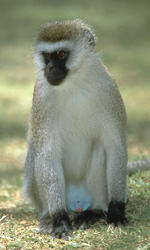
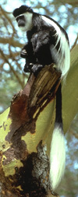
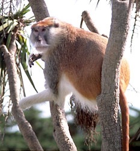

---
aliases:
  - Cercopithecidae
title: Cercopithecidae
---

# [[Cercopithecidae]]

## Old World monkeys 

  )   

## #has_/text_of_/abstract 

> Old World monkeys are primates in the family **Cercopithecidae**. Twenty-four genera and 138 species are recognized, making it the largest primate family. Old World monkey genera include baboons (genus Papio), red colobus (genus Piliocolobus), and macaques (genus Macaca). Common names for other Old World monkeys include the talapoin, guenon, colobus, douc (douc langur, genus Pygathrix), vervet, gelada, mangabey (a group of genera), langur, mandrill, drill, surili (Presbytis), patas, and proboscis monkey.
>
> Phylogenetically, they are more closely related to apes than to New World monkeys, with the Old World monkeys and apes diverging from a common ancestor between 25 million and 30 million years ago. This clade, containing  the Old World monkeys and the apes, diverged from a common ancestor with the New World monkeys around 45 to 55 million years ago. The individual species of Old World monkey are more closely related to each other than to apes or any other grouping, with a common ancestor around 14 million years ago.
>
> The smallest Old World monkey is the talapoin, with a head and body 34–37 centimetres (13–15 in) in length, and weighing between 0.7 and 1.3 kilograms (1.5 and 2.9 lb). The largest is the male mandrill,  around 70 centimetres (28 in) in length, and weighing up to 50 kilograms (110 lb) Old World monkeys have a variety of facial features; some have snouts, some are flat-nosed, and many exhibit coloration. Most have tails, but they are not prehensile.
>
> Old World monkeys are native to Africa and Asia today, inhabiting numerous environments: tropical rain forests,  savannas, shrublands, and mountainous terrain. They inhabited much of Europe in the past; today, the only survivors in Europe are the Barbary macaques of Gibraltar. Whether they were native to Gibraltar or were brought by humans is unknown.
>
> Some Old World monkeys are arboreal, such as the colobus monkeys; others are terrestrial, such as the baboons. Most are at least partially omnivorous, but all prefer plant matter, which forms the bulk of their diets. Most are highly opportunistic, primarily eating fruit, but also consuming almost any food item available, such as flowers, leaves, bulbs and rhizomes, insects, snails, small mammals, and garbage and handouts from humans.
>
> [Wikipedia](https://en.wikipedia.org/wiki/Old%20World%20monkey) 

## Phylogeny 

-   « Ancestral Groups  
    -  [Catarrhini](../Catarrhini.md) 
    -  [Primates](../../Primates.md) 
    -  [Eutheria](../../../Eutheria.md) 
    -  [Mammal](../../../../Mammal.md) 
    -   [Therapsida](../../../../../Therapsida.md)
    -   [Synapsida](../../../../../../Synapsida.md)
    -   [Amniota](../../../../../../../Amniota.md)
    -   [Terrestrial Vertebrates](../../../../../../../../Terrestrial.md)
    -   [Sarcopterygii](../../../../../../../../../Sarc.md)
    -   [Gnathostomata](../../../../../../../../../../Gnath.md)
    -   [Vertebrata](../../../../../../../../../../../Vertebrata.md)
    -   [Craniata](../../../../../../../../../../../../Craniata.md)
    -   [Chordata](../../../../../../../../../../../../../Chordata.md)
    -   [Deuterostomia](../../../../../../../../../../../../../../Deutero.md)
    -  [Bilateria](../../../../../../../../../../../../../../../Bilateria.md) 
    -  [Animals](../../../../../../../../../../../../../../../../Animals.md) 
    -  [Eukarya](../../../../../../../../../../../../../../../../../Eukarya.md) 
    -   [Tree of Life](../../../../../../../../../../../../../../../../../Tree_of_Life.md)

-   ◊ Sibling Groups of  Catarrhini
    -   Cercopithecidae
    -   [Hominidae](Hominidae.md)
    -   [Gibbon](Gibbon.md)

-   » Sub-Groups 

### Information on the Internet

-   [Bioko Primate Protection Program (BiokoPR)](http://www.bioko.org/)
-   [The Douc Langur     Project](http://www-rohan.sdsu.edu/faculty/lippold1/)
-   [Cercopithecidae](http://animaldiversity.ummz.umich.edu/chordata/mammalia/primates/cercopithecidae.html).
    The University of Michigan Museum of Zoology Animal Diversity Web.
-   [Spook Skelton\'s Baboon     Gallery](http://sailfish.exis.net/%7Espook/bab.html)

## Title Illustrations

------------------------------------------------------------------------------ 
 
scientific_name ::  Cercopithecus aethiops
location ::        Tanzania
Comments          Vervet monkey
copyright ::         © 1999 [Greg and Marybeth Dimijian](http://www.dimijianimages.com/) 

------------------------------------------------------------------------------ 
 
scientific_name ::  Colobus
location ::        Lake Naivasha, Kenya
Comments          in yellow fever tree
copyright ::         © 1999 [Greg and Marybeth Dimijian](http://www.dimijianimages.com/) 

------------------------------------------------------------------------------ 
 
scientific_name ::     Erythrocebus patas
Comments             Patas monkey, red guenon
Creator              H. Vannoy Davis
specimen_condition ::  Live Specimen
Source Collection    [CalPhotos](http://calphotos.berkeley.edu/)
copyright ::            © 2001 [California Academy of Sciences](http://www.calacademy.org/) 

## Confidential Links & Embeds: 

### #is_/same_as :: [[/_Standards/bio/bio~Domain/Eukarya/Animal/Bilateria/Deutero/Chordata/Craniata/Vertebrata/Gnath/Sarc/Tetrapods/Amniota/Synapsida/Therapsida/Mammal/Eutheria/Primates/Catarrhini/Cercopithecidae|Cercopithecidae]] 

### #is_/same_as :: [[/_public/bio/bio~Domain/Eukarya/Animal/Bilateria/Deutero/Chordata/Craniata/Vertebrata/Gnath/Sarc/Tetrapods/Amniota/Synapsida/Therapsida/Mammal/Eutheria/Primates/Catarrhini/Cercopithecidae.public|Cercopithecidae.public]] 

### #is_/same_as :: [[/_internal/bio/bio~Domain/Eukarya/Animal/Bilateria/Deutero/Chordata/Craniata/Vertebrata/Gnath/Sarc/Tetrapods/Amniota/Synapsida/Therapsida/Mammal/Eutheria/Primates/Catarrhini/Cercopithecidae.internal|Cercopithecidae.internal]] 

### #is_/same_as :: [[/_protect/bio/bio~Domain/Eukarya/Animal/Bilateria/Deutero/Chordata/Craniata/Vertebrata/Gnath/Sarc/Tetrapods/Amniota/Synapsida/Therapsida/Mammal/Eutheria/Primates/Catarrhini/Cercopithecidae.protect|Cercopithecidae.protect]] 

### #is_/same_as :: [[/_private/bio/bio~Domain/Eukarya/Animal/Bilateria/Deutero/Chordata/Craniata/Vertebrata/Gnath/Sarc/Tetrapods/Amniota/Synapsida/Therapsida/Mammal/Eutheria/Primates/Catarrhini/Cercopithecidae.private|Cercopithecidae.private]] 

### #is_/same_as :: [[/_personal/bio/bio~Domain/Eukarya/Animal/Bilateria/Deutero/Chordata/Craniata/Vertebrata/Gnath/Sarc/Tetrapods/Amniota/Synapsida/Therapsida/Mammal/Eutheria/Primates/Catarrhini/Cercopithecidae.personal|Cercopithecidae.personal]] 

### #is_/same_as :: [[/_secret/bio/bio~Domain/Eukarya/Animal/Bilateria/Deutero/Chordata/Craniata/Vertebrata/Gnath/Sarc/Tetrapods/Amniota/Synapsida/Therapsida/Mammal/Eutheria/Primates/Catarrhini/Cercopithecidae.secret|Cercopithecidae.secret]] 

