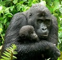
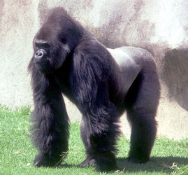

---
aliases:
  - Gorilla
title: Gorilla
---

# [[Gorilla]] 
)

## #has_/text_of_/abstract 

> **Gorilla**s are primarily herbivorous, terrestrial great apes that inhabit the tropical forests of equatorial Africa. The genus Gorilla is divided into two species: the eastern gorilla and the western gorilla, and either four or five subspecies. The DNA of gorillas is highly similar to that of humans, from 96 to 99% depending on what is included, and they are the next closest living relatives to humans after the chimpanzees.
>
> Gorillas are the largest living primates, reaching heights between 1.25 and 1.8 m (4 ft 1 in and 5 ft 11 in), weights between 100 and 270 kg (220 and 600 lb), and arm spans up to 2.6 m (8 ft 6 in), depending on species and sex. They tend to live in troops, with the leader being called a silverback. The eastern gorilla is distinguished from the western by darker fur colour and some other minor morphological differences. Gorillas tend to live 35–40 years in the wild.
>
> Gorillas' natural habitats cover tropical or subtropical forest in Sub-Saharan Africa. Although their range covers a small percentage of Sub-Saharan Africa, gorillas cover a wide range of elevations. The mountain gorilla inhabits the Albertine Rift montane cloud forests of the Virunga Volcanoes, ranging in altitude from 2,200 to 4,300 m (7,200 to 14,100 ft). Lowland gorillas live in dense forests and lowland swamps and marshes as low as sea level, with western lowland gorillas living in Central West African countries and eastern lowland gorillas living in the Democratic Republic of the Congo near its border with Rwanda.
>
> There are thought to be around 316,000 western gorillas in the wild, and 5,000 eastern gorillas. Both species are classified as Critically Endangered by the IUCN; all subspecies are classified as Critically Endangered with the exception of the mountain gorilla, which is classified as Endangered. There are many threats to their survival, such as poaching, habitat destruction, and disease, which threaten the survival of the species. However, conservation efforts have been successful in some areas where they live.
>
> [Wikipedia](https://en.wikipedia.org/wiki/Gorilla)

## Phylogeny 

-   « Ancestral Groups  
    -  [Hominidae](../Hominidae.md))
    -  [Catarrhini](../../Catarrhini.md))
    -  [Primates](../../../Primates.md))
    -  [Eutheria](../../../../Eutheria.md))
    -  [Mammal](../../../../../Mammal.md))
    -   [Therapsida](../../../../../../Therapsida.md)
    -   [Synapsida](../../../../../../../Synapsida.md)
    -   [Amniota](../../../../../../../../Amniota.md)
    -   [Terrestrial Vertebrates](../../../../../../../../../Terrestrial.md)
    -   [Sarcopterygii](../../../../../../../../../../Sarc.md)
    -   [Gnathostomata](../../../../../../../../../../../Gnath.md)
    -   [Vertebrata](../../../../../../../../../../../../Vertebrata.md)
    -   [Craniata](../../../../../../../../../../../../../Craniata.md)
    -   [Chordata](../../../../../../../../../../../../../../Chordata.md)
    -   [Deuterostomia](../../../../../../../../../../../../../../../Deutero.md)
    -  [Bilateria](../../../../../../../../../../../../../../../../Bilateria.md))
    -  [Animals](../../../../../../../../../../../../../../../../../Animals.md))
    -  [Eukarya](../../../../../../../../../../../../../../../../../../Eukarya.md))
    -   [Tree of Life](../../../../../../../../../../../../../../../../../../Tree_of_Life.md)

-   ◊ Sibling Groups of  Hominidae
    -   [Orangutan](Orangutan.md)
    -   [Pan(Genus)](Pan(Genus).md)
    -   [Homo](Homo.md)
    -   Gorilla

-   » Sub-Groups 

	-   *Gorilla beringei*
	-   *Gorilla gorilla*

### Information on the Internet

-   [Gorillas](http://www.gorilla.org/). The Gorilla Foundation.
-   [The Mountain Gorilla Protection     Project](http://www.informatics.org/gorilla/). A project assembling
    a digitized database of the mountain gorilla habitat.

## Title Illustrations

)

  ----------------------------------------------------------------
  Scientific Name ::     Gorilla beringei graueri
  Location ::           Eastern DR Congo
  Specimen Condition   Live Specimen
  Life Cycle Stage ::     juvenile and adult
  Source               [mother and child closer](http://www.flickr.com/photos/fredr/370629527/)
  Source Collection    [Flickr](http://flickr.com/)
  Image Use ::    [Attribution-NonCommercial-NoDerivs 2.0 Creative Commons License](http://creativecommons.org/licenses/by-nc-nd/2.0/).
  Copyright ::            © 2007 [Fred](http://flickr.com/people/51928542@N00)
  ----------------------------------------------------------------
)

  -------------------------------------------------------------------------
  Scientific Name ::     Gorilla gorilla
  Location ::           Los Angeles Zoo
  Specimen Condition   Live Specimen
  Identified By        LA Zoo
  Behavior             standing
  Sex ::                Male
  Life Cycle Stage ::     Adult
  Body Part            whole
  Copyright ::            © 2006 [David Bygott](mailto:davidbygott@yahoo.com) 
  -------------------------------------------------------------------------

## Confidential Links & Embeds: 

### #is_/same_as :: [Gorilla](/_Standards/bio/bio~Domain/Eukarya/Animal/Bilateria/Deutero/Chordata/Craniata/Vertebrata/Gnath/Sarc/Tetrapods/Amniota/Synapsida/Therapsida/Mammal/Eutheria/Primates/Catarrhini/Hominidae/Gorilla.md) 

### #is_/same_as :: [Gorilla.public](/_public/bio/bio~Domain/Eukarya/Animal/Bilateria/Deutero/Chordata/Craniata/Vertebrata/Gnath/Sarc/Tetrapods/Amniota/Synapsida/Therapsida/Mammal/Eutheria/Primates/Catarrhini/Hominidae/Gorilla.public.md) 

### #is_/same_as :: [Gorilla.internal](/_internal/bio/bio~Domain/Eukarya/Animal/Bilateria/Deutero/Chordata/Craniata/Vertebrata/Gnath/Sarc/Tetrapods/Amniota/Synapsida/Therapsida/Mammal/Eutheria/Primates/Catarrhini/Hominidae/Gorilla.internal.md) 

### #is_/same_as :: [Gorilla.protect](/_protect/bio/bio~Domain/Eukarya/Animal/Bilateria/Deutero/Chordata/Craniata/Vertebrata/Gnath/Sarc/Tetrapods/Amniota/Synapsida/Therapsida/Mammal/Eutheria/Primates/Catarrhini/Hominidae/Gorilla.protect.md) 

### #is_/same_as :: [Gorilla.private](/_private/bio/bio~Domain/Eukarya/Animal/Bilateria/Deutero/Chordata/Craniata/Vertebrata/Gnath/Sarc/Tetrapods/Amniota/Synapsida/Therapsida/Mammal/Eutheria/Primates/Catarrhini/Hominidae/Gorilla.private.md) 

### #is_/same_as :: [Gorilla.personal](/_personal/bio/bio~Domain/Eukarya/Animal/Bilateria/Deutero/Chordata/Craniata/Vertebrata/Gnath/Sarc/Tetrapods/Amniota/Synapsida/Therapsida/Mammal/Eutheria/Primates/Catarrhini/Hominidae/Gorilla.personal.md) 

### #is_/same_as :: [Gorilla.secret](/_secret/bio/bio~Domain/Eukarya/Animal/Bilateria/Deutero/Chordata/Craniata/Vertebrata/Gnath/Sarc/Tetrapods/Amniota/Synapsida/Therapsida/Mammal/Eutheria/Primates/Catarrhini/Hominidae/Gorilla.secret.md)

