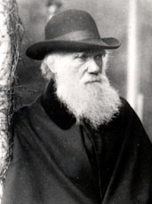
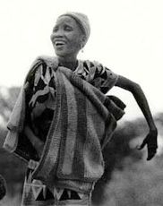

---
aliases:
- abantu
- adam
- afgan
- alak
- ame
- a̱tyubishyi
- binadamu
- biniaadan
- bniedem
- bod dynol
- bodie
- caucau
- cilvēks
- cylvāks
- czowiek
- człowiek
- cłowjek
- den
- diné
- djin
- duine
- ember
- esser human
- gbɔmɔ
- gbɛtɔ
- gbẹtọ
- gizaki
- hende
- home
- homo
- Homo sapiens
- Homo_sapiens
- human
- humano
- humanu
- ihminen
- Ikiremwa muntu
- inemine
- inimene
- insaan
- insan
- inson
- jan
- jaqi
- k'oçi
- kam
- keşe
- lo remna
- lâng
- mann
- Manossa
- manungsa
- manusa
- manush
- Manusia
- manusia'
- maður
- men
- menneske
- menniskja
- mens
- Mensch
- mense
- Mensia
- merdım
- mins
- Minsch
- minsk
- minske
- mirov
- mmádu
- moanske
- modern humans
- moto
- moun
- mounité
- munhu
- munthu
- muntu
- mutum
- människa
- Mänsch
- Mënsch
- mɔgɔ
- Nama
- neach
- neda
- nehirowisiw
- nensaala
- nera
- ngìn-lui
- người
- ninsaal
- ninsala
- njeri
- nnipa
- nè̤ng
- nɩŋsaalaa
- odam
- olmmoš
- olmooš
- olombelona
- om
- omp
- omu
- omuntu
- ooumaž
- pesin
- porsona
- raan
- ristikanzu
- ristit
- runa
- salan
- ser humano
- squliq
- tademaw
- tao
- tau
- tawo
- tawu
- tlācatl
- tokoh
- tus
- tāngata
- uman
- umana
- umane
- umano
- umuntu
- urang
- vanhu
- vesser uman
- vunz
- yuuman
- yvypóra
- èsar uman
- èsser uman
- èssiri umanu
- ésser humà
- être humain
- ëse uman
- òm
- človek
- člověk
- čovek
- čovjek
- čłowjek
- žmogus
- žmuogos
- ɓii aadama
- άνθρωπος
- адæймаг
- адам
- адями
- айдеме
- инсан
- инсон
- кас
- кеше
- киhи
- ломанць
- ломань
- людина
- морт
- саг
- тăнлă çын
- ухаанта хүн
- хүн
- цӏыф
- чалавек
- человек
- чи
- чловѣкъ
- човек
- чоловік
- մարդ
- אדם
- מענטש
- آدم
- إنسان
- ئادەم
- انسان
- اِنسان
- اینسان
- بشر
- بنادم
- عبد
- ماءنسي
- مرۆڤ
- ينسان
- ܒܪ ܐܢܫܐ
- ߡߐ߱
- मनई
- मनुष्य
- मनुष्यः
- मनुस्सो
- मनू
- मानव
- मानिस
- मान्सु
- लोक
- মানুষ
- মানুহ
- ਮਨੁੱਖ
- મનુષ્ય
- ମଣିଷ
- மனிதர்
- మానవుడు
- ಮಾನವ
- ಮಾನವೆ
- മനുഷ്യൻ
- මිනිසා
- มนุษย์
- ຜູ້ຄົນ
- འགྲོ་བ་མི།
- လူ
- ადამიანი
- ადამიერი
- ሰብ
- ኣዳም
- የሰው ልጅ
- ᏴᏫ
- ᐄᒃ
- មនុស្ស
- ᨑᨘᨄᨈᨕᨘ
- ᱢᱟᱹᱱᱢᱤ
- ọmọnìyàn
- ἄνθρωπος
- ⴰⴼⴳⴰⵏ
- ヒト
- 人
- 人类
- 人類
- ꠝꠣꠘꠥ
- ꯃꯤꯑꯣꯏꯕ
- 사람
- "\U000110A7\U000110A2\U000110B3\U000110AD\U000110B9\U000110A8"
title: Homo sapiens
has_id_wikidata: Q5
dv_has_:
  name_:
    ace: tokoh
    acm: بشر
    ady: цӏыф
    aeb-arab: عبد
    af: mens
    am: የሰው ልጅ
    an: Homo sapiens
    ang: mann
    anp: मनुष्य
    apc: إنسان
    ar: إنسان
    arc: ܒܪ ܐܢܫܐ
    arq: بنادم
    ary: بنادم
    arz: انسان
    as: মানুহ
    ast: humanu
    atj: nehirowisiw
    av: чи
    awa: मनई
    ay: jaqi
    az: insan
    azb: اینسان
    ba: кеше
    ban: manusa
    bar: Mensch
    bcl: tao
    bdr: manusia'
    be: чалавек
    be-tarask: чалавек
    bew: manusia
    bg: човек
    bho: "\U000110A7\U000110A2\U000110B3\U000110AD\U000110B9\U000110A8"
    bjn: manusia
    bm: mɔgɔ
    bn: মানুষ
    bo: འགྲོ་བ་མི།
    br: den
    bs: čovjek
    btm: alak
    bug: ᨑᨘᨄᨈᨕᨘ
    bxr: ухаанта хүн
    ca: ésser humà
    cdo: nè̤ng
    ce: адам
    ceb: tawo
    chr: ᏴᏫ
    ckb: مرۆڤ
    co: omu
    crh: insan
    cs: člověk
    csb: człowiek
    cu: чловѣкъ
    cv: тăнлă çын
    cy: bod dynol
    da: menneske
    dag: ninsala
    de: Mensch
    dga: nensaala
    din: raan
    diq: merdım
    dsb: cłowjek
    dty: मान्सु
    ee: ame
    el: άνθρωπος
    en: human
    en-ca: human
    en-gb: human
    en-us: human
    eo: homo
    es: ser humano
    et: inimene
    eu: gizaki
    ext: Homo sapiens
    fa: انسان
    ff: ɓii aadama
    fi: ihminen
    fo: menniskja
    fon: gbɛtɔ
    fr: être humain
    frp: Homo sapiens
    frr: minsk
    fur: omp
    fy: minske
    ga: duine
    gaa: gbɔmɔ
    gan: 人
    gcr: mounité
    gd: neach
    gl: ser humano
    glk: آدم
    gn: yvypóra
    gpe: human
    grc: ἄνθρωπος
    gsw: Mänsch
    gu: મનુષ્ય
    gur: nera
    guw: gbẹtọ
    ha: mutum
    hak: ngìn-lui
    he: אדם
    hi: मनुष्य
    hif: insaan
    hr: čovjek
    hsb: čłowjek
    ht: moun
    hu: ember
    hy: մարդ
    ia: esser human
    iba: Mensia
    id: manusia
    ig: mmádu
    ilo: tao
    inh: саг
    io: homo
    is: maður
    it: umano
    iu: ᐄᒃ
    ja: ヒト
    jam: yuuman
    jbo: lo remna
    jv: manungsa
    ka: ადამიანი
    kaa: adam
    kab: afgan
    kcg: a̱tyubishyi
    kg: muntu
    kge: Manusia
    kk: адам
    kk-cyrl: адам
    km: មនុស្ស
    kn: ಮಾನವ
    knc: kam
    ko: 사람
    koi: морт
    krj: tawu
    ks: اِنسان
    ksh: Minsch
    ku: mirov
    ku-latn: mirov
    kus: ninsaal
    kv: морт
    kw: tus
    ky: адам
    la: homo
    lb: Mënsch
    lbe: инсан
    lez: кас
    lfn: umana
    lg: omuntu
    li: mins
    lij: ëse uman
    lld: porsona
    lmo: vesser uman
    ln: moto
    lo: ຜູ້ຄົນ
    lt: žmogus
    ltg: cylvāks
    lv: cilvēks
    lzh: 人
    lzz: k'oçi
    mad: Manossa
    mai: लोक
    map-bms: tokoh
    mdf: ломанць
    mg: olombelona
    mhr: айдеме
    mi: tāngata
    min: urang
    mk: човек
    ml: മനുഷ്യൻ
    mn: хүн
    mni: ꯃꯤꯑꯣꯏꯕ
    mos: neda
    mr: मानव
    ms: manusia
    ms-arab: ماءنسي
    mt: bniedem
    mwl: Homo sapiens
    my: လူ
    myv: ломань
    mzn: آدم
    nah: tlācatl
    nan: lâng
    nan-hani: 人
    nap: umane
    nb: menneske
    nds: Minsch
    nds-nl: mense
    ne: मानिस
    new: मनू
    nl: mens
    nn: menneske
    nov: home
    nqo: ߡߐ߱
    nv: diné
    oc: èsser uman
    olo: ristikanzu
    om: Nama
    or: ମଣିଷ
    os: адæймаг
    ota: ينسان
    pa: ਮਨੁੱਖ
    pam: tau
    pap: hende
    pcm: pesin
    pfl: Mensch
    pi: मनुस्सो
    pih: salan
    pl: człowiek
    pms: òm
    pnb: انسان
    pnt: άνθρωπος
    ps: انسان
    pt: humano
    pt-br: ser humano
    pwn: caucau
    qu: runa
    rm: uman
    rmy: manush
    rn: Ikiremwa muntu
    ro: om
    ru: человек
    rue: чоловік
    rup: omu
    ryu: ヒト
    sa: मनुष्यः
    sah: киhи
    sat: ᱢᱟᱹᱱᱢᱤ
    scn: èssiri umanu
    sco: bodie
    sd: انسان
    se: olmmoš
    sgs: žmuogos
    sh: čovjek
    shi: afgan
    si: මිනිසා
    sk: človek
    sl: človek
    smn: olmooš
    sms: ooumaž
    sn: munhu
    so: biniaadan
    sq: njeri
    sr: човек
    sr-ec: човек
    sr-el: čovek
    stq: moanske
    su: manusa
    sv: människa
    sw: binadamu
    syl: ꠝꠣꠘꠥ
    szl: czowiek
    szy: tademaw
    ta: மனிதர்
    tay: squliq
    tcy: ಮಾನವೆ
    te: మానవుడు
    tg: инсон
    tg-cyrl: инсон
    tg-latn: inson
    th: มนุษย์
    ti: ሰብ
    tig: ኣዳም
    tk: adam
    tl: tao
    tly: inson
    tok: jan
    tr: insan
    ts: vanhu
    tt: кеше
    tt-cyrl: кеше
    tt-latn: keşe
    tum: munthu
    tw: nnipa
    udm: адями
    ug: ئادەم
    uk: людина
    ur: انسان
    uz: odam
    vec: èsar uman
    vep: ristit
    vi: người
    vls: mens
    vo: men
    vro: inemine
    wa: djin
    war: tawo
    wlx: nɩŋsaalaa
    wuu: 人
    xh: abantu
    xmf: ადამიერი
    yi: מענטש
    yo: ọmọnìyàn
    yue: 人
    za: vunz
    zgh: ⴰⴼⴳⴰⵏ
    zh: 人類
    zh-cn: 人类
    zh-hans: 人类
    zh-hant: 人類
    zh-hk: 人類
    zh-mo: 人類
    zh-my: 人类
    zh-sg: 人类
    zh-tw: 人類
    zu: umuntu
---
#is_/instance_of :: [[../../../../../../../../../../../../../../../../../bio~Domain/Eukarya/Animal/Bilateria/bio~Class/bio~Order/bio~Family/bio~Genus/bio~Species|bio~Species]] 

# [[Homo_sapiens]] 

## Modern humans 

      

## #has_/text_of_/abstract 

> Humans (**Homo sapiens**) or modern humans are the most common and 
> widespread species of primate, and the last surviving species of the genus Homo. 
> 
> They are great apes characterized by their hairlessness, bipedalism, and high intelligence. 
> 
> Humans have large brains, enabling more advanced cognitive skills 
> that facilitate successful adaptation to varied environments, 
> development of sophisticated tools, 
> and formation of complex social structures and civilizations. 
>
> Humans are highly social, with individual humans tending to 
> belong to a multi-layered network of distinct social groups — 
> from families and peer groups to corporations and political states. 
> 
> As such, social interactions between humans have established a wide variety of values, social norms, languages, and traditions (collectively termed institutions), each of which bolsters human society. Humans are also highly curious: the desire to understand and influence phenomena has motivated humanity's development of science, technology, philosophy, mythology, religion, and other frameworks of knowledge; humans also study themselves through such domains as anthropology, social science, history, psychology, and medicine. As of 2025, there are estimated to be more than 8 billion living humans.
>
> For most of their history, humans were nomadic hunter-gatherers. Humans began exhibiting behavioral modernity about 160,000–60,000 years ago. The Neolithic Revolution occurred independently in multiple locations, the earliest in Southwest Asia 13,000 years ago, and saw the emergence of agriculture and permanent human settlement; in turn, this led to the development of civilization and kickstarted a period of continuous (and ongoing) population growth and rapid technological change. Since then, a number of civilizations have risen and fallen, while a number of sociocultural and technological developments have resulted in significant changes to the human lifestyle. 
>
> Humans are omnivorous, capable of consuming a wide variety of plant and animal material, and have used fire and other forms of heat to prepare and cook food since the time of Homo erectus. Humans are generally diurnal, sleeping on average seven to nine hours per day. Humans have had a dramatic effect on the environment. They are apex predators, being rarely preyed upon by other species. Human population growth, industrialization, land development, overconsumption and combustion of fossil fuels have led to environmental destruction and pollution that significantly contributes to the ongoing mass extinction of other forms of life. Within the last century, humans have explored challenging environments such as Antarctica, the deep sea, and outer space, though human habitation in these environments is typically limited in duration and restricted to scientific, military, or industrial expeditions. Humans have visited the Moon and sent human-made spacecraft to other celestial bodies, becoming the first known species to do so.
>
> Although the term "humans" technically equates with all members of the genus Homo, in common usage it generally refers to Homo sapiens, the only extant member. All other members of the genus Homo, which are now extinct, are known as archaic humans, and the term "modern human" is used to distinguish Homo sapiens from archaic humans. Anatomically modern humans emerged around 300,000 years ago in Africa, evolving from Homo heidelbergensis or a similar species. Migrating out of Africa, they gradually replaced and interbred with local populations of archaic humans. Multiple hypotheses for the extinction of archaic human species such as Neanderthals include competition, violence, interbreeding with Homo sapiens, or inability to adapt to climate change. Genes and the environment influence human biological variation in visible characteristics, physiology, disease susceptibility, mental abilities, body size, and life span. Though humans vary in many traits (such as genetic predispositions and physical features), humans are among the least genetically diverse primates. Any two humans are at least 99% genetically similar.
>
> Humans are sexually dimorphic: generally, males have greater body strength and females have a higher body fat percentage. At puberty, humans develop secondary sex characteristics. Females are capable of pregnancy, usually between puberty, at around 12 years old, and menopause, around the age of 50. Childbirth is dangerous, with a high risk of complications and death. Often, both the mother and the father provide care for their children, who are helpless at birth.
>
> [Wikipedia](https://en.wikipedia.org/wiki/Human) 

## Phylogeny 

-   « Ancestral Groups  in ascending Order 
    -  [Homo](../Homo.md) 
    -  [Hominidae](../../Hominidae.md) 
    -  [Catarrhini](../../../Catarrhini.md) 
    -  [Primates](../../../../Primates.md) 
    -  [Eutheria](../../../../../Eutheria.md) 
    -  [Mammal](../../../../../../Mammal.md) 
    -   [Therapsida](../../../../../../../Therapsida.md)
    -   [Synapsida](../../../../../../../../Synapsida.md)
    -   [Amniota](../../../../../../../../../Amniota.md)
    -   [Terrestrial Vertebrates](../../../../../../../../../../Terrestrial.md)
    -   [Sarcopterygii](../../../../../../../../../../../Sarc.md)
    -   [Gnathostomata](../../../../../../../../../../../../Gnath.md)
    -   [Vertebrata](../../../../../../../../../../../../../Vertebrata.md)
    -   [Craniata](../../../../../../../../../../../../../../Craniata.md)
    -   [Chordata](../../../../../../../../../../../../../../../Chordata.md)
    -   [Deuterostomia](../../../../../../../../../../../../../../../../Deutero.md)
    -  [Bilateria](../../../../../../../../../../../../../../../../../Bilateria.md) 
    -  [Animals](../../../../../../../../../../../../../../../../../../Animals.md) 
    -  [Eukarya](../../../../../../../../../../../../../../../../../../../Eukarya.md) 
    -   [Tree of Life](../../../../../../../../../../../../../../../../../../../Tree_of_Life.md)

-   ◊ No Sibling Groups of  Homo

-   » No Sub-Groups of Homo 

## Title Illustrations

 

  ------------------------------------------
  scientific_name ::   Homo sapiens
  location ::         England
  Comments           A European male. Charles Darwin at age 72 on the veranda at Down.
  Creator            Photograph by J. Kirschner
  Acknowledgements   Courtesy Department of Library Services [American Museum of Natural History](http://www.amnh.org/) (Neg. No. 105168).
  ------------------------------------------
 

  --------------------------
  scientific_name ::   Homo sapiens
  location ::         Xishuangbana, Yunnan Province, China
  Comments           Children of the Dai minority in a schoolyard
  Sex ::              Female
  Life Cycle Stage ::   children
  copyright ::          © 1993 [Ethan Michelson](http://www.indiana.edu/%7Eemsoc/index.html)
  --------------------------
 

  ----------------------
  scientific_name ::  Homo sapiens
  location ::        Botswana
  Comments          Woman of the !Kung bushmen
  copyright ::         © 1997 [Rodney Barnett](http://www.arts-net.com/barnett/)
  ----------------------

## Confidential Links & Embeds: 

### #is_/same_as :: [[/_Standards/bio/bio~Domain/Eukarya/Animal/Bilateria/Deutero/Chordata/Craniata/Vertebrata/Gnath/Sarc/Tetrapods/Amniota/Synapsida/Therapsida/Mammal/Eutheria/Primates/Catarrhini/Hominidae/Homo/Homo_sapiens|Homo_sapiens]] 

### #is_/same_as :: [[/_public/bio/bio~Domain/Eukarya/Animal/Bilateria/Deutero/Chordata/Craniata/Vertebrata/Gnath/Sarc/Tetrapods/Amniota/Synapsida/Therapsida/Mammal/Eutheria/Primates/Catarrhini/Hominidae/Homo/Homo_sapiens.public|Homo_sapiens.public]] 

### #is_/same_as :: [[/_internal/bio/bio~Domain/Eukarya/Animal/Bilateria/Deutero/Chordata/Craniata/Vertebrata/Gnath/Sarc/Tetrapods/Amniota/Synapsida/Therapsida/Mammal/Eutheria/Primates/Catarrhini/Hominidae/Homo/Homo_sapiens.internal|Homo_sapiens.internal]] 

### #is_/same_as :: [[/_protect/bio/bio~Domain/Eukarya/Animal/Bilateria/Deutero/Chordata/Craniata/Vertebrata/Gnath/Sarc/Tetrapods/Amniota/Synapsida/Therapsida/Mammal/Eutheria/Primates/Catarrhini/Hominidae/Homo/Homo_sapiens.protect|Homo_sapiens.protect]] 

### #is_/same_as :: [[/_private/bio/bio~Domain/Eukarya/Animal/Bilateria/Deutero/Chordata/Craniata/Vertebrata/Gnath/Sarc/Tetrapods/Amniota/Synapsida/Therapsida/Mammal/Eutheria/Primates/Catarrhini/Hominidae/Homo/Homo_sapiens.private|Homo_sapiens.private]] 

### #is_/same_as :: [[/_personal/bio/bio~Domain/Eukarya/Animal/Bilateria/Deutero/Chordata/Craniata/Vertebrata/Gnath/Sarc/Tetrapods/Amniota/Synapsida/Therapsida/Mammal/Eutheria/Primates/Catarrhini/Hominidae/Homo/Homo_sapiens.personal|Homo_sapiens.personal]] 

### #is_/same_as :: [[/_secret/bio/bio~Domain/Eukarya/Animal/Bilateria/Deutero/Chordata/Craniata/Vertebrata/Gnath/Sarc/Tetrapods/Amniota/Synapsida/Therapsida/Mammal/Eutheria/Primates/Catarrhini/Hominidae/Homo/Homo_sapiens.secret|Homo_sapiens.secret]] 

