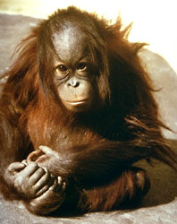

---
aliases:
- Bârângodhân
- I-orengithengi
- Ka'iporo
- kogiu
- Mágí diʼilí
- Nəsnas
- Orang Utan
- Orang-oetang
- orang-oetans
- Orang-Utan
- Orang-Utanen
- Orang-Utans
- orangit
- Orangotan
- Orangotango
- Orangotàna
- Orangoutan
- Orangutan
- Orangutanai
- Orangutang
- Orangutanger
- Orangutangur
- Orangutani
- Orangutanlar
- Orangutano
- Orangutanu
- Orangutanët
- Orangután
- orangután de Bornéu
- Orangutāni
- oraŋŋ
- parboleem
- Pongo
- Pongo pygmaeus
- Rangutango
- Uorangutůn
- Uranghutan
- Urangutan
- Âng-seng-seng
- órang-útan
- Órangútan
- Đười ươi
- Ουρακοτάγκος
- арангутан
- Арангутаны
- орангутан
- Орангутандар
- орангутани
- Орангутантæ
- орангутаны
- օրանգուտան
- אורנגאוטן
- إنسان الغاب
- انسان الغاب
- اورانگوتان
- اورنګوتان
- اورینگوٹان
- ओरंगउटान
- वनमानुष
- वनमान्छे
- ওৰাঙোটাং
- বনমানুষ
- ஓராங் ஊத்தான்
- ఒరంగుటాన్
- ಒರಾಂಗೂಟಾನ್
- ഒറാങ്ങ്ഉട്ടാൻ
- อุรังอุตัง
- སྤྲ།
- လူဝံ
- ორანგუტანი
- ᠰᡳᡵᠰᡳᠩ
- オランウータン
- 猩猩属
- 猩猩屬
- 紅毛猩猩
- 오랑우탄
has_id_wikidata: Q41050
title: Pongo
different_from: '[[_Standards/WikiData/WD~Pongo,403861]]'
has_part_s_: '[[_Standards/WikiData/WD~Sumatran_orangutan,543424]]'
described_by_source:
- '[[../../../../../../../../../../../../../../../../../../../../WikiData/WD~Brockhaus_and_Efron_Encyclopedic_Dictionary,602358]]'
- '[[_Standards/WikiData/WD~Encyclopædia_Britannica_11th_edition,867541]]'
- '[[_Standards/WikiData/WD~Armenian_Soviet_Encyclopedia,2657718]]'
- '[[_Standards/WikiData/WD~Small_Brockhaus_and_Efron_Encyclopedic_Dictionary,19180675]]'
- '[[_Standards/WikiData/WD~New_Encyclopedic_Dictionary,19190511]]'
- '[[_Standards/WikiData/WD~Meyers_Konversations_Lexikon,_4th_edition_(1885_1890),19219752]]'
parent_taxon: '[[_Standards/WikiData/WD~Pongini,3755098]]'
taxonomic_type: '[[_Standards/WikiData/WD~Pongo_borneo,122832537]]'
main_food_source: '[[_Standards/WikiData/WD~fruit,1364]]'
instance_of: '[[_Standards/WikiData/WD~taxon,16521]]'
taxon_rank: '[[_Standards/WikiData/WD~genus,34740]]'
OmegaWiki_Defined_Meaning: 8111
Commons_gallery: Pongo
Commons_category: Pongo
taxon_name: Pongo
subreddit: orangutan
ITIS_TSN: 572839
image: http://commons.wikimedia.org/wiki/Special:FilePath/Bornean%2C%20Sumatran%20%26%20Tapanuli%20orangs%20%28horizontal%29.jpg
pronunciation_audio: http://commons.wikimedia.org/wiki/Special:FilePath/De-Orang-Utan.ogg
size_comparison_diagram: http://commons.wikimedia.org/wiki/Special:FilePath/Orangutan-human%20comparison.svg
taxon_range_map_image: http://commons.wikimedia.org/wiki/Special:FilePath/Pongo%20distribution.svg
EPPO_Code: 1PONGG
MeSH_tree_code: B01.050.150.900.649.313.988.400.112.400.635
UMLS_CUI: C0178448
taxon_common_name:
- orangután de Bornéu
- orangutan
native_label: orang hutan
dv_has_:
  name_:
    af: Orang-oetang
    an: Pongo
    anp: वनमानुष
    ar: إنسان الغاب
    arz: انسان الغاب
    as: ওৰাঙোটাং
    ast: Orangután de Bornéu
    avk: parboleem
    az: Nəsnas
    ba: Орангутандар
    ban: Orangutan
    bcl: Orangutan
    be: Арангутаны
    be_tarask: арангутан
    bg: орангутани
    bjn: Uranghutan
    bn: বনমানুষ
    bo: སྤྲ།
    br: Orangoutan
    bs: Orangutani
    ca: orangutan
    ceb: Pongo pygmaeus
    cs: orangutan
    cy: Orangutan
    da: Orangutang
    de: Orang-Utans
    dtp: kogiu
    el: Ουρακοτάγκος
    en: Orangutan
    en-us: orangutan
    eo: Orangutano
    es: Pongo
    et: Orangutan
    eu: Pongo
    fa: اورانگوتان
    fi: orangit
    fo: Orangutangur
    fr: Pongo
    frr: Orang-Utans
    ga: órang-útan
    gl: Orangután
    gn: Ka'iporo
    gsw: Orang-Utan
    he: אורנגאוטן
    hi: ओरंगउटान
    hr: Orangutan
    hu: orangután
    hy: օրանգուտան
    ia: Pongo
    id: Orang utan
    io: Orangutano
    is: Órangútan
    it: Pongo
    ja: オランウータン
    jv: Orang utan
    ka: ორანგუტანი
    kk: Орангутандар
    kn: ಒರಾಂಗೂಟಾನ್
    ko: 오랑우탄
    ky: Орангутан
    la: Pongo
    lb: Orang-Utanen
    lbe: Орангутан
    lt: Orangutanai
    lv: Orangutāni
    mad: Bârângodhân
    mg: Orangotàna
    mhr: Орангутан
    mk: орангутан
    ml: ഒറാങ്ങ്ഉട്ടാൻ
    mn: Орангутан
    mnc: ᠰᡳᡵᠰᡳᠩ
    mrj: Орангутан
    ms: orang utan
    mul: Pongo
    my: လူဝံ
    mzn: اورانگوتان
    nan: Âng-seng-seng
    nap: Rangutango
    nb: orangutanger
    ne: वनमान्छे
    nl: orang-oetans
    nv: Mágí diʼilí
    oc: Orangotan
    os: Орангутантæ
    pl: Orangutan
    pnb: اورینگوٹان
    ps: اورنګوتان
    pt: Orangotango
    qu: Orangutan
    ro: Urangutan
    ru: орангутаны
    sah: Орангутан
    scn: Pongo
    sco: orangutan
    sh: Orangutan
    sk: Orangutan
    sl: orangutan
    sms: oraŋŋ
    sq: Orangutanët
    sr: орангутан
    su: Orang utan
    sv: Orangutanger
    sw: Orangutanu
    szl: Uorangutůn
    ta: ஓராங் ஊத்தான்
    te: ఒరంగుటాన్
    th: อุรังอุตัง
    tl: Orangutan
    tr: Orangutan
    udm: Орангутан
    uk: Орангутан
    uz: Orangutanlar
    vi: Đười ươi
    war: Pongo pygmaeus
    wuu: 猩猩属
    xmf: ორანგუტანი
    yue: 紅毛猩猩
    zh: 猩猩屬
    zh_cn: 猩猩属
    zh_tw: 猩猩屬
    zu: I-orengithengi
Unicode_character: 🦧
---
# [[Orangutan]] 🦧 

#is_/same_as ::  [[../../../../../../../../../../../../../../../../../../../../WikiData/WD~Orangutan,41050|WD~Orangutan,41050]] 

## #has_/text_of_/abstract 

> **Orangutan**s are great apes native to the rainforests of Indonesia and Malaysia. They are now found only in parts of Borneo and Sumatra, but during the Pleistocene they ranged throughout Southeast Asia and South China. Classified in the genus Pongo, orangutans were originally considered to be one species. In 1996, they were divided into two species: the Bornean orangutan (P. pygmaeus, with three subspecies) and the Sumatran orangutan (P. abelii); a third species, the Tapanuli orangutan (P. tapanuliensis), was identified definitively in 2017. The orangutans are the only surviving members of the subfamily Ponginae, which diverged genetically from the other hominids (gorillas, chimpanzees, and humans) between 19.3 and 15.7 million years ago.
>
> The most arboreal of the great apes, orangutans spend most of their time in trees. They have proportionally long arms and short legs, and have reddish-brown hair covering their bodies. Adult males weigh about 75 kg (165 lb), while females weigh about 37 kg (82 lb). Dominant adult males develop distinctive cheek pads or flanges and make long calls that attract females and intimidate rivals; younger subordinate males do not and more resemble adult females. Orangutans are the most solitary of the great apes: social bonds occur primarily between mothers and their dependent offspring. Fruit is the most important component of an orangutan's diet, but they will also eat vegetation, bark, honey, insects and bird eggs. They can live over 30 years, both in the wild and in captivity.
>
> Orangutans are among the most intelligent primates. They use a variety of sophisticated tools and construct elaborate sleeping nests each night from branches and foliage. The apes' learning abilities have been studied extensively. There may be distinctive cultures within populations. Orangutans have been featured in literature and art since at least the 18th century, particularly in works that comment on human society. Field studies of the apes were pioneered by primatologist Birutė Galdikas and they have been kept in captive facilities around the world since at least the early 19th century.
>
> All three orangutan species are considered critically endangered. Human activities have caused severe declines in populations and ranges. Threats to wild orangutan populations include poaching (for bushmeat and retaliation for consuming crops), habitat destruction and deforestation (for palm oil cultivation and logging), and the illegal pet trade. Several conservation and rehabilitation organisations are dedicated to the survival of orangutans in the wild.
>
> [Wikipedia](https://en.wikipedia.org/wiki/Orangutan) 

## Phylogeny 

-   « Ancestral Groups  
    -  [Hominidae](../Hominidae.md) 
    -  [Catarrhini](../../Catarrhini.md) 
    -  [Primates](../../../Primates.md) 
    -  [Eutheria](../../../../Eutheria.md) 
    -  [Mammal](../../../../../Mammal.md) 
    -   [Therapsida](../../../../../../Therapsida.md)
    -   [Synapsida](../../../../../../../Synapsida.md)
    -   [Amniota](../../../../../../../../Amniota.md)
    -   [Terrestrial Vertebrates](../../../../../../../../../Terrestrial.md)
    -   [Sarcopterygii](../../../../../../../../../../Sarc.md)
    -   [Gnathostomata](../../../../../../../../../../../Gnath.md)
    -   [Vertebrata](../../../../../../../../../../../../Vertebrata.md)
    -   [Craniata](../../../../../../../../../../../../../Craniata.md)
    -   [Chordata](../../../../../../../../../../../../../../Chordata.md)
    -   [Deuterostomia](../../../../../../../../../../../../../../../Deutero.md)
    -  [Bilateria](../../../../../../../../../../../../../../../../Bilateria.md) 
    -  [Animals](../../../../../../../../../../../../../../../../../Animals.md) 
    -  [Eukarya](../../../../../../../../../../../../../../../../../../Eukarya.md) 
    -   [Tree of Life](../../../../../../../../../../../../../../../../../../Tree_of_Life.md)

-   ◊ Sibling Groups of  Hominidae
    -   Pongo
    -   [Pan(Genus)](Pan(Genus).md)
    -   [Homo](Homo.md)
    -   [Gorilla](Gorilla.md)

-   » Sub-Groups 
	-   *Pongo abelii*
	-   *Pongo pygmaeus*
	

### Information on the Internet

-   [The Borneo Orangutan Survival Foundation     (BOS)](http://www.savetheorangutan.info/index_int.php)
-   [Sepilok Orangutan Appeal     UK](http://www.orangutan-appeal.org.uk/default.php)
-   [Orangutan and Primate Information     Center](http://www.grungyape.com/)

## Title Illustrations

  ------------------------------------------------------------------------------
  scientific_name ::     Pongo pygmaeus
  Creator              John H. Tashjian
  specimen_condition ::  Live Specimen
  Source Collection    [CalPhotos](http://calphotos.berkeley.edu/)
  copyright ::            © 2001 [California Academy of Sciences](http://www.calacademy.org/) 
 
  ------------------------------------------------------------------------------

## Confidential Links & Embeds: 

### #is_/same_as :: [[/_Standards/bio/bio~Domain/Eukarya/Animal/Bilateria/Deutero/Chordata/Craniata/Vertebrata/Gnath/Sarc/Tetrapods/Amniota/Synapsida/Therapsida/Mammal/Eutheria/Primates/Catarrhini/Hominidae/Orangutan|Orangutan]] 

### #is_/same_as :: [[/_public/bio/bio~Domain/Eukarya/Animal/Bilateria/Deutero/Chordata/Craniata/Vertebrata/Gnath/Sarc/Tetrapods/Amniota/Synapsida/Therapsida/Mammal/Eutheria/Primates/Catarrhini/Hominidae/Orangutan.public|Orangutan.public]] 

### #is_/same_as :: [[/_internal/bio/bio~Domain/Eukarya/Animal/Bilateria/Deutero/Chordata/Craniata/Vertebrata/Gnath/Sarc/Tetrapods/Amniota/Synapsida/Therapsida/Mammal/Eutheria/Primates/Catarrhini/Hominidae/Orangutan.internal|Orangutan.internal]] 

### #is_/same_as :: [[/_protect/bio/bio~Domain/Eukarya/Animal/Bilateria/Deutero/Chordata/Craniata/Vertebrata/Gnath/Sarc/Tetrapods/Amniota/Synapsida/Therapsida/Mammal/Eutheria/Primates/Catarrhini/Hominidae/Orangutan.protect|Orangutan.protect]] 

### #is_/same_as :: [[/_private/bio/bio~Domain/Eukarya/Animal/Bilateria/Deutero/Chordata/Craniata/Vertebrata/Gnath/Sarc/Tetrapods/Amniota/Synapsida/Therapsida/Mammal/Eutheria/Primates/Catarrhini/Hominidae/Orangutan.private|Orangutan.private]] 

### #is_/same_as :: [[/_personal/bio/bio~Domain/Eukarya/Animal/Bilateria/Deutero/Chordata/Craniata/Vertebrata/Gnath/Sarc/Tetrapods/Amniota/Synapsida/Therapsida/Mammal/Eutheria/Primates/Catarrhini/Hominidae/Orangutan.personal|Orangutan.personal]] 

### #is_/same_as :: [[/_secret/bio/bio~Domain/Eukarya/Animal/Bilateria/Deutero/Chordata/Craniata/Vertebrata/Gnath/Sarc/Tetrapods/Amniota/Synapsida/Therapsida/Mammal/Eutheria/Primates/Catarrhini/Hominidae/Orangutan.secret|Orangutan.secret]] 

