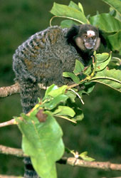
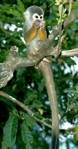
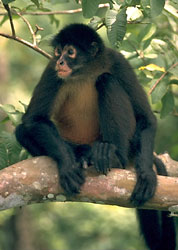

---
aliases:
  - Platyrrhini
title: Platyrrhini
has_id_wikidata: Q237157
---
# [[Platyrrhini]]

## New World Monkeys 

)   ) 

## #has_/text_of_/abstract 

> New World monkeys are the five families of primates that are found in the tropical regions of Mexico, Central and South America: Callitrichidae, Cebidae, Aotidae, Pitheciidae, and Atelidae. The five families are ranked together as the Ceboidea (), the only extant superfamily in the parvorder **Platyrrhini** ().
>
> Platyrrhini is derived from the Greek for "broad nosed", and their noses are flatter than those of other simians, with sideways-facing nostrils. Monkeys in the family Atelidae, such as the spider monkey, are the only primates to have prehensile tails. New World monkeys' closest relatives are the other simians, the Catarrhini ("down-nosed"), comprising Old World monkeys and apes. New World monkeys descend from African simians that colonized South America, a line that split off about 40 million years ago.
>
> [Wikipedia](https://en.wikipedia.org/wiki/New%20World%20monkey) 

## Phylogeny 

-   « Ancestral Groups  
    -  [Primates](../Primates.md) 
    -  [Eutheria](../../Eutheria.md) 
    -  [Mammal](../../../Mammal.md) 
    -   [Therapsida](../../../../Therapsida.md)
    -   [Synapsida](../../../../../Synapsida.md)
    -   [Amniota](../../../../../../Amniota.md)
    -   [Terrestrial Vertebrates](../../../../../../../Terrestrial.md)
    -   [Sarcopterygii](../../../../../../../../Sarc.md)
    -   [Gnathostomata](../../../../../../../../../Gnath.md)
    -   [Vertebrata](../../../../../../../../../../Vertebrata.md)
    -   [Craniata](../../../../../../../../../../../Craniata.md)
    -   [Chordata](../../../../../../../../../../../../Chordata.md)
    -   [Deuterostomia](../../../../../../../../../../../../../Deutero.md)
    -  [Bilateria](../../../../../../../../../../../../../../Bilateria.md) 
    -  [Animals](../../../../../../../../../../../../../../../Animals.md) 
    -  [Eukarya](../../../../../../../../../../../../../../../../Eukarya.md) 
    -   [Tree of Life](../../../../../../../../../../../../../../../../Tree_of_Life.md)

-   ◊ Sibling Groups of  Primates
    -   Platyrrhini
    -   [Catarrhini](Catarrhini.md)
    -   [Tarsier](Tarsier.md)
    -   [Strepsirrhini](Strepsirrhini.md)

-   » Sub-Groups 

### Information on the Internet

-   [Proyecto Tití (Project     Tamarin)](http://www.csew.com/proyectotiti/). Cotton-top Tamarin
    Conservation in Colombia.
-   [Golden Lion Tamarin Conservation     Program](http://natzoo.si.edu/gltprogram/).
-   [Squirrel Monkey Breeding and Research     Resource](http://www.saimiri.usouthal.edu/prl/). University of South
    Alabama.
-   [International Primate Sanctuary     Panama](http://www.primatesofpanama.org/). Primate Behavior and
    Ecology Program of Florida State University-Panama Canal College
    Branch.
-   [Gremlins: Faces in the     Forest](http://www.pbs.org/wnet/nature/gremlins/). Information on
    marmosets and tamarins. PBS Online: NATURE on the Web.
-   [Callitrichidae](http://animaldiversity.ummz.umich.edu/chordata/mammalia/primates/callitrichidae.html)
    (Marmosets, Tamarins). The University of Michigan Museum of Zoology
    Animal Diversity Web.
-   [Cebidae](http://animaldiversity.ummz.umich.edu/chordata/mammalia/primates/cebidae.html)
    (Cebids, including Capuchin Monkeys, Howlers, Wooly Monkeys,
    Squirrel Monkeys, Night Monkeys, Titis, Uakaris, and others). The
    University of Michigan Museum of Zoology Animal Diversity Web.

## Title Illustrations

------------------------------------------------------------------------------ 
 
scientific_name ::     Callithrix jacchus
location ::           Brazil
Creator              Lloyd Glenn Ingles
specimen_condition ::  Live Specimen
Source Collection    [CalPhotos](http://calphotos.berkeley.edu/)
copyright ::            © 2001 [California Academy of Sciences](http://www.calacademy.org/) 

------------------------------------------------------------------------------ 
 
scientific_name ::     Saimiri sciureus
location ::           Brazil
Creator              Lloyd Glenn Ingles
specimen_condition ::  Live Specimen
Source Collection    [CalPhotos](http://calphotos.berkeley.edu/)
copyright ::            © 2001 [California Academy of Sciences](http://www.calacademy.org/) 

------------------------------------------------------------------------------ 
 
scientific_name ::     Ateles
location ::           Panama
Creator              Lloyd Glenn Ingles
specimen_condition ::  Live Specimen
Source Collection    [CalPhotos](http://calphotos.berkeley.edu/)
copyright ::            © 2001 [California Academy of Sciences](http://www.calacademy.org/) 

## Confidential Links & Embeds: 

### #is_/same_as :: [[/_Standards/bio/bio~Domain/Eukarya/Animal/Bilateria/Deutero/Chordata/Craniata/Vertebrata/Gnath/Sarc/Tetrapods/Amniota/Synapsida/Therapsida/Mammal/Eutheria/Primates/Platyrrhini|Platyrrhini]] 

### #is_/same_as :: [[/_public/bio/bio~Domain/Eukarya/Animal/Bilateria/Deutero/Chordata/Craniata/Vertebrata/Gnath/Sarc/Tetrapods/Amniota/Synapsida/Therapsida/Mammal/Eutheria/Primates/Platyrrhini.public|Platyrrhini.public]] 

### #is_/same_as :: [[/_internal/bio/bio~Domain/Eukarya/Animal/Bilateria/Deutero/Chordata/Craniata/Vertebrata/Gnath/Sarc/Tetrapods/Amniota/Synapsida/Therapsida/Mammal/Eutheria/Primates/Platyrrhini.internal|Platyrrhini.internal]] 

### #is_/same_as :: [[/_protect/bio/bio~Domain/Eukarya/Animal/Bilateria/Deutero/Chordata/Craniata/Vertebrata/Gnath/Sarc/Tetrapods/Amniota/Synapsida/Therapsida/Mammal/Eutheria/Primates/Platyrrhini.protect|Platyrrhini.protect]] 

### #is_/same_as :: [[/_private/bio/bio~Domain/Eukarya/Animal/Bilateria/Deutero/Chordata/Craniata/Vertebrata/Gnath/Sarc/Tetrapods/Amniota/Synapsida/Therapsida/Mammal/Eutheria/Primates/Platyrrhini.private|Platyrrhini.private]] 

### #is_/same_as :: [[/_personal/bio/bio~Domain/Eukarya/Animal/Bilateria/Deutero/Chordata/Craniata/Vertebrata/Gnath/Sarc/Tetrapods/Amniota/Synapsida/Therapsida/Mammal/Eutheria/Primates/Platyrrhini.personal|Platyrrhini.personal]] 

### #is_/same_as :: [[/_secret/bio/bio~Domain/Eukarya/Animal/Bilateria/Deutero/Chordata/Craniata/Vertebrata/Gnath/Sarc/Tetrapods/Amniota/Synapsida/Therapsida/Mammal/Eutheria/Primates/Platyrrhini.secret|Platyrrhini.secret]] 

