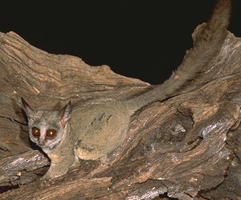

---
aliases:
- Strepsirrhini
- Strepsirhini
title: Strepsirrhini
---

# [[Strepsirrhini]] 
)

## #has_/text_of_/abstract 

> **Strepsirrhini** or Strepsirhini ( ; STREP-sə-RY-nee) is a suborder of primates that includes the lemuriform primates, which consist of the lemurs of Madagascar, galagos ("bushbabies") and pottos from Africa, and the lorises from India and Southeast Asia. Collectively they are referred to as strepsirrhines. Also belonging to the suborder are the extinct adapiform primates, which thrived during the Eocene in Europe, North America, and Asia, but disappeared from most of the Northern Hemisphere as the climate cooled. Adapiforms are sometimes referred to as being "lemur-like", although the diversity of both lemurs and adapiforms does not support this comparison.
>
> Strepsirrhines are defined by their "wet" (moist) rhinarium (the tip of the snout) – hence the colloquial but inaccurate term "wet-nosed" – similar to the rhinaria of canines and felines. They also have a smaller brain than comparably sized simians, large olfactory lobes for smell, a vomeronasal organ to detect pheromones, and a bicornuate uterus with an epitheliochorial placenta. Their eyes contain a reflective layer to improve their night vision, and their eye sockets include a ring of bone around the eye, but they lack a wall of thin bone behind it. Strepsirrhine primates produce their own vitamin C, whereas haplorhine primates must obtain it from their diets. Lemuriform primates are characterized by a toothcomb, a specialized set of teeth in the front, lower part of the mouth mostly used for combing fur during grooming.
>
> Many of today's living strepsirrhines are endangered due to habitat destruction, hunting for bushmeat, and live capture for the exotic pet trade. Both living and extinct strepsirrhines are behaviorally diverse, although all are primarily arboreal (tree-dwelling). Most living lemuriforms are nocturnal, while most adapiforms were diurnal. Both living and extinct groups primarily fed on fruit, leaves, and insects.
>
> [Wikipedia](https://en.wikipedia.org/wiki/Strepsirrhini) 

## Phylogeny 

-   « Ancestral Groups  
    -  [Primates](../Primates.md))
    -  [Eutheria](../../Eutheria.md))
    -  [Mammal](../../../Mammal.md))
    -   [Therapsida](../../../../Therapsida.md)
    -   [Synapsida](../../../../../Synapsida.md)
    -   [Amniota](../../../../../../Amniota.md)
    -   [Terrestrial Vertebrates](../../../../../../../Terrestrial.md)
    -   [Sarcopterygii](../../../../../../../../Sarc.md)
    -   [Gnathostomata](../../../../../../../../../Gnath.md)
    -   [Vertebrata](../../../../../../../../../../Vertebrata.md)
    -   [Craniata](../../../../../../../../../../../Craniata.md)
    -   [Chordata](../../../../../../../../../../../../Chordata.md)
    -   [Deuterostomia](../../../../../../../../../../../../../Deutero.md)
    -  [Bilateria](../../../../../../../../../../../../../../Bilateria.md))
    -  [Animals](../../../../../../../../../../../../../../../Animals.md))
    -  [Eukarya](../../../../../../../../../../../../../../../../Eukarya.md))
    -   [Tree of Life](../../../../../../../../../../../../../../../../Tree_of_Life.md)

-   ◊ Sibling Groups of  Primates
    -   [Platyrrhini](Platyrrhini.md)
    -   [Catarrhini](Catarrhini.md)
    -   [Tarsii](Tarsii.md)
    -   Strepsirrhini

-   » Sub-Groups
    -  [Lemuridae](Strepsirrhini/Lemuridae.md))
    -  [Indridae](Strepsirrhini/Indridae.md))
    -  [Palaeopropithecidae](Strepsirrhini/Palaeopropithecidae.md))
    -  [Cheirogaleidae](Strepsirrhini/Cheirogaleidae.md))
    -  [Lepilemur](Strepsirrhini/Lepilemur.md))
    -  [Lorisiformes](Strepsirrhini/Lorisiformes.md))

### Information on the Internet

-   [The Duke University Primate     Center](http://www.duke.edu/web/primate/). Information on Lemurs.

-   [Lemurs of Madagascar](http://www.tsidy.com/lemurs/). Expert Center
    for Taxonomic Identification.

-   [Prosimian Picture     Gallery](http://www.duke.edu/web/primate/lemgal.html). Duke
    University Primate Center

-   [The Madagascar Fauna Group     (MFG)](http://www.madagascarfaunagroup.org/). International
    consortium of zoological institutions concerned with conservation of
    all classes of Malagasy fauna.

-   [Godric\'s Lemur     Gallery](http://www.gozen.demon.co.uk/godric/lemgall.html). Lemur
    sights and sounds.

-   [Lemur Furtography](http://you.genie.co.uk/ringtail/photos/lemur/).
    A collection of lemur photographs by Tom Mortimer.

    Strepsirrhini pages at the University of Michigan Museum of Zoology
    Animal Diversity Web:

    -   [Lemuridae](http://animaldiversity.ummz.umich.edu/chordata/mammalia/primates/lemuridae.html)
        (Lemurs)
    -   [Cheirogaleidae](http://animaldiversity.ummz.umich.edu/chordata/mammalia/primates/cheirogaleidae.html)
        (Dwarf lemurs, Mouse lemurs)
    -   [Indridae](http://animaldiversity.ummz.umich.edu/chordata/mammalia/primates/indridae.html)
        (Indrisoids, Avahis, Sifakas, Indris)
    -   [Daubentoniidae](http://animaldiversity.ummz.umich.edu/chordata/mammalia/primates/daubentoniidae.html)
        (Aye Aye).
    -   [Galagonidae](http://animaldiversity.ummz.umich.edu/chordata/mammalia/primates/galagonidae.html)
        (Galagos, Bushbabies)
    -   [Loridae](http://animaldiversity.ummz.umich.edu/chordata/mammalia/primates/loridae.html)
        (Lorises, Slow Lorises, Pottos, Angwantibos)
    -   [Megaladapidae](http://animaldiversity.ummz.umich.edu/chordata/mammalia/primates/megaladapidae.html)
        (Sportive Lemurs or Weasel Lemurs)

## Title Illustrations

)

------------------------------------------------------------------------------
Scientific Name ::  Galago senegalensis
Location ::        Okavango Delta (Machaba), Botswana
Comments          Lesser bushbaby
Copyright ::         © 2000 [Greg and Marybeth Dimijian](http://www.dimijianimages.com/) 
------------------------------------------------------------------------------

## Confidential Links & Embeds: 

### #is_/same_as ::[Strepsirrhini](Strepsirrhini.md)) 

### #is_/same_as :: [Strepsirrhini.public](/_public/bio/bio~Domain/Eukarya/Animal/Bilateria/Deutero/Chordata/Craniata/Vertebrata/Gnath/Sarc/Tetrapods/Amniota/Synapsida/Therapsida/Mammal/Eutheria/Primates/Strepsirrhini.public.md) 

### #is_/same_as :: [Strepsirrhini.internal](/_internal/bio/bio~Domain/Eukarya/Animal/Bilateria/Deutero/Chordata/Craniata/Vertebrata/Gnath/Sarc/Tetrapods/Amniota/Synapsida/Therapsida/Mammal/Eutheria/Primates/Strepsirrhini.internal.md) 

### #is_/same_as :: [Strepsirrhini.protect](/_protect/bio/bio~Domain/Eukarya/Animal/Bilateria/Deutero/Chordata/Craniata/Vertebrata/Gnath/Sarc/Tetrapods/Amniota/Synapsida/Therapsida/Mammal/Eutheria/Primates/Strepsirrhini.protect.md) 

### #is_/same_as :: [Strepsirrhini.private](/_private/bio/bio~Domain/Eukarya/Animal/Bilateria/Deutero/Chordata/Craniata/Vertebrata/Gnath/Sarc/Tetrapods/Amniota/Synapsida/Therapsida/Mammal/Eutheria/Primates/Strepsirrhini.private.md) 

### #is_/same_as :: [Strepsirrhini.personal](/_personal/bio/bio~Domain/Eukarya/Animal/Bilateria/Deutero/Chordata/Craniata/Vertebrata/Gnath/Sarc/Tetrapods/Amniota/Synapsida/Therapsida/Mammal/Eutheria/Primates/Strepsirrhini.personal.md) 

### #is_/same_as :: [Strepsirrhini.secret](/_secret/bio/bio~Domain/Eukarya/Animal/Bilateria/Deutero/Chordata/Craniata/Vertebrata/Gnath/Sarc/Tetrapods/Amniota/Synapsida/Therapsida/Mammal/Eutheria/Primates/Strepsirrhini.secret.md)

