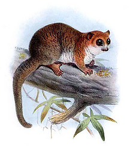
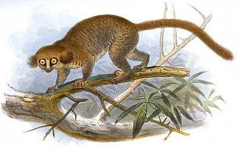
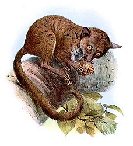

---
aliases:
  - Cheirogaleidae
title: Cheirogaleidae
---

# [[Cheirogaleidae]]

## Dwarf Lemurs and Mouse Lemurs 

 

## #has_/text_of_/abstract 

> The **Cheirogaleidae** are the family of strepsirrhine primates containing the various dwarf and mouse lemurs. Like all other lemurs, cheirogaleids live exclusively on the island of Madagascar.
>
> [Wikipedia](https://en.wikipedia.org/wiki/Cheirogaleidae) 

## Phylogeny 

-   « Ancestral Groups  
    -  [Strepsirrhini](../Strepsirrhini.md) 
    -  [Primates](../../Primates.md) 
    -  [Eutheria](../../../Eutheria.md) 
    -  [Mammal](../../../../Mammal.md) 
    -   [Therapsida](../../../../../Therapsida.md)
    -   [Synapsida](../../../../../../Synapsida.md)
    -   [Amniota](../../../../../../../Amniota.md)
    -   [Terrestrial Vertebrates](../../../../../../../../Terrestrial.md)
    -   [Sarcopterygii](../../../../../../../../../Sarc.md)
    -   [Gnathostomata](../../../../../../../../../../Gnath.md)
    -   [Vertebrata](../../../../../../../../../../../Vertebrata.md)
    -   [Craniata](../../../../../../../../../../../../Craniata.md)
    -   [Chordata](../../../../../../../../../../../../../Chordata.md)
    -   [Deuterostomia](../../../../../../../../../../../../../../Deutero.md)
    -  [Bilateria](../../../../../../../../../../../../../../../Bilateria.md) 
    -  [Animals](../../../../../../../../../../../../../../../../Animals.md) 
    -  [Eukarya](../../../../../../../../../../../../../../../../../Eukarya.md) 
    -   [Tree of Life](../../../../../../../../../../../../../../../../../Tree_of_Life.md)

-   ◊ Sibling Groups of  Strepsirrhini
    -   [Lemuridae](Lemuridae.md)
    -   [Indridae](Indridae.md)
    -   [Palaeopropithecidae](Palaeopropithecidae.md)
    -   Cheirogaleidae
    -   [Lepilemur](Lepilemur.md)
    -   [Lorisiformes](Lorisiformes.md)

-   » Sub-Groups 

## Title Illustrations

---------------------------------

Scientific Name ::  Cheirogaleus major
Reference         Elliot, D. G. 1913. A Review of The Primates. American Museum of Natural History. New York.

--------------------------------- 
 
Scientific Name ::  Allocebus trichotis
Location ::        Madagascar
Comments          hairy-eared dwarf lemur
Reference         Günther, A. 1875. Notes on some Mammals from Madagascar. Proceedings of the Zoological Society London: 78-80, pl. 15-16.

## Confidential Links & Embeds: 

### #is_/same_as :: [[/_Standards/bio/bio~Domain/Eukarya/Animal/Bilateria/Deutero/Chordata/Craniata/Vertebrata/Gnath/Sarc/Tetrapods/Amniota/Synapsida/Therapsida/Mammal/Eutheria/Primates/Strepsirrhini/Cheirogaleidae|Cheirogaleidae]] 

### #is_/same_as :: [[/_public/bio/bio~Domain/Eukarya/Animal/Bilateria/Deutero/Chordata/Craniata/Vertebrata/Gnath/Sarc/Tetrapods/Amniota/Synapsida/Therapsida/Mammal/Eutheria/Primates/Strepsirrhini/Cheirogaleidae.public|Cheirogaleidae.public]] 

### #is_/same_as :: [[/_internal/bio/bio~Domain/Eukarya/Animal/Bilateria/Deutero/Chordata/Craniata/Vertebrata/Gnath/Sarc/Tetrapods/Amniota/Synapsida/Therapsida/Mammal/Eutheria/Primates/Strepsirrhini/Cheirogaleidae.internal|Cheirogaleidae.internal]] 

### #is_/same_as :: [[/_protect/bio/bio~Domain/Eukarya/Animal/Bilateria/Deutero/Chordata/Craniata/Vertebrata/Gnath/Sarc/Tetrapods/Amniota/Synapsida/Therapsida/Mammal/Eutheria/Primates/Strepsirrhini/Cheirogaleidae.protect|Cheirogaleidae.protect]] 

### #is_/same_as :: [[/_private/bio/bio~Domain/Eukarya/Animal/Bilateria/Deutero/Chordata/Craniata/Vertebrata/Gnath/Sarc/Tetrapods/Amniota/Synapsida/Therapsida/Mammal/Eutheria/Primates/Strepsirrhini/Cheirogaleidae.private|Cheirogaleidae.private]] 

### #is_/same_as :: [[/_personal/bio/bio~Domain/Eukarya/Animal/Bilateria/Deutero/Chordata/Craniata/Vertebrata/Gnath/Sarc/Tetrapods/Amniota/Synapsida/Therapsida/Mammal/Eutheria/Primates/Strepsirrhini/Cheirogaleidae.personal|Cheirogaleidae.personal]] 

### #is_/same_as :: [[/_secret/bio/bio~Domain/Eukarya/Animal/Bilateria/Deutero/Chordata/Craniata/Vertebrata/Gnath/Sarc/Tetrapods/Amniota/Synapsida/Therapsida/Mammal/Eutheria/Primates/Strepsirrhini/Cheirogaleidae.secret|Cheirogaleidae.secret]] 

