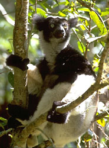

---
aliases:
- bancoleem
- Indriachtigen
- Indriartige
- Indridae
- Indrier
- Indriidae
- indriji
- Indrilased
- Indriniai
- indriovití
- Indrisowate
- indrit
- Tsinlátah naháaztání
- ugrómakifélék
- Vunasti lemuri
- Índrid
- İndrigiller
- İndrilər
- Індрієві
- Індрыевыя
- Индри сымалдуулар
- индриеви
- Индриевые
- ինդիրներ
- אינדריים
- إندرية
- اندريه
- اندری لیمر
- ایندیریان
- インドリ科
- 大狐猴科
- 인드리과
title: Indridae
has_id_wikidata: Q175626
dv_has_:
  name_:
    an: Indriidae
    ar: إندرية
    arz: اندريه
    ast: Indridae
    avk: bancoleem
    az: İndrilər
    be_tarask: Індрыевыя
    bg: индриеви
    br: Indriidae
    ca: Índrid
    ceb: Indridae
    cs: indriovití
    da: Indrier
    de: Indriartige
    en: Indriidae
    eo: Indriidae
    es: Indriidae
    et: Indrilased
    eu: Indriidae
    ext: Indriidae
    fa: ایندیریان
    fi: indrit
    fr: Indriidae
    frr: Indriidae
    ga: Indridae
    gl: Indriidae
    he: אינדריים
    hr: Vunasti lemuri
    hu: ugrómakifélék
    hy: ինդիրներ
    ia: Indridae
    id: Indriidae
    ie: Indriidae
    io: Indriidae
    it: Indriidae
    ja: インドリ科
    ko: 인드리과
    ky: Индри сымалдуулар
    la: Indridae
    lt: Indriniai
    mg: Indridae
    mul: Indriidae
    nb: Indrier
    nl: Indriachtigen
    nv: Tsinlátah naháaztání
    oc: Indridae
    pl: Indrisowate
    pnb: اندری لیمر
    pt: Indridae
    pt_br: Indriidae
    ro: Indridae
    ru: Индриевые
    sh: Vunasti lemuri
    sl: indriji
    sq: Indriidae
    sv: Indrier
    tr: İndrigiller
    uk: Індрієві
    vi: Indridae
    vo: Indriidae
    war: Indridae
    zh: 大狐猴科
    zh_cn: 大狐猴科
    zh_hans: 大狐猴科
    zh_tw: 大狐猴科
---

# [[Indridae]] 
 

## #has_/text_of_/abstract 

> The Indriidae (sometimes incorrectly spelled **Indridae**) are a family of strepsirrhine primates. They are medium- to large-sized lemurs, with only four teeth in the toothcomb instead of the usual six. Indriids, like all lemurs, live exclusively on the island of Madagascar.
>
> [Wikipedia](https://en.wikipedia.org/wiki/Indriidae) 

## Phylogeny 

-   « Ancestral Groups  
    -  [Strepsirrhini](../Strepsirrhini.md) 
    -  [Primates](../../Primates.md) 
    -  [Eutheria](../../../Eutheria.md) 
    -  [Mammal](../../../../Mammal.md) 
    -   [Therapsida](../../../../../Therapsida.md)
    -   [Synapsida](../../../../../../Synapsida.md)
    -   [Amniota](../../../../../../../Amniota.md)
    -   [Terrestrial Vertebrates](../../../../../../../../Terrestrial.md)
    -   [Sarcopterygii](../../../../../../../../../Sarc.md)
    -   [Gnathostomata](../../../../../../../../../../Gnath.md)
    -   [Vertebrata](../../../../../../../../../../../Vertebrata.md)
    -   [Craniata](../../../../../../../../../../../../Craniata.md)
    -   [Chordata](../../../../../../../../../../../../../Chordata.md)
    -   [Deuterostomia](../../../../../../../../../../../../../../Deutero.md)
    -  [Bilateria](../../../../../../../../../../../../../../../Bilateria.md) 
    -  [Animals](../../../../../../../../../../../../../../../../Animals.md) 
    -  [Eukarya](../../../../../../../../../../../../../../../../../Eukarya.md) 
    -   [Tree of Life](../../../../../../../../../../../../../../../../../Tree_of_Life.md)

-   ◊ Sibling Groups of  Strepsirrhini
    -   [Lemuridae](Lemuridae.md)
    -   Indridae
    -   [Palaeopropithecidae](Palaeopropithecidae.md)
    -   [Cheirogaleidae](Cheirogaleidae.md)
    -   [Lepilemur](Lepilemur.md)
    -   [Lorisiformes](Lorisiformes.md)

-   » Sub-Groups 

## Title Illustrations

------------------------------------------------------------------------------ 
 
scientific_name ::    Indri indri
location ::          Andasibe National Park, Perinet Reserve (Madagascar)
Source Collection   [CalPhotos](http://calphotos.berkeley.edu/)
copyright ::           © 2000 [California Academy of Sciences](http://www.calacademy.org/) 

## Confidential Links & Embeds: 

### #is_/same_as :: [[/_Standards/bio/bio~Domain/Eukarya/Animal/Bilateria/Deutero/Chordata/Craniata/Vertebrata/Gnath/Sarc/Tetrapods/Amniota/Synapsida/Therapsida/Mammal/Eutheria/Primates/Strepsirrhini/Indridae|Indridae]] 

### #is_/same_as :: [[/_public/bio/bio~Domain/Eukarya/Animal/Bilateria/Deutero/Chordata/Craniata/Vertebrata/Gnath/Sarc/Tetrapods/Amniota/Synapsida/Therapsida/Mammal/Eutheria/Primates/Strepsirrhini/Indridae.public|Indridae.public]] 

### #is_/same_as :: [[/_internal/bio/bio~Domain/Eukarya/Animal/Bilateria/Deutero/Chordata/Craniata/Vertebrata/Gnath/Sarc/Tetrapods/Amniota/Synapsida/Therapsida/Mammal/Eutheria/Primates/Strepsirrhini/Indridae.internal|Indridae.internal]] 

### #is_/same_as :: [[/_protect/bio/bio~Domain/Eukarya/Animal/Bilateria/Deutero/Chordata/Craniata/Vertebrata/Gnath/Sarc/Tetrapods/Amniota/Synapsida/Therapsida/Mammal/Eutheria/Primates/Strepsirrhini/Indridae.protect|Indridae.protect]] 

### #is_/same_as :: [[/_private/bio/bio~Domain/Eukarya/Animal/Bilateria/Deutero/Chordata/Craniata/Vertebrata/Gnath/Sarc/Tetrapods/Amniota/Synapsida/Therapsida/Mammal/Eutheria/Primates/Strepsirrhini/Indridae.private|Indridae.private]] 

### #is_/same_as :: [[/_personal/bio/bio~Domain/Eukarya/Animal/Bilateria/Deutero/Chordata/Craniata/Vertebrata/Gnath/Sarc/Tetrapods/Amniota/Synapsida/Therapsida/Mammal/Eutheria/Primates/Strepsirrhini/Indridae.personal|Indridae.personal]] 

### #is_/same_as :: [[/_secret/bio/bio~Domain/Eukarya/Animal/Bilateria/Deutero/Chordata/Craniata/Vertebrata/Gnath/Sarc/Tetrapods/Amniota/Synapsida/Therapsida/Mammal/Eutheria/Primates/Strepsirrhini/Indridae.secret|Indridae.secret]] 

