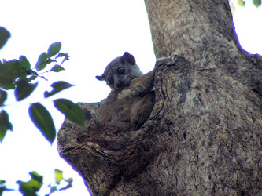
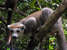

---
aliases:
- bancudoleem
- Gewöhnliche Makis
- Họ Vượn cáo
- Leemurlased
- Lemur
- Lemuredoj
- Lemuren
- Lemurer
- Lemuri
- Lemuriano
- Lemuridae
- lemurji
- Lemurlar
- Lemurovité
- lemurovití denní
- Lemurowate
- Lemwrlar
- Lemúrid
- Lemūriniai
- Magíshtłizhí
- Maki
- maki's
- maki- og lemurfamilien
- makifélék
- Makigiller
- makit
- Лемур йышшисем
- Лемуравыя
- лемури
- Лемуринбур
- Лемурлар
- лемурові
- лемурови
- лемуровые
- լեմուրազգիներ
- למוריים
- عام لیمر
- لموریان
- ليموريات
- لەمۋرلار
- ლემურისებრნი
- キツネザル科
- 狐猴
- 狐猴科
- 여우원숭이과
title: Lemuridae
has_id_wikidata: Q186462
dv_has_:
  name_:
    an: Lemuridae
    ar: ليموريات
    arz: ليموريات
    ast: Lemuridae
    avk: bancudoleem
    az: Lemurlar
    be: Лемуравыя
    be_tarask: Лемуравыя
    bg: лемурови
    br: Lemuridae
    bs: Lemuridae
    ca: Lemúrid
    ceb: Lemuridae
    cs: lemurovití denní
    cv: Лемур йышшисем
    da: Maki
    de: Gewöhnliche Makis
    en: Lemuridae
    eo: Lemuredoj
    es: Lemuridae
    et: Leemurlased
    eu: Lemuridae
    ext: Lemuridae
    fa: لموریان
    fi: makit
    fr: Lemuridae
    frr: Lemuridae
    ga: Lemuridae
    gl: Lemuridae
    he: למוריים
    hr: Lemuri
    hu: makifélék
    hy: լեմուրազգիներ
    ia: Lemuridae
    ie: Lemuridae
    io: Lemuriano
    it: Lemuridae
    ja: キツネザル科
    ka: ლემურისებრნი
    kk: Лемурлар
    kk_arab: لەمۋرلار
    kk-cn: لەمۋرلار
    kk_cyrl: Лемурлар
    kk-kz: Лемурлар
    kk_latn: Lemwrlar
    kk-tr: Lemwrlar
    ko: 여우원숭이과
    ky: Лемурлар
    la: Lemuridae
    lb: Lemuren
    lez: Лемуринбур
    lij: Lemuridae
    lt: Lemūriniai
    mk: лемури
    mul: Lemuridae
    nb: maki- og lemurfamilien
    nl: maki's
    nv: Magíshtłizhí
    oc: Lemuridae
    pl: Lemurowate
    pnb: عام لیمر
    pt: Lemuridae
    pt_br: Lemuridae
    ro: Lemuridae
    ru: лемуровые
    scn: Lemuridae
    sco: Lemuridae
    sh: Lemuri
    sk: Lemurovité
    sl: lemurji
    sq: Lemur
    sv: Lemurer
    tl: Lemuridae
    tr: Makigiller
    uk: лемурові
    vi: Họ Vượn cáo
    vo: Lemuridae
    war: Lemuridae
    zh: 狐猴科
    zh_cn: 狐猴科
    zh_hans: 狐猴科
    zh_hant: 狐猴
    zh_hk: 狐猴
    zh_sg: 狐猴
    zh_tw: 狐猴科
---
# [[Lemuridae]] 

 

## #has_/text_of_/abstract 

> **Lemuridae** is a family of strepsirrhine primates native to Madagascar and the Comoros. They are represented by the Lemuriformes in Madagascar with one of the highest concentration of the lemurs. One of five families commonly known as lemurs, these animals were once thought to be the evolutionary predecessors of monkeys and apes, but this is no longer considered correct. They are formally referred to as lemurids.
>
> [Wikipedia](https://en.wikipedia.org/wiki/Lemuridae) 

## Phylogeny 

-   « Ancestral Groups  
    -  [Strepsirrhini](../Strepsirrhini.md) 
    -  [Primates](../../Primates.md) 
    -  [Eutheria](../../../Eutheria.md) 
    -  [Mammal](../../../../Mammal.md) 
    -   [Therapsida](../../../../../Therapsida.md)
    -   [Synapsida](../../../../../../Synapsida.md)
    -   [Amniota](../../../../../../../Amniota.md)
    -   [Terrestrial Vertebrates](../../../../../../../../Terrestrial.md)
    -   [Sarcopterygii](../../../../../../../../../Sarc.md)
    -   [Gnathostomata](../../../../../../../../../../Gnath.md)
    -   [Vertebrata](../../../../../../../../../../../Vertebrata.md)
    -   [Craniata](../../../../../../../../../../../../Craniata.md)
    -   [Chordata](../../../../../../../../../../../../../Chordata.md)
    -   [Deuterostomia](../../../../../../../../../../../../../../Deutero.md)
    -  [Bilateria](../../../../../../../../../../../../../../../Bilateria.md) 
    -  [Animals](../../../../../../../../../../../../../../../../Animals.md) 
    -  [Eukarya](../../../../../../../../../../../../../../../../../Eukarya.md) 
    -   [Tree of Life](../../../../../../../../../../../../../../../../../Tree_of_Life.md)

-   ◊ Sibling Groups of  Strepsirrhini
    -   Lemuridae
    -   [Indridae](Indridae.md)
    -   [Palaeopropithecidae](Palaeopropithecidae.md)
    -   [Cheirogaleidae](Cheirogaleidae.md)
    -   [Lepilemur](Lepilemur.md)
    -   [Lorisiformes](Lorisiformes.md)

-   » Sub-Groups 

## Title Illustrations

--------------------------------------------------------------------------------- 
 
scientific_name ::     Lepilemur
location ::           Ankarafantsika nature reserve, Madagascar
Comments             Sportive lemur
Creator              Jean-Francois Dallaire
specimen_condition ::  Live Specimen
Identified By        Jean-Francois Dallaire with the help of a guide
copyright ::            © 2006 [Jean-François Dallaire](mailto:jeanfrancois_dallaire@hotmail.com) 

--------------------------------------------------------------------------------- 
 
scientific_name ::     Eulemur coronatus
location ::           Ankarana special reserve, Madagascar
Comments             Crowned lemur
Creator              Jean-Fran?ois Dallaire
specimen_condition ::  Live Specimen
Identified By        Jean-Fran?ois Dallaire with the help of a guide
Sex ::                Female
copyright ::            © 2006 [Jean-François Dallaire](mailto:jeanfrancois_dallaire@hotmail.com) 

## Confidential Links & Embeds: 

### #is_/same_as :: [[/_Standards/bio/bio~Domain/Eukarya/Animal/Bilateria/Deutero/Chordata/Craniata/Vertebrata/Gnath/Sarc/Tetrapods/Amniota/Synapsida/Therapsida/Mammal/Eutheria/Primates/Strepsirrhini/Lemuridae|Lemuridae]] 

### #is_/same_as :: [[/_public/bio/bio~Domain/Eukarya/Animal/Bilateria/Deutero/Chordata/Craniata/Vertebrata/Gnath/Sarc/Tetrapods/Amniota/Synapsida/Therapsida/Mammal/Eutheria/Primates/Strepsirrhini/Lemuridae.public|Lemuridae.public]] 

### #is_/same_as :: [[/_internal/bio/bio~Domain/Eukarya/Animal/Bilateria/Deutero/Chordata/Craniata/Vertebrata/Gnath/Sarc/Tetrapods/Amniota/Synapsida/Therapsida/Mammal/Eutheria/Primates/Strepsirrhini/Lemuridae.internal|Lemuridae.internal]] 

### #is_/same_as :: [[/_protect/bio/bio~Domain/Eukarya/Animal/Bilateria/Deutero/Chordata/Craniata/Vertebrata/Gnath/Sarc/Tetrapods/Amniota/Synapsida/Therapsida/Mammal/Eutheria/Primates/Strepsirrhini/Lemuridae.protect|Lemuridae.protect]] 

### #is_/same_as :: [[/_private/bio/bio~Domain/Eukarya/Animal/Bilateria/Deutero/Chordata/Craniata/Vertebrata/Gnath/Sarc/Tetrapods/Amniota/Synapsida/Therapsida/Mammal/Eutheria/Primates/Strepsirrhini/Lemuridae.private|Lemuridae.private]] 

### #is_/same_as :: [[/_personal/bio/bio~Domain/Eukarya/Animal/Bilateria/Deutero/Chordata/Craniata/Vertebrata/Gnath/Sarc/Tetrapods/Amniota/Synapsida/Therapsida/Mammal/Eutheria/Primates/Strepsirrhini/Lemuridae.personal|Lemuridae.personal]] 

### #is_/same_as :: [[/_secret/bio/bio~Domain/Eukarya/Animal/Bilateria/Deutero/Chordata/Craniata/Vertebrata/Gnath/Sarc/Tetrapods/Amniota/Synapsida/Therapsida/Mammal/Eutheria/Primates/Strepsirrhini/Lemuridae.secret|Lemuridae.secret]] 

