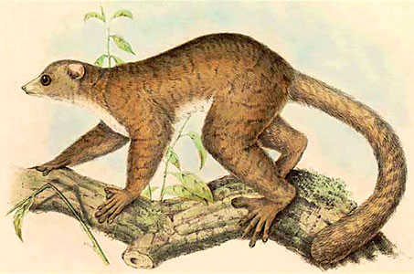

---
aliases:
- Bancimol (Lepilemuridae)
- Dlǫ́ʼiiʼniiʼí
- fürgemaki
- kärppämakit
- Lemur sportif
- Lemuri-spoti
- lemurovití noční
- Lepilemur
- Lepilemuri
- Lepilemurlar
- Lèmur mostela
- Lépilémur
- Sireleemurlased
- Vesslemakier
- Væsellemurer
- Vísillemúrar
- Wezelmaki's
- Wieselmakis
- Žebenkštiniai lemūrai
- Лепілемур
- лепилемуры
- Тънкотели лемури
- למורי ספורט
- لمورهای ورزشکار
- ليمور مرح
- نیولا لیمر
- イタチキツネザル科
- 鼬狐猴属
- 鼬狐猴屬
- 족제비여우원숭이
title: Lepilemur
has_id_wikidata: Q834470
dv_has_:
  name_:
    an: Lepilemur
    ar: ليمور مرح
    arz: ليمور مرح
    ast: Lepilemur
    avk: Bancimol (Lepilemuridae)
    az: Lepilemurlar
    bg: Тънкотели лемури
    ca: Lèmur mostela
    ceb: Lepilemur
    cs: lemurovití noční
    da: Væsellemurer
    de: Wieselmakis
    en: Lepilemur
    eo: Lepilemur
    es: Lepilemuri
    et: Sireleemurlased
    eu: Lepilemur
    ext: Lepilemur
    fa: لمورهای ورزشکار
    fi: kärppämakit
    fr: Lépilémur
    frr: Lepilemur
    ga: Lepilemur
    gl: Lepilemur
    he: למורי ספורט
    hr: Lepilemuri
    hu: fürgemaki
    ia: Lepilemur
    id: Lemur sportif
    ie: Lepilemur
    io: Lepilemur
    is: Vísillemúrar
    it: Lepilemur
    ja: イタチキツネザル科
    ko: 족제비여우원숭이
    la: Lepilemur
    lt: Žebenkštiniai lemūrai
    mul: Lepilemur
    nl: Wezelmaki's
    nv: Dlǫ́ʼiiʼniiʼí
    oc: Lepilemur
    pl: Lepilemur
    pnb: نیولا لیمر
    pt: Lepilemur
    pt_br: Lepilemur
    ro: Lepilemur
    ru: лепилемуры
    sh: Lepilemuri
    sq: Lepilemur
    sv: Vesslemakier
    sw: Lemuri-spoti
    tr: Lepilemur
    uk: Лепілемур
    vi: Lepilemuri
    vo: Lepilemur
    war: Lepilemur
    zh: 鼬狐猴屬
    zh_cn: 鼬狐猴属
    zh_hans: 鼬狐猴属
    zh_hant: 鼬狐猴屬
    zh_hk: 鼬狐猴屬
    zh_tw: 鼬狐猴屬
---
# [[Lepilemur]]

## Lepilemuridae: Sportive Lemurs, Weasel Lemurs 
 

## #has_/text_of_/abstract 

> The sportive lemurs are the medium-sized primates that make up the family **Lepilemur**idae. The family consists of only one extant genus, Lepilemur. They are closely related to the other lemurs and exclusively live on the island of Madagascar. For a time, this family was named Megaladapidae, but the current name was given precedence since the extinct genus Megaladapis was removed from the family.
>
> [Wikipedia](https://en.wikipedia.org/wiki/Sportive%20lemur) 

## Phylogeny 

-   « Ancestral Groups  
    -  [Strepsirrhini](../Strepsirrhini.md) 
    -  [Primates](../../Primates.md) 
    -  [Eutheria](../../../Eutheria.md) 
    -  [Mammal](../../../../Mammal.md) 
    -   [Therapsida](../../../../../Therapsida.md)
    -   [Synapsida](../../../../../../Synapsida.md)
    -   [Amniota](../../../../../../../Amniota.md)
    -   [Terrestrial Vertebrates](../../../../../../../../Terrestrial.md)
    -   [Sarcopterygii](../../../../../../../../../Sarc.md)
    -   [Gnathostomata](../../../../../../../../../../Gnath.md)
    -   [Vertebrata](../../../../../../../../../../../Vertebrata.md)
    -   [Craniata](../../../../../../../../../../../../Craniata.md)
    -   [Chordata](../../../../../../../../../../../../../Chordata.md)
    -   [Deuterostomia](../../../../../../../../../../../../../../Deutero.md)
    -  [Bilateria](../../../../../../../../../../../../../../../Bilateria.md) 
    -  [Animals](../../../../../../../../../../../../../../../../Animals.md) 
    -  [Eukarya](../../../../../../../../../../../../../../../../../Eukarya.md) 
    -   [Tree of Life](../../../../../../../../../../../../../../../../../Tree_of_Life.md)

-   ◊ Sibling Groups of  Strepsirrhini
    -   [Lemuridae](Lemuridae.md)
    -   [Indridae](Indridae.md)
    -   [Palaeopropithecidae](Palaeopropithecidae.md)
    -   [Cheirogaleidae](Cheirogaleidae.md)
    -   Lepilemur
    -   [Lorisiformes](Lorisiformes.md)

-   » Sub-Groups 

	-   *Lepilemur dorsalis*
	-   *Lepilemur ruficaudatus*
	-   *Lepilemur edwardsi*
	-   *Lepilemur leucopus*
	-   *Lepilemur mustelinus*
	-   *Lepilemur microdon*
	-   *Lepilemur septentrionalis*

## Title Illustrations

------------------------------------------------ 
 
  scientific_name ::  Lepilemur mustelinus
  location ::        Madagascar
  Reference         Pollen, F. P. L. and van Dam, D. C. 1868. Récherches sur la Faune de Madagascar et de ses Dépendances. 2me partie. J. K. Steenhoff ed. Leyden.

## Confidential Links & Embeds: 

### #is_/same_as :: [[/_Standards/bio/bio~Domain/Eukarya/Animal/Bilateria/Deutero/Chordata/Craniata/Vertebrata/Gnath/Sarc/Tetrapods/Amniota/Synapsida/Therapsida/Mammal/Eutheria/Primates/Strepsirrhini/Lepilemur|Lepilemur]] 

### #is_/same_as :: [[/_public/bio/bio~Domain/Eukarya/Animal/Bilateria/Deutero/Chordata/Craniata/Vertebrata/Gnath/Sarc/Tetrapods/Amniota/Synapsida/Therapsida/Mammal/Eutheria/Primates/Strepsirrhini/Lepilemur.public|Lepilemur.public]] 

### #is_/same_as :: [[/_internal/bio/bio~Domain/Eukarya/Animal/Bilateria/Deutero/Chordata/Craniata/Vertebrata/Gnath/Sarc/Tetrapods/Amniota/Synapsida/Therapsida/Mammal/Eutheria/Primates/Strepsirrhini/Lepilemur.internal|Lepilemur.internal]] 

### #is_/same_as :: [[/_protect/bio/bio~Domain/Eukarya/Animal/Bilateria/Deutero/Chordata/Craniata/Vertebrata/Gnath/Sarc/Tetrapods/Amniota/Synapsida/Therapsida/Mammal/Eutheria/Primates/Strepsirrhini/Lepilemur.protect|Lepilemur.protect]] 

### #is_/same_as :: [[/_private/bio/bio~Domain/Eukarya/Animal/Bilateria/Deutero/Chordata/Craniata/Vertebrata/Gnath/Sarc/Tetrapods/Amniota/Synapsida/Therapsida/Mammal/Eutheria/Primates/Strepsirrhini/Lepilemur.private|Lepilemur.private]] 

### #is_/same_as :: [[/_personal/bio/bio~Domain/Eukarya/Animal/Bilateria/Deutero/Chordata/Craniata/Vertebrata/Gnath/Sarc/Tetrapods/Amniota/Synapsida/Therapsida/Mammal/Eutheria/Primates/Strepsirrhini/Lepilemur.personal|Lepilemur.personal]] 

### #is_/same_as :: [[/_secret/bio/bio~Domain/Eukarya/Animal/Bilateria/Deutero/Chordata/Craniata/Vertebrata/Gnath/Sarc/Tetrapods/Amniota/Synapsida/Therapsida/Mammal/Eutheria/Primates/Strepsirrhini/Lepilemur.secret|Lepilemur.secret]] 

