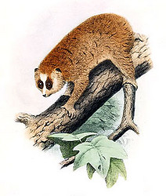
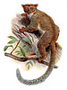

---
title: Lorisiformes
---

# Lorisiformes

## Bush Babies and Lorises 

    ) 

## Phylogeny 

-   « Ancestral Groups  
    -  [Strepsirrhini](../Strepsirrhini.md))
    -  [Primates](../../Primates.md))
    -  [Eutheria](../../../Eutheria.md))
    -  [Mammal](../../../../Mammal.md))
    -   [Therapsida](../../../../../Therapsida.md)
    -   [Synapsida](../../../../../../Synapsida.md)
    -   [Amniota](../../../../../../../Amniota.md)
    -   [Terrestrial Vertebrates](../../../../../../../../Terrestrial.md)
    -   [Sarcopterygii](../../../../../../../../../Sarc.md)
    -   [Gnathostomata](../../../../../../../../../../Gnath.md)
    -   [Vertebrata](../../../../../../../../../../../Vertebrata.md)
    -   [Craniata](../../../../../../../../../../../../Craniata.md)
    -   [Chordata](../../../../../../../../../../../../../Chordata.md)
    -   [Deuterostomia](../../../../../../../../../../../../../../Deutero.md)
    -  [Bilateria](../../../../../../../../../../../../../../../Bilateria.md))
    -  [Animals](../../../../../../../../../../../../../../../../Animals.md))
    -  [Eukarya](../../../../../../../../../../../../../../../../../Eukarya.md))
    -   [Tree of Life](../../../../../../../../../../../../../../../../../Tree_of_Life.md)

-   ◊ Sibling Groups of  Strepsirrhini
    -   [Lemuridae](Lemuridae.md)
    -   [Indridae](Indridae.md)
    -   [Palaeopropithecidae](Palaeopropithecidae.md)
    -   [Cheirogaleidae](Cheirogaleidae.md)
    -   [Lepilemur](Lepilemur.md)
    -   Lorisiformes

-   » Sub-Groups 

### Information on the Internet

-   [loris-conservation.org](http://www.loris-conservation.org/)
-   [Galagonidae](http://animaldiversity.ummz.umich.edu/chordata/mammalia/primates/galagonidae.html)
    (Galagos, Bushbabies). University of Michigan Museum of Zoology
    Animal Diversity Web.
-   [Loridae](http://animaldiversity.ummz.umich.edu/chordata/mammalia/primates/loridae.html)
    (Lorises, Slow Lorises, Pottos, Angwantibos). University of Michigan
    Museum of Zoology Animal Diversity Web.

## Title Illustrations

---------------------------------

Scientific Name ::  Galago demidoff
Reference         Elliot, D. G. 1913. A Review of The Primates. American Museum of Natural History. New York.

---------------------------------)
Scientific Name ::  Nycticebus pygmaeus
Creator           H. Goodchile (1907)

---------)
Scientific Name ::  Euoticus elegantulus
Reference         Elliot, D. G. 1913. A Review of The Primates. American Museum of Natural History. New York.

## Confidential Links & Embeds: 

### #is_/same_as ::[Lorisiformes](Lorisiformes.md)) 

### #is_/same_as :: [Lorisiformes.public](/_public/bio/bio~Domain/Eukarya/Animal/Bilateria/Deutero/Chordata/Craniata/Vertebrata/Gnath/Sarc/Tetrapods/Amniota/Synapsida/Therapsida/Mammal/Eutheria/Primates/Strepsirrhini/Lorisiformes.public.md) 

### #is_/same_as :: [Lorisiformes.internal](/_internal/bio/bio~Domain/Eukarya/Animal/Bilateria/Deutero/Chordata/Craniata/Vertebrata/Gnath/Sarc/Tetrapods/Amniota/Synapsida/Therapsida/Mammal/Eutheria/Primates/Strepsirrhini/Lorisiformes.internal.md) 

### #is_/same_as :: [Lorisiformes.protect](/_protect/bio/bio~Domain/Eukarya/Animal/Bilateria/Deutero/Chordata/Craniata/Vertebrata/Gnath/Sarc/Tetrapods/Amniota/Synapsida/Therapsida/Mammal/Eutheria/Primates/Strepsirrhini/Lorisiformes.protect.md) 

### #is_/same_as :: [Lorisiformes.private](/_private/bio/bio~Domain/Eukarya/Animal/Bilateria/Deutero/Chordata/Craniata/Vertebrata/Gnath/Sarc/Tetrapods/Amniota/Synapsida/Therapsida/Mammal/Eutheria/Primates/Strepsirrhini/Lorisiformes.private.md) 

### #is_/same_as :: [Lorisiformes.personal](/_personal/bio/bio~Domain/Eukarya/Animal/Bilateria/Deutero/Chordata/Craniata/Vertebrata/Gnath/Sarc/Tetrapods/Amniota/Synapsida/Therapsida/Mammal/Eutheria/Primates/Strepsirrhini/Lorisiformes.personal.md) 

### #is_/same_as :: [Lorisiformes.secret](/_secret/bio/bio~Domain/Eukarya/Animal/Bilateria/Deutero/Chordata/Craniata/Vertebrata/Gnath/Sarc/Tetrapods/Amniota/Synapsida/Therapsida/Mammal/Eutheria/Primates/Strepsirrhini/Lorisiformes.secret.md)

