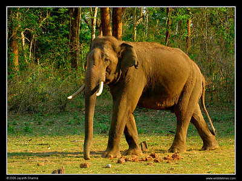

---
aliases:
  - Elephas_maximus
  - Elephas maximus
title: Elephas maximus
---

# Elephas maximus

## Asian Elephant, Indian Elephant 
 

## #has_/text_of_/abstract 

> The Asian elephant (**Elephas maximus**), also known as the Asiatic elephant, is the only living Elephas species. 
> It is the largest living land animal in Asia and the second largest living elephantid in the world. 
> It is characterised by its long trunk with a single finger-like processing; large tusks in males; laterally folded large ears and wrinkled grey skin that is partly depigmented on the trunk, ears or neck. Adult males average 4 t (4.4 short tons) in weight and females 2.7 t (3.0 short tons). It has a large and well developed neocortex of the brain, is highly intelligent and self-aware being able to display behaviours associated with grief, learning and greeting. Three subspecies are recognised—E. m. maximus, E. m. indicus and E. m. sumatranus.
>
> The Asian elephant is distributed in the Indian subcontinent and Southeast Asia, from India in the west to Borneo in the east, and Nepal in the north to Sumatra in the south. It frequently inhabits grasslands, tropical evergreen forests, semi-evergreen forests, moist deciduous forests, dry deciduous forests and dry thorn forests. It is herbivorous, eating about 150 kg (330 lb) of vegetation per day. Cows and calves form groups, while males remain solitary or form "bachelor groups" with other males. During the breeding season, males temporarily join female groups to mate. Wild Asian elephants live to be about 60 years old. While female captive elephants are recorded to have lived beyond 60 years when kept in semi-natural surroundings, Asian elephants die at a much younger age in captivity; captive populations are declining due to a low birth and high death rate.
>
> Since 1986, the Asian elephant has been listed as Endangered on the IUCN Red List, as the population has declined by at least 50 per cent over the last three elephant generations, which is about 60–75 years. It is primarily threatened by loss of habitat, habitat degradation, fragmentation and poaching. The earliest indications of captive use of Asian elephants are engravings on seals of the Indus Valley civilisation dated to the 3rd millennium BC.
>
> [Wikipedia](https://en.wikipedia.org/wiki/Asian%20elephant) 

## Phylogeny 

-   « Ancestral Groups  
    -  [Elephantidae](../Elephantidae.md) 
    -   [proboscidea](../../../../../../../../../../../../../../../bio~Domain/Eukarya/Protist/Apusomonads/Apusomonas/proboscidea.md)
    -  [Eutheria](../../../Eutheria.md) 
    -  [Mammal](../../../../Mammal.md) 
    -   [Therapsida](../../../../../Therapsida.md)
    -   [Synapsida](../../../../../../Synapsida.md)
    -   [Amniota](../../../../../../../Amniota.md)
    -   [Terrestrial Vertebrates](../../../../../../../../Terrestrial.md)
    -   [Sarcopterygii](../../../../../../../../../Sarc.md)
    -   [Gnathostomata](../../../../../../../../../../Gnath.md)
    -   [Vertebrata](../../../../../../../../../../../Vertebrata.md)
    -   [Craniata](../../../../../../../../../../../../Craniata.md)
    -   [Chordata](../../../../../../../../../../../../../Chordata.md)
    -   [Deuterostomia](../../../../../../../../../../../../../../Deutero.md)
    -  [Bilateria](../../../../../../../../../../../../../../../Bilateria.md) 
    -  [Animals](../../../../../../../../../../../../../../../../Animals.md) 
    -  [Eukarya](../../../../../../../../../../../../../../../../../Eukarya.md) 
    -   [Tree of Life](../../../../../../../../../../../../../../../../../Tree_of_Life.md)

-   ◊ Sibling Groups of  Elephantidae
    -   Elephas maximus
    -   [Mammoth](Mammoth.md)
    -   [Loxodonta africana](Loxodonta_africana.md)

-   » Sub-Groups 

## Title Illustrations

  ---------------------------------------------------------------- 
 
  scientific_name ::     Elephas maximus
  location ::           Kabini, Karnataka, India
  specimen_condition ::  Live Specimen
  Source               [Asiatic Elephant](http://flickr.com/photos/jayanthsharma/122357538/)
  Source Collection    [Flickr](http://flickr.com/)
  Image Use ::    [Attribution-NonCommercial-NoDerivs 2.0 Creative Commons License](http://creativecommons.org/licenses/by-nc-nd/2.0/).
  copyright ::            © 2006 [Jayanth Sharma](http://flickr.com/people/jayanthsharma/)

## Confidential Links & Embeds: 

### #is_/same_as :: [[/_Standards/bio/bio~Domain/Eukarya/Animal/Bilateria/Deutero/Chordata/Craniata/Vertebrata/Gnath/Sarc/Tetrapods/Amniota/Synapsida/Therapsida/Mammal/Eutheria/Proboscidea/Elephantidae/Elephas_maximus|Elephas_maximus]] 

### #is_/same_as :: [[/_public/bio/bio~Domain/Eukarya/Animal/Bilateria/Deutero/Chordata/Craniata/Vertebrata/Gnath/Sarc/Tetrapods/Amniota/Synapsida/Therapsida/Mammal/Eutheria/Proboscidea/Elephantidae/Elephas_maximus.public|Elephas_maximus.public]] 

### #is_/same_as :: [[/_internal/bio/bio~Domain/Eukarya/Animal/Bilateria/Deutero/Chordata/Craniata/Vertebrata/Gnath/Sarc/Tetrapods/Amniota/Synapsida/Therapsida/Mammal/Eutheria/Proboscidea/Elephantidae/Elephas_maximus.internal|Elephas_maximus.internal]] 

### #is_/same_as :: [[/_protect/bio/bio~Domain/Eukarya/Animal/Bilateria/Deutero/Chordata/Craniata/Vertebrata/Gnath/Sarc/Tetrapods/Amniota/Synapsida/Therapsida/Mammal/Eutheria/Proboscidea/Elephantidae/Elephas_maximus.protect|Elephas_maximus.protect]] 

### #is_/same_as :: [[/_private/bio/bio~Domain/Eukarya/Animal/Bilateria/Deutero/Chordata/Craniata/Vertebrata/Gnath/Sarc/Tetrapods/Amniota/Synapsida/Therapsida/Mammal/Eutheria/Proboscidea/Elephantidae/Elephas_maximus.private|Elephas_maximus.private]] 

### #is_/same_as :: [[/_personal/bio/bio~Domain/Eukarya/Animal/Bilateria/Deutero/Chordata/Craniata/Vertebrata/Gnath/Sarc/Tetrapods/Amniota/Synapsida/Therapsida/Mammal/Eutheria/Proboscidea/Elephantidae/Elephas_maximus.personal|Elephas_maximus.personal]] 

### #is_/same_as :: [[/_secret/bio/bio~Domain/Eukarya/Animal/Bilateria/Deutero/Chordata/Craniata/Vertebrata/Gnath/Sarc/Tetrapods/Amniota/Synapsida/Therapsida/Mammal/Eutheria/Proboscidea/Elephantidae/Elephas_maximus.secret|Elephas_maximus.secret]] 

