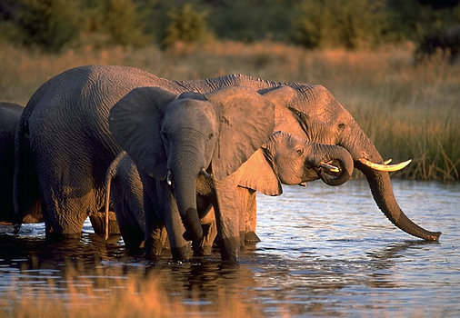

# Loxodonta africana

## African Elephant 
)

### Information on the Internet

-   [IUCN/SSC African Elephant Specialist     Group](http://iucn.org/themes/ssc/sgs/afesg/).
-   [Elephant Information Repository](http://elephant.elehost.com/).
-   [Save the Elephants](http://www.savetheelephants.org/).
-   [The Elephants of Cameroon](http://nczooeletrack.org/). North
    Carolina Zoological Park.
-   [Nature: The Elephants of     Africa](http://www.pbs.org/wnet/nature/elephants/index.html). PBS
    online.

## Phylogeny 

-   « Ancestral Groups  
    -  [Elephantidae](../Elephantidae.md))
    -   [proboscidea](../../../../../../../../../../../../../../../bio~Domain/Eukarya/Protist/Apusomonads/Apusomonas/proboscidea.md)
    -  [Eutheria](../../../Eutheria.md))
    -  [Mammal](../../../../Mammal.md))
    -   [Therapsida](../../../../../Therapsida.md)
    -   [Synapsida](../../../../../../Synapsida.md)
    -   [Amniota](../../../../../../../Amniota.md)
    -   [Terrestrial Vertebrates](../../../../../../../../Terrestrial.md)
    -   [Sarcopterygii](../../../../../../../../../Sarc.md)
    -   [Gnathostomata](../../../../../../../../../../Gnath.md)
    -   [Vertebrata](../../../../../../../../../../../Vertebrata.md)
    -   [Craniata](../../../../../../../../../../../../Craniata.md)
    -   [Chordata](../../../../../../../../../../../../../Chordata.md)
    -   [Deuterostomia](../../../../../../../../../../../../../../Deutero.md)
    -  [Bilateria](../../../../../../../../../../../../../../../Bilateria.md))
    -  [Animals](../../../../../../../../../../../../../../../../Animals.md))
    -  [Eukarya](../../../../../../../../../../../../../../../../../Eukarya.md))
    -   [Tree of Life](../../../../../../../../../../../../../../../../../Tree_of_Life.md)

-   ◊ Sibling Groups of  Elephantidae
    -   [Elephas maximus](Elephas_maximus.md)
    -   [Mammoth](Mammoth.md)
    -   Loxodonta africana

-   » Sub-Groups 

## Title Illustrations

------------------------------------------------------------------------------)
Scientific Name ::  Loxodonta africana
Location ::        Khwai, Okavango Delta, Botswana
Comments          elephant breeding herd
Copyright ::         © 2000 [Greg and Marybeth Dimijian](http://www.dimijianimages.com/) 

## Confidential Links & Embeds: 

### #is_/same_as :: [Loxodonta_africana](/_Standards/bio/bio~Domain/Eukarya/Animal/Bilateria/Deutero/Chordata/Craniata/Vertebrata/Gnath/Sarc/Tetrapods/Amniota/Synapsida/Therapsida/Mammal/Eutheria/Proboscidea/Elephantidae/Loxodonta_africana.md) 

### #is_/same_as :: [Loxodonta_africana.public](/_public/bio/bio~Domain/Eukarya/Animal/Bilateria/Deutero/Chordata/Craniata/Vertebrata/Gnath/Sarc/Tetrapods/Amniota/Synapsida/Therapsida/Mammal/Eutheria/Proboscidea/Elephantidae/Loxodonta_africana.public.md) 

### #is_/same_as :: [Loxodonta_africana.internal](/_internal/bio/bio~Domain/Eukarya/Animal/Bilateria/Deutero/Chordata/Craniata/Vertebrata/Gnath/Sarc/Tetrapods/Amniota/Synapsida/Therapsida/Mammal/Eutheria/Proboscidea/Elephantidae/Loxodonta_africana.internal.md) 

### #is_/same_as :: [Loxodonta_africana.protect](/_protect/bio/bio~Domain/Eukarya/Animal/Bilateria/Deutero/Chordata/Craniata/Vertebrata/Gnath/Sarc/Tetrapods/Amniota/Synapsida/Therapsida/Mammal/Eutheria/Proboscidea/Elephantidae/Loxodonta_africana.protect.md) 

### #is_/same_as :: [Loxodonta_africana.private](/_private/bio/bio~Domain/Eukarya/Animal/Bilateria/Deutero/Chordata/Craniata/Vertebrata/Gnath/Sarc/Tetrapods/Amniota/Synapsida/Therapsida/Mammal/Eutheria/Proboscidea/Elephantidae/Loxodonta_africana.private.md) 

### #is_/same_as :: [Loxodonta_africana.personal](/_personal/bio/bio~Domain/Eukarya/Animal/Bilateria/Deutero/Chordata/Craniata/Vertebrata/Gnath/Sarc/Tetrapods/Amniota/Synapsida/Therapsida/Mammal/Eutheria/Proboscidea/Elephantidae/Loxodonta_africana.personal.md) 

### #is_/same_as :: [Loxodonta_africana.secret](/_secret/bio/bio~Domain/Eukarya/Animal/Bilateria/Deutero/Chordata/Craniata/Vertebrata/Gnath/Sarc/Tetrapods/Amniota/Synapsida/Therapsida/Mammal/Eutheria/Proboscidea/Elephantidae/Loxodonta_africana.secret.md)

