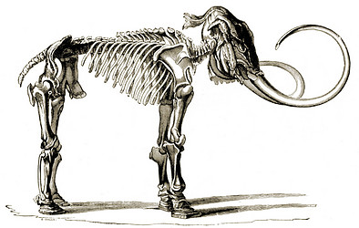

---
aliases:
- Dòng-mò̤-chiông
- Kiḷigvak
- Loðfíll
- mamat
- Mammoet
- Mammoeten
- Mammoth
- Mammoths
- Mammout
- mammouth
- mammut
- mammutar
- Mammute
- mammuteh
- mammuter
- Mammuth
- Mammuthus
- Mammuthus primigenius
- mammutit
- Mammuts
- Mammutur
- mammuutt
- Mamont
- Mamot
- Mamoth
- Mamut
- Mamutas
- Mamute
- Mamuti
- Mamuto
- Mamuuten
- Mamût
- melmakoleem
- Voi ma mút
- Μαμούθ
- Арсалан заан
- Арслан заан
- Арслң зан
- Асланбыҭә
- Мааманнар
- Маманты
- Мамонт
- Мамонтсем
- мамонттæ
- Мамонттар
- мамонты
- мамут
- мамути
- Мукöр
- Торос
- մամոնտ
- ממותה
- الماموث
- ماموت
- ماموث
- مامۆت
- میمتھ
- मैमथ
- म्यामथ
- ম্যামথ
- மாமூத்
- మామత్
- ಮ್ಯಾಮತ್
- മാമത്ത്
- මැමත් අලි
- ช้างแมมมอธ
- ຊ້າງຂົນຍາວ
- မမ္မတ်ဆင်ကြီး
- მამონტი
- ቀንደ መሬት
- マンモス
- 猛犸象
- 猛犸象属
- 猛獁象屬
- 長毛象
- 맘모스
- 매머드
title: Mammuthus
has_id_wikidata: Q36715
dv_has_:
  name_:
    ab: Асланбыҭә
    af: Mammoet
    alt: Торос
    am: ቀንደ መሬት
    ar: ماموث
    arz: الماموث
    ast: Mammuthus primigenius
    avk: melmakoleem
    az: Mamont
    ba: Мамонттар
    ban: Mamut
    bcl: Mammoth
    be: Маманты
    be_tarask: Маманты
    bg: мамути
    bn: ম্যামথ
    br: Mammout
    bs: Mamut
    bxr: Арсалан заан
    ca: mamut
    cdo: Dòng-mò̤-chiông
    ceb: Mammuthus
    ckb: مامۆت
    cs: mamut
    cv: Мамонтсем
    cy: Mamoth
    da: Mammut
    de: Mammute
    de_ch: Mammuts
    el: Μαμούθ
    en: mammoth
    eo: Mamuto
    es: Mammuthus
    et: mammut
    eu: Mamut
    fa: ماموت
    fi: mammutit
    fo: Mammutur
    fr: mammouth
    frr: Mamuuten
    fy: Mammoeten
    ga: mamat
    gd: Mamot
    gl: mamut
    gsw: Mammuts
    he: ממותה
    hi: मैमथ
    hr: Mamuti
    hu: mamut
    hy: մամոնտ
    ia: Mammut
    id: Mamut
    ik: Kiḷigvak
    io: Mamuto
    is: Loðfíll
    it: Mammuthus
    ja: マンモス
    jv: Mamut
    ka: მამონტი
    kk: Мамонттар
    kn: ಮ್ಯಾಮತ್
    ko: 매머드
    koi: Мукöр
    ko-kp: 맘모스
    ku: Mamût
    kw: Mamoth
    ky: Мамонт
    la: Mammuthus
    lfn: Mamut
    lld: Mammut
    lo: ຊ້າງຂົນຍາວ
    lt: Mamutas
    lv: Mamuti
    lzh: 長毛象
    mk: Мамут
    ml: മാമത്ത്
    mn: Арслан заан
    ms: Mammoth
    mul: Mammuthus
    my: မမ္မတ်ဆင်ကြီး
    mzn: ماموت
    nah: Mamut
    nan: Mammoth
    nb: mammuter
    new: म्यामथ
    nl: mammoeten
    nn: mammut
    oc: Mamot
    os: мамонттæ
    pl: mamut
    pnb: میمتھ
    ps: ماموت
    pt: Mamute
    pt_br: Mamute
    qu: Mamut
    ro: Mamut
    ru: мамонты
    sah: Мааманнар
    scn: Mammuth
    sco: Mammoth
    sh: Mamut
    si: මැමත් අලි
    sk: Mamut
    sl: mamut
    smn: mammuteh
    sms: mammuutt
    sq: Mammuthus
    sr: мамут
    stq: Mammute
    sv: mammutar
    ta: மாமூத்
    te: మామత్
    th: ช้างแมมมอธ
    tl: Mammuthus
    tr: Mamut
    uk: Мамут
    ur: میمتھ
    uz: Mamont
    vi: Voi ma mút
    vro: Mamut
    war: Mammuthus
    wuu: 猛犸象
    xal: Арслң зан
    yue: 長毛象
    zh: 猛犸象属
    zh_cn: 猛犸象属
    zh_hans: 猛犸象属
    zh_tw: 猛獁象屬
---
# [[Mammoth]] 

Mammoths 

 

## #has_/text_of_/abstract 

> A mammoth is any species of the extinct elephantid genus **Mammuthus**. They lived from the late Miocene epoch (from around 6.2 million years ago) into the Holocene until about 4,000 years ago, with mammoth species at various times inhabiting Africa, Asia, Europe, and North America. Mammoths are distinguished from living elephants by their (typically large) spirally twisted tusks and in some later species, the development of numerous adaptions to living in cold environments, including a thick layer of fur.
>
> Mammoths and Asian elephants are more closely related to each other than they are to African elephants. The oldest mammoth representative, Mammuthus subplanifrons, appeared around 6 million years ago during the late Miocene in what is now southern and Eastern Africa. Later in the Pliocene, by about three million years ago, mammoths dispersed into Eurasia, eventually covering most of Eurasia before migrating into North America around 1.5–1.3 million years ago, becoming ancestral to the Columbian mammoth (M. columbi). The woolly mammoth (M. primigenius) evolved about 700–400,000 years ago in Siberia, with some surviving on Russia's Wrangel Island in the Arctic Ocean until as recently as 4,000 years ago, still extant during the existence of the earliest civilisations in ancient Egypt and Mesopotamia.
>
> [Wikipedia](https://en.wikipedia.org/wiki/Mammoth) 

## Phylogeny 

-   « Ancestral Groups  
    -  [Elephantidae](../Elephantidae.md) 
    -   [proboscidea](../../../../../../../../../../../../../../../bio~Domain/Eukarya/Protist/Apusomonads/Apusomonas/proboscidea.md)
    -  [Eutheria](../../../Eutheria.md) 
    -  [Mammal](../../../../Mammal.md) 
    -   [Therapsida](../../../../../Therapsida.md)
    -   [Synapsida](../../../../../../Synapsida.md)
    -   [Amniota](../../../../../../../Amniota.md)
    -   [Terrestrial Vertebrates](../../../../../../../../Terrestrial.md)
    -   [Sarcopterygii](../../../../../../../../../Sarc.md)
    -   [Gnathostomata](../../../../../../../../../../Gnath.md)
    -   [Vertebrata](../../../../../../../../../../../Vertebrata.md)
    -   [Craniata](../../../../../../../../../../../../Craniata.md)
    -   [Chordata](../../../../../../../../../../../../../Chordata.md)
    -   [Deuterostomia](../../../../../../../../../../../../../../Deutero.md)
    -  [Bilateria](../../../../../../../../../../../../../../../Bilateria.md) 
    -  [Animals](../../../../../../../../../../../../../../../../Animals.md) 
    -  [Eukarya](../../../../../../../../../../../../../../../../../Eukarya.md) 
    -   [Tree of Life](../../../../../../../../../../../../../../../../../Tree_of_Life.md)

-   ◊ Sibling Groups of  Elephantidae
    -   [Elephas maximus](Elephas_maximus.md)
    -   Mammuthus
    -   [Loxodonta africana](Loxodonta_africana.md)

-   » Sub-Groups 

	-   *Mammuthus columbi* †
	    [(Columbian mammoth)]
	-   *Mammuthus exilis* † [(pygmy
	    mammoth)]
	-   *Mammuthus jeffersonii* †
	    [(Jefferson\'s mammoth)]
	-   *Mammuthus lamarmorae* †
	    [(Sardinian dwarf mammoth)]
	-   *Mammuthus meridionalis* †
	-   *Mammuthus primigenius* †
	    [(woolly mammoth)]

### Information on the Internet

-   [What Killed the     Mammoths?](http://sciencebulletins.amnh.org/biobulletin/biobulletin/story981.html).
    American Museum of Natural History.
-   [Mammoth Site of Hot Springs, SD](http://www.mammothsite.com/).

## Title Illustrations

---------------------------------------------------------------------------------------

scientific_name ::     Mammuthus
location ::           Siberia
Comments             The skeleton of the Mammoth found frozen in Siberia and now in the museum of St. Petersburg. A good deal of the flesh and skin is preserved in a dried state on the head, whilst the feet are still encased in the great leathery pads which hide the separate toes.
Reference            Lankester, E. R. 1905. Extinct Animals. Archibald Constable & Co. Ltd., London
specimen_condition ::  Fossil
Body Part            skeleton
View                 lateral

## Confidential Links & Embeds: 

### #is_/same_as :: [[/_Standards/bio/bio~Domain/Eukarya/Animal/Bilateria/Deutero/Chordata/Craniata/Vertebrata/Gnath/Sarc/Tetrapods/Amniota/Synapsida/Therapsida/Mammal/Eutheria/Proboscidea/Elephantidae/Mammoth|Mammoth]] 

### #is_/same_as :: [[/_public/bio/bio~Domain/Eukarya/Animal/Bilateria/Deutero/Chordata/Craniata/Vertebrata/Gnath/Sarc/Tetrapods/Amniota/Synapsida/Therapsida/Mammal/Eutheria/Proboscidea/Elephantidae/Mammoth.public|Mammoth.public]] 

### #is_/same_as :: [[/_internal/bio/bio~Domain/Eukarya/Animal/Bilateria/Deutero/Chordata/Craniata/Vertebrata/Gnath/Sarc/Tetrapods/Amniota/Synapsida/Therapsida/Mammal/Eutheria/Proboscidea/Elephantidae/Mammoth.internal|Mammoth.internal]] 

### #is_/same_as :: [[/_protect/bio/bio~Domain/Eukarya/Animal/Bilateria/Deutero/Chordata/Craniata/Vertebrata/Gnath/Sarc/Tetrapods/Amniota/Synapsida/Therapsida/Mammal/Eutheria/Proboscidea/Elephantidae/Mammoth.protect|Mammoth.protect]] 

### #is_/same_as :: [[/_private/bio/bio~Domain/Eukarya/Animal/Bilateria/Deutero/Chordata/Craniata/Vertebrata/Gnath/Sarc/Tetrapods/Amniota/Synapsida/Therapsida/Mammal/Eutheria/Proboscidea/Elephantidae/Mammoth.private|Mammoth.private]] 

### #is_/same_as :: [[/_personal/bio/bio~Domain/Eukarya/Animal/Bilateria/Deutero/Chordata/Craniata/Vertebrata/Gnath/Sarc/Tetrapods/Amniota/Synapsida/Therapsida/Mammal/Eutheria/Proboscidea/Elephantidae/Mammoth.personal|Mammoth.personal]] 

### #is_/same_as :: [[/_secret/bio/bio~Domain/Eukarya/Animal/Bilateria/Deutero/Chordata/Craniata/Vertebrata/Gnath/Sarc/Tetrapods/Amniota/Synapsida/Therapsida/Mammal/Eutheria/Proboscidea/Elephantidae/Mammoth.secret|Mammoth.secret]] 

