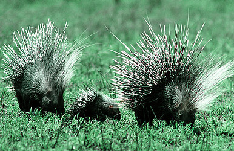
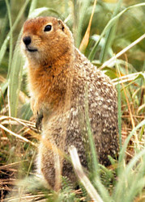

---
aliases:
- Biby mpikiky
- Bộ Gặm nhấm
- ciebanat
- Cnofil
- Creimiche
- creimire
- Giat-khí-lūi
- Glodari
- Glodavci
- Gnaagdeerter
- gnagarar
- gnagare
- 'Gnagare (föråldrat: enkeltandade gnagare)'
- Gnagdýr
- gnagenddēor
- Gnagere
- Gnaudiarten
- Gnauedierte
- Gnavere
- grauzēji
- Graužikai
- Graužėkā
- Grugeux
- Gryzarje
- Gryzonie
- Gəmiricilər
- hewan pengerat
- Hlodavce
- hlodavci
- Hrymzaki
- Héwan kerat-kerit
- Iziququdi
- jursseeh
- Jyrsijät
- Karraskari
- kemirici
- Kemiriciler
- Kemiruvchilar
- Khankiq
- Kjifdieren
- Knaagdier
- Knaagdiere
- Knaagdieren
- Knabberdéieren
- Knaogdiere
- Knivil
- Knoagbeestn
- Koma kojeran
- Krigner
- Kéwan kekrikitan
- Mangungutkut
- nagdýr
- Nager
- Nagetiere
- Nogeviecha
- Nyama ekokɛ́kɛkɛ
- Näriline
- närilised
- Nühtajad
- Oñapi'ũva
- Qurxumsoo
- Rawiant
- Rescecature
- Rodensia
- Rodensya
- Rodent
- Rodente
- Rodentia
- Rodents
- Rodero
- Roditoï
- Roedor
- Roedores
- Rongeur
- Ronĝuloj
- Rosegador
- rosegadors
- Rosegaires
- Rozătoare
- Rágcsálók
- Sebadadunol (Rodentia)
- Timseɣẓaẓ
- Tsin Deigházhígíí
- Æхсынджытæ
- Τρωκτικά
- глодари
- глодачи
- Гризачи
- Гризуни
- Грызуны
- Йириссез
- Кăшлакансем
- Кеміргіштер
- Кемирүүчүлөр
- Кимереүселәр
- кимерүчеләр
- Кэрбээччилэр аймахтара
- мишоподібні
- Мэрэгч
- Мэрээшэн
- Ньымыштшы
- Хоянда
- Царгаш-йIаьха дийнаташ
- Կրծողներ
- מכרסמים
- נאגער
- القوراض
- جوندگان
- خورۆکەکان
- قوارض
- کترنے والا
- کترے میمل
- گمیریجیلر
- कुरतडणारे प्राणी
- कृंतक
- छुँ (रोदेन्त)
- लोखर्के
- তীক্ষ্ণদন্তী
- তীক্ষ্ণদন্তী প্ৰাণী
- ਕੁਤਰਦੰਦੀ ਜੀਵ
- કૃંતક
- கொறிணி
- రోడెన్షియా
- ದಂಶಕ
- കരണ്ടുതീനി
- สัตว์ฟันแทะ
- อันดับสัตว์ฟันแทะ
- ကိုက်ဖြတ် သတ္တဝါ
- მღრღნელები
- ዘራይጥ
- ネズミ目
- 啮齿目
- 嚙齒目
- 설치류
- 설치목(齧齒目)
- 쥐목
has_id_wikidata: Q10850
code_of_nomenclature: '[[_Standards/WikiData/WD~International_Code_of_Zoological_Nomenclature,13011]]'
Commons_category: Rodentia
described_by_source:
- '[[../../../../../../../../../../../../../../../../../WikiData/WD~Brockhaus_and_Efron_Encyclopedic_Dictionary,602358]]'
- '[[_Standards/WikiData/WD~Encyclopædia_Britannica_11th_edition,867541]]'
- '[[_Standards/WikiData/WD~Small_Brockhaus_and_Efron_Encyclopedic_Dictionary,19180675]]'
- '[[_Standards/WikiData/WD~Meyers_Konversations-Lexikon,_4th_edition_(1885–1890),19219752]]'
- '[[_Standards/WikiData/WD~Armenian_Soviet_Encyclopedia,_vol._5,124737632]]'
EPPO_Code: 1RODEO
GS1_GPC_code: 10005455
Iconclass_notation: 25F26
image: http://commons.wikimedia.org/wiki/Special:FilePath/Tamias%20striatus%20CT.jpg
inception: -66000000-01-01
instance_of:
- '[[_Standards/WikiData/WD~taxon,16521]]'
ITIS_TSN: 180130
Krugosvet_article: nauka_i_tehnika/biologiya/GRIZUNI.html
main_food_source: '[[_Standards/WikiData/WD~herbaceous_plant,190903]]'
MeSH_tree_code: B01.050.150.900.649.313.992
montage_image: http://commons.wikimedia.org/wiki/Special:FilePath/Rodent%20collage.png
natural_reservoir_of: '[[_Standards/WikiData/WD~Leishmania,524818]]'
NBN_System_Key: NHMSYS0000376181
OmegaWiki_Defined_Meaning: 3268
parent_taxon:
- '[[_Standards/WikiData/WD~Glires,660432]]'
- '[[_Standards/WikiData/WD~Simplicidentata,7520911]]'
start_time: -56000000-01-01
studied_in:
- '[[_Standards/WikiData/WD~rodentology,76749558]]'
subclass_of: '[[_Standards/WikiData/WD~fur-bearing_animal,12366542]]'
taxon_common_name:
- Rosegador
- Roedor
- Rodents
- القوراض
- Грызуны
- Гризачи
- hlodavci
- Gnavere
- Nagetiere
- Ronĝuloj
- Näriline
- Jyrsijät
- Rongeur
- Gnaudiarten
- creimire
- מכרסמים
- Glodavci
- Rágcsálók
- Կրծողներ
- ネズミ目
- მღრღნელები
- 설치목(齧齒目)
- 쥐목
- Knaagdiere
- Roditoï
- глодачи
- Gnagere
- Knaagdieren
- Gryzonie
- Roedores
- Hlodavce
- 'Gnagare (föråldrat: enkeltandade gnagare)'
- สัตว์ฟันแทะ
- Kemiriciler
- Гризуни
- 啮齿目
taxon_name: Rodentia
taxon_rank: '[[_Standards/WikiData/WD~order,36602]]'
this_taxon_is_source_of: '[[_Standards/WikiData/WD~rodent_meat,124815478]]'
title: Rodentia
topic_s_main_Wikimedia_portal: '[[_Standards/WikiData/WD~Q42351419,42351419]]'
U_S_National_Archives_Identifier:
- 10647853
dv_has_:
  name_:
    af: Knaagdier
    am: ዘራይጥ
    an: Rodentia
    ang: gnagenddēor
    ar: قوارض
    ary: قوارض
    arz: قوارض
    as: তীক্ষ্ণদন্তী প্ৰাণী
    ast: Rodentia
    avk: Sebadadunol (Rodentia)
    az: Gəmiricilər
    azb: گمیریجیلر
    ba: Кимереүселәр
    bar: Nogeviecha
    be: грызуны
    be-tarask: грызуны
    bew: Héwan kerat-kerit
    bg: гризачи
    bn: তীক্ষ্ণদন্তী
    br: Krigner
    bs: Glodari
    bxr: Мэрээшэн
    ca: rosegadors
    ceb: Mangungutkut
    ckb: خورۆکەکان
    crh: kemirici
    cs: hlodavci
    cv: Кăшлакансем
    cy: Cnofil
    da: Gnavere
    de: Nagetiere
    dsb: Gryzarje
    el: Τρωκτικά
    en: Rodentia
    en-ca: Rodent
    en-gb: rodent
    en-us: rodents
    eo: Ronĝuloj
    es: Rodentia
    et: närilised
    eu: Karraskari
    ext: Rodentia
    fa: جوندگان
    fi: jyrsijät
    fo: Gnagdýr
    fr: Rodentia
    frr: Gnaudiarten
    fy: Kjifdieren
    ga: Rodentia
    gd: Creimiche
    gl: roedores
    gn: Oñapi'ũva
    gsw: Nager
    gu: કૃંતક
    ha: Rodentia
    he: מכרסמים
    hi: कृंतक
    hif: Rodent
    hr: Glodavci
    hsb: Hrymzaki
    hu: rágcsálók
    hy: կրծողներ
    ia: Rodentia
    id: hewan pengerat
    ie: Rodentia
    inh: Царгаш-йIаьха дийнаташ
    io: Rodero
    is: nagdýr
    it: Rodentia
    ja: ネズミ目
    jv: Kéwan kekrikitan
    ka: მღრღნელები
    kab: Timseɣẓaẓ
    kk: Кеміргіштер
    kn: ದಂಶಕ
    ko: 설치류
    koi: Йириссез
    ku: Koma kojeran
    kw: Knivil
    ky: Кемирүүчүлөр
    la: Rodentia
    lb: Knabberdéieren
    lfn: Rodente
    li: Knaogdiere
    lij: Rodentia
    lmo: Rodentia
    ln: Nyama ekokɛ́kɛkɛ
    lt: Graužikai
    lv: grauzēji
    mg: Biby mpikiky
    mk: глодачи
    ml: കരണ്ടുതീനി
    mn: Мэрэгч
    mr: कुरतडणारे प्राणी
    mrj: Ньымыштшы
    ms: Rodensia
    mt: Rodentia
    mul: Rodentia
    my: ကိုက်ဖြတ် သတ္တဝါ
    nan: Giat-khí-lūi
    nap: Rescecature
    nb: gnagere
    nds: Gnaagdeerter
    nds-nl: Rodentia
    ne: लोखर्के
    new: छुँ (रोदेन्त)
    nl: knaagdieren
    nn: gnagarar
    nov: Rodentia
    nrm: Grugeux
    nv: Tsin Deigházhígíí
    oc: Rosegaires
    om: Qurxumsoo
    os: Æхсынджытæ
    pa: ਕੁਤਰਦੰਦੀ ਜੀਵ
    pl: gryzonie
    pms: Rodentia
    pnb: کترے میمل
    pt: Roedores
    pt-br: Roedores
    qu: Khankiq
    ro: Rozătoare
    ru: грызуны
    sah: Кэрбээччилэр аймахтара
    sco: rodent
    se: ciebanat
    sgs: Graužėkā
    sh: Glodavci
    sk: Hlodavce
    sl: glodavci
    smn: jursseeh
    sq: Rodentia
    sr: глодари
    stq: Gnauedierte
    sv: gnagare
    sw: Rodentia
    ta: கொறிணி
    te: రోడెన్షియా
    tg: Хоянда
    th: อันดับสัตว์ฟันแทะ
    tl: Rodentia
    tr: kemiriciler
    tt: кимерүчеләр
    uk: мишоподібні
    ur: کترنے والا
    uz: Kemiruvchilar
    vec: Rodentia
    vep: Nühtajad
    vi: Bộ Gặm nhấm
    vls: Knoagbeestn
    vo: Rodentia
    wa: Rawiant
    war: Rodensya
    wuu: 啮齿目
    yi: נאגער
    yue: 嚙齒目
    zh: 啮齿目
    zh-cn: 啮齿目
    zh-hans: 啮齿目
    zh-hk: 嚙齒目
    zh-tw: 嚙齒目
    zu: Iziququdi
---
# Rodentia

#is_/same_as :: [[../../../../../../../../../../../../../../../../../WikiData/WD~Rodentia,10850|WD~Rodentia,10850]] 

## Rodents: mice, rats, hamsters, squirrels, gophers, porcupines, beavers, etc. 

 

## #has_/text_of_/abstract 

> **Rodent**s (from Latin rodere, 'to gnaw') are mammals of the order Rodentia ( roh-DEN-shə), 
> which are characterized by a single pair of continuously growing incisors 
> in each of the upper and lower jaws. About 40% of all mammal species are rodents. 
> 
> They are native to all major land masses except for Antarctica, and several oceanic islands, though they have subsequently been introduced to most of these land masses by human activity.
>
> Rodents are extremely diverse in their ecology and lifestyles and can be found in almost every terrestrial habitat, including human-made environments. Species can be arboreal, fossorial (burrowing), saltatorial/ricochetal (leaping on their hind legs), or semiaquatic. However, all rodents share several morphological features, including having only a single upper and lower pair of ever-growing incisors. Well-known rodents include mice, rats, squirrels, prairie dogs, porcupines, beavers, guinea pigs, and hamsters. However, rabbits, hares, and pikas, which also have incisors that grow continuously (but have two pairs of upper incisors instead of one), were once included with rodents, but are now considered to be in a separate order, the Lagomorpha. Nonetheless, Rodentia and Lagomorpha are sister groups, sharing a single common ancestor and forming the clade of Glires.
>
> Most rodents are small animals with robust bodies, short limbs, and long tails. They use their sharp incisors to gnaw food, excavate burrows, and defend themselves. Most eat seeds or other plant material, but some have more varied diets. They tend to be social animals and many species live in societies with complex ways of communicating with each other. Mating among rodents can vary from monogamy, to polygyny, to promiscuity. Many have litters of underdeveloped, altricial young, while others are precocial (relatively well developed) at birth.
>
> The rodent fossil record dates back to the Paleocene on the supercontinent of Laurasia. Rodents greatly diversified in the Eocene, as they spread across continents, sometimes even crossing oceans. Rodents reached both South America and Madagascar from Africa and, until the arrival of Homo sapiens, were the only terrestrial placental mammals to reach and colonize Australia.
>
> Rodents have been used as food, for clothing, as pets, and as laboratory animals in research. Some species, in particular, the brown rat, the black rat, and the house mouse, are serious pests, eating and spoiling food stored by humans and spreading diseases. Accidentally introduced species of rodents are often considered to be invasive and have caused the extinction of numerous species, such as island birds, the dodo being an example, previously isolated from land-based predators.
>
> [Wikipedia](https://en.wikipedia.org/wiki/Rodent) 

### Information on the Internet

-   [Rodentia](http://animaldiversity.ummz.umich.edu/chordata/mammalia/rodentia.html).
    Animal Diversity Web. University of Michigan Museum of Zoology.
-   [The Mammals of Texas:     Rodents](http://www.nsrl.ttu.edu/tmot1/ordroden.htm).
-   [Rodent Genome     Databases](http://www.cbi.pku.edu.cn/mirror/GenomeWeb/rodent-gen-db.html).
-   [The Rodent     Zone](http://members.tripod.com/%7ECloveApple/rodent.html).
-   [The Squirrel Place](http://www.squirrels.org/).
-   [International Marmot     Network](http://cons-dev.univ-lyon1.fr/MARMOTTE/MARMOT.EN/marmotnetwork.html).
-   [National Gerbil Society (UK)](http://www.rodent.demon.co.uk/).
-   [The Dormouse Hollow](http://www.glirarium.de/dormouse/).
-   [The Capybara Page](http://www.rebsig.com/capybara/).

## Phylogeny 

-   « Ancestral Groups  
    -  [Eutheria](../Eutheria.md) 
    -  [Mammal](../../Mammal.md) 
    -   [Therapsida](../../../Therapsida.md)
    -   [Synapsida](../../../../Synapsida.md)
    -   [Amniota](../../../../../Amniota.md)
    -   [Terrestrial Vertebrates](../../../../../../Terrestrial.md)
    -   [Sarcopterygii](../../../../../../../Sarc.md)
    -   [Gnathostomata](../../../../../../../../Gnath.md)
    -   [Vertebrata](../../../../../../../../../Vertebrata.md)
    -   [Craniata](../../../../../../../../../../Craniata.md)
    -   [Chordata](../../../../../../../../../../../Chordata.md)
    -   [Deuterostomia](../../../../../../../../../../../../Deutero.md)
    -  [Bilateria](../../../../../../../../../../../../../Bilateria.md) 
    -  [Animals](../../../../../../../../../../../../../../Animals.md) 
    -  [Eukarya](../../../../../../../../../../../../../../../Eukarya.md) 
    -   [Tree of Life](../../../../../../../../../../../../../../../Tree_of_Life.md)

-   ◊ Sibling Groups of  Eutheria
    -   [Edentata](Edentata.md)
    -   [Pholidota](Pholidota.md)
    -  [Lagomorpha](Glires/Lagomorpha.md) 
    -   Rodentia
    -   [Macroscelididae](Macroscelididae.md)
    -   [Primates](Primates.md)
    -   [Scandentia](Scandentia.md)
    -   [Bat](Bat.md)
    -   [Dermoptera](Dermoptera.md)
    -   [Insectivora](Insectivora.md)
    -   [Carnivora](Carnivora.md)
    -   [Artiodactyla](Artiodactyla.md)
    -   [Whale](Whale.md)
    -   [Tubulidentata](Tubulidentata.md)
    -   [Perissodactyla](Perissodactyla.md)
    -   [Hyracoidea](Hyracoidea.md)
    -   [Sirenia](Sirenia.md)
    -   [Proboscidea](Eukarya/Animal/Bilateria/Deutero/Chordata/Craniata/Vertebrata/Gnath/Sarc/Terrestrial/Amniota/Synapsida/Therapsida/Mammal/Eutheria/Proboscidea.md)

-   » Sub-Groups
    -  [Muroidea](Rodentia/Muroidea.md) 
    -   [Squirrel](Rodentia/Sciuromorpha/Squirrel.md)

## Title Illustrations

------------------------------------------------------------------------- 
 
scientific_name ::     Hystrix cristata
location ::           Serengeti National Park
Comments             This was an unusual sighting, not only of a pair with young, but in open country at mid-day. Crested porcupines are mainly nocturnal.
specimen_condition ::  Live Specimen
Identified By        David Bygott
Behavior             Parental
Sex ::                Presumed pair
Life Cycle Stage ::     Adults and young
View                 Frontal/lateral
copyright ::            © 2005 [David Bygott](mailto:davidbygott@yahoo.com) 

------------------------------------------------------------------------- 
 
scientific_name ::     Spermophilus parryii
Comments             Arctic ground squirrel
Creator              Jim McCarthy
Acknowledgements     Photograph courtesy of the U.S. Fish and Wildlife Service
specimen_condition ::  Live Specimen

## Confidential Links & Embeds: 

### #is_/same_as :: [[/_Standards/bio/bio~Domain/Eukarya/Animal/Bilateria/Deutero/Chordata/Craniata/Vertebrata/Gnath/Sarc/Tetrapods/Amniota/Synapsida/Therapsida/Mammal/Eutheria/Rodentia|Rodentia]] 

### #is_/same_as :: [[/_public/bio/bio~Domain/Eukarya/Animal/Bilateria/Deutero/Chordata/Craniata/Vertebrata/Gnath/Sarc/Tetrapods/Amniota/Synapsida/Therapsida/Mammal/Eutheria/Rodentia.public|Rodentia.public]] 

### #is_/same_as :: [[/_internal/bio/bio~Domain/Eukarya/Animal/Bilateria/Deutero/Chordata/Craniata/Vertebrata/Gnath/Sarc/Tetrapods/Amniota/Synapsida/Therapsida/Mammal/Eutheria/Rodentia.internal|Rodentia.internal]] 

### #is_/same_as :: [[/_protect/bio/bio~Domain/Eukarya/Animal/Bilateria/Deutero/Chordata/Craniata/Vertebrata/Gnath/Sarc/Tetrapods/Amniota/Synapsida/Therapsida/Mammal/Eutheria/Rodentia.protect|Rodentia.protect]] 

### #is_/same_as :: [[/_private/bio/bio~Domain/Eukarya/Animal/Bilateria/Deutero/Chordata/Craniata/Vertebrata/Gnath/Sarc/Tetrapods/Amniota/Synapsida/Therapsida/Mammal/Eutheria/Rodentia.private|Rodentia.private]] 

### #is_/same_as :: [[/_personal/bio/bio~Domain/Eukarya/Animal/Bilateria/Deutero/Chordata/Craniata/Vertebrata/Gnath/Sarc/Tetrapods/Amniota/Synapsida/Therapsida/Mammal/Eutheria/Rodentia.personal|Rodentia.personal]] 

### #is_/same_as :: [[/_secret/bio/bio~Domain/Eukarya/Animal/Bilateria/Deutero/Chordata/Craniata/Vertebrata/Gnath/Sarc/Tetrapods/Amniota/Synapsida/Therapsida/Mammal/Eutheria/Rodentia.secret|Rodentia.secret]] 

