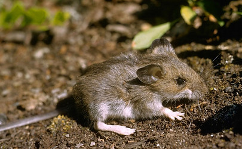

---
aliases:
has_id_wikidata: Q58949
title: Muroidea
described_by_source: "[[_Standards/WikiData/WD~Gujin_Tushu_Jicheng,1768721]]"
taxon_rank: "[[_Standards/WikiData/WD~superfamily,2136103]]"
instance_of: "[[_Standards/WikiData/WD~taxon,16521]]"
ITIS_TSN: "970141"
image: http://commons.wikimedia.org/wiki/Special:FilePath/Feldmaus%20Microtus%20arvalis.jpg
Commons_category: Muroidea
taxon_name: Muroidea
UMLS_CUI: C1640644
---

# [[Muroidea]] 

## Murid rodents 
 

#is_/same_as :: [[../../../../../../../../../../../../../../../../../../_Standards/WikiData/WD~Muroidea,58949|WD~Muroidea,58949]] 

## #has_/text_of_/abstract 

> The **Muroidea** are a large superfamily of rodents, including 
> mice, rats, voles, hamsters, lemmings, gerbils, and many other relatives.  
> 
> Although the Muroidea originated in Eurasia, 
> they occupy a vast variety of habitats on every continent except Antarctica. 
> 
> Some authorities have placed all members of this group into a single family, Muridae, 
> due to difficulties in determining how the subfamilies are related to one another. 
> 
> Many of the families within the Muroidea superfamily have more variations between the families than between the different clades. A possible explanation for the variations in rodents is because of the location of these rodents; these changes could have been due to radiation or the overall environment they migrated to or originated in. The following taxonomy is based on recent well-supported molecular phylogenies.
>
> The muroids are classified in six families, 19 subfamilies, around 280 genera, and at least 1,750 species.
>
> [Wikipedia](https://en.wikipedia.org/wiki/Muroidea) 

### Information on the Internet

[The Mouse Genome](http://www.nature.com/nature/mousegenome/). Nature December 2002.

## Introduction

[Scott J. Steppan]()

Recent molecular studies using more slowly evolving nuclear genes have
modified some traditional groupings based on morphology and greatly
increased our confidence in most of the relationships. This muroid tree
is based primarily on the nuclear DNA phylogenies of Steppan et al.
(2004), Jansa and Weksler (2004), and Michaux et al. (2001) as well as
Robinson et al. (1997) and Michaux and Catzeflis (2000). The
classification used here follows Steppan et al. (2004) and differs from
the more commonly used taxonomy of Musser and Carleton (1993) by
recognizing more than a single family within Muroidea. Musser and
Carleton (1993) chose to not subdivide the superfamily because of
uncertainty about phylogenetic relationships among the many subfamilies.
Strong concordance among many molecular phylogenies has greatly improved
that situation.

## Phylogeny 

-   « Ancestral Groups  
    -  [Rodentia](../Rodentia.md) 
    -  [Eutheria](../../Eutheria.md) 
    -  [Mammal](../../../Mammal.md) 
    -   [Therapsida](../../../../Therapsida.md)
    -   [Synapsida](../../../../../Synapsida.md)
    -   [Amniota](../../../../../../Amniota.md)
    -   [Terrestrial Vertebrates](../../../../../../../Terrestrial.md)
    -   [Sarcopterygii](../../../../../../../../Sarc.md)
    -   [Gnathostomata](../../../../../../../../../Gnath.md)
    -   [Vertebrata](../../../../../../../../../../Vertebrata.md)
    -   [Craniata](../../../../../../../../../../../Craniata.md)
    -   [Chordata](../../../../../../../../../../../../Chordata.md)
    -   [Deuterostomia](../../../../../../../../../../../../../Deutero.md)
    -  [Bilateria](../../../../../../../../../../../../../../Bilateria.md) 
    -  [Animals](../../../../../../../../../../../../../../../Animals.md) 
    -  [Eukarya](../../../../../../../../../../../../../../../../Eukarya.md) 
    -   [Tree of Life](../../../../../../../../../../../../../../../../Tree_of_Life.md)

-   ◊ Sibling Groups of  Rodentia
    -   Muroidea
    -   [Squirrel](Sciuromorpha/Squirrel.md)

-   » Sub-Groups
    -  [Murinae](Muroidea/Muridae/Murinae.md) 
    -  [Deomyinae](Muroidea/Deomyinae.md) 
    -  [Sigmodontinae](Muroidea/Sigmodontinae.md) 
    -  [Tylomyinae](Muroidea/Tylomyinae.md) 

## Title Illustrations

)

------------------------------------------------------------------------------
Scientific Name ::     Peromyscus maniculatus
Location ::           Teslin Lake (Alaska, USA)
Comments             Deer Mouse
Creator              Photograph by Glenn and Martha Vargas
Specimen Condition   Live Specimen
Source Collection    [CalPhotos](http://calphotos.berkeley.edu/)
Copyright ::            © 2002 [California Academy of Sciences](http://www.calacademy.org/) 
------------------------------------------------------------------------------

## Confidential Links & Embeds: 

### #is_/same_as :: [Muroidea](/_Standards/bio/bio~Domain/Eukarya/Animal/Bilateria/Deutero/Chordata/Craniata/Vertebrata/Gnath/Sarc/Tetrapods/Amniota/Synapsida/Therapsida/Mammal/Eutheria/Rodentia/Muroidea.md) 

### #is_/same_as :: [Muroidea.public](/_public/bio/bio~Domain/Eukarya/Animal/Bilateria/Deutero/Chordata/Craniata/Vertebrata/Gnath/Sarc/Tetrapods/Amniota/Synapsida/Therapsida/Mammal/Eutheria/Rodentia/Muroidea.public.md) 

### #is_/same_as :: [Muroidea.internal](/_internal/bio/bio~Domain/Eukarya/Animal/Bilateria/Deutero/Chordata/Craniata/Vertebrata/Gnath/Sarc/Tetrapods/Amniota/Synapsida/Therapsida/Mammal/Eutheria/Rodentia/Muroidea.internal.md) 

### #is_/same_as :: [Muroidea.protect](/_protect/bio/bio~Domain/Eukarya/Animal/Bilateria/Deutero/Chordata/Craniata/Vertebrata/Gnath/Sarc/Tetrapods/Amniota/Synapsida/Therapsida/Mammal/Eutheria/Rodentia/Muroidea.protect.md) 

### #is_/same_as :: [Muroidea.private](/_private/bio/bio~Domain/Eukarya/Animal/Bilateria/Deutero/Chordata/Craniata/Vertebrata/Gnath/Sarc/Tetrapods/Amniota/Synapsida/Therapsida/Mammal/Eutheria/Rodentia/Muroidea.private.md) 

### #is_/same_as :: [Muroidea.personal](/_personal/bio/bio~Domain/Eukarya/Animal/Bilateria/Deutero/Chordata/Craniata/Vertebrata/Gnath/Sarc/Tetrapods/Amniota/Synapsida/Therapsida/Mammal/Eutheria/Rodentia/Muroidea.personal.md) 

### #is_/same_as :: [Muroidea.secret](/_secret/bio/bio~Domain/Eukarya/Animal/Bilateria/Deutero/Chordata/Craniata/Vertebrata/Gnath/Sarc/Tetrapods/Amniota/Synapsida/Therapsida/Mammal/Eutheria/Rodentia/Muroidea.secret.md)

