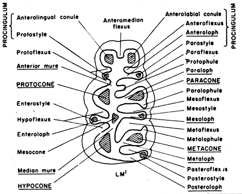
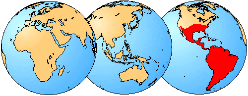

---
aliases:
  - Sigmodontinae
title: Sigmodontinae
---

# [[Sigmodontinae]] 

## Neotropical mice and rats 

## #has_/text_of_/abstract 

> The rodent subfamily **Sigmodontinae** includes New World rats and mice, with at least 376 species. Many authorities include the Neotominae and Tylomyinae as part of a larger definition of Sigmodontinae.  When those genera are included, the species count numbers at least 508. Their distribution includes much of the New World, but the genera are predominantly South American, such as brucies. They invaded South America from Central America as part of the Great American Interchange near the end of the Miocene, about 5 million years ago. Sigmodontines proceeded to diversify explosively in the formerly isolated continent. They inhabit many of the same ecological niches that the Murinae occupy in the Old World.
>
> The "Thomasomyini" from the Atlantic Forest of Brazil are generally thought to be not especially related to the "real" Thomasomyini from the northern Andes and the Amazon rainforest. The genera Wiedomys and Sigmodon are generally placed in their own tribe, and the "phyllotines" Irenomys, Punomys, Euneomys, and Reithrodon are considered incertae sedis.
>
> The name "Sigmodontinae" is based on the name of the type genus, Sigmodon. This name in turn derives from the Greek roots for "S-tooth" (sigm- for "S" and odont- for "tooth", as in orthodontist) for the characteristic of the molars having an S-shape when viewed from above.
>
> [Wikipedia](https://en.wikipedia.org/wiki/Sigmodontinae) 

## Introduction

[Scott J. Steppan]()

The sigmodontines comprise one of the greatest recent radiations of
mammals. There are currently more than 300 species occupying a wide
variety of niches: from hopping mice to semi-aquatic swimmers that hunt
fish and crustaceans. Other habitats and behaviors include arboreal and
burrowing species, grass eating specialists, insectivores, and
omnivores. They can be found from sea level to over 5000 meters (16,400
ft.) high in the Andes. Estimates for the age of this group range from
4.5 to 15 million years. There is a strong consensus that the lineage
originated in North America, but there is controversy over whether their
greatest diversification occurred in North or South America. If the
former, then a remarkable pattern of numerous invasions must have taken
place. If the later, then they might constitute a large scale adaptive
radiation. In either case, they figure prominantly in the Great American
Faunal Interchange. The centers of diversity are now in South America,
but many species can be found in Central America and two or three
species occur as far north as southern USA. Some of the more commonly
known species include the cotton rats
([**Sigmodon**](tree?group=Sigmodontini&contgroup=Sigmodontinae)),
rice rats
([**Oryzomys**](tree?group=Oryzomyini&contgroup=Sigmodontinae)),
marsh rats
([**Holochilus**](tree?group=Oryzomyini&contgroup=Sigmodontinae)),
South American field mice
([**Akodon**](tree?group=Akodontini&contgroup=Sigmodontinae)),
leaf-eared mice
([**Phyllotis**](tree?group=Phyllotis&contgroup=Phyllotini)),
and vesper mice
([**Calomys**](tree?group=Calomys&contgroup=Phyllotini)).
Although the majority of species avoid human contact, a few species have
become agricultural pests. Others are vector for human diseases, such as
Argentine hemoragic fever, which is carried in some **Calomys**. Because
of their abundance in the wild and museum collections, sigmodontines
have have figured prominantly in ecological and multivariate
evolutionary studies.

### Characteristics

Sigmodontines are stereotypic mice and rats, but as might be expected in
such a large group, there are many variations on the theme. Like all
murids, the dental formula is 1/1 0/0 0/0 3/3 (one pair of incisors and
three pairs of molars, both upper and lower). The skeleton is relatively
generalized. Sigmodontines all possess complex penises, with a few well
defined exceptions. A complex penis has two lateral horns on the
cartilagenous distal baculum, making it appear trident shaped (Fig. 3).
The predominantly North American Neotominae (often subsumed within
Sigmodontinae) lack these lateral horns and are characterzied as
simple-penised forms. Although still subject to debate, most
systematists assume that the complex penis is ancestral. Few other
characters define this diverse array of species, and there are few
diagnostic dental features that can be used to definitively assign
fossils, which are frequently only represented by teeth or lower jaws.
Possible synapomorphies for the subfamily from Steppan (1995) are: a
complex penis, the entoglossal process of the hyoid is absent, a dual
articulation of the first rib with the seventh cervical and first
thoracic vertebrae, the fifth metatarsal does not extend posterior to
the cuboid/calcaneum articulation, the entepicondylar foramen of the
humerus is absent while the supertrochlear foramen is present, and a gap
is present between the trochlear process and articular facet of the
calcanuem.
)

Figure 2. Generalized diagram of a sigmodontine molar, from Reig (1986).

### Discussion of Phylogenetic Relationships

The above tree summarizes the available phylogenies, drawing mostly from
nuclear DNA studies of Steppan et al. (2004 and unpubl. data), Jansa and
Weksler (2004), D\'Elia (2003), Weksler (2003), DNA hybridization study
of Dickerman (1992), mitochondrial DNA phylogenies of Engel et al.
(1998) and Smith and Patton (1999), and some from the morphological
cladistic analysis of Steppan (1995). Earlier studies of Karyotypes
(Gerdner and Patton, 1976), phallic morphology (Hooper and Musser,
1964), and synthetic studies (Hershkovitz, 1962; Reig, 1980; 1986) have
provided a foudation for the later studies.

Sigmodontini is placed at the base of the sigmodontines based primarily
on a variety of molecular studies (immunological, mtDNA sequence, DNA
hybridization). Morphological data tend to place Sigmodontini with
Phyllotini or closely related to it, a result that is probably due to
convergence on simplified dentitions and the long branch leading to
**Sigmodon**, the sole member of Sigmodontini.

The Ichthyomyini, the fish-eating rats, are also placed as an early
branch, although there is less direct evidence to support the
arrangment. Voss\' (1988) supposition that Ichthyomyini is not closely
related to any other sigmodontine group is supported by DNA data
(Dickerman, 1992; Jansa and Weksler 2004; Steppan et al. unpubl. data).
Steppan (1995) placed them in the tetralophodont tribal group (lacking a
complete mesoloph and thus with four rows of cusps on the molars rather
than the plesiomorphic five rows). Support from morphological characters
was weak and supported primarily by the simplification of the molars, a
commonly repeated trend in rodents.

The Thomasomyine group, conventionally treated as a tribe or subsumed
within Oryzomyini, appears to be paraphyletic and incudes several basal
lineages once the Oryzomyini sensu stricto are defined and removed.

Akodontini conventionally included the abrothicine group but not the
oxymycterines or scapteromyine. Work by Smith and Patton (1999) using
the mitochondrial gene cytochrome b and by D\'Elia (2003) and Steppan et
al. (unpubl. data) using multiple nuclear and mitochondrial genes
however support the arrangment shown above.

The Phyllotini had been taxonomically stable for a long time and
morphologists were largely confident about its close relationship to the
Akodontini. However, mtDNA phylogenies do not support monophyly (Engel
et al., 1998; Smith and Patton, 1999) and in particular Smith and Patton
(1999) found that it included several genera of no clear affinities. The
nuclear data sets confirm and extend those findings, hence the
proliferation of \"unique lineages\" (Smith and Patton, 1999) on the
tree with no tribal affiliation.

### Geographic Distribution
)

Figure 3. Although several species of sigmodontines can be found as far
north as the central United States, the large majority of species are
restricted to South America or the southern portion of Central America.

## Phylogeny 

-   « Ancestral Groups  
    -  [Muroidea](../Muroidea.md) 
    -  [Rodentia](../../Rodentia.md) 
    -  [Eutheria](../../../Eutheria.md) 
    -  [Mammal](../../../../Mammal.md) 
    -   [Therapsida](../../../../../Therapsida.md)
    -   [Synapsida](../../../../../../Synapsida.md)
    -   [Amniota](../../../../../../../Amniota.md)
    -   [Terrestrial Vertebrates](../../../../../../../../Terrestrial.md)
    -   [Sarcopterygii](../../../../../../../../../Sarc.md)
    -   [Gnathostomata](../../../../../../../../../../Gnath.md)
    -   [Vertebrata](../../../../../../../../../../../Vertebrata.md)
    -   [Craniata](../../../../../../../../../../../../Craniata.md)
    -   [Chordata](../../../../../../../../../../../../../Chordata.md)
    -   [Deuterostomia](../../../../../../../../../../../../../../Deutero.md)
    -  [Bilateria](../../../../../../../../../../../../../../../Bilateria.md) 
    -  [Animals](../../../../../../../../../../../../../../../../Animals.md) 
    -  [Eukarya](../../../../../../../../../../../../../../../../../Eukarya.md) 
    -   [Tree of Life](../../../../../../../../../../../../../../../../../Tree_of_Life.md)

-   ◊ Sibling Groups of  Muroidea
    -   [Murinae](Muridae/Murinae.md)
    -   [Deomyinae](Deomyinae.md)
    -   Sigmodontinae
    -   [Tylomyinae](Tylomyinae.md)

-   » Sub-Groups
    -  [Sigmodon](Sigmodontinae/Sigmodon.md) 
    -  [Ichthyomyini](Sigmodontinae/Ichthyomyini.md) 
    -   [Thomasomyine group and Sigmodontinae incertae         sedis](Thomasomyine_group_and_Sigmodontinae_incertae_sedis)
    -  [Wiedomyini](Sigmodontinae/Wiedomyini.md) 
    -  [Oryzomyini](Sigmodontinae/Oryzomyini.md) 
    -  [Phyllotini](Sigmodontinae/Phyllotini.md) 
    -  [Andinomys edax](Sigmodontinae/Andinomys_edax.md) 
    -  [Reithrodon](Sigmodontinae/Reithrodon.md) 
    -  [Irenomys tarsalis](Sigmodontinae/Irenomys_tarsalis.md) 
    -  [Euneomys](Sigmodontinae/Euneomys.md) 
    -   [Abrothicine group](Abrothicine_group)
    -  [Akodontini](Sigmodontinae/Akodontini.md) 

## Title Illustrations

----------

Scientific Name ::  Irenomys tarsalis
Copyright ::         © 1997 P. L. Meserve

## Confidential Links & Embeds: 

### #is_/same_as :: [[/_Standards/bio/bio~Domain/Eukarya/Animal/Bilateria/Deutero/Chordata/Craniata/Vertebrata/Gnath/Sarc/Tetrapods/Amniota/Synapsida/Therapsida/Mammal/Eutheria/Rodentia/Muroidea/Sigmodontinae|Sigmodontinae]] 

### #is_/same_as :: [[/_public/bio/bio~Domain/Eukarya/Animal/Bilateria/Deutero/Chordata/Craniata/Vertebrata/Gnath/Sarc/Tetrapods/Amniota/Synapsida/Therapsida/Mammal/Eutheria/Rodentia/Muroidea/Sigmodontinae.public|Sigmodontinae.public]] 

### #is_/same_as :: [[/_internal/bio/bio~Domain/Eukarya/Animal/Bilateria/Deutero/Chordata/Craniata/Vertebrata/Gnath/Sarc/Tetrapods/Amniota/Synapsida/Therapsida/Mammal/Eutheria/Rodentia/Muroidea/Sigmodontinae.internal|Sigmodontinae.internal]] 

### #is_/same_as :: [[/_protect/bio/bio~Domain/Eukarya/Animal/Bilateria/Deutero/Chordata/Craniata/Vertebrata/Gnath/Sarc/Tetrapods/Amniota/Synapsida/Therapsida/Mammal/Eutheria/Rodentia/Muroidea/Sigmodontinae.protect|Sigmodontinae.protect]] 

### #is_/same_as :: [[/_private/bio/bio~Domain/Eukarya/Animal/Bilateria/Deutero/Chordata/Craniata/Vertebrata/Gnath/Sarc/Tetrapods/Amniota/Synapsida/Therapsida/Mammal/Eutheria/Rodentia/Muroidea/Sigmodontinae.private|Sigmodontinae.private]] 

### #is_/same_as :: [[/_personal/bio/bio~Domain/Eukarya/Animal/Bilateria/Deutero/Chordata/Craniata/Vertebrata/Gnath/Sarc/Tetrapods/Amniota/Synapsida/Therapsida/Mammal/Eutheria/Rodentia/Muroidea/Sigmodontinae.personal|Sigmodontinae.personal]] 

### #is_/same_as :: [[/_secret/bio/bio~Domain/Eukarya/Animal/Bilateria/Deutero/Chordata/Craniata/Vertebrata/Gnath/Sarc/Tetrapods/Amniota/Synapsida/Therapsida/Mammal/Eutheria/Rodentia/Muroidea/Sigmodontinae.secret|Sigmodontinae.secret]] 

