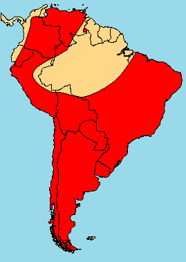

---
aliases:
  - Akodontini
title: Akodontini
---

# [[Akodontini]]

## South American field mice 

## #has_/text_of_/abstract 

> **Akodontini** is the second most speciose rodent tribe of the subfamily Sigmodontinae. It includes at least 106 living species in 19 genera and is distributed mainly in the southern half of South America, with only two genera extending into Guyana (Podoxymys) and Venezuela (Necromys). It also includes genera previously placed in tribe Scapteromyini. The following genera are now generally recognized:
> - Akodon
> - Bibimys
> - Blarinomys
> - Brucepattersonius
> - Deltamys
> - Juscelinomys
> - Kunsia
> - Lenoxus
> - Necromys (previously Bolomys or Cabreramys)
> - Neomicroxus
> - Oxymycterus
> - Podoxymys
> - Scapteromys
> - Thalpomys
> - Thaptomys
> - Chalcomys, Hypsimys, and Microxus have been synonymized under the genus Akodon.
>
> Several other genera were previously placed in Akodontini, but are now placed in a separate tribe Abrotrichini, largely on molecular grounds.
>
> [Wikipedia](https://en.wikipedia.org/wiki/Akodontini)

### Geographic Distribution
 

## Phylogeny 

-   « Ancestral Groups  
    -  [Sigmodontinae](../Sigmodontinae.md) 
    -  [Muroidea](../../Muroidea.md) 
    -  [Rodentia](../../../Rodentia.md) 
    -  [Eutheria](../../../../Eutheria.md) 
    -  [Mammal](../../../../../Mammal.md) 
    -   [Therapsida](../../../../../../Therapsida.md)
    -   [Synapsida](../../../../../../../Synapsida.md)
    -   [Amniota](../../../../../../../../Amniota.md)
    -   [Terrestrial Vertebrates](../../../../../../../../../Terrestrial.md)
    -   [Sarcopterygii](../../../../../../../../../../Sarc.md)
    -   [Gnathostomata](../../../../../../../../../../../Gnath.md)
    -   [Vertebrata](../../../../../../../../../../../../Vertebrata.md)
    -   [Craniata](../../../../../../../../../../../../../Craniata.md)
    -   [Chordata](../../../../../../../../../../../../../../Chordata.md)
    -   [Deuterostomia](../../../../../../../../../../../../../../../Deutero.md)
    -  [Bilateria](../../../../../../../../../../../../../../../../Bilateria.md) 
    -  [Animals](../../../../../../../../../../../../../../../../../Animals.md) 
    -  [Eukarya](../../../../../../../../../../../../../../../../../../Eukarya.md) 
    -   [Tree of Life](../../../../../../../../../../../../../../../../../../Tree_of_Life.md)

-   ◊ Sibling Groups of  Sigmodontinae
    -   [Sigmodon](Sigmodon.md)
    -   [Ichthyomyini](Ichthyomyini.md)
    -   [Thomasomyine group and Sigmodontinae incertae         sedis](Thomasomyine_group_and_Sigmodontinae_incertae_sedis)
    -   [Wiedomyini](Wiedomyini.md)
    -   [Oryzomyini](Oryzomyini.md)
    -   [Phyllotini](Phyllotini.md)
    -   [Andinomys edax](Andinomys_edax.md)
    -   [Reithrodon](Reithrodon.md)
    -   [Irenomys tarsalis](Irenomys_tarsalis.md)
    -   [Euneomys](Euneomys.md)
    -   [Abrothicine group](Abrothicine_group)
    -   Akodontini

-   » Sub-Groups 

## Confidential Links & Embeds: 

### #is_/same_as :: [[/_Standards/bio/bio~Domain/Eukarya/Animal/Bilateria/Deutero/Chordata/Craniata/Vertebrata/Gnath/Sarc/Tetrapods/Amniota/Synapsida/Therapsida/Mammal/Eutheria/Rodentia/Muroidea/Sigmodontinae/Akodontini|Akodontini]] 

### #is_/same_as :: [[/_public/bio/bio~Domain/Eukarya/Animal/Bilateria/Deutero/Chordata/Craniata/Vertebrata/Gnath/Sarc/Tetrapods/Amniota/Synapsida/Therapsida/Mammal/Eutheria/Rodentia/Muroidea/Sigmodontinae/Akodontini.public|Akodontini.public]] 

### #is_/same_as :: [[/_internal/bio/bio~Domain/Eukarya/Animal/Bilateria/Deutero/Chordata/Craniata/Vertebrata/Gnath/Sarc/Tetrapods/Amniota/Synapsida/Therapsida/Mammal/Eutheria/Rodentia/Muroidea/Sigmodontinae/Akodontini.internal|Akodontini.internal]] 

### #is_/same_as :: [[/_protect/bio/bio~Domain/Eukarya/Animal/Bilateria/Deutero/Chordata/Craniata/Vertebrata/Gnath/Sarc/Tetrapods/Amniota/Synapsida/Therapsida/Mammal/Eutheria/Rodentia/Muroidea/Sigmodontinae/Akodontini.protect|Akodontini.protect]] 

### #is_/same_as :: [[/_private/bio/bio~Domain/Eukarya/Animal/Bilateria/Deutero/Chordata/Craniata/Vertebrata/Gnath/Sarc/Tetrapods/Amniota/Synapsida/Therapsida/Mammal/Eutheria/Rodentia/Muroidea/Sigmodontinae/Akodontini.private|Akodontini.private]] 

### #is_/same_as :: [[/_personal/bio/bio~Domain/Eukarya/Animal/Bilateria/Deutero/Chordata/Craniata/Vertebrata/Gnath/Sarc/Tetrapods/Amniota/Synapsida/Therapsida/Mammal/Eutheria/Rodentia/Muroidea/Sigmodontinae/Akodontini.personal|Akodontini.personal]] 

### #is_/same_as :: [[/_secret/bio/bio~Domain/Eukarya/Animal/Bilateria/Deutero/Chordata/Craniata/Vertebrata/Gnath/Sarc/Tetrapods/Amniota/Synapsida/Therapsida/Mammal/Eutheria/Rodentia/Muroidea/Sigmodontinae/Akodontini.secret|Akodontini.secret]] 

