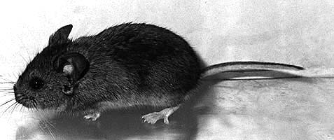
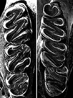
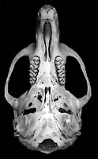
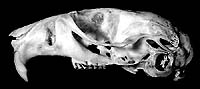
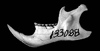

# Euneomys

## Patagonian chinchilla mice 

## #has_/text_of_/abstract 

> **Euneomys** is a genus of rodents in the family Cricetidae.
> It contains the following species:
> - Patagonian chinchilla mouse (Euneomys chinchilloides)
> - Burrowing chinchilla mouse (Euneomys fossor)
> - Biting chinchilla mouse (Euneomys mordax)
> - Peterson's chinchilla mouse (Euneomys petersoni)
>
> [Wikipedia](https://en.wikipedia.org/wiki/Euneomys) 

## Phylogeny 

-   « Ancestral Groups  
    -  [Sigmodontinae](../Sigmodontinae.md))
    -  [Muroidea](../../Muroidea.md))
    -  [Rodentia](../../../Rodentia.md))
    -  [Eutheria](../../../../Eutheria.md))
    -  [Mammal](../../../../../Mammal.md))
    -   [Therapsida](../../../../../../Therapsida.md)
    -   [Synapsida](../../../../../../../Synapsida.md)
    -   [Amniota](../../../../../../../../Amniota.md)
    -   [Terrestrial Vertebrates](../../../../../../../../../Terrestrial.md)
    -   [Sarcopterygii](../../../../../../../../../../Sarc.md)
    -   [Gnathostomata](../../../../../../../../../../../Gnath.md)
    -   [Vertebrata](../../../../../../../../../../../../Vertebrata.md)
    -   [Craniata](../../../../../../../../../../../../../Craniata.md)
    -   [Chordata](../../../../../../../../../../../../../../Chordata.md)
    -   [Deuterostomia](../../../../../../../../../../../../../../../Deutero.md)
    -  [Bilateria](../../../../../../../../../../../../../../../../Bilateria.md))
    -  [Animals](../../../../../../../../../../../../../../../../../Animals.md))
    -  [Eukarya](../../../../../../../../../../../../../../../../../../Eukarya.md))
    -   [Tree of Life](../../../../../../../../../../../../../../../../../../Tree_of_Life.md)

-   ◊ Sibling Groups of  Sigmodontinae
    -   [Sigmodon](Sigmodon.md)
    -   [Ichthyomyini](Ichthyomyini.md)
    -   [Thomasomyine group and Sigmodontinae incertae         sedis](Thomasomyine_group_and_Sigmodontinae_incertae_sedis)
    -   [Wiedomyini](Wiedomyini.md)
    -   [Oryzomyini](Oryzomyini.md)
    -   [Phyllotini](Phyllotini.md)
    -   [Andinomys edax](Andinomys_edax.md)
    -   [Reithrodon](Reithrodon.md)
    -   [Irenomys tarsalis](Irenomys_tarsalis.md)
    -   Euneomys
    -   [Abrothicine group](Abrothicine_group)
    -   [Akodontini](Akodontini.md)

-   » Sub-Groups 

	-   *Euneomys chinchilloides*
	-   *Euneomys petersoni*
	-   *Euneomys mordax*

### Information on the Internet

[Mammal Species of the World](http://www.nmnh.si.edu/msw/): a Taxonomic
and Geographic Reference. Internet version.

### Generic Portrait

  ------------------------------------------------------------------------------------------------------------------
        
                                                                                                                                                                                                                                                                    
                                                                                                                                          
  ------------------------------------------------------------------------------------------------------------------

Click on a figure to see a larger version.

Compare the skuls, jaws, or molars of all phyllotine genera by selecting
the appropriate view below.

\|
[Dorsal](http://www.tolweb.org/accessory/Phyllotine_Molars?acc_id=562)
\|
[Ventral](http://www.tolweb.org/accessory/Ventral_Views_of_Phyllotine_Skulls?acc_id=559)
\|
[Lateral](http://www.tolweb.org/accessory/Lateral_Views_of_Phyllotine_Skulls?acc_id=560)
\|
[Jaw](http://www.tolweb.org/accessory/Phyllotine_Mandibles?acc_id=561)
\| [Teeth](http://www.tolweb.org/accessory/Phyllotine_Molars?acc_id=562)
\|

## Title Illustrations

)

  ------------
  Scientific Name ::  Euneomys chinchilloides
  Copyright ::         © 1996 O. Pearson
  ------------

## Confidential Links & Embeds: 

### #is_/same_as :: [Euneomys](/_Standards/bio/bio~Domain/Eukarya/Animal/Bilateria/Deutero/Chordata/Craniata/Vertebrata/Gnath/Sarc/Tetrapods/Amniota/Synapsida/Therapsida/Mammal/Eutheria/Rodentia/Muroidea/Sigmodontinae/Euneomys.md) 

### #is_/same_as :: [Euneomys.public](/_public/bio/bio~Domain/Eukarya/Animal/Bilateria/Deutero/Chordata/Craniata/Vertebrata/Gnath/Sarc/Tetrapods/Amniota/Synapsida/Therapsida/Mammal/Eutheria/Rodentia/Muroidea/Sigmodontinae/Euneomys.public.md) 

### #is_/same_as :: [Euneomys.internal](/_internal/bio/bio~Domain/Eukarya/Animal/Bilateria/Deutero/Chordata/Craniata/Vertebrata/Gnath/Sarc/Tetrapods/Amniota/Synapsida/Therapsida/Mammal/Eutheria/Rodentia/Muroidea/Sigmodontinae/Euneomys.internal.md) 

### #is_/same_as :: [Euneomys.protect](/_protect/bio/bio~Domain/Eukarya/Animal/Bilateria/Deutero/Chordata/Craniata/Vertebrata/Gnath/Sarc/Tetrapods/Amniota/Synapsida/Therapsida/Mammal/Eutheria/Rodentia/Muroidea/Sigmodontinae/Euneomys.protect.md) 

### #is_/same_as :: [Euneomys.private](/_private/bio/bio~Domain/Eukarya/Animal/Bilateria/Deutero/Chordata/Craniata/Vertebrata/Gnath/Sarc/Tetrapods/Amniota/Synapsida/Therapsida/Mammal/Eutheria/Rodentia/Muroidea/Sigmodontinae/Euneomys.private.md) 

### #is_/same_as :: [Euneomys.personal](/_personal/bio/bio~Domain/Eukarya/Animal/Bilateria/Deutero/Chordata/Craniata/Vertebrata/Gnath/Sarc/Tetrapods/Amniota/Synapsida/Therapsida/Mammal/Eutheria/Rodentia/Muroidea/Sigmodontinae/Euneomys.personal.md) 

### #is_/same_as :: [Euneomys.secret](/_secret/bio/bio~Domain/Eukarya/Animal/Bilateria/Deutero/Chordata/Craniata/Vertebrata/Gnath/Sarc/Tetrapods/Amniota/Synapsida/Therapsida/Mammal/Eutheria/Rodentia/Muroidea/Sigmodontinae/Euneomys.secret.md)

