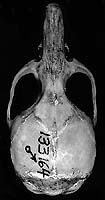
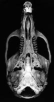
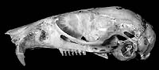

---
aliases:
  - Irenomys_tarsalis
  - Irenomys tarsalis
title: Irenomys tarsalis
---

# [[Irenomys_tarsalis]] 

## Chilean Tree Mouse 

### Generic Portrait

  ----------------------------------------------------------------------------------------------------------------------
        
                                                                                                                                                                                                                                                                        
                                                                                                                                            
  ----------------------------------------------------------------------------------------------------------------------

Click on a figure to see a larger version.

Compare the skuls, jaws, or molars of all phyllotine genera by selecting
the appropriate view below.

\|
[Dorsal](http://www.tolweb.org/accessory/Phyllotine_Molars?acc_id=562)
\|
[Ventral](http://www.tolweb.org/accessory/Ventral_Views_of_Phyllotine_Skulls?acc_id=559)
\|
[Lateral](http://www.tolweb.org/accessory/Lateral_Views_of_Phyllotine_Skulls?acc_id=560)
\|
[Jaw](http://www.tolweb.org/accessory/Phyllotine_Mandibles?acc_id=561)
\| [Teeth](http://www.tolweb.org/accessory/Phyllotine_Molars?acc_id=562)
\|

## Phylogeny 

-   « Ancestral Groups  
    -  [Sigmodontinae](../Sigmodontinae.md) 
    -  [Muroidea](../../Muroidea.md) 
    -  [Rodentia](../../../Rodentia.md) 
    -  [Eutheria](../../../../Eutheria.md) 
    -  [Mammal](../../../../../Mammal.md) 
    -   [Therapsida](../../../../../../Therapsida.md)
    -   [Synapsida](../../../../../../../Synapsida.md)
    -   [Amniota](../../../../../../../../Amniota.md)
    -   [Terrestrial Vertebrates](../../../../../../../../../Terrestrial.md)
    -   [Sarcopterygii](../../../../../../../../../../Sarc.md)
    -   [Gnathostomata](../../../../../../../../../../../Gnath.md)
    -   [Vertebrata](../../../../../../../../../../../../Vertebrata.md)
    -   [Craniata](../../../../../../../../../../../../../Craniata.md)
    -   [Chordata](../../../../../../../../../../../../../../Chordata.md)
    -   [Deuterostomia](../../../../../../../../../../../../../../../Deutero.md)
    -  [Bilateria](../../../../../../../../../../../../../../../../Bilateria.md) 
    -  [Animals](../../../../../../../../../../../../../../../../../Animals.md) 
    -  [Eukarya](../../../../../../../../../../../../../../../../../../Eukarya.md) 
    -   [Tree of Life](../../../../../../../../../../../../../../../../../../Tree_of_Life.md)

-   ◊ Sibling Groups of  Sigmodontinae
    -   [Sigmodon](Sigmodon.md)
    -   [Ichthyomyini](Ichthyomyini.md)
    -   [Thomasomyine group and Sigmodontinae incertae         sedis](Thomasomyine_group_and_Sigmodontinae_incertae_sedis)
    -   [Wiedomyini](Wiedomyini.md)
    -   [Oryzomyini](Oryzomyini.md)
    -   [Phyllotini](Phyllotini.md)
    -   [Andinomys edax](Andinomys_edax.md)
    -   [Reithrodon](Reithrodon.md)
    -   Irenomys tarsalis
    -   [Euneomys](Euneomys.md)
    -   [Abrothicine group](Abrothicine_group)
    -   [Akodontini](Akodontini.md)

-   » Sub-Groups 

## Title Illustrations

---------

copyright ::   © 1997 P. L. Meserve

## Confidential Links & Embeds: 

### #is_/same_as :: [[/_Standards/bio/bio~Domain/Eukarya/Animal/Bilateria/Deutero/Chordata/Craniata/Vertebrata/Gnath/Sarc/Tetrapods/Amniota/Synapsida/Therapsida/Mammal/Eutheria/Rodentia/Muroidea/Sigmodontinae/Irenomys_tarsalis|Irenomys_tarsalis]] 

### #is_/same_as :: [[/_public/bio/bio~Domain/Eukarya/Animal/Bilateria/Deutero/Chordata/Craniata/Vertebrata/Gnath/Sarc/Tetrapods/Amniota/Synapsida/Therapsida/Mammal/Eutheria/Rodentia/Muroidea/Sigmodontinae/Irenomys_tarsalis.public|Irenomys_tarsalis.public]] 

### #is_/same_as :: [[/_internal/bio/bio~Domain/Eukarya/Animal/Bilateria/Deutero/Chordata/Craniata/Vertebrata/Gnath/Sarc/Tetrapods/Amniota/Synapsida/Therapsida/Mammal/Eutheria/Rodentia/Muroidea/Sigmodontinae/Irenomys_tarsalis.internal|Irenomys_tarsalis.internal]] 

### #is_/same_as :: [[/_protect/bio/bio~Domain/Eukarya/Animal/Bilateria/Deutero/Chordata/Craniata/Vertebrata/Gnath/Sarc/Tetrapods/Amniota/Synapsida/Therapsida/Mammal/Eutheria/Rodentia/Muroidea/Sigmodontinae/Irenomys_tarsalis.protect|Irenomys_tarsalis.protect]] 

### #is_/same_as :: [[/_private/bio/bio~Domain/Eukarya/Animal/Bilateria/Deutero/Chordata/Craniata/Vertebrata/Gnath/Sarc/Tetrapods/Amniota/Synapsida/Therapsida/Mammal/Eutheria/Rodentia/Muroidea/Sigmodontinae/Irenomys_tarsalis.private|Irenomys_tarsalis.private]] 

### #is_/same_as :: [[/_personal/bio/bio~Domain/Eukarya/Animal/Bilateria/Deutero/Chordata/Craniata/Vertebrata/Gnath/Sarc/Tetrapods/Amniota/Synapsida/Therapsida/Mammal/Eutheria/Rodentia/Muroidea/Sigmodontinae/Irenomys_tarsalis.personal|Irenomys_tarsalis.personal]] 

### #is_/same_as :: [[/_secret/bio/bio~Domain/Eukarya/Animal/Bilateria/Deutero/Chordata/Craniata/Vertebrata/Gnath/Sarc/Tetrapods/Amniota/Synapsida/Therapsida/Mammal/Eutheria/Rodentia/Muroidea/Sigmodontinae/Irenomys_tarsalis.secret|Irenomys_tarsalis.secret]] 

