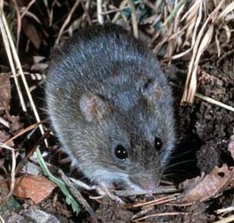

---
aliases:
- orizominis
- Oryzomyini
- Rijstratten
- جرذان الأرز
- جرذان الارز
- موشهای برنجی
- 稻鼠族
- 쌀쥐족
title: Oryzomyini
has_id_wikidata: Q2410209
dv_has_:
  name_:
    an: Oryzomyini
    ar: جرذان الأرز
    arz: جرذان الارز
    ast: Oryzomyini
    bg: Oryzomyini
    ca: orizominis
    ceb: Oryzomyini
    de: Oryzomyini
    en: Oryzomyini
    en-ca: Oryzomyini
    en-gb: Oryzomyini
    eo: Oryzomyini
    es: Oryzomyini
    eu: Oryzomyini
    ext: Oryzomyini
    fa: موشهای برنجی
    fi: Oryzomyini
    fr: Oryzomyini
    ga: Oryzomyini
    gl: Oryzomyini
    ia: Oryzomyini
    ie: Oryzomyini
    io: Oryzomyini
    it: Oryzomyini
    ko: 쌀쥐족
    la: Oryzomyini
    mul: Oryzomyini
    nl: Rijstratten
    oc: Oryzomyini
    pl: Oryzomyini
    pt: Oryzomyini
    pt-br: Oryzomyini
    ro: Oryzomyini
    ru: Oryzomyini
    sq: Oryzomyini
    uk: Oryzomyini
    vi: Oryzomyini
    vo: Oryzomyini
    war: Oryzomyini
    zh: 稻鼠族
    zh-cn: 稻鼠族
    zh-hans: 稻鼠族
    zh-tw: 稻鼠族
---
# [[Oryzomyini]] 

## Rice rats, spiny mice, marsh rats 

## #has_/text_of_/abstract 

> **Oryzomyini** is a tribe of rodents in the subfamily Sigmodontinae of the family Cricetidae. It includes about 120 species in about thirty genera, distributed from the eastern United States to the southernmost parts of South America, including many offshore islands. It is part of the clade Oryzomyalia, which includes most of the South American Sigmodontinae.
>
> The name Oryzomyini derives from that of its type genus, Oryzomys, which means "rice rat" or "rice mouse". Many species are also known as rice rats.
>
> [Wikipedia](https://en.wikipedia.org/wiki/Oryzomyini) 

### Discussion of Phylogenetic Relationships

Resolution of oryzomyine relationships is severely handicapped by the
paraphyletic or polyphyletic nature of Oryzomys, the lack of taxonomic
overlap among studies, and disagreements among studies.

## Phylogeny 

-   « Ancestral Groups  
    -  [Sigmodontinae](../Sigmodontinae.md) 
    -  [Muroidea](../../Muroidea.md) 
    -  [Rodentia](../../../Rodentia.md) 
    -  [Eutheria](../../../../Eutheria.md) 
    -  [Mammal](../../../../../Mammal.md) 
    -   [Therapsida](../../../../../../Therapsida.md)
    -   [Synapsida](../../../../../../../Synapsida.md)
    -   [Amniota](../../../../../../../../Amniota.md)
    -   [Terrestrial Vertebrates](../../../../../../../../../Terrestrial.md)
    -   [Sarcopterygii](../../../../../../../../../../Sarc.md)
    -   [Gnathostomata](../../../../../../../../../../../Gnath.md)
    -   [Vertebrata](../../../../../../../../../../../../Vertebrata.md)
    -   [Craniata](../../../../../../../../../../../../../Craniata.md)
    -   [Chordata](../../../../../../../../../../../../../../Chordata.md)
    -   [Deuterostomia](../../../../../../../../../../../../../../../Deutero.md)
    -  [Bilateria](../../../../../../../../../../../../../../../../Bilateria.md) 
    -  [Animals](../../../../../../../../../../../../../../../../../Animals.md) 
    -  [Eukarya](../../../../../../../../../../../../../../../../../../Eukarya.md) 
    -   [Tree of Life](../../../../../../../../../../../../../../../../../../Tree_of_Life.md)

-   ◊ Sibling Groups of  Sigmodontinae
    -   [Sigmodon](Sigmodon.md)
    -   [Ichthyomyini](Ichthyomyini.md)
    -   [Thomasomyine group and Sigmodontinae incertae         sedis](Thomasomyine_group_and_Sigmodontinae_incertae_sedis)
    -   [Wiedomyini](Wiedomyini.md)
    -   Oryzomyini
    -   [Phyllotini](Phyllotini.md)
    -   [Andinomys edax](Andinomys_edax.md)
    -   [Reithrodon](Reithrodon.md)
    -   [Irenomys tarsalis](Irenomys_tarsalis.md)
    -   [Euneomys](Euneomys.md)
    -   [Abrothicine group](Abrothicine_group)
    -   [Akodontini](Akodontini.md)

-   » Sub-Groups 

## Title Illustrations

---------- 
 
scientific_name ::     Oryzomys palustris
Creator              R.K. LaVal
specimen_condition ::  Live Specimen
Identified By        R.K. LaVal
Life Cycle Stage ::     Adult

## Confidential Links & Embeds: 

### #is_/same_as :: [[/_Standards/bio/bio~Domain/Eukarya/Animal/Bilateria/Deutero/Chordata/Craniata/Vertebrata/Gnath/Sarc/Tetrapods/Amniota/Synapsida/Therapsida/Mammal/Eutheria/Rodentia/Muroidea/Sigmodontinae/Oryzomyini|Oryzomyini]] 

### #is_/same_as :: [[/_public/bio/bio~Domain/Eukarya/Animal/Bilateria/Deutero/Chordata/Craniata/Vertebrata/Gnath/Sarc/Tetrapods/Amniota/Synapsida/Therapsida/Mammal/Eutheria/Rodentia/Muroidea/Sigmodontinae/Oryzomyini.public|Oryzomyini.public]] 

### #is_/same_as :: [[/_internal/bio/bio~Domain/Eukarya/Animal/Bilateria/Deutero/Chordata/Craniata/Vertebrata/Gnath/Sarc/Tetrapods/Amniota/Synapsida/Therapsida/Mammal/Eutheria/Rodentia/Muroidea/Sigmodontinae/Oryzomyini.internal|Oryzomyini.internal]] 

### #is_/same_as :: [[/_protect/bio/bio~Domain/Eukarya/Animal/Bilateria/Deutero/Chordata/Craniata/Vertebrata/Gnath/Sarc/Tetrapods/Amniota/Synapsida/Therapsida/Mammal/Eutheria/Rodentia/Muroidea/Sigmodontinae/Oryzomyini.protect|Oryzomyini.protect]] 

### #is_/same_as :: [[/_private/bio/bio~Domain/Eukarya/Animal/Bilateria/Deutero/Chordata/Craniata/Vertebrata/Gnath/Sarc/Tetrapods/Amniota/Synapsida/Therapsida/Mammal/Eutheria/Rodentia/Muroidea/Sigmodontinae/Oryzomyini.private|Oryzomyini.private]] 

### #is_/same_as :: [[/_personal/bio/bio~Domain/Eukarya/Animal/Bilateria/Deutero/Chordata/Craniata/Vertebrata/Gnath/Sarc/Tetrapods/Amniota/Synapsida/Therapsida/Mammal/Eutheria/Rodentia/Muroidea/Sigmodontinae/Oryzomyini.personal|Oryzomyini.personal]] 

### #is_/same_as :: [[/_secret/bio/bio~Domain/Eukarya/Animal/Bilateria/Deutero/Chordata/Craniata/Vertebrata/Gnath/Sarc/Tetrapods/Amniota/Synapsida/Therapsida/Mammal/Eutheria/Rodentia/Muroidea/Sigmodontinae/Oryzomyini.secret|Oryzomyini.secret]] 

