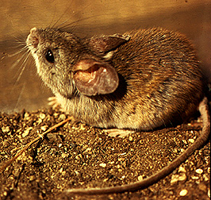
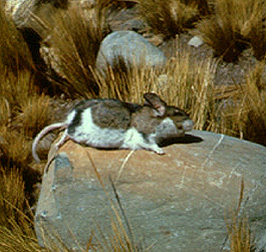
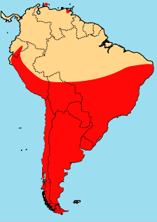

---
aliases:
  - Phyllotini
title: Phyllotini
---

# [[Phyllotini]]

## Leaf-eared mice and their relatives 

  ) 

## #has_/text_of_/abstract 

> The rodent subfamily Sigmodontinae includes New World rats and mice, with at least 376 species. Many authorities include the Neotominae and Tylomyinae as part of a larger definition of Sigmodontinae.  When those genera are included, the species count numbers at least 508. Their distribution includes much of the New World, but the genera are predominantly South American, such as brucies. They invaded South America from Central America as part of the Great American Interchange near the end of the Miocene, about 5 million years ago. Sigmodontines proceeded to diversify explosively in the formerly isolated continent. They inhabit many of the same ecological niches that the Murinae occupy in the Old World.
>
> The "Thomasomyini" from the Atlantic Forest of Brazil are generally thought to be not especially related to the "real" Thomasomyini from the northern Andes and the Amazon rainforest. The genera Wiedomys and Sigmodon are generally placed in their own tribe, and the "phyllotines" Irenomys, Punomys, Euneomys, and Reithrodon are considered incertae sedis.
>
> The name "Sigmodontinae" is based on the name of the type genus, Sigmodon. This name in turn derives from the Greek roots for "S-tooth" (sigm- for "S" and odont- for "tooth", as in orthodontist) for the characteristic of the molars having an S-shape when viewed from above.
>
> [Wikipedia](https://en.wikipedia.org/wiki/Sigmodontinae) 

### Information on the Internet

[Mammal Species of the World](http://www.nmnh.si.edu/msw/): a Taxonomic
and Geographic Reference. Internet version.

## Introduction

[Scott J. Steppan](http://www.tolweb.org/)

The phyllotines are among the most diverse group of New World muroids
(mice and rats) in terms of external appearance and habitats. They range
in size from about 12 grams (**Calomys hummelincki**) to 160 grams
(**Chinchillula**), have tails from 35% (**Galenomys**) to 145%
(**Irenomys**) of body length, fur color that varies light sandy with
pure white undersides in one desert species (**Phyllotis gerbillus**) to
nearly uniform dark brown in a forest species (**Loxodontomys**). As
just indicated, members live in a range of habitats, but are
concentrated in open, pastoral habitats and do not occur in tropical or
montain rainforests. They reach maximum diversity in the Andean
altiplano, where approximately 44% of all phyllotine species can be
found (Reig, 1986). Nearly the entire elevational range is encompased by
a single species, **Phyllotis xanthopygus**, from sea level to over 5000
m (16,400\'). **Phyllotis xanthopygus** is possibly the most widespread
species, but most other species have much more restrictred
distributions, perhaps due to habitat specializations. The combination
of being relatively accessible for study and the high local abundances
of many species has resulted in the phyllotines being better understood
than any other sigmodontine group.

### Characteristics

The phyllotines generally share simplified molars for a diet emphasizing
plants and seeds, while the skull and other features are relatively
generalized. Although most authors have considered the phyllotines to be
a relatively well-defined and \"cohesive\" group, there are actually few
convincing shared derived features that define the tribe. These putative
synapomorphies include complete loss of the mesoloph and mesolophid (a
transformation occuring repeatedly among sigmodontines), premaxillary
subequal in posterior extent with nasals, large sphenopalatine vacuity,
mesopterygoid narrower than parapterygoid, and large pinnae (ears).
Other possible snyapomorphies include the zygomatic arch inserting high
on the rostrum and moderately long interparietal. Other characteristic
features that are probably plesiomorphic are a hairy heel, a gall
bladder, long palate, long incisive foramina, angled or ridged
suprorbital region, deeply incised zygomatic notch, and moderate to
large third molars. Most species (except **Calomys sensu stricto**)
share the derived second pair of preputial glands (found in the prepuce
of the penis) which apparently evolved early within the tribe\'s
diversification.

### Discussion of Phylogenetic Relationships

An alternate hypothesis was proposed by Braun (1993).

         ======================================= Pseudoryzomys 
         |
         |  ==================================== Calomys 
         |  |
         |  |  ================================= Eligmodontia 
         |  |  |
         |  |  |  |||||||||||||||||||||||||||||| Paralomys  (Phyllotis amicus and gerbillus) 
         |  |  |  |
         |  |  |  |     |||||||||||||||||||||||| Graomys 
         |  |  |  |  ===|
         |  |  |  |  |  ======================== Andalgalomys 
         |  |  |  |  |
         |  |  |  |  |  |||||||||||||||||||||||| Phyllotis 
         |  |  |  |  |  |
         |  |  |  |  |  |  ===================== Irenomys 
         |  |  |  |  |  |  |
    =====|  |  |  |  |  |  |  ================== Euneomys 
         ===|  |  |  |  |  |  |
            ===|  |  |  |  |  |     |||||||||||| Auliscomys 
               ===|  |  |  |  |  ===|
                  ===|  |  |  |  |  ============ Galenomys 
                     |  |  |  |  |
                     ===|  |  |  |  ============ Loxodontomys 
                        ===|  |  |  |
                           ===|  |  |     ====== Neotomys 
                              ===|  |  ===|
                                 |  |  |  ====== Reithrodon 
                                 ===|  |
                                    ===|  ====== Punomys 
                                       |  |
                                       ===|  === Andinomys 
                                          ===|
                                             === Chinchillula 

Figure 1. Braun\'s hypothesis is a composite of parsimony analyses
conducted on taxonomic subsets so as to maximally resolve the tree.
Because **Phyllotis amicus** and **gerbillus** were so basal, she
resurrected **Paralomys** to encompass them. To accomodate a
paraphyletic **Auliscomys**, she created **Maresomys** for **A.
boliviensis**, leaving the remaining two species to form a monophyletic
**Auliscomys**. **Loxodontomys** was resurrected to contain
**(Auliscomys) micropus**. Steppan (1993) also presented a
morphology-based phylogenetic hypothesis, although including a broader
survey of characters. A subsequent reanalysis (Steppan, 1995b) resulted
in the following hypothesis.

         ||||||||||||||||||||||||||||||| Calomys 
         |
         |        |||||||||||||||||||||| Phyllotis 
         |        |
         |        |                  ||| Graomys 
         |  ======|               ===|
         |  |     ==Graomys group=|  === Andalgalomys 
         |  |                     |
         |  |                     ====== Eligmodontia 
         |  |
         |  |     ====================== Auliscomys 
         |  |=====|
    =====|  |     ====================== Galenomys 
         ===|
            |=========================== Chinchillula 
            |
            |=========================== P. wolffsohni 
            |
            |     ====================== Irenomys 
            |=====|
            |     ====================== Andinomys 
            |
            |     ====================== Loxodontomys 
            ======|
                  ====================== Reithrodon group 

Figure 2. This tree represents an 80% majority rule tree wherein
**Punomys** is not a phyllotine. In the most-parsimonious tree, which is
one step shorter, **Punomys** is placed as the sister group to
**Irenomys/Andinomys**, while not changing any of the other
relationships. This tree was favored because a phylogenetic analysis of
the family sigmodontinae indicated that **Punomys** was not a
phyllotine. That same sigmodontine analysis definitively excluded
**Pseudoryzomys** from the phyllotines and placed it in Oryzomyini.
**Calomys sorellus** was most likely more closely related to the
remaining phyllotines, but most interior nodes were not well supported.
**Phyllotis** was polyphyletic and had the **Graomys** group arising
from within in, most closely related to **P. amicus** and **gerbillus**.
Basal nodes within **Phyllotis** were so weakly supported, however, that
no taxonomic changes were recommended. In fact, trees only a few steps
longer placed the **Graomys** group between **Calomys** and the
remaining phyllotines in much the configuration show at the top of this
page. Paraphyly of **Graomys** with respect to **Andalgalomys** resulted
in synonomy of the latter.

### Geographic Distribution
)

Fig. 3.

### Generic Portraits

Compare the skuls, jaws, or molars of all phyllotine genera by selecting
the appropriate view below.

\|
[Dorsal](http://www.tolweb.org/accessory/Dorsal_Views_of_Phyllotine_Skulls?acc_id=558)
\|
[Ventral](http://www.tolweb.org/accessory/Ventral_Views_of_Phyllotine_Skulls?acc_id=559)
\|
[Lateral](http://www.tolweb.org/accessory/Lateral_Views_of_Phyllotine_Skulls?acc_id=560)
\|
[Jaw](http://www.tolweb.org/accessory/Phyllotine_Mandibles?acc_id=561)
\| [Teeth](http://www.tolweb.org/accessory/Phyllotine_Molars?acc_id=562)
\|

## Phylogeny 

-   « Ancestral Groups  
    -  [Sigmodontinae](../Sigmodontinae.md))
    -  [Muroidea](../../Muroidea.md))
    -  [Rodentia](../../../Rodentia.md))
    -  [Eutheria](../../../../Eutheria.md))
    -  [Mammal](../../../../../Mammal.md))
    -   [Therapsida](../../../../../../Therapsida.md)
    -   [Synapsida](../../../../../../../Synapsida.md)
    -   [Amniota](../../../../../../../../Amniota.md)
    -   [Terrestrial Vertebrates](../../../../../../../../../Terrestrial.md)
    -   [Sarcopterygii](../../../../../../../../../../Sarc.md)
    -   [Gnathostomata](../../../../../../../../../../../Gnath.md)
    -   [Vertebrata](../../../../../../../../../../../../Vertebrata.md)
    -   [Craniata](../../../../../../../../../../../../../Craniata.md)
    -   [Chordata](../../../../../../../../../../../../../../Chordata.md)
    -   [Deuterostomia](../../../../../../../../../../../../../../../Deutero.md)
    -  [Bilateria](../../../../../../../../../../../../../../../../Bilateria.md))
    -  [Animals](../../../../../../../../../../../../../../../../../Animals.md))
    -  [Eukarya](../../../../../../../../../../../../../../../../../../Eukarya.md))
    -   [Tree of Life](../../../../../../../../../../../../../../../../../../Tree_of_Life.md)

-   ◊ Sibling Groups of  Sigmodontinae
    -   [Sigmodon](Sigmodon.md)
    -   [Ichthyomyini](Ichthyomyini.md)
    -   [Thomasomyine group and Sigmodontinae incertae         sedis](Thomasomyine_group_and_Sigmodontinae_incertae_sedis)
    -   [Wiedomyini](Wiedomyini.md)
    -   [Oryzomyini](Oryzomyini.md)
    -   Phyllotini
    -   [Andinomys edax](Andinomys_edax.md)
    -   [Reithrodon](Reithrodon.md)
    -   [Irenomys tarsalis](Irenomys_tarsalis.md)
    -   [Euneomys](Euneomys.md)
    -   [Abrothicine group](Abrothicine_group)
    -   [Akodontini](Akodontini.md)

-   » Sub-Groups
    -   [Reithrodon group sensu         stricto](Reithrodon_group_sensu_stricto)
    -  [Calomys](Phyllotini/Calomys.md))
    -  [Eligmodontia](Phyllotini/Eligmodontia.md))
    -  [Graomys](Phyllotini/Graomys.md))
    -  [Phyllotis](Phyllotini/Phyllotis.md))
    -  [Auliscomys](Phyllotini/Auliscomys.md))
    -   [Galenomys garleppi](Galenomys_garleppi)
    -  [Loxodontomys](Phyllotini/Loxodontomys.md))
    -   [Chinchillula sahamae](Chinchillula_sahamae)
    -  [Andalgalomys](Phyllotini/Andalgalomys.md))

## Title Illustrations

----------)
Scientific Name ::  Phyllotis darwini
Copyright ::         © 1996 P. L. Meserve

----------)
Scientific Name ::  Chinchillula sahamae
Comments          Chinchilla mouse
Copyright ::         © 1996 J. Anderson

## Confidential Links & Embeds: 

### #is_/same_as :: [Phyllotini](/_Standards/bio/bio~Domain/Eukarya/Animal/Bilateria/Deutero/Chordata/Craniata/Vertebrata/Gnath/Sarc/Tetrapods/Amniota/Synapsida/Therapsida/Mammal/Eutheria/Rodentia/Muroidea/Sigmodontinae/Phyllotini.md) 

### #is_/same_as :: [Phyllotini.public](/_public/bio/bio~Domain/Eukarya/Animal/Bilateria/Deutero/Chordata/Craniata/Vertebrata/Gnath/Sarc/Tetrapods/Amniota/Synapsida/Therapsida/Mammal/Eutheria/Rodentia/Muroidea/Sigmodontinae/Phyllotini.public.md) 

### #is_/same_as :: [Phyllotini.internal](/_internal/bio/bio~Domain/Eukarya/Animal/Bilateria/Deutero/Chordata/Craniata/Vertebrata/Gnath/Sarc/Tetrapods/Amniota/Synapsida/Therapsida/Mammal/Eutheria/Rodentia/Muroidea/Sigmodontinae/Phyllotini.internal.md) 

### #is_/same_as :: [Phyllotini.protect](/_protect/bio/bio~Domain/Eukarya/Animal/Bilateria/Deutero/Chordata/Craniata/Vertebrata/Gnath/Sarc/Tetrapods/Amniota/Synapsida/Therapsida/Mammal/Eutheria/Rodentia/Muroidea/Sigmodontinae/Phyllotini.protect.md) 

### #is_/same_as :: [Phyllotini.private](/_private/bio/bio~Domain/Eukarya/Animal/Bilateria/Deutero/Chordata/Craniata/Vertebrata/Gnath/Sarc/Tetrapods/Amniota/Synapsida/Therapsida/Mammal/Eutheria/Rodentia/Muroidea/Sigmodontinae/Phyllotini.private.md) 

### #is_/same_as :: [Phyllotini.personal](/_personal/bio/bio~Domain/Eukarya/Animal/Bilateria/Deutero/Chordata/Craniata/Vertebrata/Gnath/Sarc/Tetrapods/Amniota/Synapsida/Therapsida/Mammal/Eutheria/Rodentia/Muroidea/Sigmodontinae/Phyllotini.personal.md) 

### #is_/same_as :: [Phyllotini.secret](/_secret/bio/bio~Domain/Eukarya/Animal/Bilateria/Deutero/Chordata/Craniata/Vertebrata/Gnath/Sarc/Tetrapods/Amniota/Synapsida/Therapsida/Mammal/Eutheria/Rodentia/Muroidea/Sigmodontinae/Phyllotini.secret.md)

