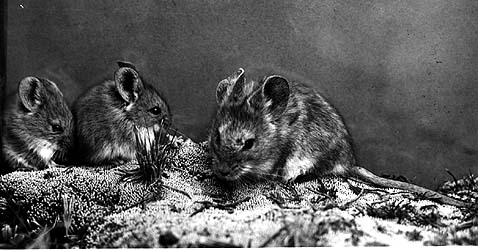
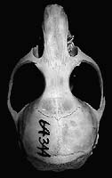
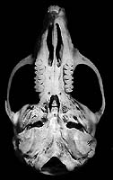
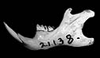
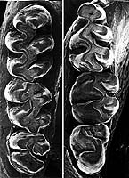

---
title: Auliscomys
---

## Phylogeny 

-   « Ancestral Groups  
    -  [Phyllotini](../Phyllotini.md))
    -  [Sigmodontinae](../../Sigmodontinae.md))
    -  [Muroidea](../../../Muroidea.md))
    -  [Rodentia](../../../../Rodentia.md))
    -  [Eutheria](../../../../../Eutheria.md))
    -  [Mammal](../../../../../../Mammal.md))
    -   [Therapsida](../../../../../../../Therapsida.md)
    -   [Synapsida](../../../../../../../../Synapsida.md)
    -   [Amniota](../../../../../../../../../Amniota.md)
    -   [Terrestrial Vertebrates](../../../../../../../../../../Terrestrial.md)
    -   [Sarcopterygii](../../../../../../../../../../../Sarc.md)
    -   [Gnathostomata](../../../../../../../../../../../../Gnath.md)
    -   [Vertebrata](../../../../../../../../../../../../../Vertebrata.md)
    -   [Craniata](../../../../../../../../../../../../../../Craniata.md)
    -   [Chordata](../../../../../../../../../../../../../../../Chordata.md)
    -   [Deuterostomia](../../../../../../../../../../../../../../../../Deutero.md)
    -  [Bilateria](../../../../../../../../../../../../../../../../../Bilateria.md))
    -  [Animals](../../../../../../../../../../../../../../../../../../Animals.md))
    -  [Eukarya](../../../../../../../../../../../../../../../../../../../Eukarya.md))
    -   [Tree of Life](../../../../../../../../../../../../../../../../../../../Tree_of_Life.md)

-   ◊ Sibling Groups of  Phyllotini
    -   [Reithrodon group sensu         stricto](Reithrodon_group_sensu_stricto)
    -   [Calomys](Calomys.md)
    -   [Eligmodontia](Eligmodontia.md)
    -   [Graomys](Graomys.md)
    -   [Phyllotis](Phyllotis.md)
    -   Auliscomys
    -   [Galenomys garleppi](Galenomys_garleppi)
    -   [Loxodontomys](Loxodontomys.md)
    -   [Chinchillula sahamae](Chinchillula_sahamae)
    -   [Andalgalomys](Andalgalomys.md)

-   » Sub-Groups 

# Auliscomys 

[Scott J. Steppan]()
)

Containing group:[Phyllotini](../Phyllotini.md))

### Information on the Internet

[Mammal Species of the World](http://www.nmnh.si.edu/msw/): a Taxonomic
and Geographic Reference. Internet version.

### Generic Portrait

  ------------------------------------------------------------------------------------------------------------------
        
                                                                                                                                                                                                                                                                
                                                                                                                                  
  ------------------------------------------------------------------------------------------------------------------

Click on a figure to see a larger version.

Compare all phyllotine genera together by selecting the view below.

\|
[Dorsal](http://www.tolweb.org/accessory/Phyllotine_Molars?acc_id=562)
\|
[Ventral](http://www.tolweb.org/accessory/Ventral_Views_of_Phyllotine_Skulls?acc_id=559)
\|
[Lateral](http://www.tolweb.org/accessory/Lateral_Views_of_Phyllotine_Skulls?acc_id=560)
\|
[Jaw](http://www.tolweb.org/accessory/Phyllotine_Mandibles?acc_id=561)
\| [Teeth](http://www.tolweb.org/accessory/Phyllotine_Molars?acc_id=562)
\|

## Title Illustrations

)

  -----------
  Scientific Name ::  Auliscomys boliviensis
  Copyright ::         © 1996 O. Pearson
  -----------

## Confidential Links & Embeds: 

### #is_/same_as ::[Auliscomys](Auliscomys.md)) 

### #is_/same_as :: [Auliscomys.public](/_public/bio/bio~Domain/Eukarya/Animal/Bilateria/Deutero/Chordata/Craniata/Vertebrata/Gnath/Sarc/Tetrapods/Amniota/Synapsida/Therapsida/Mammal/Eutheria/Rodentia/Muroidea/Sigmodontinae/Phyllotini/Auliscomys.public.md) 

### #is_/same_as :: [Auliscomys.internal](/_internal/bio/bio~Domain/Eukarya/Animal/Bilateria/Deutero/Chordata/Craniata/Vertebrata/Gnath/Sarc/Tetrapods/Amniota/Synapsida/Therapsida/Mammal/Eutheria/Rodentia/Muroidea/Sigmodontinae/Phyllotini/Auliscomys.internal.md) 

### #is_/same_as :: [Auliscomys.protect](/_protect/bio/bio~Domain/Eukarya/Animal/Bilateria/Deutero/Chordata/Craniata/Vertebrata/Gnath/Sarc/Tetrapods/Amniota/Synapsida/Therapsida/Mammal/Eutheria/Rodentia/Muroidea/Sigmodontinae/Phyllotini/Auliscomys.protect.md) 

### #is_/same_as :: [Auliscomys.private](/_private/bio/bio~Domain/Eukarya/Animal/Bilateria/Deutero/Chordata/Craniata/Vertebrata/Gnath/Sarc/Tetrapods/Amniota/Synapsida/Therapsida/Mammal/Eutheria/Rodentia/Muroidea/Sigmodontinae/Phyllotini/Auliscomys.private.md) 

### #is_/same_as :: [Auliscomys.personal](/_personal/bio/bio~Domain/Eukarya/Animal/Bilateria/Deutero/Chordata/Craniata/Vertebrata/Gnath/Sarc/Tetrapods/Amniota/Synapsida/Therapsida/Mammal/Eutheria/Rodentia/Muroidea/Sigmodontinae/Phyllotini/Auliscomys.personal.md) 

### #is_/same_as :: [Auliscomys.secret](/_secret/bio/bio~Domain/Eukarya/Animal/Bilateria/Deutero/Chordata/Craniata/Vertebrata/Gnath/Sarc/Tetrapods/Amniota/Synapsida/Therapsida/Mammal/Eutheria/Rodentia/Muroidea/Sigmodontinae/Phyllotini/Auliscomys.secret.md)

