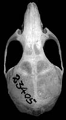
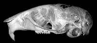
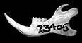
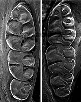

---
aliases:
  - Calomys
title: Calomys
---

## Phylogeny 

-   « Ancestral Groups  
    -  [Phyllotini](../Phyllotini.md) 
    -  [Sigmodontinae](../../Sigmodontinae.md) 
    -  [Muroidea](../../../Muroidea.md) 
    -  [Rodentia](../../../../Rodentia.md) 
    -  [Eutheria](../../../../../Eutheria.md) 
    -  [Mammal](../../../../../../Mammal.md) 
    -   [Therapsida](../../../../../../../Therapsida.md)
    -   [Synapsida](../../../../../../../../Synapsida.md)
    -   [Amniota](../../../../../../../../../Amniota.md)
    -   [Terrestrial Vertebrates](../../../../../../../../../../Terrestrial.md)
    -   [Sarcopterygii](../../../../../../../../../../../Sarc.md)
    -   [Gnathostomata](../../../../../../../../../../../../Gnath.md)
    -   [Vertebrata](../../../../../../../../../../../../../Vertebrata.md)
    -   [Craniata](../../../../../../../../../../../../../../Craniata.md)
    -   [Chordata](../../../../../../../../../../../../../../../Chordata.md)
    -   [Deuterostomia](../../../../../../../../../../../../../../../../Deutero.md)
    -  [Bilateria](../../../../../../../../../../../../../../../../../Bilateria.md) 
    -  [Animals](../../../../../../../../../../../../../../../../../../Animals.md) 
    -  [Eukarya](../../../../../../../../../../../../../../../../../../../Eukarya.md) 
    -   [Tree of Life](../../../../../../../../../../../../../../../../../../../Tree_of_Life.md)

-   ◊ Sibling Groups of  Phyllotini
    -   [Reithrodon group sensu         stricto](Reithrodon_group_sensu_stricto)
    -   Calomys
    -   [Eligmodontia](Eligmodontia.md)
    -   [Graomys](Graomys.md)
    -   [Phyllotis](Phyllotis.md)
    -   [Auliscomys](Auliscomys.md)
    -   [Galenomys garleppi](Galenomys_garleppi)
    -   [Loxodontomys](Loxodontomys.md)
    -   [Chinchillula sahamae](Chinchillula_sahamae)
    -   [Andalgalomys](Andalgalomys.md)

-   » Sub-Groups 

# Calomys

## Vesper mice 

Containing group:[Phyllotini](../Phyllotini.md) 

### Information on the Internet

[Mammal Species of the World](http://www.nmnh.si.edu/msw/): a Taxonomic
and Geographic Reference. Internet version.

### Discussion of Phylogenetic Relationships

The phylogenetic relationships within **Calomys** are rendered suspect
because the species level taxonomy is very confused (no two treatments
agree on the number or names of species). Names are not always used
consistently across systematic studies and species sampling is limited,
leaving it very difficult to integrate the various studies. A
phylogenetic study of the entire tribe (Steppan 1995) indicated that
**sorellus** was the sister species to all other phyllotines and not a
member of **Calomys**. However, there was little support for this or
other hypotheses, and **sorellus** is here placed in **Calomys** for
convience pending more comprehensive phylogenetic studies.

### Generic Portrait

  ----------------------------------------------------------------------------------------------------------------------
        
                                                                                                                                                                                                                                                                        
                                                                                                                                        
  ----------------------------------------------------------------------------------------------------------------------

Click on a figure to see a larger version.

Compare all phyllotine genera together by selecting the view below.

\|
[Dorsal](http://www.tolweb.org/accessory/Phyllotine_Molars?acc_id=562)
\|
[Ventral](http://www.tolweb.org/accessory/Ventral_Views_of_Phyllotine_Skulls?acc_id=559)
\|
[Lateral](http://www.tolweb.org/accessory/Lateral_Views_of_Phyllotine_Skulls?acc_id=560)
\|
[Jaw](http://www.tolweb.org/accessory/Phyllotine_Mandibles?acc_id=561)
\| [Teeth](http://www.tolweb.org/accessory/Phyllotine_Molars?acc_id=562)
\|

## Confidential Links & Embeds: 

### #is_/same_as :: [[/_Standards/bio/bio~Domain/Eukarya/Animal/Bilateria/Deutero/Chordata/Craniata/Vertebrata/Gnath/Sarc/Tetrapods/Amniota/Synapsida/Therapsida/Mammal/Eutheria/Rodentia/Muroidea/Sigmodontinae/Phyllotini/Calomys|Calomys]] 

### #is_/same_as :: [[/_public/bio/bio~Domain/Eukarya/Animal/Bilateria/Deutero/Chordata/Craniata/Vertebrata/Gnath/Sarc/Tetrapods/Amniota/Synapsida/Therapsida/Mammal/Eutheria/Rodentia/Muroidea/Sigmodontinae/Phyllotini/Calomys.public|Calomys.public]] 

### #is_/same_as :: [[/_internal/bio/bio~Domain/Eukarya/Animal/Bilateria/Deutero/Chordata/Craniata/Vertebrata/Gnath/Sarc/Tetrapods/Amniota/Synapsida/Therapsida/Mammal/Eutheria/Rodentia/Muroidea/Sigmodontinae/Phyllotini/Calomys.internal|Calomys.internal]] 

### #is_/same_as :: [[/_protect/bio/bio~Domain/Eukarya/Animal/Bilateria/Deutero/Chordata/Craniata/Vertebrata/Gnath/Sarc/Tetrapods/Amniota/Synapsida/Therapsida/Mammal/Eutheria/Rodentia/Muroidea/Sigmodontinae/Phyllotini/Calomys.protect|Calomys.protect]] 

### #is_/same_as :: [[/_private/bio/bio~Domain/Eukarya/Animal/Bilateria/Deutero/Chordata/Craniata/Vertebrata/Gnath/Sarc/Tetrapods/Amniota/Synapsida/Therapsida/Mammal/Eutheria/Rodentia/Muroidea/Sigmodontinae/Phyllotini/Calomys.private|Calomys.private]] 

### #is_/same_as :: [[/_personal/bio/bio~Domain/Eukarya/Animal/Bilateria/Deutero/Chordata/Craniata/Vertebrata/Gnath/Sarc/Tetrapods/Amniota/Synapsida/Therapsida/Mammal/Eutheria/Rodentia/Muroidea/Sigmodontinae/Phyllotini/Calomys.personal|Calomys.personal]] 

### #is_/same_as :: [[/_secret/bio/bio~Domain/Eukarya/Animal/Bilateria/Deutero/Chordata/Craniata/Vertebrata/Gnath/Sarc/Tetrapods/Amniota/Synapsida/Therapsida/Mammal/Eutheria/Rodentia/Muroidea/Sigmodontinae/Phyllotini/Calomys.secret|Calomys.secret]] 

