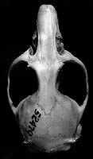
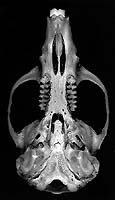
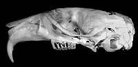
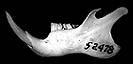

---
aliases:
  - Chinchillula
title: Chinchillula sahamae
---

## Phylogeny 

-   « Ancestral Groups  
    -  [Phyllotini](../Phyllotini.md) 
    -  [Sigmodontinae](../../Sigmodontinae.md) 
    -  [Muroidea](../../../Muroidea.md) 
    -  [Rodentia](../../../../Rodentia.md) 
    -  [Eutheria](../../../../../Eutheria.md) 
    -  [Mammal](../../../../../../Mammal.md) 
    -   [Therapsida](../../../../../../../Therapsida.md)
    -   [Synapsida](../../../../../../../../Synapsida.md)
    -   [Amniota](../../../../../../../../../Amniota.md)
    -   [Terrestrial Vertebrates](../../../../../../../../../../Terrestrial.md)
    -   [Sarcopterygii](../../../../../../../../../../../Sarc.md)
    -   [Gnathostomata](../../../../../../../../../../../../Gnath.md)
    -   [Vertebrata](../../../../../../../../../../../../../Vertebrata.md)
    -   [Craniata](../../../../../../../../../../../../../../Craniata.md)
    -   [Chordata](../../../../../../../../../../../../../../../Chordata.md)
    -   [Deuterostomia](../../../../../../../../../../../../../../../../Deutero.md)
    -  [Bilateria](../../../../../../../../../../../../../../../../../Bilateria.md) 
    -  [Animals](../../../../../../../../../../../../../../../../../../Animals.md) 
    -  [Eukarya](../../../../../../../../../../../../../../../../../../../Eukarya.md) 
    -   [Tree of Life](../../../../../../../../../../../../../../../../../../../Tree_of_Life.md)

-   ◊ Sibling Groups of  Phyllotini
    -   [Reithrodon group sensu         stricto](Reithrodon_group_sensu_stricto)
    -   [Calomys](Calomys.md)
    -   [Eligmodontia](Eligmodontia.md)
    -   [Graomys](Graomys.md)
    -   [Phyllotis](Phyllotis.md)
    -   [Auliscomys](Auliscomys.md)
    -   [Galenomys garleppi](Galenomys_garleppi)
    -   [Loxodontomys](Loxodontomys.md)
    -   Chinchillula sahamae
    -   [Andalgalomys](Andalgalomys.md)

-   » Sub-Groups 

## Chinchillula 

# *Chinchillula sahamae*

## Chinchilla mouse 

[Scott J. Steppan]()

Containing group:[Phyllotini](../Phyllotini.md) 

### Generic Portrait

  ----------------------------------------------------------------------------------------------------------------------
        
                                                                                                                                                                                                                                                                        
                                                                                                                                        
  ----------------------------------------------------------------------------------------------------------------------

Click on a figure to see a larger version.

Compare the skuls, jaws, or molars of all phyllotine genera by selecting
the appropriate view below.

\|
[Dorsal](http://www.tolweb.org/accessory/Phyllotine_Molars?acc_id=562)
\|
[Ventral](http://www.tolweb.org/accessory/Ventral_Views_of_Phyllotine_Skulls?acc_id=559)
\|
[Lateral](http://www.tolweb.org/accessory/Lateral_Views_of_Phyllotine_Skulls?acc_id=560)
\|
[Jaw](http://www.tolweb.org/accessory/Phyllotine_Mandibles?acc_id=561)
\| [Teeth](http://www.tolweb.org/accessory/Phyllotine_Molars?acc_id=562)
\|

## Title Illustrations

Figure 1. **Chinchillula sahamae**, copyright © O. Pearson.


  --------
  Copyright ::   © 1997 O. Pearson
  --------

## Confidential Links & Embeds: 

### #is_/same_as :: [[/_Standards/bio/bio~Domain/Eukarya/Animal/Bilateria/Deutero/Chordata/Craniata/Vertebrata/Gnath/Sarc/Tetrapods/Amniota/Synapsida/Therapsida/Mammal/Eutheria/Rodentia/Muroidea/Sigmodontinae/Phyllotini/Chinchillula|Chinchillula]] 

### #is_/same_as :: [[/_public/bio/bio~Domain/Eukarya/Animal/Bilateria/Deutero/Chordata/Craniata/Vertebrata/Gnath/Sarc/Tetrapods/Amniota/Synapsida/Therapsida/Mammal/Eutheria/Rodentia/Muroidea/Sigmodontinae/Phyllotini/Chinchillula.public|Chinchillula.public]] 

### #is_/same_as :: [[/_internal/bio/bio~Domain/Eukarya/Animal/Bilateria/Deutero/Chordata/Craniata/Vertebrata/Gnath/Sarc/Tetrapods/Amniota/Synapsida/Therapsida/Mammal/Eutheria/Rodentia/Muroidea/Sigmodontinae/Phyllotini/Chinchillula.internal|Chinchillula.internal]] 

### #is_/same_as :: [[/_protect/bio/bio~Domain/Eukarya/Animal/Bilateria/Deutero/Chordata/Craniata/Vertebrata/Gnath/Sarc/Tetrapods/Amniota/Synapsida/Therapsida/Mammal/Eutheria/Rodentia/Muroidea/Sigmodontinae/Phyllotini/Chinchillula.protect|Chinchillula.protect]] 

### #is_/same_as :: [[/_private/bio/bio~Domain/Eukarya/Animal/Bilateria/Deutero/Chordata/Craniata/Vertebrata/Gnath/Sarc/Tetrapods/Amniota/Synapsida/Therapsida/Mammal/Eutheria/Rodentia/Muroidea/Sigmodontinae/Phyllotini/Chinchillula.private|Chinchillula.private]] 

### #is_/same_as :: [[/_personal/bio/bio~Domain/Eukarya/Animal/Bilateria/Deutero/Chordata/Craniata/Vertebrata/Gnath/Sarc/Tetrapods/Amniota/Synapsida/Therapsida/Mammal/Eutheria/Rodentia/Muroidea/Sigmodontinae/Phyllotini/Chinchillula.personal|Chinchillula.personal]] 

### #is_/same_as :: [[/_secret/bio/bio~Domain/Eukarya/Animal/Bilateria/Deutero/Chordata/Craniata/Vertebrata/Gnath/Sarc/Tetrapods/Amniota/Synapsida/Therapsida/Mammal/Eutheria/Rodentia/Muroidea/Sigmodontinae/Phyllotini/Chinchillula.secret|Chinchillula.secret]] 

