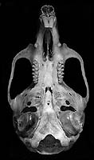
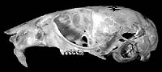
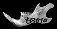
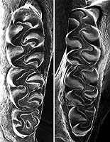

## Phylogeny 

-   « Ancestral Groups  
    -  [Phyllotini](../Phyllotini.md))
    -  [Sigmodontinae](../../Sigmodontinae.md))
    -  [Muroidea](../../../Muroidea.md))
    -  [Rodentia](../../../../Rodentia.md))
    -  [Eutheria](../../../../../Eutheria.md))
    -  [Mammal](../../../../../../Mammal.md))
    -   [Therapsida](../../../../../../../Therapsida.md)
    -   [Synapsida](../../../../../../../../Synapsida.md)
    -   [Amniota](../../../../../../../../../Amniota.md)
    -   [Terrestrial Vertebrates](../../../../../../../../../../Terrestrial.md)
    -   [Sarcopterygii](../../../../../../../../../../../Sarc.md)
    -   [Gnathostomata](../../../../../../../../../../../../Gnath.md)
    -   [Vertebrata](../../../../../../../../../../../../../Vertebrata.md)
    -   [Craniata](../../../../../../../../../../../../../../Craniata.md)
    -   [Chordata](../../../../../../../../../../../../../../../Chordata.md)
    -   [Deuterostomia](../../../../../../../../../../../../../../../../Deutero.md)
    -  [Bilateria](../../../../../../../../../../../../../../../../../Bilateria.md))
    -  [Animals](../../../../../../../../../../../../../../../../../../Animals.md))
    -  [Eukarya](../../../../../../../../../../../../../../../../../../../Eukarya.md))
    -   [Tree of Life](../../../../../../../../../../../../../../../../../../../Tree_of_Life.md)

-   ◊ Sibling Groups of  Phyllotini
    -   [Reithrodon group sensu         stricto](Reithrodon_group_sensu_stricto)
    -   [Calomys](Calomys.md)
    -   Eligmodontia
    -   [Graomys](Graomys.md)
    -   [Phyllotis](Phyllotis.md)
    -   [Auliscomys](Auliscomys.md)
    -   [Galenomys garleppi](Galenomys_garleppi)
    -   [Loxodontomys](Loxodontomys.md)
    -   [Chinchillula sahamae](Chinchillula_sahamae)
    -   [Andalgalomys](Andalgalomys.md)

-   » Sub-Groups 

# Eligmodontia

## Highland desert mice 

-   *Eligmodontia morgani*
-   *Eligmodontia typus*
-   *Eligmodontia moreni*
-   *Eligmodontia puerulus*

Containing group:[Phyllotini](../Phyllotini.md))

### Information on the Internet

[Mammal Species of the World](http://www.nmnh.si.edu/msw/): a Taxonomic
and Geographic Reference. Internet version.

### Generic Portrait

  ------------------------------------------------------------------------------------------------------------------------
        
                                                                                                                                                                                                                                                                            
                                                                                                                                        
  ------------------------------------------------------------------------------------------------------------------------

Click on a figure to see a larger version.

Compare the skuls, jaws, or molars of all phyllotine genera by selecting
the appropriate view below.

\|
[Dorsal](http://www.tolweb.org/accessory/Phyllotine_Molars?acc_id=562)
\|
[Ventral](http://www.tolweb.org/accessory/Ventral_Views_of_Phyllotine_Skulls?acc_id=559)
\|
[Lateral](http://www.tolweb.org/accessory/Lateral_Views_of_Phyllotine_Skulls?acc_id=560)
\|
[Jaw](http://www.tolweb.org/accessory/Phyllotine_Mandibles?acc_id=561)
\| [Teeth](http://www.tolweb.org/accessory/Phyllotine_Molars?acc_id=562)
\|

## Title Illustrations

Figure 1. **Eligmodontia typus** copyright © Oliver Pearson 1997.


  ---------
  Copyright ::   © 1997 Oliver Pearson
  ---------

## Confidential Links & Embeds: 

### #is_/same_as :: [Eligmodontia](/_Standards/bio/bio~Domain/Eukarya/Animal/Bilateria/Deutero/Chordata/Craniata/Vertebrata/Gnath/Sarc/Tetrapods/Amniota/Synapsida/Therapsida/Mammal/Eutheria/Rodentia/Muroidea/Sigmodontinae/Phyllotini/Eligmodontia.md) 

### #is_/same_as :: [Eligmodontia.public](/_public/bio/bio~Domain/Eukarya/Animal/Bilateria/Deutero/Chordata/Craniata/Vertebrata/Gnath/Sarc/Tetrapods/Amniota/Synapsida/Therapsida/Mammal/Eutheria/Rodentia/Muroidea/Sigmodontinae/Phyllotini/Eligmodontia.public.md) 

### #is_/same_as :: [Eligmodontia.internal](/_internal/bio/bio~Domain/Eukarya/Animal/Bilateria/Deutero/Chordata/Craniata/Vertebrata/Gnath/Sarc/Tetrapods/Amniota/Synapsida/Therapsida/Mammal/Eutheria/Rodentia/Muroidea/Sigmodontinae/Phyllotini/Eligmodontia.internal.md) 

### #is_/same_as :: [Eligmodontia.protect](/_protect/bio/bio~Domain/Eukarya/Animal/Bilateria/Deutero/Chordata/Craniata/Vertebrata/Gnath/Sarc/Tetrapods/Amniota/Synapsida/Therapsida/Mammal/Eutheria/Rodentia/Muroidea/Sigmodontinae/Phyllotini/Eligmodontia.protect.md) 

### #is_/same_as :: [Eligmodontia.private](/_private/bio/bio~Domain/Eukarya/Animal/Bilateria/Deutero/Chordata/Craniata/Vertebrata/Gnath/Sarc/Tetrapods/Amniota/Synapsida/Therapsida/Mammal/Eutheria/Rodentia/Muroidea/Sigmodontinae/Phyllotini/Eligmodontia.private.md) 

### #is_/same_as :: [Eligmodontia.personal](/_personal/bio/bio~Domain/Eukarya/Animal/Bilateria/Deutero/Chordata/Craniata/Vertebrata/Gnath/Sarc/Tetrapods/Amniota/Synapsida/Therapsida/Mammal/Eutheria/Rodentia/Muroidea/Sigmodontinae/Phyllotini/Eligmodontia.personal.md) 

### #is_/same_as :: [Eligmodontia.secret](/_secret/bio/bio~Domain/Eukarya/Animal/Bilateria/Deutero/Chordata/Craniata/Vertebrata/Gnath/Sarc/Tetrapods/Amniota/Synapsida/Therapsida/Mammal/Eutheria/Rodentia/Muroidea/Sigmodontinae/Phyllotini/Eligmodontia.secret.md)

