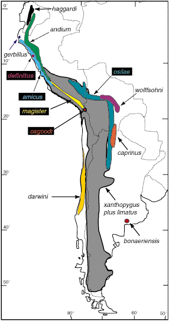
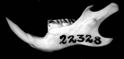

---
aliases:
  - Phyllotis
title: Phyllotis
---

## Phylogeny 

-   « Ancestral Groups  
    -  [Phyllotini](../Phyllotini.md) 
    -  [Sigmodontinae](../../Sigmodontinae.md) 
    -  [Muroidea](../../../Muroidea.md) 
    -  [Rodentia](../../../../Rodentia.md) 
    -  [Eutheria](../../../../../Eutheria.md) 
    -  [Mammal](../../../../../../Mammal.md) 
    -   [Therapsida](../../../../../../../Therapsida.md)
    -   [Synapsida](../../../../../../../../Synapsida.md)
    -   [Amniota](../../../../../../../../../Amniota.md)
    -   [Terrestrial Vertebrates](../../../../../../../../../../Terrestrial.md)
    -   [Sarcopterygii](../../../../../../../../../../../Sarc.md)
    -   [Gnathostomata](../../../../../../../../../../../../Gnath.md)
    -   [Vertebrata](../../../../../../../../../../../../../Vertebrata.md)
    -   [Craniata](../../../../../../../../../../../../../../Craniata.md)
    -   [Chordata](../../../../../../../../../../../../../../../Chordata.md)
    -   [Deuterostomia](../../../../../../../../../../../../../../../../Deutero.md)
    -  [Bilateria](../../../../../../../../../../../../../../../../../Bilateria.md) 
    -  [Animals](../../../../../../../../../../../../../../../../../../Animals.md) 
    -  [Eukarya](../../../../../../../../../../../../../../../../../../../Eukarya.md) 
    -   [Tree of Life](../../../../../../../../../../../../../../../../../../../Tree_of_Life.md)

-   ◊ Sibling Groups of  Phyllotini
    -   [Reithrodon group sensu         stricto](Reithrodon_group_sensu_stricto)
    -   [Calomys](Calomys.md)
    -   [Eligmodontia](Eligmodontia.md)
    -   [Graomys](Graomys.md)
    -   Phyllotis
    -   [Auliscomys](Auliscomys.md)
    -   [Galenomys garleppi](Galenomys_garleppi)
    -   [Loxodontomys](Loxodontomys.md)
    -   [Chinchillula sahamae](Chinchillula_sahamae)
    -   [Andalgalomys](Andalgalomys.md)

-   » Sub-Groups
    -   [Phyllotis xanthopygus](Phyllotis_xanthopygus)
    -   [Phyllotis limatus](Phyllotis_limatus)
    -   [Phyllotis darwini](Phyllotis_darwini)

# Phyllotis

## Leaf-eared mice 

[Scott J. Steppan](http://www.tolweb.org/)

Tree derived from cytochrome b phylogeny of Steppan (1995a;
[1998](http://bio.fsu.edu/%7Esteppan/Phyllotis_cytb.html)) and
morphology based phylogeny of [Steppan (1995b)](http://bio.fsu.edu/%7Esteppan/Fieldiana.html).

Containing group:[Phyllotini](../Phyllotini.md) 

### Information on the Internet

[Mammal Species of the World](http://www.nmnh.si.edu/msw/): a Taxonomic
and Geographic Reference. Internet version.

## Introduction

Systematic investigations in *Phyllotis* began when Darwin collected two
species during the voyage of the Beagle: *xanthopygus* from eastern
Patagonia and *darwini* from Coquimbo on the central Chilean coast. Its
species are frequently the most abundant mammal species at a locality
and they have been described as the South American equivalents of
*Peromyscus*, the North american deer mice (Pearson 1958), although they
average two to four times the mass. Most species of *Phyllotis* live in
rocky or brushy habitats in the Andes and nearby areas, and they can be
found from sea level to about 5000 meters (16,000 feet). Because of
their high abundance, their karyology, reproductive biology, morphology,
and ecology have been studied to a greater degree than perhaps any other
comparable Neotropical rodent group.

*Phyllotis* consists of one widespread and polytypic species,
*xanthopygus*, and 13 other species of much more restricted
distributions. Three species are essentially known from only one or a
few neighboring localities: *gerbillus*, *definitus*, and
*bonaeriensis*.

### Characteristics

The leaf-eared mice are medium sized (20-100 g), morphologically rather
generalized mice. They all have moderate to large ears, and their
leaf-like appearance is the basis for the name of the genus and tribe.
Molars are simplified relative to most sigmodontines. The absence of
many clear diagnostic specializations has made definition of the genus
more difficult than for other phyllotine genera. Upper incisors are
opisthodont, the rostrum is short to moderate in length, the
interorbital region is pinched or hour-glass-shaped, and the cranium is
weakly vaulted in lateral view. The fur is relatively long and thick.
The upper parts range in color from sand-colored (*gerbillus*) to a dark
ochrous-brown and is closely associated with the amount of vegetation in
their habitats. Undersides are typically greyish, but can range from
white to buffy.

### Discussion of Phylogenetic Relationships

*Phyllotis* has benefited from two thorough systematic revisions
(Pearson, 1958; Hershkovitz, 1964) and two subsequent phylogenetic
analyses (Steppan, 1995b; 1998). However, despite those studies and
numerous other investigations on related aspects of *Phyllotis* biology,
many phylogenetic issues remain unresolved. The best supported grouping
is that of the *darwini* species group, which is found in
morphology-based (Steppan, 1993, 1995b) and mtDNA sequence phylogenies
(Steppan 1998).

Morphological synapomorphies are largely limited to penile structures: a
large distal baculum more than 77% the length of the proximal baculum,
hooks on the lateral mounds, and dorsal knobs on the lateral mounds.
This very large distal baculum is not found in any other sigmodontine
yet surveyed. The placement of *caprinus* and *bonaeriensis* relative to
other members of the darwini species group is tentative as they were not
included in the DNA phylogeny. *Phyllotis sensu stricto* is supported
primarily by a moderate to large distal baculum and a series of more
homoplasious characters.

A karyotype based hypothesis was proposed by Pearson and Patton (1976)
that differed in a variety of ways.

         =========================== Phyllotis osilae 
         |
         |  ======================== Phyllotis andium 
         |  |
         |  |                    === Phyllotis xanthopygus 
         |  |              ======|
         |  |              |     === Phyllotis caprinus 
         |  |              |
         |  |              |======== Phyllotis amicus 
         |  |           ===|
         |  |        ===|  |     === Phyllotis haggardi 
    =====|  |     ===|  |  |=====|
         ===|  ===|  |  |  |     === Phyllotis gerbillus 
            ===|  |  |  |  |
               |  |  |  |  ========= Phyllotis magister 
               |  |  |  |
               |  |  |  ==      ?=== Graomys 
               |  |  |
               |  |  =============== Phyllotis wolffsohni 
               |  |
               |  ================== Phyllotis definitus 
               |
               =                 ?== Eligmodontia, Reithrodon, and Auliscomys 
      

A principal difference was in viewing taxa as paraphyletic entities from
which other taxa would evolve. The scenario was also guided by
Robertsonian fusions as the proposed orthogenetic mechanism for
karyotypic evolution in the sigmodontines.

### Geographic Distribution
)

Figure 1. Distribution of the fourteen species of *Phyllotis*. The
distributions of *P. xanthopygus* and *P. limatus* are combined to
simplify viewing.
### Generic Portrait

  ---------
 )
  ---------

*Phyllotis darwini*

Compare the skulls, jaws, or molars of all phyllotine genera by
selecting the appropriate view below.

\|
[Dorsal](http://www.tolweb.org/accessory/Dorsal_Views_of_Phyllotine_Skulls?acc_id=558)
\|
[Ventral](http://www.tolweb.org/accessory/Ventral_Views_of_Phyllotine_Skulls?acc_id=559)
\|
[Lateral](http://www.tolweb.org/accessory/Lateral_Views_of_Phyllotine_Skulls?acc_id=560)
\|
[Jaw](http://www.tolweb.org/accessory/Phyllotine_Mandibles?acc_id=561)
\| [Teeth](http://www.tolweb.org/accessory/Phyllotine_Molars?acc_id=562)
\|

### References

Braun, J. K. 1993. Systematic relationships of the tribe Phyllotini
(Muridae: Sigmodontinae) of South America. Oklahoma Museum of Natural
History, Norman.

Hershkovitz, P. 1962. Evolution of neotropical cricetine rodents
(Muridae) with special reference to the phyllotine group. Fieldiana:
Zool. 46:1-524.

Mann, G. F. 1978. Los pequeños de mamíferos de Chile (marsupiales,
quirópteros, edentados y roedores). Guyana (Zoología) 40:1-342.

Mares, M. A. 1977. Water balance and other ecological observations on
three species of Phyllotis in northwestern Argentina. J. Mamm.
58:514-520.

Meserve, P. L. 1981. Trophic relationships and small mammals in a
Chilean semiarid thorn scrub community. J. Mamm. 62:304-314.

Osgood, W. H. 1943. The mammals of Chile. Field Mus. Nat. Hist., Zool.
Ser. 30:1-268.

Osgood, W. H. 1947. Cricetine rodents allied to Phyllotis. J. Mamm
28:165-174.

Pearson, O. P. 1958. A taxonomic revision of the rodent genus Phyllotis.
Univ. Calif. Publ. Zool. 56:391-477.

Pearson, O. P. 1975. An outbreak of mice in the coastal desert of Peru.
Mammalia 39:375-386.

Pearson, O. P., and J. L. Patton. 1976. Relationships among South
American phyllotine rodents based on chromosome analysis. J. Mamm.
57:339-350.

Pearson, O. P., and C. P. Ralph. 1978. The diversity and abundance of
vertebrates along an altitudinal gradient in Peru. Mem. Mus. Hist. Nat.
(Lima, Peru) 18:1-97.

Phillips, C. J., I. Kim, E. C. Birney, R. S. Sikes, and J. A. Monjeau.
1993. Mitochondrial gene flow reveals dispersal patterns for Phyllotis
xanthopygus in Patagonia. pp. 101. Sociedad Argentina para el estudio de
los mamíferos, Bariloche, Argentina

Pizzimenti, J. J., and R. de Salle. 1980. Dietary and morphometric
variation in some Peruvian rodent communities: the effect of feeding
strategy on evolution. Biol. J. Linn. Soc. 13:263-285.

Simonetti, J. Z., and A. O. Spotorno. 1980. Posicion taxonomica de
Phyllotis micropus (Rodentia: Cricetidae). An. Mus. Hist. Nat.
Valparaiso 13:285-297.

Spotorno, A. E. 1976. Análisis taxonómico de tres especies altiplánicas
del género Phyllotis (Rodentia: Cricetidae). An. Mus. Hist. Nat. (Chile)
9:141-161.

Spotorno, A. E., and L. I. Walker. 1983. Análisis electroforético de dos
especies de Phyllotis en Chile Central y sus híbridos experimentales.
Rev. Chil. Hist. Nat. 56:51-59.

Spotorno, A. O. 1986. Systematics and evolutionary relationships of
Andean phyllotine and akodontine rodents. Ph.D. dissertation, University
of California, Berkeley.

Steppan, S. J. 1993. Phylogenetic relationships among the Phyllotini
(Rodentia: Sigmodontinae) using morphological characters. J. Mamm. Evol.
1:187-213.

Steppan, S. J. 1995a. Phylogenetic relationships of the phyllotine
rodents (Sigmodontinae) and the evolution of phenotypic patterns of
covariation in Phyllotis. Ph.D. dissertation, University of Chicago.

Steppan, S. J. 1995b. Revision of the leaf-eared mice Phyllotini
(Rodentia: Sigmodontinae) with a phylogenetic hypothesis for the
Sigmodontinae. Fieldiana: Zool. 80:1-112

Steppan, S.J. 1997. Phylogenetic analysis of phenotypic covariance
structure. I. Contrasting results from matrix correlation and Common
Principal Component analyses. Evolution. 51(2): 571-586.

Steppan, S.J. 1997. Phylogenetic analysis of phenotypic covariance
structure. II. Reconstructing matrix evolution. Evolution. 51(2):
587-594.

Steppan, S.J. 1998. Phylogenetic relationships and species limits within
Phyllotis (Rodentia: Sigmodontinae): concordance between mtDNA sequence
and morphology. Journal of Mammalogy. 79(2):573-593.

Thomas, O. 1916. On the grouping of some South American Muridae that
have been referred to Phyllotis, Euneomys, and Eligmodontia. Ann. Mag.
Nat. Hist. 8:139-143.

Walker, L. I., A. E. Spotorno, and J. Arrau. 1984. Cytogenetic and
reproductive studies of two nominal subspecies of Phyllotis darwini and
their experimental hybrids. J. Mamm. 65:220-230.

Waterhouse, G. R. 1837. Characters of new species of the genus Mus, from
the collection of Mr. Darwin. Proc. Zool. Soc. Lond. 15-21, 27-29.

Woodman, N. 1993. The correct gender of mammalian generic names ending
in -otis. J. Mamm. 74:544-546.

## Title Illustrations



  ----------
  Scientific Name ::  Phyllotis darwini
  Copyright ::         © 1996 P. L. Meserve
  ----------

## Confidential Links & Embeds: 

### #is_/same_as :: [[/_Standards/bio/bio~Domain/Eukarya/Animal/Bilateria/Deutero/Chordata/Craniata/Vertebrata/Gnath/Sarc/Tetrapods/Amniota/Synapsida/Therapsida/Mammal/Eutheria/Rodentia/Muroidea/Sigmodontinae/Phyllotini/Phyllotis|Phyllotis]] 

### #is_/same_as :: [[/_public/bio/bio~Domain/Eukarya/Animal/Bilateria/Deutero/Chordata/Craniata/Vertebrata/Gnath/Sarc/Tetrapods/Amniota/Synapsida/Therapsida/Mammal/Eutheria/Rodentia/Muroidea/Sigmodontinae/Phyllotini/Phyllotis.public|Phyllotis.public]] 

### #is_/same_as :: [[/_internal/bio/bio~Domain/Eukarya/Animal/Bilateria/Deutero/Chordata/Craniata/Vertebrata/Gnath/Sarc/Tetrapods/Amniota/Synapsida/Therapsida/Mammal/Eutheria/Rodentia/Muroidea/Sigmodontinae/Phyllotini/Phyllotis.internal|Phyllotis.internal]] 

### #is_/same_as :: [[/_protect/bio/bio~Domain/Eukarya/Animal/Bilateria/Deutero/Chordata/Craniata/Vertebrata/Gnath/Sarc/Tetrapods/Amniota/Synapsida/Therapsida/Mammal/Eutheria/Rodentia/Muroidea/Sigmodontinae/Phyllotini/Phyllotis.protect|Phyllotis.protect]] 

### #is_/same_as :: [[/_private/bio/bio~Domain/Eukarya/Animal/Bilateria/Deutero/Chordata/Craniata/Vertebrata/Gnath/Sarc/Tetrapods/Amniota/Synapsida/Therapsida/Mammal/Eutheria/Rodentia/Muroidea/Sigmodontinae/Phyllotini/Phyllotis.private|Phyllotis.private]] 

### #is_/same_as :: [[/_personal/bio/bio~Domain/Eukarya/Animal/Bilateria/Deutero/Chordata/Craniata/Vertebrata/Gnath/Sarc/Tetrapods/Amniota/Synapsida/Therapsida/Mammal/Eutheria/Rodentia/Muroidea/Sigmodontinae/Phyllotini/Phyllotis.personal|Phyllotis.personal]] 

### #is_/same_as :: [[/_secret/bio/bio~Domain/Eukarya/Animal/Bilateria/Deutero/Chordata/Craniata/Vertebrata/Gnath/Sarc/Tetrapods/Amniota/Synapsida/Therapsida/Mammal/Eutheria/Rodentia/Muroidea/Sigmodontinae/Phyllotini/Phyllotis.secret|Phyllotis.secret]] 

