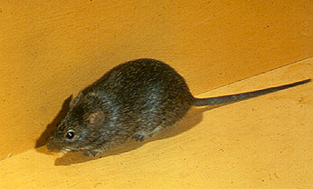
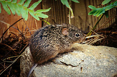

---
aliases:
  - Sigmodon
title: Sigmodon
---

# [[Sigmodon]]

## Sigmodontini: cotton rats 
)

## #has_/text_of_/abstract 

> A cotton rat is any member of the rodent genus **Sigmodon**. Their name derives from their damaging effects on cotton as well as other plantation crops, such as sugarcane, corn, peanut and rice.  Cotton rats have small ears and dark coats, and are found in North and South America. Members of this genus are distributed in the Southwestern United States, Mexico, Central America, and South American countries of: Venezuela, Ecuador, Colombia, Peru, Brazil, Guyana, and Suriname. Many of the species are found in Mexico.
>
> They are primarily herbivores. The molars of cotton rats are S-shaped when viewed from above. The genus name literally means S-tooth.
>
> Sigmodon hispidus was the first model organism to be used in polio research.
>
> [Wikipedia](https://en.wikipedia.org/wiki/Cotton%20rat) 

## Introduction

[Scott J. Steppan and Michael Reno]()

The rodents of Sigmodontini are commonly referred to as the cotton rats;
a name that stems from their habit of using cotton fibers to make
nests.  The tribe is comprised of a single genus, *Sigmodon*, which
consists of twelve recognized species and many subspecies.  The
Sigmodontini are found throughout both North and South America with a
majority residing in Central America and only a few species living in
the United States or South America.

While the sigmodontini are normally considered minor agricultural pests,
several species have become associated with viral diseases. *Sigmodon
hispidus* is a known vector of Hantavirus, specifically the Sin Nombre
and Black Creek viruses, in the southern United States. Sin Nombre was
first seen in the Four Corners Region of the United States in 1993.  It
was found to cause Hantavirus Pulmonary Syndrome, a flu-like illness
which rapidly progresses into cardiovascular shock in roughly three
days. *Sigmodon alstoni* has become a vector for Arenovirus,
specifically Guanarito Virus, in South America.  Gaunarito Virus is
responsible for Venezuelan Hemorrhagic Fever, a disease associated with
high fever leading to hemorrhagic organ failure with a 30% mortality
rate. (Strauss and Strauss, 2002)

### Characteristics
)

*Sigmodon hispidus*, a *Sigmodon* species commonly occurring in the
United States.

Sigmodon are generally large sized rodents which average greater than
100 grams. They generally have a dark colored coat with large eyes and
small ears. The tail is usually sparsely covered by hair and shorter
than the body length (Voss, 1992). *Sigmodon* *fulviventer* is the
largest of the Sigmodontini and reaches a mass of 220 grams (LaRoche
and Yahnke, 2004). There is little morphological difference among the
species of the Sigmodontini.

The Sigmodontini range from northern South America to central United
States. *Sigmodon hispidus* has been expanding its range across the
United States at a rapid rate. It is now commonly found north of
Tennessee and has been seen occasionally in Illinois. They tend to
prefer grassy fields and will build nests and runways in the dense
ground foliage. The US species of Sigmodontini are mostly nocturnal in
their behavior and are active throughout the year (Stafford, 2000).
While they are capable of breeding throughout the year, most
reproduction happens in the late summer with litter sizes ranging from
two to fifteen (Voss, 1992).

### Morphology
)

Lower molars of *Sigmodon hispidus*. Note S-shaped pattern of last
molar. © [Phil Myers, University of Michigan Animal Diversity Web](http://animaldiversity.ummz.umich.edu/)

*Sigmodon hispidus* is the type species (Say and Ord, 1825). A large
volume of work has been conducted using the North American species;
however, little phylogenetic work has utilized the South American
species.  Voss (1992) provides a great deal of systematic work based on
morphology. Early morphological descriptions of the Sigmodontini was
provided by Say and Ord (1825); however, these descriptions are based on
only three samples of *Sigmodon hispidus* collected in Florida. The
Sigmodontini have small ears, short whiskers, and short tails. They have
unwebbed hind feet with the first and fifth digits shorter than the
middle three. Their molars are hypsodont with conspicuous lophodont
(high crowned with ridges perpendicular to the jaw). These molars are
best suited for grinding the stems, roots, and shots that compose the
bulk of their diet. The cusps and crests are arranged in a sigmoidal
array (S-shaped), and the mesoloph is absent (Say and Ord, 1825).

Morphological differences among the Sigmodontini are rather scarce.
*Sigmodon alstoni* is perhaps the most divergent of the group and most
easily identified.  It is distinguishibale due to its smaller size,
deeply grooved incisors, rounded cusps on upper molars, and mandibular
molars with only three roots (Voss 1992). Morphological characters among
other species of *Sigmodon* vary only slightly.

### Discussion of Phylogenetic Relationships

Historically, *Sigmodon* has been associated at times with other
hypsodont and lophodont groups. For example, Herskovitz (1955)
recognized the sigmodont group to include the marsh rat *Holochilus*
(later removed to Oryzomyini by Voss and Carleton (1993) and Steppan
(1995)), *Reithrodon*, and *Neotomys* (both placed in Phyllotini by Olds
and Anderson (1989) and Steppan (1995)); but *Reithrodon* was removed to
an independent lineage or Reithrodontini by Smith and Patton (1999),
Jansa and Weksler (2004), and Steppan et al. (2004).

Little work has been done to determine the phylogenetic relationships
among the species of *Sigmodon*.  Oftentimes, *Sigmodon hispidus* and
*Sigmodon alstoni* appear in larger sample sets; however, only one major
study has been conducted with focus on the Sigmodontini. Peppers et al.
(2002) utilized cytochrome b sequences, and the follow-up study (Carroll
and Bradley, 2005) added sequences from nuclear intron 7 of
beta-fibrinogen. Both studies used fifteen *Sigmodon* subspecies
representing ten different species. The majority of the taxa used in the
study were collected from the southern US and Mexico, except for the
South American *Sigmodon alstoni*. Placement of *Sigmodon alstoni* as
the most basal member of the Sigmodontini is in agreement with other
studies (Steppan, unpublished). Furthermore, the grouping of *S. alleni*
and *S. hirsutus* was well supported as well as the grouping of *S
leucotis and S. fulviventer*. Strong support for grouping *S.
mascotensis, S. hispidus, and S. arizonae* was found, but the
relationship among them was largely unresolved. However, the branching
pattern was not robustly resolved and additional genes and more detailed
taxon sampling is needed (Carroll and Bradley, 2005).

## Phylogeny 

-   « Ancestral Groups  
    -  [Sigmodontinae](../Sigmodontinae.md) 
    -  [Muroidea](../../Muroidea.md) 
    -  [Rodentia](../../../Rodentia.md) 
    -  [Eutheria](../../../../Eutheria.md) 
    -  [Mammal](../../../../../Mammal.md) 
    -   [Therapsida](../../../../../../Therapsida.md)
    -   [Synapsida](../../../../../../../Synapsida.md)
    -   [Amniota](../../../../../../../../Amniota.md)
    -   [Terrestrial Vertebrates](../../../../../../../../../Terrestrial.md)
    -   [Sarcopterygii](../../../../../../../../../../Sarc.md)
    -   [Gnathostomata](../../../../../../../../../../../Gnath.md)
    -   [Vertebrata](../../../../../../../../../../../../Vertebrata.md)
    -   [Craniata](../../../../../../../../../../../../../Craniata.md)
    -   [Chordata](../../../../../../../../../../../../../../Chordata.md)
    -   [Deuterostomia](../../../../../../../../../../../../../../../Deutero.md)
    -  [Bilateria](../../../../../../../../../../../../../../../../Bilateria.md) 
    -  [Animals](../../../../../../../../../../../../../../../../../Animals.md) 
    -  [Eukarya](../../../../../../../../../../../../../../../../../../Eukarya.md) 
    -   [Tree of Life](../../../../../../../../../../../../../../../../../../Tree_of_Life.md)

-   ◊ Sibling Groups of  Sigmodontinae
    -   Sigmodon
    -   [Ichthyomyini](Ichthyomyini.md)
    -   [Thomasomyine group and Sigmodontinae incertae         sedis](Thomasomyine_group_and_Sigmodontinae_incertae_sedis)
    -   [Wiedomyini](Wiedomyini.md)
    -   [Oryzomyini](Oryzomyini.md)
    -   [Phyllotini](Phyllotini.md)
    -   [Andinomys edax](Andinomys_edax.md)
    -   [Reithrodon](Reithrodon.md)
    -   [Irenomys tarsalis](Irenomys_tarsalis.md)
    -   [Euneomys](Euneomys.md)
    -   [Abrothicine group](Abrothicine_group)
    -   [Akodontini](Akodontini.md)

-   » Sub-Groups 

## Title Illustrations

)

-----------
Scientific Name ::  Sigmodon hispidus
Comments          The hispid cotton rat
Copyright ::         © 1996 R. H. Baker
-----------

## Confidential Links & Embeds: 

### #is_/same_as :: [[/_Standards/bio/bio~Domain/Eukarya/Animal/Bilateria/Deutero/Chordata/Craniata/Vertebrata/Gnath/Sarc/Tetrapods/Amniota/Synapsida/Therapsida/Mammal/Eutheria/Rodentia/Muroidea/Sigmodontinae/Sigmodon|Sigmodon]] 

### #is_/same_as :: [[/_public/bio/bio~Domain/Eukarya/Animal/Bilateria/Deutero/Chordata/Craniata/Vertebrata/Gnath/Sarc/Tetrapods/Amniota/Synapsida/Therapsida/Mammal/Eutheria/Rodentia/Muroidea/Sigmodontinae/Sigmodon.public|Sigmodon.public]] 

### #is_/same_as :: [[/_internal/bio/bio~Domain/Eukarya/Animal/Bilateria/Deutero/Chordata/Craniata/Vertebrata/Gnath/Sarc/Tetrapods/Amniota/Synapsida/Therapsida/Mammal/Eutheria/Rodentia/Muroidea/Sigmodontinae/Sigmodon.internal|Sigmodon.internal]] 

### #is_/same_as :: [[/_protect/bio/bio~Domain/Eukarya/Animal/Bilateria/Deutero/Chordata/Craniata/Vertebrata/Gnath/Sarc/Tetrapods/Amniota/Synapsida/Therapsida/Mammal/Eutheria/Rodentia/Muroidea/Sigmodontinae/Sigmodon.protect|Sigmodon.protect]] 

### #is_/same_as :: [[/_private/bio/bio~Domain/Eukarya/Animal/Bilateria/Deutero/Chordata/Craniata/Vertebrata/Gnath/Sarc/Tetrapods/Amniota/Synapsida/Therapsida/Mammal/Eutheria/Rodentia/Muroidea/Sigmodontinae/Sigmodon.private|Sigmodon.private]] 

### #is_/same_as :: [[/_personal/bio/bio~Domain/Eukarya/Animal/Bilateria/Deutero/Chordata/Craniata/Vertebrata/Gnath/Sarc/Tetrapods/Amniota/Synapsida/Therapsida/Mammal/Eutheria/Rodentia/Muroidea/Sigmodontinae/Sigmodon.personal|Sigmodon.personal]] 

### #is_/same_as :: [[/_secret/bio/bio~Domain/Eukarya/Animal/Bilateria/Deutero/Chordata/Craniata/Vertebrata/Gnath/Sarc/Tetrapods/Amniota/Synapsida/Therapsida/Mammal/Eutheria/Rodentia/Muroidea/Sigmodontinae/Sigmodon.secret|Sigmodon.secret]] 

