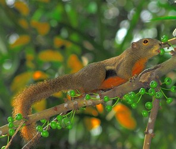
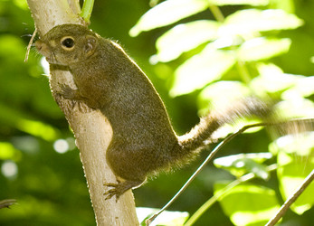

---
aliases:
- Callosciurini
- cal·losciürinis
- Dienvidaustrumāzijas vāveres
- Echte Aziatyske pronkiikhoarntsjes
- Náátsʼózídę́ę́ʼ hazéí danizhónígíí
- 칼로스키우루스족
title: Callosciurini
has_id_wikidata: Q16354398
dv_has_:
  name_:
    an: Callosciurini
    ast: Callosciurini
    bg: Callosciurini
    ca: cal·losciürinis
    ceb: Callosciurini
    de: Callosciurini
    en: Callosciurini
    eo: Callosciurini
    es: Callosciurini
    eu: Callosciurini
    ext: Callosciurini
    fi: Callosciurini
    fr: Callosciurini
    fy: Echte Aziatyske pronkiikhoarntsjes
    ga: Callosciurini
    gl: Callosciurini
    ia: Callosciurini
    ie: Callosciurini
    io: Callosciurini
    it: Callosciurini
    ko: 칼로스키우루스족
    la: Callosciurini
    lv: Dienvidaustrumāzijas vāveres
    mul: Callosciurini
    nl: Callosciurini
    nv: Náátsʼózídę́ę́ʼ hazéí danizhónígíí
    oc: Callosciurini
    pl: Callosciurini
    pt: Callosciurini
    pt_br: Callosciurini
    ro: Callosciurini
    ru: Callosciurini
    sq: Callosciurini
    uk: Callosciurini
    vi: Callosciurini
    vo: Callosciurini
    war: Callosciurini
---
# [[Callosciurini]]  

## #has_/text_of_/abstract 

> **Callosciurini** is a tribe of tree squirrels mainly found in southern Asia.
>
> [Wikipedia](https://en.wikipedia.org/wiki/Callosciurini) 

## Phylogeny 

-   « Ancestral Groups  
    -   [Squirrel](../Squirrel.md)
    -  [Rodentia](../../../Rodentia.md) 
    -  [Eutheria](../../../../Eutheria.md) 
    -  [Mammal](../../../../../Mammal.md) 
    -   [Therapsida](../../../../../../Therapsida.md)
    -   [Synapsida](../../../../../../../Synapsida.md)
    -   [Amniota](../../../../../../../../Amniota.md)
    -   [Terrestrial Vertebrates](../../../../../../../../Terrestrial.md)
    -   [Sarcopterygii](../../../../../../../../../../Sarc.md)
    -   [Gnathostomata](../../../../../../../../../../../Gnath.md)
    -   [Vertebrata](../../../../../../../../../../../../Vertebrata.md)
    -   [Craniata](../../../../../../../../../../../../../Craniata.md)
    -   [Chordata](../../../../../../../../../../../../../../Chordata.md)
    -   [Deuterostomia](../../../../../../../../../../../../../../../Deutero.md)
    -  [Bilateria](../../../../../../../../../../../../../../../../Bilateria.md) 
    -  [Animals](../../../../../../../../../../../../../../../../Animals.md) 
    -  [Eukarya](../../../../../../../../../../../../../../../../../../Eukarya.md) 
    -   [Tree of Life](../../../../../../../../../../../../../../../../../../Tree_of_Life.md)

-   ◊ Sibling Groups of  Sciuridae
    -   Callosciurini
    -   [Xerinae](Xerinae.md)
    -   [Sciurini](Sciurini.md)
    -   [Pteromyini](Pteromyini.md)

-   » Sub-Groups 
	-   *Callosciurus*
	-   *Dremomys*
	-   *Exilisciurus*
	-   *Glyphotes*
	-   *Hyosciurus*
	-   *Lariscus*
	-   *Menetes*
	-   *Nannosciurus*
	-   *Prosciurillus*
	-   *Rubrisciurus*
	-   *Tamiops*
	-   *Sundasciurus*

## Title Illustrations

  --------------------------------------------------------
  scientific_name ::     Callosciurus notatus
  location ::           Lower Peirce Reservoir, Singapore
  specimen_condition ::  Live Specimen
  Source               [Plantain Squirrel](http://www.flickr.com/photos/64684201@N00/267759125/)
  Source Collection    [Flickr](http://flickr.com/)
  Image Use ::    [Attribution 2.0 Creative Commons License](http://creativecommons.org/licenses/by/2.0/).
  copyright ::            © 2006 [Jwee](http://flickr.com/people/64684201@N00)
  --------------------------------------------------------

  ------------------------------------------------------------------
  scientific_name ::     Sundasciurus tenuis
  specimen_condition ::  Live Specimen
  Source               [slender squirrel (Sundasciurus tenuis)](http://www.flickr.com/photos/budak/510893344/)
  Source Collection    [Flickr](http://flickr.com/)
  Image Use ::    [Attribution-NonCommercial-ShareAlike 2.0 Creative Commons License](http://creativecommons.org/licenses/by-nc-sa/2.0/).
  copyright ::            © 2007 [budak](http://flickr.com/people/77246694@N00)
  ------------------------------------------------------------------

## Confidential Links & Embeds: 

### #is_/same_as :: [[/_Standards/bio/bio~Domain/Eukarya/Animal/Bilateria/Deutero/Chordata/Craniata/Vertebrata/Gnath/Sarc/Tetrapods/Amniota/Synapsida/Therapsida/Mammal/Eutheria/Rodentia/Sciuromorpha/Squirrel/Callosciurini|Callosciurini]] 

### #is_/same_as :: [[/_public/bio/bio~Domain/Eukarya/Animal/Bilateria/Deutero/Chordata/Craniata/Vertebrata/Gnath/Sarc/Tetrapods/Amniota/Synapsida/Therapsida/Mammal/Eutheria/Rodentia/Sciuromorpha/Squirrel/Callosciurini.public|Callosciurini.public]] 

### #is_/same_as :: [[/_internal/bio/bio~Domain/Eukarya/Animal/Bilateria/Deutero/Chordata/Craniata/Vertebrata/Gnath/Sarc/Tetrapods/Amniota/Synapsida/Therapsida/Mammal/Eutheria/Rodentia/Sciuromorpha/Squirrel/Callosciurini.internal|Callosciurini.internal]] 

### #is_/same_as :: [[/_protect/bio/bio~Domain/Eukarya/Animal/Bilateria/Deutero/Chordata/Craniata/Vertebrata/Gnath/Sarc/Tetrapods/Amniota/Synapsida/Therapsida/Mammal/Eutheria/Rodentia/Sciuromorpha/Squirrel/Callosciurini.protect|Callosciurini.protect]] 

### #is_/same_as :: [[/_private/bio/bio~Domain/Eukarya/Animal/Bilateria/Deutero/Chordata/Craniata/Vertebrata/Gnath/Sarc/Tetrapods/Amniota/Synapsida/Therapsida/Mammal/Eutheria/Rodentia/Sciuromorpha/Squirrel/Callosciurini.private|Callosciurini.private]] 

### #is_/same_as :: [[/_personal/bio/bio~Domain/Eukarya/Animal/Bilateria/Deutero/Chordata/Craniata/Vertebrata/Gnath/Sarc/Tetrapods/Amniota/Synapsida/Therapsida/Mammal/Eutheria/Rodentia/Sciuromorpha/Squirrel/Callosciurini.personal|Callosciurini.personal]] 

### #is_/same_as :: [[/_secret/bio/bio~Domain/Eukarya/Animal/Bilateria/Deutero/Chordata/Craniata/Vertebrata/Gnath/Sarc/Tetrapods/Amniota/Synapsida/Therapsida/Mammal/Eutheria/Rodentia/Sciuromorpha/Squirrel/Callosciurini.secret|Callosciurini.secret]] 

