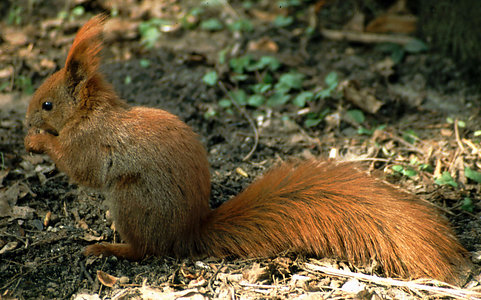

---
aliases:
- Baumhörnchen
- Dloziłgaii dóó bikʼéí
- Echte beamiikhoarntsjes
- esciürinis
- Koku vāveres
- Sciurini
- Sciurinioj
- Sciurinos (tribo)
- Tông Sóc cây
- valódi mókusok
- wiewiórki
- 松鼠族
- 청서족
title: Sciurini
has_id_wikidata: Q2294121
dv_has_:
  name_:
    an: Sciurini
    ast: Sciurini
    bg: Sciurini
    ca: esciürinis
    ceb: Sciurini
    cs: Sciurini
    de: Baumhörnchen
    el: Sciurini
    en: Sciurini
    eo: Sciurinioj
    es: Sciurini
    eu: Sciurini
    ext: Sciurini
    fi: Sciurini
    fr: Sciurini
    frr: Sciurini
    fy: Echte beamiikhoarntsjes
    ga: Sciurini
    gl: Sciurinos (tribo)
    hu: valódi mókusok
    ia: Sciurini
    ie: Sciurini
    io: Sciurini
    it: Sciurini
    jv: Sciurini
    ko: 청서족
    la: Sciurini
    lv: Koku vāveres
    mul: Sciurini
    nl: Sciurini
    nv: Dloziłgaii dóó bikʼéí
    oc: Sciurini
    pl: wiewiórki
    pt: Sciurini
    pt_br: Sciurini
    ro: Sciurini
    ru: Sciurini
    sl: Sciurini
    sq: Sciurini
    sv: Sciurini
    uk: Sciurini
    vi: Tông Sóc cây
    vo: Sciurini
    war: Sciurini
    zh: 松鼠族
    zh_cn: 松鼠族
    zh_hans: 松鼠族
    zh_tw: 松鼠族
---
# [[Sciurini]] 

## #has_/text_of_/abstract 

> **Sciurini** is a tribe that includes about forty species of squirrels, mostly from the Americas. 
> It includes five living genera—the American dwarf squirrels, Microsciurus; the Bornean Rheithrosciurus; the widespread American and Eurasian tree squirrels of the genus Sciurus, which includes some of the best known squirrel species; the Central American Syntheosciurus; and the American pine squirrels, Tamiasciurus. Like other arboreal squirrels, they are sometimes referred to as tree squirrels.
>
> [Wikipedia](https://en.wikipedia.org/wiki/Sciurini) 

## Phylogeny 

-   « Ancestral Groups  
    -   [Squirrel](../Squirrel.md)
    -  [Rodentia](../../../Rodentia.md) 
    -  [Eutheria](../../../../Eutheria.md) 
    -  [Mammal](../../../../../Mammal.md) 
    -   [Therapsida](../../../../../../Therapsida.md)
    -   [Synapsida](../../../../../../../Synapsida.md)
    -   [Amniota](../../../../../../../../Amniota.md)
    -   [Terrestrial Vertebrates](../../../../../../../../Terrestrial.md)
    -   [Sarcopterygii](../../../../../../../../../../Sarc.md)
    -   [Gnathostomata](../../../../../../../../../../../Gnath.md)
    -   [Vertebrata](../../../../../../../../../../../../Vertebrata.md)
    -   [Craniata](../../../../../../../../../../../../../Craniata.md)
    -   [Chordata](../../../../../../../../../../../../../../Chordata.md)
    -   [Deuterostomia](../../../../../../../../../../../../../../../Deutero.md)
    -  [Bilateria](../../../../../../../../../../../../../../../../Bilateria.md) 
    -  [Animals](../../../../../../../../../../../../../../../../Animals.md) 
    -  [Eukarya](../../../../../../../../../../../../../../../../../../Eukarya.md) 
    -   [Tree of Life](../../../../../../../../../../../../../../../../../../Tree_of_Life.md)

-   ◊ Sibling Groups of  Sciuridae
    -   [Callosciurini](Callosciurini.md)
    -   [Xerinae](Xerinae.md)
    -   Sciurini
    -   [Pteromyini](Pteromyini.md)

-   » Sub-Groups
    -   [Microsciurini](Sciurini/Microsciurini.md)

	-   *Rheithrosciurus*
	-   *Sciurus*[ (non-monophyletic) ]
	-   *[Microsciurini](Sciurini/Microsciurini.md "go to ToL page")*
	    [(Neotropical dwarf squirrels)]

Containing group: [Squirrel](../Squirrel.md)

## Title Illustrations

  ------------------------------
  scientific_name ::     Sciurus vulgaris
  location ::           Poland
  Comments             Eurasian red squirrel
  Acknowledgements     Photograph courtesy [InsectImages.org](http://www.insectimages.org/) (#1261031)
  specimen_condition ::  Live Specimen
  Source Collection    [InsectImages.org](http://www.insectimages.org/)
  copyright ::            © Gil Wojciech, Polish Forest Research Institute
  ------------------------------

## Confidential Links & Embeds: 

### #is_/same_as :: [[/_Standards/bio/bio~Domain/Eukarya/Animal/Bilateria/Deutero/Chordata/Craniata/Vertebrata/Gnath/Sarc/Tetrapods/Amniota/Synapsida/Therapsida/Mammal/Eutheria/Rodentia/Sciuromorpha/Squirrel/Sciurini|Sciurini]] 

### #is_/same_as :: [[/_public/bio/bio~Domain/Eukarya/Animal/Bilateria/Deutero/Chordata/Craniata/Vertebrata/Gnath/Sarc/Tetrapods/Amniota/Synapsida/Therapsida/Mammal/Eutheria/Rodentia/Sciuromorpha/Squirrel/Sciurini.public|Sciurini.public]] 

### #is_/same_as :: [[/_internal/bio/bio~Domain/Eukarya/Animal/Bilateria/Deutero/Chordata/Craniata/Vertebrata/Gnath/Sarc/Tetrapods/Amniota/Synapsida/Therapsida/Mammal/Eutheria/Rodentia/Sciuromorpha/Squirrel/Sciurini.internal|Sciurini.internal]] 

### #is_/same_as :: [[/_protect/bio/bio~Domain/Eukarya/Animal/Bilateria/Deutero/Chordata/Craniata/Vertebrata/Gnath/Sarc/Tetrapods/Amniota/Synapsida/Therapsida/Mammal/Eutheria/Rodentia/Sciuromorpha/Squirrel/Sciurini.protect|Sciurini.protect]] 

### #is_/same_as :: [[/_private/bio/bio~Domain/Eukarya/Animal/Bilateria/Deutero/Chordata/Craniata/Vertebrata/Gnath/Sarc/Tetrapods/Amniota/Synapsida/Therapsida/Mammal/Eutheria/Rodentia/Sciuromorpha/Squirrel/Sciurini.private|Sciurini.private]] 

### #is_/same_as :: [[/_personal/bio/bio~Domain/Eukarya/Animal/Bilateria/Deutero/Chordata/Craniata/Vertebrata/Gnath/Sarc/Tetrapods/Amniota/Synapsida/Therapsida/Mammal/Eutheria/Rodentia/Sciuromorpha/Squirrel/Sciurini.personal|Sciurini.personal]] 

### #is_/same_as :: [[/_secret/bio/bio~Domain/Eukarya/Animal/Bilateria/Deutero/Chordata/Craniata/Vertebrata/Gnath/Sarc/Tetrapods/Amniota/Synapsida/Therapsida/Mammal/Eutheria/Rodentia/Sciuromorpha/Squirrel/Sciurini.secret|Sciurini.secret]] 

