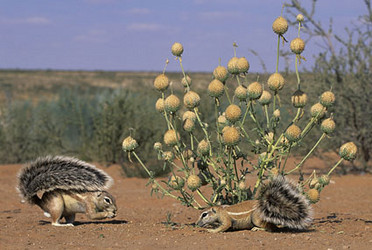

---
aliases:
- afrowiórki
- Erdhörnchen
- földimókusformák
- Grûniikhoarntsjes en Afrikaanske beamiikhoarntsjes
- Phân họ Sóc đất
- Xerinae
- Xerí
- Zemes vāveres
- Äerdkaweechelcher
- Ξερινές
- סנאיי קרקע
- خشکیسنجابیان
- سناجب أرضية
- سناجب ارضيه
- アラゲジリス亜科
- 非洲地松鼠亚科
- 非洲地松鼠亞科
- 땅다람쥐아과
has_id_wikidata: Q53112
title: Xerinae
taxon_rank: '[[_Standards/WikiData/WD~subfamily,164280]]'
parent_taxon: '[[_Standards/WikiData/WD~squirrel,9482]]'
instance_of: '[[_Standards/WikiData/WD~taxon,16521]]'
ITIS_TSN: 930206
Commons_gallery: Xerinae
Commons_category: Xerinae
taxon_name: Xerinae
image: http://commons.wikimedia.org/wiki/Special:FilePath/Borstenh%C3%B6rnchen%20060319%202.jpg
UMLS_CUI: C1648590
dv_has_:
  name_:
    an: Xerinae
    ar: سناجب أرضية
    arz: سناجب ارضيه
    ast: Xerinae
    bg: Xerinae
    br: Xerinae
    ca: Xerí
    ceb: Xerinae
    cs: Xerinae
    de: Erdhörnchen
    de_ch: Erdhörnchen
    el: Ξερινές
    en: Xerinae
    en_ca: Xerinae
    en_gb: Xerinae
    eo: Xerinae
    es: Xerinae
    eu: Xerinae
    ext: Xerinae
    fa: خشکیسنجابیان
    fi: Xerinae
    fr: Xerinae
    fy: Grûniikhoarntsjes en Afrikaanske beamiikhoarntsjes
    ga: Xerinae
    gl: Xerinae
    he: סנאיי קרקע
    hu: földimókusformák
    ia: Xerinae
    ie: Xerinae
    io: Xerinae
    it: Xerinae
    ja: アラゲジリス亜科
    ko: 땅다람쥐아과
    la: Xerinae
    lb: Äerdkaweechelcher
    lv: Zemes vāveres
    ms: Xerinae
    mul: Xerinae
    nl: Xerinae
    oc: Xerinae
    pl: afrowiórki
    pt: Xerinae
    pt_br: Xerinae
    ro: Xerinae
    ru: Xerinae
    sl: Xerinae
    sq: Xerinae
    uk: Xerinae
    vec: Xerinae
    vi: Phân họ Sóc đất
    vo: Xerinae
    war: Xerinae
    zh: 非洲地松鼠亞科
    zh_cn: 非洲地松鼠亚科
    zh_hant: 非洲地松鼠亞科
    zh_tw: 非洲地松鼠亞科
---
# [[Xerinae]] 

#is_/same_as :: [[../../../../../../../../../../../../../../../../../../../../WikiData/WD~Xerinae,53112|WD~Xerinae,53112]] 

## #has_/text_of_/abstract 

> The **Xerinae** comprise a subfamily of squirrels, many of which are highly terrestrial. It includes the tribes Marmotini (marmots, chipmunks, prairie dogs, and other Holarctic ground squirrels), Xerini (African and some Eurasian ground squirrels), and Protoxerini (African tree squirrels). 
>
> The Xerinae first originated in Eurasia but later dispersed to other parts of the world. One of which was Africa, where they traveled via land bridges in the Miocene period, leading to the emergence of Protoxerini and Xerini ground squirrel tribes. Many Xerinae also dispersed to North America during the early Oligocene era, and with the help of global cooling and the expansion of grasslands, resulted in the emergence of the Marmotini ground squirrel tribe.
>
> [Wikipedia](https://en.wikipedia.org/wiki/Xerinae) 

## Phylogeny 

-   « Ancestral Groups  
    -   [Squirrel](../Squirrel.md)
    -  [Rodentia](../../../Rodentia.md) 
    -  [Eutheria](../../../../Eutheria.md) 
    -  [Mammal](../../../../../Mammal.md) 
    -   [Therapsida](../../../../../../Therapsida.md)
    -   [Synapsida](../../../../../../../Synapsida.md)
    -   [Amniota](../../../../../../../../Amniota.md)
    -   [Terrestrial Vertebrates](../../../../../../../../Terrestrial.md)
    -   [Sarcopterygii](../../../../../../../../../../Sarc.md)
    -   [Gnathostomata](../../../../../../../../../../../Gnath.md)
    -   [Vertebrata](../../../../../../../../../../../../Vertebrata.md)
    -   [Craniata](../../../../../../../../../../../../../Craniata.md)
    -   [Chordata](../../../../../../../../../../../../../../Chordata.md)
    -   [Deuterostomia](../../../../../../../../../../../../../../../Deutero.md)
    -  [Bilateria](../../../../../../../../../../../../../../../../Bilateria.md) 
    -  [Animals](../../../../../../../../../../../../../../../../Animals.md) 
    -  [Eukarya](../../../../../../../../../../../../../../../../../../Eukarya.md) 
    -   [Tree of Life](../../../../../../../../../../../../../../../../../../Tree_of_Life.md)

-   ◊ Sibling Groups of  Sciuridae
    -   [Callosciurini](Callosciurini.md)
    -   Xerinae
    -   [Sciurini](Sciurini.md)
    -   [Pteromyini](Pteromyini.md)

-   » Sub-Groups
    -   [Ground_Squirrel](Xerinae/Ground_Squirrel.md)
    -   [Protoxerini](Xerinae/Protoxerini.md)
    -   [Xerini](Xerinae/Xerini.md)

## Title Illustrations

---------------------

scientific_name ::     Xerus inauris
location ::           Kgalagadi Transfrontier Park, Kalahari, South Africa
specimen_condition ::  Live Specimen
copyright ::            © 2006 [Nigel Dennis](http://www.nigeldennis.com/)

## Confidential Links & Embeds: 

### #is_/same_as :: [[/_Standards/bio/bio~Domain/Eukarya/Animal/Bilateria/Deutero/Chordata/Craniata/Vertebrata/Gnath/Sarc/Tetrapods/Amniota/Synapsida/Therapsida/Mammal/Eutheria/Rodentia/Sciuromorpha/Squirrel/Xerinae|Xerinae]] 

### #is_/same_as :: [[/_public/bio/bio~Domain/Eukarya/Animal/Bilateria/Deutero/Chordata/Craniata/Vertebrata/Gnath/Sarc/Tetrapods/Amniota/Synapsida/Therapsida/Mammal/Eutheria/Rodentia/Sciuromorpha/Squirrel/Xerinae.public|Xerinae.public]] 

### #is_/same_as :: [[/_internal/bio/bio~Domain/Eukarya/Animal/Bilateria/Deutero/Chordata/Craniata/Vertebrata/Gnath/Sarc/Tetrapods/Amniota/Synapsida/Therapsida/Mammal/Eutheria/Rodentia/Sciuromorpha/Squirrel/Xerinae.internal|Xerinae.internal]] 

### #is_/same_as :: [[/_protect/bio/bio~Domain/Eukarya/Animal/Bilateria/Deutero/Chordata/Craniata/Vertebrata/Gnath/Sarc/Tetrapods/Amniota/Synapsida/Therapsida/Mammal/Eutheria/Rodentia/Sciuromorpha/Squirrel/Xerinae.protect|Xerinae.protect]] 

### #is_/same_as :: [[/_private/bio/bio~Domain/Eukarya/Animal/Bilateria/Deutero/Chordata/Craniata/Vertebrata/Gnath/Sarc/Tetrapods/Amniota/Synapsida/Therapsida/Mammal/Eutheria/Rodentia/Sciuromorpha/Squirrel/Xerinae.private|Xerinae.private]] 

### #is_/same_as :: [[/_personal/bio/bio~Domain/Eukarya/Animal/Bilateria/Deutero/Chordata/Craniata/Vertebrata/Gnath/Sarc/Tetrapods/Amniota/Synapsida/Therapsida/Mammal/Eutheria/Rodentia/Sciuromorpha/Squirrel/Xerinae.personal|Xerinae.personal]] 

### #is_/same_as :: [[/_secret/bio/bio~Domain/Eukarya/Animal/Bilateria/Deutero/Chordata/Craniata/Vertebrata/Gnath/Sarc/Tetrapods/Amniota/Synapsida/Therapsida/Mammal/Eutheria/Rodentia/Sciuromorpha/Squirrel/Xerinae.secret|Xerinae.secret]] 

