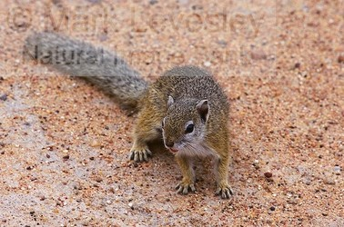

---
aliases:
  - Protoxerini
title: Protoxerini
---

# [[Protoxerini]]

## #has_/text_of_/abstract 

> The **Protoxerini** comprise a tribe of squirrels found in Africa. The 30 species in six genera are:
> - Epixerus (monotypic) - Ebian's palm squirrel
> - Funisciurus (nine species) - African striped squirrels
> - Heliosciurus (six species) - sun squirrels
> - Myosciurus (monotypic) - African pygmy squirrel
> - Paraxerus (11 species) - African bush squirrels
> - Protoxerus (two species) - African giant squirrels
>
> [Wikipedia](https://en.wikipedia.org/wiki/Protoxerini) 

## Phylogeny 

-   « Ancestral Groups  
    -   [Xerinae](../Xerinae.md)
    -   [Squirrel](../../Squirrel.md)
    -  [Rodentia](../../../../Rodentia.md) 
    -  [Eutheria](../../../../../Eutheria.md) 
    -  [Mammal](../../../../../../Mammal.md) 
    -   [Therapsida](../../../../../../../Therapsida.md)
    -   [Synapsida](../../../../../../../../Synapsida.md)
    -   [Amniota](../../../../../../../../../Amniota.md)
    -   [Terrestrial Vertebrates](../../../../../../../../../Terrestrial.md)
    -   [Sarc](../../../../../../../../../../../Sarc.md)(Sarc.md)
    -   [Gnathostomata](../../../../../../../../../../../../Gnath.md)
    -   [Vertebrata](../../../../../../../../../../../../../Vertebrata.md)
    -   [Craniata](../../../../../../../../../../../../../../Craniata.md)
    -   [Chordata](../../../../../../../../../../../../../../../Chordata.md)
    -   [Deuterostomia](../../../../../../../../../../../../../../../../Deutero.md)
    -  [Bilateria](../../../../../../../../../../../../../../../../../Bilateria.md) 
    -  [Animals](../../../../../../../../../../../../../../../../../Animals.md) 
    -  [Eukarya](../../../../../../../../../../../../../../../../../../../Eukarya.md) 
    -   [Tree of Life](../../../../../../../../../../../../../../../../../../../Tree_of_Life.md)

-   ◊ Sibling Groups of  Xerinae
    -   [Ground_Squirrel](Ground_Squirrel.md)
    -   Protoxerini
    -   [Xerini](Xerini.md)

-   » Sub-Groups 

## Title Illustrations

------------------------

scientific_name ::     Paraxerus cepapi
location ::           Kruger National Park, South Africa
specimen_condition ::  Live Specimen
copyright ::            © [Mark Levesley](http://www.naturalimagebank.com/index.html)

## Confidential Links & Embeds: 

### #is_/same_as :: [[/_Standards/bio/bio~Domain/Eukarya/Animal/Bilateria/Deutero/Chordata/Craniata/Vertebrata/Gnath/Sarc/Tetrapods/Amniota/Synapsida/Therapsida/Mammal/Eutheria/Rodentia/Sciuromorpha/Squirrel/Xerinae/Protoxerini|Protoxerini]] 

### #is_/same_as :: [[/_public/bio/bio~Domain/Eukarya/Animal/Bilateria/Deutero/Chordata/Craniata/Vertebrata/Gnath/Sarc/Tetrapods/Amniota/Synapsida/Therapsida/Mammal/Eutheria/Rodentia/Sciuromorpha/Squirrel/Xerinae/Protoxerini.public|Protoxerini.public]] 

### #is_/same_as :: [[/_internal/bio/bio~Domain/Eukarya/Animal/Bilateria/Deutero/Chordata/Craniata/Vertebrata/Gnath/Sarc/Tetrapods/Amniota/Synapsida/Therapsida/Mammal/Eutheria/Rodentia/Sciuromorpha/Squirrel/Xerinae/Protoxerini.internal|Protoxerini.internal]] 

### #is_/same_as :: [[/_protect/bio/bio~Domain/Eukarya/Animal/Bilateria/Deutero/Chordata/Craniata/Vertebrata/Gnath/Sarc/Tetrapods/Amniota/Synapsida/Therapsida/Mammal/Eutheria/Rodentia/Sciuromorpha/Squirrel/Xerinae/Protoxerini.protect|Protoxerini.protect]] 

### #is_/same_as :: [[/_private/bio/bio~Domain/Eukarya/Animal/Bilateria/Deutero/Chordata/Craniata/Vertebrata/Gnath/Sarc/Tetrapods/Amniota/Synapsida/Therapsida/Mammal/Eutheria/Rodentia/Sciuromorpha/Squirrel/Xerinae/Protoxerini.private|Protoxerini.private]] 

### #is_/same_as :: [[/_personal/bio/bio~Domain/Eukarya/Animal/Bilateria/Deutero/Chordata/Craniata/Vertebrata/Gnath/Sarc/Tetrapods/Amniota/Synapsida/Therapsida/Mammal/Eutheria/Rodentia/Sciuromorpha/Squirrel/Xerinae/Protoxerini.personal|Protoxerini.personal]] 

### #is_/same_as :: [[/_secret/bio/bio~Domain/Eukarya/Animal/Bilateria/Deutero/Chordata/Craniata/Vertebrata/Gnath/Sarc/Tetrapods/Amniota/Synapsida/Therapsida/Mammal/Eutheria/Rodentia/Sciuromorpha/Squirrel/Xerinae/Protoxerini.secret|Protoxerini.secret]] 

