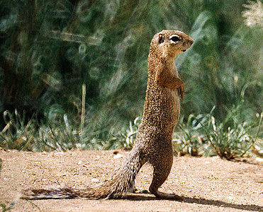
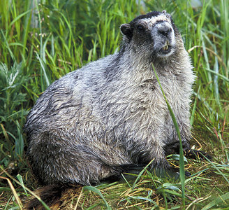
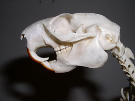

---
aliases:
- Sciuridae
- Squirrel
- Squirrels
title: Sciuridae
---

# [[Squirrel]]
 

    

## Introduction

[Scott J. Steppan and Shawn M. Hamm]()

Family Sciuridae, the squirrels, with 278 species and 51 genera, is one
of the most diverse and variable families of living mammals. Members of
Sciuridae range from the common, arboreal grey squirrel in the United
States, to flying squirrels, terrestrial marmots, chipmunks,
semi-fossorial prairie dogs, and various terrestrial and arboreal
squirrels around the world (Hoffman et al., 1993). Sciurids can tolerate
a variety of environmental conditions and are found from the Arctic to
the tropics, including most arid and humid regions (Wilson et al.,
1996). Most sciurids are diurnal, which means they are most active
during the day, and while active, they consume mostly plants, nuts and
seeds, in addition to occasional insects, eggs, and small vertebrates
(Wilson et al., 1996). Squirrels can be extremely social, as seen by
prairie dogs with their networks of underground tunnels, or solitary,
like some woodchucks. Typical squirrels, such as *Sciurus carolinensis,
Spermophilus lateralis,* and *Xerus inauris* have a body mass of 0.25 kg
to 0.4 kg, with lengths of about 23 to 25 centimeters (with tail of
equal length). The African Pygmy squirrel, *Myosciurus*, however, can be
as small as seven centimeters, fitting in the palm of your hand, and the
Giant Red Squirrels of Southeast Asia, *Ratufa*, can grow to 91
centimeters in body length (including tail), reaching nearly 3 kg. The
diversity and their easy accessibility during the day, has led to
extensive research on behavior, ecology, reproductive biology, and
morphology, which is why the Sciuridae are among the best understood
mammals.

It is believed that squirrels were named back in ancient Greece, where
they were called "skioros," meaning shade tail, by the Greek philosopher
Aristotle. The French began in later years to described them as
"esquirel," and in time, through other languages and interpretations,
rodents with long, bushy tails became commonly known as squirrels in the
English language.

With modern technological advances, such as DNA sequencing, and
continuing study of morphological structures, our understanding of
squirrel evolution has improved significantly (Simpson 1945; Hafner
1984; Thorington 1984; Hoffmann et al. 1993; Oshida et al. 1996; Roth
1996; McKenna and Bell 1997; Thorington et al. 1997; Thorington et al.
2002; Mercer and Roth 2003; Steppan et al. 2004; Thorington and Hoffmann
in press). Within the past few years, the classification of family
Sciuridae has changed considerably. Squirrels were thought to comprise
two subfamilies, *Sciurinae*, the tree and ground squirrels, and
*Pteromyinae*, the flying squirrels (Hoffman et al., 1993, McKenna and
Bell, 1997). This division emphasized the distinctive adaptations for
gliding found in the *Pteromyinae*. With the recent findings from
molecular phylogenetics, squirrels are now classified into 5
subfamilies: *Ratufinae*, *Sciurillinae*, *Sciurinae*, *Xerinae*, and
*Callosciurinae*, with the flying squirrels as a tribe within the
*Sciurinae* (Thorington and Hoffmann, 2005).

### Characteristics

Skull of an Oriental Giant Squirrel

The distinguishing features of Sciuridae are their skull structure and
the position of the infraorbital canal in relation to the dental system.
The sciuromorphous zygomasseteric system, where part of the lateral
muscle has shifted to the rostrum, is characteristic only in those
members of Sciuridae, defining them as truly sciuromorphous (Carleton
and Musser, 2005). Squirrels have four large incisor teeth for gnawing,
which grow the entire duration of their lives, and an additional eight
cheek teeth on each of the upper and lower jaws. Each tooth row contains
one pre-molar, which is very small or deciduous, and three molars, which
are rooted and tubercular, for grinding down nuts and seeds. The skull
is lightly built, with long post-orbital processes, the infra-orbital
opening is small, and the palate is broad (Flower, 1978).

Typically, squirrels have bushy tails as long as the body, smooth coats
and pointed ears. In some species, the fur coat is coarse and spiny, and
in others, the ears have long hairs extending from the points. Most
squirrels have cheek pouches for temporary food storage, where their
cheeks will enlarge to fit more food during a single scavenge. Arboreal
squirrels have double-jointed hind limbs, with four toes and a vestigial
thumb that allows them to climb trees quickly. The flying squirrels have
gliding membranes between the forearms and hind limbs for gliding from
tree to tree.

From chirps and yelps to quick movements and tail flagging, squirrels
have  highly sophisticated communication, ranging from warnings to
mating signals. Squirrels also have the ability to change the color of
their coat during mating season. One oriental species of squirrel,
*Sciurus caniceps*, is one of the rare known instance among mammals
where their coat distinctly changes during mating season. For most of
the year the squirrel's coat is a uniform gray. From about December, its
back becomes a brilliant orange-yellow, until March, when it changes
back to gray (Flower, 1978).

### Discussion of Phylogenetic Relationships

Our understanding of phylogenetic relationships among sciurids has
improved greatly in recent years. In 1993 and until recently, family
Sciuridae was classified into two subfamilies: *Sciurinae*, the tree and
ground squirrels, and *Pteromyinae*, the flying squirrels (Hoffman et
al., 1993; Thorington et al., 2002). After studies were conducted on
cranial morphology (Roth, 1996) within these subfamilies, and the
nuclear gene of the 12S rRNA was sequenced (Oshida et al., 1996),
different relationships were suggested: tree squirrels (*Sciurinae*)
were more closely related to flying squirrels (*Pteromyinae*) than to
ground squirrels (*Sciurinae*). This evidence has created a problem
within the traditional classification containing two subfamilies.

Phylogenetic analyses using slowly evolving nuclear DNA (Steppan et al.,
2004; Mercer and Roth, 2003) have had a significant effect on the
rearrangement of the phylogenetic relationships within family
Sciuridae.  The nuclear gene regions IRBP, RAG1, and c-myc, and the
mitochondrial gene region 12S provided strong evidence that flying
squirrels are derived from tree squirrels, and that they are
specifically related to New World tree squirrels (Steppan et al., 2004).
The five major lineages identified by Mercer and Roth (2003) and Steppan
et al (2004), and followed by Hoffman et al. (2005), became subfamilies
in the revised classification: *Ratufinae*, *Sciurillinae*, *Sciurinae*,
*Xerinae*, and *Callosciurinae*. As of 2006, the accepted number of
species in family Sciuridae is 278, with 51 genera, including the
aforementioned five subfamilies (Thorington and Hoffman, 2005). There
are only a few remaining uncertainties with respect to two aspects of
the branching order among the five subfamilies, and the position of the
rock squirrel *Sciurotamias* (Steppan et al., 2004).

### Geographic Distribution

Squirrels are a geographically cosmopolitan family of rodents, found in
a wide variety of habitats throughout the major land masses except
Madagascar, Australia, New Zealand and Antarctica. Most species of the
subfamily *Callosciurinae* are distributed throughout the Indomalaya
ecozone, consisting of India and Southeast Asia. Ground squirrels and
marmots in subfamily *Xerinae* are distributed among the Nearctic,
Palearctic, Indomalaya and Afrotropic regions, with the highest
concentration in the Nearctic region (North America).

Tree squirrels, of *Sciurinae*, are concentrated mostly in North and
South America, with very few species located in Japan and in regions of
the Middle East.  Flying squirrels, also of subfamily *Sciurinae*, are
found generally in the Indomalaya region, in addition to Russia, Japan
and China. The giant squirrels in subfamily *Ratufinae* are limited to
the Eastern hemisphere, recorded only in Indomalaya and the Palearctic,
and *Sciurillinae*, the neotropical pygmy squirrels, exist only in the
Neotropic region of South America (Wilson and Reeder 1993).

### Fossil History

The first fossil records of squirrels suggest that they originated in
the Northern Hemisphere, particularly North America, around 36 million
years ago. The fossil of the earliest recorded squirrel, *Douglassciurus
jeffersoni*, ranges from approximately 37.5 to 35 million years ago
(Thorington and Emry 1984).  This squirrel species had very similar
skeletal and dental structures like those of present day squirrels, but
it lacked the characteristic sciuromorphous zygomasseteric system, which
classifies squirrels today (Mercer and Roth 2003). The earliest
sciuromorphous squirrel fossil recorded to date is *Palaeosciurus*, from
Europe, which is believed to have lived in the early Oligocene epoch,
about 33.7 to 23.8 million years ago (Vianey-Liaud 1984). Most fossil
species found thereafter range from 33.7 million years ago, to today,
and the New World tree squirrel *Sciurus* is considered to be a "living
fossil" (Thorington and Emry 1984).

## Phylogeny 

-   « Ancestral Groups  
    -  [Rodentia](../Rodentia.md))
    -  [Eutheria](../../Eutheria.md))
    -  [Mammal](../../../Mammal.md))
    -   [Therapsida](../../../../Therapsida.md)
    -   [Synapsida](../../../../../Synapsida.md)
    -   [Amniota](../../../../../../Amniota.md)
    -   [Terrestrial Vertebrates](../../../../../../../Terrestrial.md)
    -   [Sarcopterygii](../../../../../../../../Sarc.md)
    -   [Gnathostomata](../../../../../../../../../Gnath.md)
    -   [Vertebrata](../../../../../../../../../../Vertebrata.md)
    -   [Craniata](../../../../../../../../../../../Craniata.md)
    -   [Chordata](../../../../../../../../../../../../Chordata.md)
    -   [Deuterostomia](../../../../../../../../../../../../../Deutero.md)
    -  [Bilateria](../../../../../../../../../../../../../../Bilateria.md))
    -  [Animals](../../../../../../../../../../../../../../../Animals.md))
    -  [Eukarya](../../../../../../../../../../../../../../../../Eukarya.md))
    -   [Tree of Life](../../../../../../../../../../../../../../../../Tree_of_Life.md)

-   ◊ Sibling Groups of  Rodentia
    -   [Muroidea](Muroidea.md)
    -   Sciuridae

-   » Sub-Groups
    -   [Callosciurini](Squirrel/Callosciurini.md)
    -   [Xerinae](Squirrel/Xerinae.md)
    -   [Sciurini](Squirrel/Sciurini.md)
    -   [Pteromyini](Squirrel/Pteromyini.md)

## Title Illustrations

-------------------------------------------------------------------------

Scientific Name ::     Xerus rutilus
Location ::           Tarangire National Park, Tanzania
Specimen Condition   Live Specimen
Identified By        David Bygott
Life Cycle Stage ::     Adult
View                 Lateral
Copyright ::            © 2005 [David Bygott](mailto:davidbygott@yahoo.com) 

-------------------------------------------------------------------------

Scientific Name ::     Marmota
Creator              Bill Hickey
Acknowledgements     Photo courtesy U.S. Fish and Wildlife Service
Specimen Condition   Live Specimen

## Confidential Links & Embeds: 

### #is_/same_as :: [Squirrel](/_Standards/bio/bio~Domain/Eukarya/Animal/Bilateria/Deutero/Chordata/Craniata/Vertebrata/Gnath/Sarc/Tetrapods/Amniota/Synapsida/Therapsida/Mammal/Eutheria/Rodentia/Squirrel.md) 

### #is_/same_as :: [Squirrel.public](/_public/bio/bio~Domain/Eukarya/Animal/Bilateria/Deutero/Chordata/Craniata/Vertebrata/Gnath/Sarc/Tetrapods/Amniota/Synapsida/Therapsida/Mammal/Eutheria/Rodentia/Squirrel.public.md) 

### #is_/same_as :: [Squirrel.internal](/_internal/bio/bio~Domain/Eukarya/Animal/Bilateria/Deutero/Chordata/Craniata/Vertebrata/Gnath/Sarc/Tetrapods/Amniota/Synapsida/Therapsida/Mammal/Eutheria/Rodentia/Squirrel.internal.md) 

### #is_/same_as :: [Squirrel.protect](/_protect/bio/bio~Domain/Eukarya/Animal/Bilateria/Deutero/Chordata/Craniata/Vertebrata/Gnath/Sarc/Tetrapods/Amniota/Synapsida/Therapsida/Mammal/Eutheria/Rodentia/Squirrel.protect.md) 

### #is_/same_as :: [Squirrel.private](/_private/bio/bio~Domain/Eukarya/Animal/Bilateria/Deutero/Chordata/Craniata/Vertebrata/Gnath/Sarc/Tetrapods/Amniota/Synapsida/Therapsida/Mammal/Eutheria/Rodentia/Squirrel.private.md) 

### #is_/same_as :: [Squirrel.personal](/_personal/bio/bio~Domain/Eukarya/Animal/Bilateria/Deutero/Chordata/Craniata/Vertebrata/Gnath/Sarc/Tetrapods/Amniota/Synapsida/Therapsida/Mammal/Eutheria/Rodentia/Squirrel.personal.md) 

### #is_/same_as :: [Squirrel.secret](/_secret/bio/bio~Domain/Eukarya/Animal/Bilateria/Deutero/Chordata/Craniata/Vertebrata/Gnath/Sarc/Tetrapods/Amniota/Synapsida/Therapsida/Mammal/Eutheria/Rodentia/Squirrel.secret.md)

