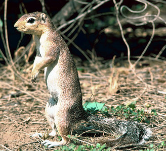
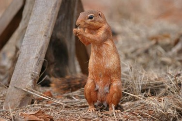

---
title: Xerini
---

# [[Xerini]]

## African ground squirrels 

## #has_/text_of_/abstract 

> **Xerini** is a tribe of ground squirrels occurring in Africa and Asia. With the tribes Marmotini (Holarctic ground squirrels) and Protoxerini (African tree squirrels), they form the subfamily Xerinae. There are five living genera—Xerus, the unstriped ground squirrel; Euxerus, the striped ground squirrel; Geosciurus, the Cape and mountain ground squirrels; Atlantoxerus, containing the living Barbary ground squirrel of North Africa and some extinct species; and Spermophilopsis, containing the long-clawed ground squirrel of Central Asia.
>
> The squirrels live in open woodlands, grasslands, or rocky country. They are diurnal and terrestrial, living in burrows. Their diet is roots, seeds, fruits, pods, grains, insects, small vertebrates and bird eggs. They live in colonies similar to North American prairie dogs, and have similar behavior. If kept as pets, they run free as house cats do, otherwise farmers consider them pests. Breeding in South African ground squirrels is asynchronous and there is no specific period of breeding although very few litters are seen above the ground in the months of July to October. Gestation period lasts for 48 days and the young ones are weaned after 52 days. There are one to three babies per litter. A female becomes sexually mature when she is 10 months old and a male matures at the age of 8 months. Although a female has the capability to breed throughout the year, less than 10% reproduce more than one litter in a year.
>
> The South African ground squirrel does not hibernate. These squirrels are very social and live in groups with about 1 to 3 females and 2 to 3 males. Sometimes, the number of males can exceed up to 9 with some sub-adult females. An interesting thing about this breed is that mature males like to form their own groups and there can be 19 to 20 individuals in one group. These groups are called bands.
>
> Their home range is shared with other groups which is actually quite a surprising thing, since in case of most of the mammals there is generally an extremely tough competition to get the female. The group-living instinct of this species gives it a survival opportunity from predators overweighing the disadvantage of breeding opportunities which come from competition.
>
> [Wikipedia](https://en.wikipedia.org/wiki/Xerini) 

## Introduction

[Scott J. Steppan and Shawn M. Hamm]()

The tribe Xerini consists of three genera and six species of terrestrial
squirrels known as the African and Long-Clawed Ground Squirrels. The
tribe is predominantly distributed among Africa's arid and semi-arid
regions, with one species found only in Central Asia (Northern Iran and
Afghanistan). Xerini includes smaller to medium-sized squirrels, with
head and body lengths of 16 to 46 cm, tail lengths ranging from 7 to 27
cm, and an overall weight between 300 and 945 grams (Nowak 1999).

Species within this tribe use a wide range of habitats, from woodlands
and grasslands, to rocky sites and sandy deserts. Within the genus
*Xerus*, one species, *X. inauris*, is known to create extensive burrow
systems containing one to three social units (Herzig-Straschil 1978),
similar to prairie dogs in North America, while another species, *X.
rutilus*, has been observed to prefer a single, isolated burrow system
with a primary social unit consisting of a female with her young (O'Shea
1976). Due to extreme temperatures during the mid portion of the day,
the ground squirrels are most active in the morning and late evening
foraging typically for roots, seeds, fruit, grain, and insects, within
the vicinity of their burrow. The burrow is the pivotal site for
protection against predators and bearing offspring, and there is no
evidence of hibernation or food storage.

In South Africa, it is not uncommon to see these ground squirrels as
pets. In some circumstances, they are seen as agricultural pests as a
result of feeding on crops of local farmers, and they have been known to
carry rabies and the bubonic plague (Nowak 1999).

### Characteristics

Most ground squirrels in Xerini exhibit some form of striping in their
coats, usually white or black, which is typical among a large group of
species within Xerinae. In some species there may be a single stripe
along the back, or multiple stripes on each flank of the body, each of
which are prominently contrasted by the tan to brownish color of the
squirrels' coat. The tint of their coats is attributed to the soil color
of the squirrels' habitat, where tiny soil particles adhere to the
squirrels' hair and create a coloring effect (Nowak 1999).

{height="250"}\

*Xerus rutilus* has an orange tint to its coat because of the deep
orange color of the soil its burrow is located in. © 2006 [Bruce Patterson](mailto:bpatterson@fieldmuseum.org)

Species in *Xerus* and *Spermophilopsis* have uniquely longer claws
compared to all other species of squirrels. With an average length of 10
mm, their claws are thick and strong for multi-purpose use (Nowak 1999).

### Discussion of Phylogenetic Relationships

A very limited amount of research has been published discussing
relationships among the Xerini. The first phylogenetic positions of
Xerini ground squirrels within *Sciuridae* were proposed by Pocock
(1923) and Moore (1959). In recent years, Mercer and Roth (2003), and
Steppan *et* *al.* (2004) have presented some insight into these
relationships. As of 2005, the phylogeny of the tribe Xerini stands as
three genera, *Atlantoxerus*, *Spermophilopsis,* and *Xerus*, with six
distributed species (Wilson and Reeder 2005). No study has included all
three genera together.

## Phylogeny 

-   « Ancestral Groups  
    -   [Xerinae](../Xerinae.md)
    -   [Squirrel](../../Squirrel.md)
    -  [Rodentia](../../../Rodentia.md))
    -  [Eutheria](../../../../Eutheria.md))
    -  [Mammal](../../../../../Mammal.md))
    -   [Therapsida](../../../../../../Therapsida.md)
    -   [Synapsida](../../../../../../../Synapsida.md)
    -   [Amniota](../../../../../../../../Amniota.md)
    -   [Terrestrial Vertebrates](../../../../../../../../../Terrestrial.md)
    -   [Sarcopterygii](../../../../../../../../../../Sarc.md)
    -   [Gnathostomata](../../../../../../../../../../../Gnath.md)
    -   [Vertebrata](../../../../../../../../../../../../Vertebrata.md)
    -   [Craniata](../../../../../../../../../../../../../Craniata.md)
    -   [Chordata](../../../../../../../../../../../../../../Chordata.md)
    -   [Deuterostomia](../../../../../../../../../../../../../../../Deutero.md)
    -  [Bilateria](../../../../../../../../../../../../../../../../Bilateria.md))
    -  [Animals](../../../../../../../../../../../../../../../../../Animals.md))
    -  [Eukarya](../../../../../../../../../../../../../../../../../../Eukarya.md))
    -   [Tree of Life](../../../../../../../../../../../../../../../../../../Tree_of_Life.md)

-   ◊ Sibling Groups of  Xerinae
    -   [Marmotini](Marmotini.md)
    -   [Protoxerini](Protoxerini.md)
    -   Xerini

-   » Sub-Groups
    -   [Atlantoxerus getulus](Atlantoxerus_getulus)
    -   [Spermophilopsis         leptodactylus](Spermophilopsis_leptodactylus)

## Title Illustrations

-----------------------

Scientific Name ::     Xerus
Comments             African ground squirrel
Creator              Photograph by Gary M. Stolz
Acknowledgements     Photograph courtesy of the U.S. Fish and Wildlife Service
Specimen Condition   Live Specimen

## Confidential Links & Embeds: 

### #is_/same_as ::[Xerini](Xerini.md)) 

### #is_/same_as :: [Xerini.public](/_public/bio/bio~Domain/Eukarya/Animal/Bilateria/Deutero/Chordata/Craniata/Vertebrata/Gnath/Sarc/Tetrapods/Amniota/Synapsida/Therapsida/Mammal/Eutheria/Rodentia/Squirrel/Xerinae/Xerini.public.md) 

### #is_/same_as :: [Xerini.internal](/_internal/bio/bio~Domain/Eukarya/Animal/Bilateria/Deutero/Chordata/Craniata/Vertebrata/Gnath/Sarc/Tetrapods/Amniota/Synapsida/Therapsida/Mammal/Eutheria/Rodentia/Squirrel/Xerinae/Xerini.internal.md) 

### #is_/same_as :: [Xerini.protect](/_protect/bio/bio~Domain/Eukarya/Animal/Bilateria/Deutero/Chordata/Craniata/Vertebrata/Gnath/Sarc/Tetrapods/Amniota/Synapsida/Therapsida/Mammal/Eutheria/Rodentia/Squirrel/Xerinae/Xerini.protect.md) 

### #is_/same_as :: [Xerini.private](/_private/bio/bio~Domain/Eukarya/Animal/Bilateria/Deutero/Chordata/Craniata/Vertebrata/Gnath/Sarc/Tetrapods/Amniota/Synapsida/Therapsida/Mammal/Eutheria/Rodentia/Squirrel/Xerinae/Xerini.private.md) 

### #is_/same_as :: [Xerini.personal](/_personal/bio/bio~Domain/Eukarya/Animal/Bilateria/Deutero/Chordata/Craniata/Vertebrata/Gnath/Sarc/Tetrapods/Amniota/Synapsida/Therapsida/Mammal/Eutheria/Rodentia/Squirrel/Xerinae/Xerini.personal.md) 

### #is_/same_as :: [Xerini.secret](/_secret/bio/bio~Domain/Eukarya/Animal/Bilateria/Deutero/Chordata/Craniata/Vertebrata/Gnath/Sarc/Tetrapods/Amniota/Synapsida/Therapsida/Mammal/Eutheria/Rodentia/Squirrel/Xerinae/Xerini.secret.md)

